***
**目录**

[**第01章_C语言入门**](#第01章_C语言入门)  
[**第02章_变量与进制**](#第02章_变量与进制)  
[**第03章_运算符与流程控制**](#第03章_运算符与流程控制)  
[**第04章_数组**](#第04章_数组)  
[**第05章_指针**](#第05章_指针)  
[**第06章_函数**](#第06章_函数)  
[**第07章_结构体与共用体**](#第07章_结构体与共用体)  
[**第08章_C语言常用函数**](#第08章_C语言常用函数)  
[**第09章_文件操作**](#第09章_文件操作)  
[**附录1：CLion使用**](#附录1：CLion使用)  
[**附录2：MinGW编译器的安装和配置**](#附录2：MinGW编译器的安装和配置)  
***

 <p id = "第01章_C语言入门"></p> 

# 第01章_C语言入门

## 本章专题脉络

 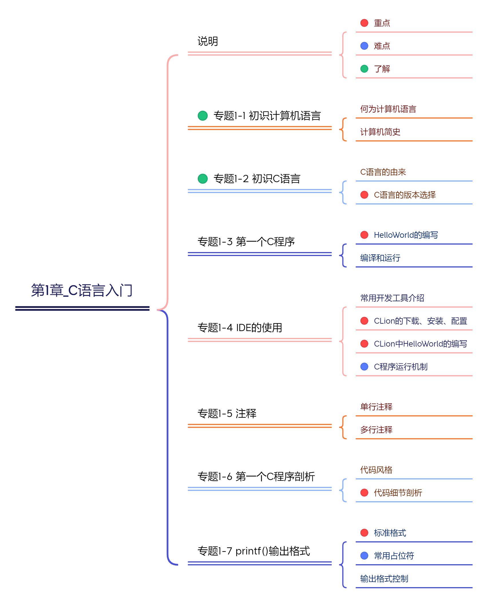

## 1、初识计算机语言

### 1.1 计算机语言是什么

- **人类语言**：是人与人之间用于沟通的一种方式。例如：中国人与中国人用普通话沟通。而中国人要和英国人交流，可以使用普通话或英语。

- **计算机编程语言**，就是人与计算机交流的方式。人们可以使用`编程语言`对计算机下达`命令`，让计算机完成人们需要的功能。
  - 计算机语言有很多种。如：C 、C++、Java、Go、JavaScript、Python，Scala等。

> 体会：语言 = 语法 + 逻辑

### 1.2 计算机语言简史

* **第一代：机器语言（相当于人类的石器时代）**

  * 1946年2月14日，世界上第一台计算机`ENAC`诞生，使用的是最原始的`穿孔卡片`。这种卡片上使用的是用`二进制代码`表示的语言，与人类语言差别极大，这种语言就称为`机器语言`。比如一段典型的机器码：

    ```
    1.	0000,0000,000000010000 代表 LOAD A, 16
    2.	0000,0001,000000000001 代表 LOAD B, 1
    3.	0001,0001,000000010000 代表 STORE B, 16
    ```

  * 这种语言本质上是计算机能识别的`唯一语言`，人类很难理解。可以大胆想象"`此时的程序员99.9%都是异类！`"

    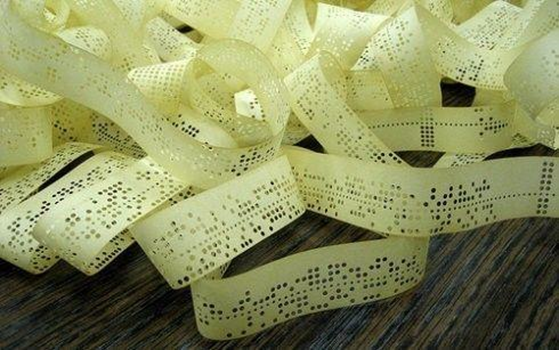

* **第二代：汇编语言（相当于人类的青铜&铁器时代）**

  * 使用英文缩写的`助记符`来表示基本的操作，这些助记符构成了汇编语言的基础。比如：`LOAD`、`MOVE`等，使人更容易使用。因此，汇编语言也称为`符号语言`。

  * 优点：能编写`高效率`的程序。

  * 缺点：汇编语言是`面向机器的`，不同计算机会有不同的汇编语言，程序不易移植。

    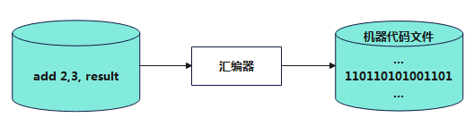

  * 目前仍然应用于工业电子编程领域、软件的加密解密、计算机病毒分析等。

* **第三代：高级语言（相当于人类的信息时代）**

  * 高级语言，是一种`接近于人们使用习惯`的程序设计语言。它允许程序员使用`接近日常英语`的指令来编写程序，程序中的符号和算式也与`日常用的数学式子`差不多，接近于自然语言和数学语言，容易为人们掌握。比如：

    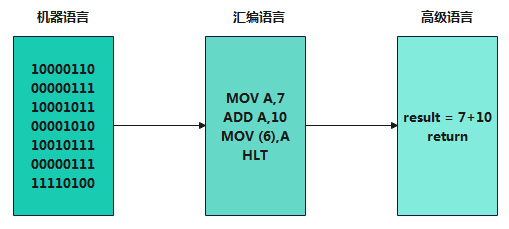

  * 高级语言`独立于计算机硬件`，有一定的通用性；计算机不能直接识别和执行用高级语言编写的程序，需要使用**编译器或者解释器**，`转换为机器语言`才能被识别和执行。

    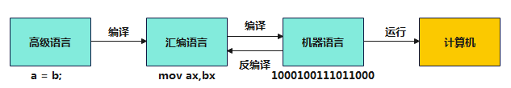

  * 使用普遍的高级语言有Fortran、ALGOL、Basic、COBOL、LISP、Pascal、PROLOG、C、C++、VC、VB、Delphi、Java等。

## 2、初识C语言

### 2.1 C语言的由来

**C 语言最初是作为 Unix 系统的开发工具而发明的。**

1969年，美国贝尔实验室的肯·汤普森（Ken Thompson）与丹尼斯·里奇（Dennis Ritchie）一起开发了Unix 操作系统。Unix 是用`汇编语言`写的，依赖于计算机硬件。为了程序的`可读性`和`可移植性`，他们决定使用高级语言重写。但是，当时的高级语言无法满足他们的要求，汤普森就在 BCPL 语言的基础上发明了 `B 语言`。

1972年，丹尼斯·里奇（Dennis Ritchie）在 B 语言的基础上重新设计了一种新语言，这种新语言取代了 B 语言，称为` C 语言`。

1973年，`整个 Unix 系统都使用 C 语言重写`。

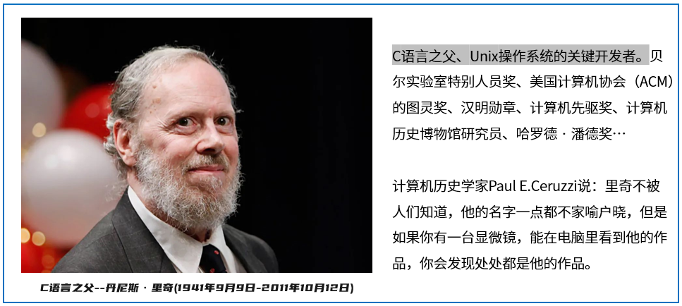

此后，这种语言快速流传，广泛用于各种操作系统和系统软件的开发。如UNIX、MS-DOS、Microsoft Windows及Linux等。


1988年，美国国家标准协会（ANSI）正式将` C语言标准化`，标志着 C 语言开始稳定和规范化。

### 2.2 为什么要学习C语言

1、**C语言具有可移植性好、跨平台的特点**，用C编写的代码可以在不同的操作系统和硬件平台上编译和运行。

- C 语言的原始设计目的，是将 Unix 系统移植到其他计算机架构，这使得它从一开始就非常注重可移植性。

2、**C语言在许多领域应用广泛**，掌握C语言可以让你有更多就业机会。

- `操作系统`：C 广泛用于开发操作系统，如 Unix、Linux 和 Windows。
- `嵌入式系统`：C 是一种用于开发嵌入式系统（如微控制器、微处理器和其他电子设备）的流行语言。
- `系统软件`：C用于开发设备驱动程序、编译器和汇编器等系统软件。
- `网络`：C 语言广泛用于开发网络应用程序，例如 Web 服务器、网络协议和网络驱动程序。
- `数据库系统`：C 用于开发数据库系统，例如 Oracle、MySQL 和 PostgreSQL。
- `游戏`：由于 C 能够处理低级硬件交互，因此经常用于开发计算机游戏。
- `人工智能`：C 用于开发人工智能和机器学习应用程序，例如神经网络和深度学习算法。
- `科学应用`：C 用于开发科学应用程序，例如仿真软件和数值分析工具。
- `金融应用`：C用于开发股票市场分析和交易系统等金融应用。

3、C 语言能够直接对硬件进行操作、管理内存、跟操作系统对话，这使得它是一种非常接近底层的语言，非常适合写需要**跟硬件交互、有极高性能要求的程序**。

4、**学习C语言有助于快速上手其他编程语言**，比如C++（原先是C语言的一个扩展，在C语言的基础上嫁接了面向对象编程）、C#、Java、PHP、Javascript、Perl等。这些语言都继承或深受C语言的影响和启发。

5、C 语言长盛不衰。至今，**依然是最广泛使用、最流行的编程语言之一**。包括很多大学将C语言作为计算机教学的入门语言，拥有庞大而活跃的用户社区，这意味着有许多资源和库可供开发人员使用。

### 2.3 计算机语言排行榜

TIOBE （https://www.tiobe.com/tiobe-index/）是一个流行编程语言排行，每月更新。排名权重基于世界范围内 工程师数量，Google、Bing、Yahoo! 、Wikipedia、Amazon、Youtube和百度这些主流的搜索引擎，也将作为排名权重的参考指标。

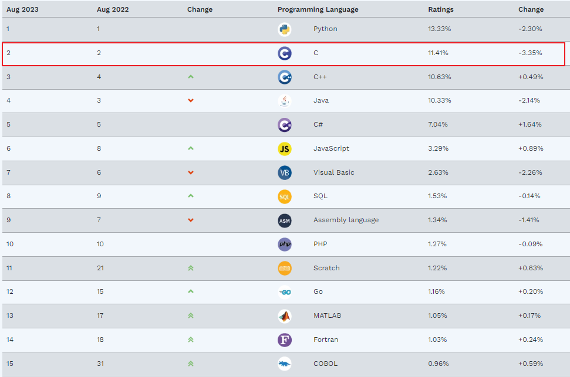

计算机走势图：

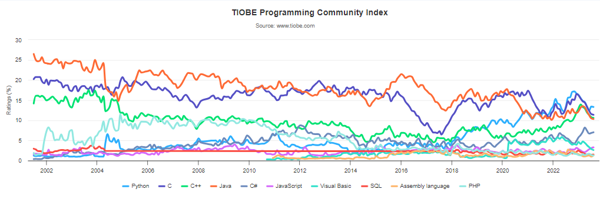

### 2.4 网友一言话C

https://www.nowcoder.com/stack/209

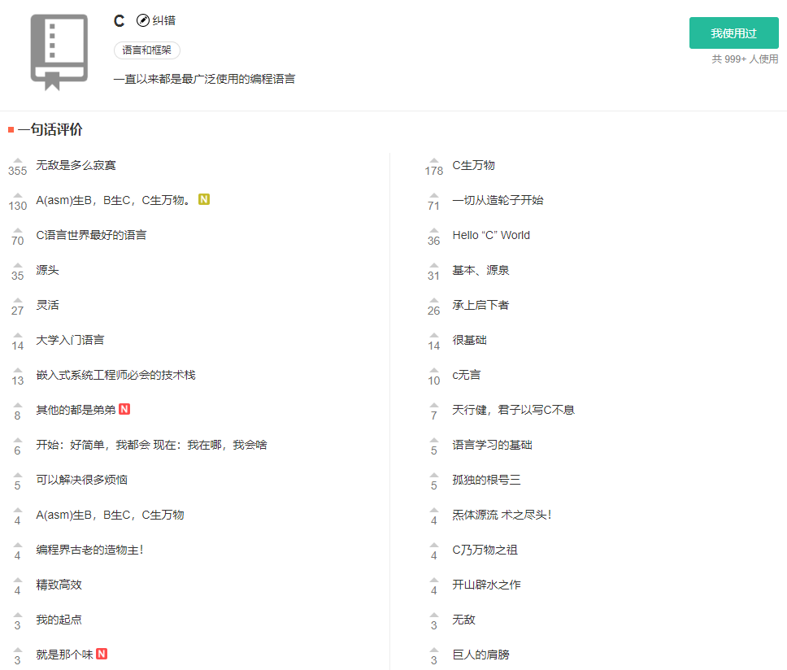


### 2.5 C语言的版本选择

随着微型计算机的日益普及，出现了许多C语言版本。

**版本1：K＆R C**

K&R C 指的是 C 语言的原始版本。1978年，C 语言的发明者布莱恩·柯林（Brian Kernighan）和丹尼斯·里奇（Dennis Ritchie）合写了一本著名的教材《C 编程语言》（The C programming language）。

由于 C 语言还没有成文的语法标准，这本书就成了公认标准，以两位作者的姓氏首字母作为版本简称“K&R C”。

**版本2：ANSI C（又称 C89 或 C90）**

C 语言的原始版本非常简单，对很多情况的描述非常模糊，加上 C 语法依然在快速发展，要求将 C 语言标准化的呼声越来越高。

1989年，美国国家标准协会（ANSI）制定了一套 C 语言标准，并于次年被国际标准化组织（ISO）通过。它被称为“ANSI C”，也可以按照发布年份，称为“C89 或 C90”。

**版本3：C99**

C 语言标准的第一次`大型修订`，发生在1999年，增加了许多语言特性，比如双斜杠（ // ）的注释语法，可变长度数组、灵活的数组成员、复数、内联函数和指定的初始值设定项。这个版本称为 C99，`是目前最流行的 C 版本`。

**版本4：C11**

2011年，标准化组织再一次对C 语言进行修订，增加了_Generic、static_assert 和原子类型限定符。这个版本称为C11。

> 需要强调的是，修订标准的原因不是因为原标准不能用，而是需要跟进新的技术。

**版本5：C17**

C11 标准在2017年进行了修补，但发布是在2018年。新版本只是解决了 C11 的一些缺陷，没有引入任何新功能。这个版本称为 C17。

**版本6：C23**

2023年预计发布，计划进一步增强安全性，消除实现定义的行为，引入模块化语言概念等新特性，使C语言在安全和可靠性方面有重大提高。

## 3、第一个C程序的编写->编译->运行

### 3.1 步骤1：HelloWorld的编写

C 语言的源代码文件，以**后缀名 .c 结尾**。下面是一个简单的 C 程序 `Hello.c` 。

```c
#include <stdio.h>              

int main()                  	
{                               
    printf("hello,world!!\n"); 
  	return 0;                   
}
```

### 3.2 步骤2：编译器的安装与配置

C 语言是一种`编译型语言`，源码都是`文本文件`，本身无法执行。必须通过编译器，生成二进制的可执行文件，才能执行。

目前，最常见的 C 语言编译器是自由软件基金会推出的 `GCC 编译器`，可以免费使用。Linux 和 Mac 系统可以直接安装 GCC，Windows 系统可以安装 `MinGW`。

> 补充知识：MinGW和GCC的区别：
>
> GCC是一个跨平台的编译器集合，可用于多种操作系统和处理器架构，包括Windows；而MinGW是GCC在Windows平台上的移植版本，主要用于在Windows上本地编译C和C++代码。

在Windows下，MinGW的详细安装和配置见`《第01章附录：MinGW编译器的安装和配置.md》`。

### 3.3 步骤3：编译和运行

编译器将代码从文本翻译成二进制指令的过程，就称为编译阶段，又称为“编译时”（compile time），跟运行阶段（又称为“运行时”）相区分。

假设你已经安装好了 GCC 编译器，可以通过`win+r`打开cmd命令行，在Hello.c文件所在目录下执行下面的命令。

```
> gcc Hello.c
```

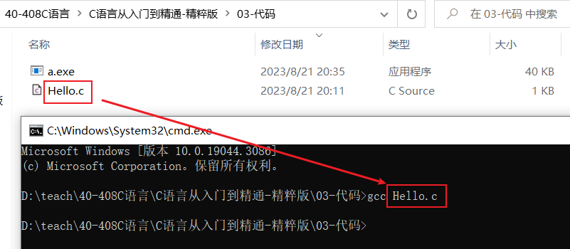

上面命令使用 gcc 编译器，将源文件 Hello.c 编译成二进制代码。

运行这个命令以后，默认会在当前目录下生成一个编译产物文件 a.exe。执行该文件，就会在屏幕上输出 Hello World 。

```
> a.exe
hello,world!!
```

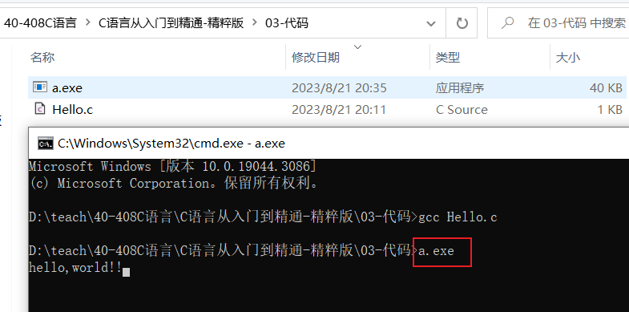

**GCC 的 -o 参数（output 的缩写）可以指定编译产物的文件名。**

```
> gcc -o Hello Hello.c
```

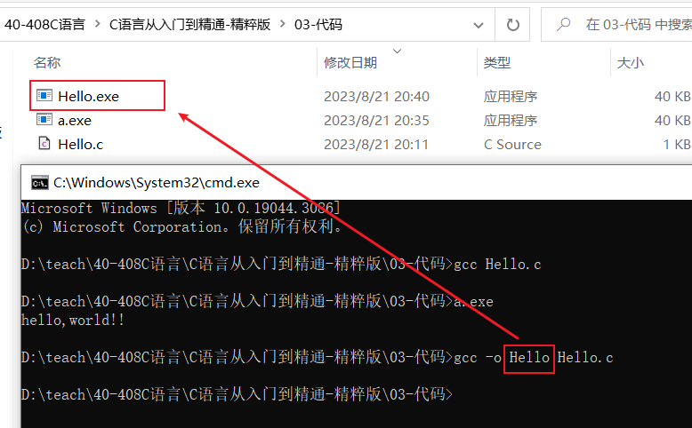

上面命令的 `-o Hello` 指定，编译得到的可执行文件名为 Hello.exe ，取代默认的 a.exe。执行该文件，也会得到同样的结果。

```
> Hello.exe
hello,world!!
```

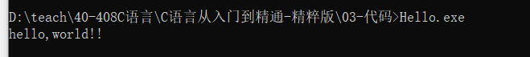

**GCC 的 `-std= 参数`（standard 的缩写）还可以指定按照哪个 C 语言的标准进行编译。**

```
> gcc -std=c99 Hello.c
```

上面命令指定按照 C99 标准进行编译。

## 4、IDE的使用

IDE(Integrated Development Environment，集成开发环境)：相较于文本开发工具，IDE可以把代码编写，编译，执行，调试等多种功能综合到一起的开发工具。

### 4.1 开发工具介绍

#### 方式1：本地安装的IDE工具

**1. Code::Block**

Code::Block是一个免费的跨平台IDE，它支持C、C++和Fortan程序的开发。Code::Block的最大特点是它支持通过插件的方式对IDE自身功能进行扩展，这使得Code::Block具有很强的灵活性，方便用户使用。

官网地址：https://www.codeblocks.org

**2. Microsoft Visual C++ 2010**

Visual C++ 2010，简称VC2010，是由微软开发的独立的、免费的 C/C++ 编译工具，与Visual Basic等并列，最后微软将它们整合在一起组成了Visual Studio。

Visual C++从发布起到现在已经有10个大版本了，这里介绍的Visual C++ 2010就是Visual C++ 10，简称VC10。上朔10多年发布的Visual C++ 6.0，被称为史上最经典的VC，现在有很多企业还在用它，大量的教材基于这个版本的VC来写的。但VC6比较弱，被淘汰是迟早的。

**3. Microsoft Visual Studio**

Visual Studio（简称 VS）是由微软公司发布的集成开发环境。它包括了整个软件生命周期中所需要的大部分工具，如UML工具、代码管控工具、集成开发环境（IDE）等。

Visual Studio 支持 C/C++、C#、F#、VB 等多种程序语言的开发和测试，可以用于生成Web应用程序，也可以生成桌面应用程序，功能十分强大。但下载和安装很可能耗时数小时，还可能会塞满磁盘。

Visual Studio 2019有三种版本：社区版(免费，不支持企业使用)，专业版(第一年1199美元/ 799美元续订)和企业版(第一年5999美元/2569美元续订)。企业版拥有面向架构师的功能、高级调试和测试，这些功能是另两种SKU所没有的。

Visual Studio旨在成为世界上最好的IDE（集成开发环境），目前最新版本为 Visual Studio 2023。

> 这就好像Office 2007是由Word 2007、Excel 2007、Access 2007等等组成的一个道理。其中Visual C++就是Visual Studio的一个重要的组成部分。

官网地址：https://visualstudio.microsoft.com

**4. CLion**

CLion是一款由JetBrains推出的跨平台C/C++集成开发环境（IDE），它具有智能编辑器、CMake构建支持、调试器、单元测试、代码分析等功能,可以极大提高C/C++开发效率。

官网地址：https://www.jetbrains.com/clion

#### 方式2：可在线使用的工具

CodingGround: https://tutorialspoint.com/compile_c_online.php

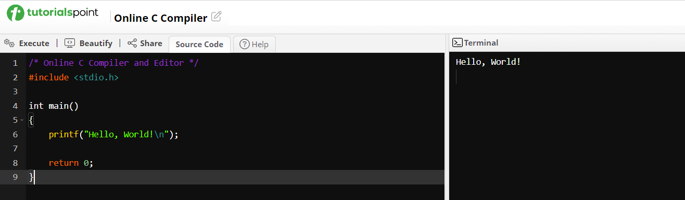

OnlineGDB: https://onlinegdb.com/online_c_compiler

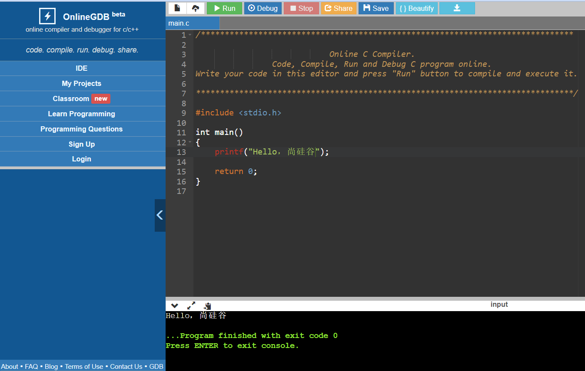

Lightly：https://cde2f3ce.lightly.teamcode.com/

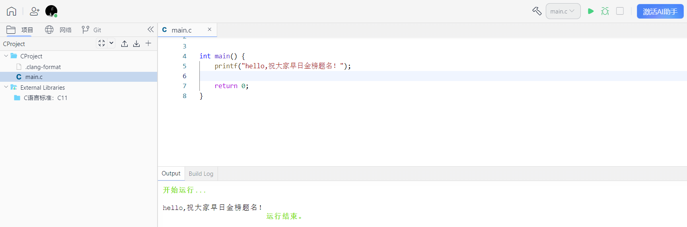

### 4.2 CLion的下载与安装

详细见`《第01章附录：C开发利器：CLion的使用.md》`。

### 4.3 CLion中HelloWorld的执行

1）选择"New Project"：


2）指定创建C可执行文件、工程目录，图中的“untitled1”需要修改为自己的工程名称。如下所示：

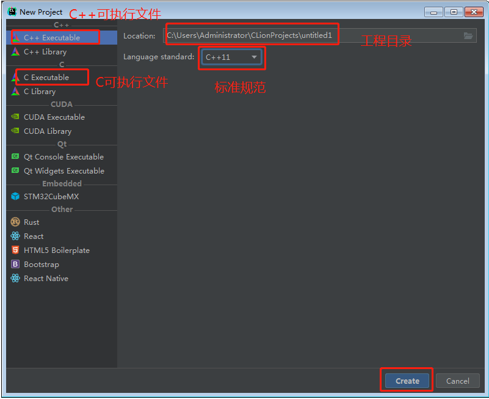

3）选择C可执行文件，修改工程名称为demo1

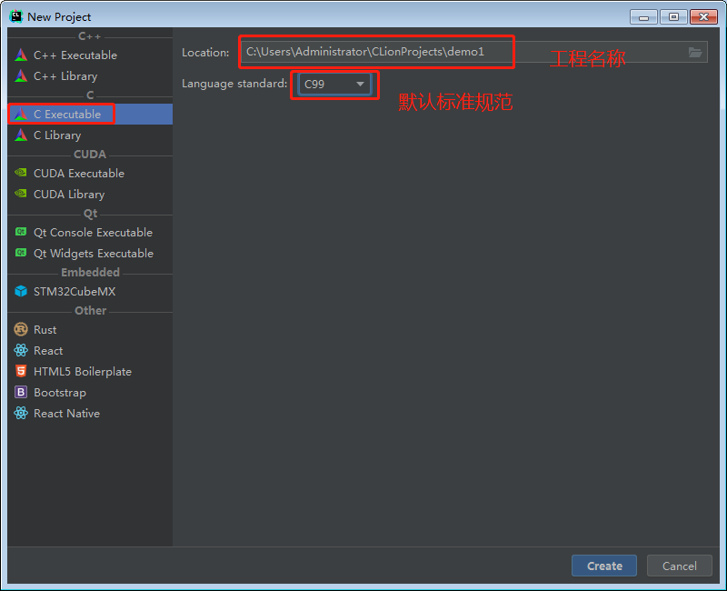

4）点击“Create”进行下一步，如图所示

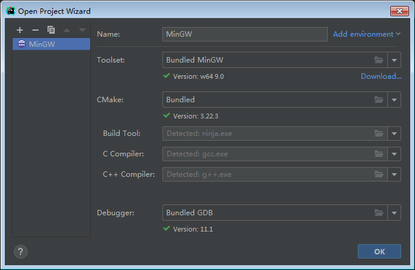

5）此处选择编译器，默认MinGW即可，点击“OK”按钮，如图所示，默认创建了main.c文件。

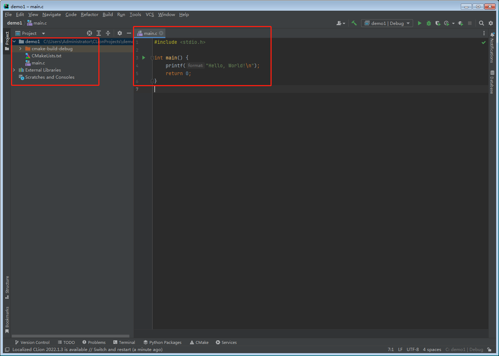

6）点击执行按钮，如下所示

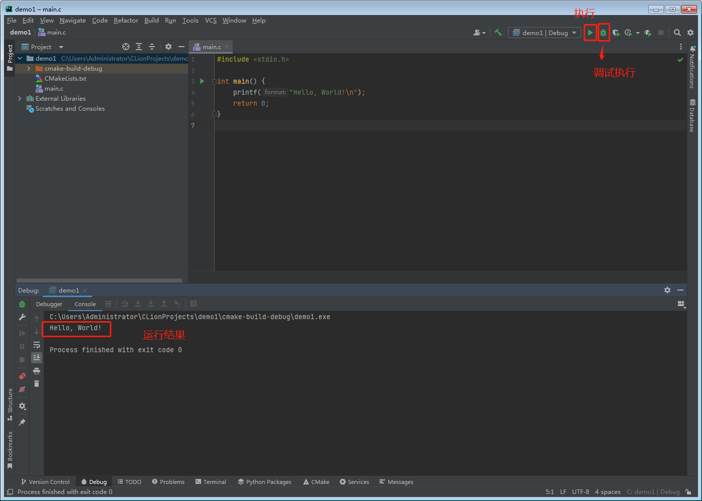

### 4.4 C 程序运行机制

**过程1：编辑**

编写C语言源程序代码，并以文件的形式存储到磁盘中。源程序文件以“`.c`”作为扩展名。

**过程2：编译**

将C语言源程序转换为`目标程序(或目标文件)`。如果程序没有错误，没有任何提示，就会生成一个扩展名为“`.obj`”的二进制文件。C语言中的每条可执行语句经过编译后最终都将被转换成二进制的机器指令。

**过程3：链接/连接**

将编译形成的目标文件“.obj”和库函数及其他目录文件连接/链接，形成统一的`可执行的`二进制文件“`.exe`”。

> 为什么需要链接库文件呢？
>
> 因为我们的C程序中会使用 C程序库的内容，比如<stdio.h> 、<stdlib.h> 中的函数printf()、system()等，这些函数不是程序员自己写的，而是C程序库中提供的，因此需要链接。链接后，生成的.exe 文件，比obj 文件大了很多。

**过程4：运行**

有了可执行的exe文件，我们可以在控制台下直接运行此exe文件。

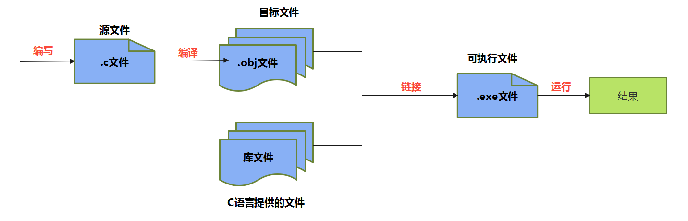

> 注意：
>
> 对修改后的xxx.c源文件需要**重新编译、链接**，生成新的exe文件后，再执行，才能生效。

练习：

> 计算机高级语言程序的运行方法有编译执行和解释执行两种，以下叙述中正确的是（　　）。
> A．C语言程序仅可以编译执行
> B．C语言程序仅可以解释执行
> C．C语言程序既可以编译执行，又可以解释执行
> D．以上说法都不对
>
> 【答案】A
>
> 【解析】编译执行是指程序执行前需要一个专门的编译过程把程序编译成机器语言的文件，再次运行时不需要重新翻译，执行效率高；解释执行是指每个语句都是执行的时候才翻译，执行效率低。用C语言编写的程序必须经过编译器编译后，转换为二进制的机器指令来运行。

练习：

> 以下叙述中错误的是（　　）。
> A．C语言的可执行程序是由一系列机器指令构成的
> B．用C语言编写的源程序不能直接在计算机上运行
> C．通过编译得到的二进制目标程序需要链接才可以运行
> D．在没有安装C语言集成开发环境的机器上不能运行C源程序生成的exe文件
>
> 【答案】D
>
> 【解析】A项正确，C语言的可执行程序是由一系列机器指令组成的；BC项正确，用C语言编写的源程序必须经过编译，生成二进制目标代码，再经过连接才能运行；D项错误，C语言经过编译链接后的二进制目标代码可以脱离C语言集成开发环境独立运行。答案选择D选项。

## 5、注 释(comment)


- 什么是注释？

  - 源文件中用于`解释`、`说明`程序的文字就是注释。
  - 注释只是给人看的，程序执行时，`编译器会忽略注释`，注释对代码执行没有影响

- 注释是一个程序员必须要具有的良好编程习惯。实际开发中，程序员可以先将自己的`思想`通过注释整理出来，再用`代码`去体现。

  > 程序员最讨厌两件事：
  >
  > - 一件是自己写代码被要求加注释
  >
  >
  > - 另一件是接手别人代码，发现没有注释

- 不加注释的危害

  

- C语言中的注释类型：

  - **单行注释**

  ```c
  // 单行注释
  ```

  - **多行注释(或块注释)**

  ```c
  /*
    这是第一行注释
    这是第二行注释
    这是第三行注释
  */
  ```

  ```c
  /* 我是被注释的文字 */
  ```

- 举例

  - 举例1

  ```c
  #include <stdio.h>              //这是编译预处理指令
  
  int main()                  	//定义主函数
  {                               //函数开始的标志
      printf("Hello World\n");    //输出所指定的一行信息
    	return 0;                   //函数执行完毕时返回函数值0
  }                               //函数结束的标志
  ```

  - 举例2

  ```c
  int x = 1; // 这里定义了一个变量
  ```

  - 举例3

  ```c
  printf("1"); 
  /* 
  printf("2");
  printf("3");  
  */
  printf("4");
  ```

  - 举例4

  ```c
  int open(char* s /* file name */, int mode);
  ```

- 注意：

  1. 多行注释不能嵌套使用

     ```c
     /*
     我是注释信息1
     /*
     我是注释信息2
     */
     我是注释信息3
     */
     ```

  2. 双引号内使用注释，会被当做普通字符串看待，失去注释作用

     ```c
     printf("// hello /* atguigu */ ");
     ```

- 一个段子

  ```c
  A：嘿 //是什么意思啊？
  B：嘿.
  A：呃 我问你//是什么意思？
  B：问吧.
  A：我刚才不是问了么？
  B：啊？
  A：你再看看记录...
  B：看完了.
  A：......所以//是啥？
  B：所以什么？
  A：你存心耍我呢吧？
  B：没有啊 你想问什么？
  ……
  不断循环之后，A一气之下和B绝交，自己苦学程序。
  N年之后，A终于修成正果，回想起B，又把聊天记录翻出来看，这时，他突然发现B没有耍他……
  而他自己也不知道当年他问B的究竟是什么问题……
  ```

练习：

> 以下叙述中错误的是（　　）。
> A．C语言中的每条可执行语句和非执行语句最终都将被转换成二进制的机器指令
> B．C程序经过编译、链接步骤之后才能形成一个真正可执行的二进制机器指令文件
> C．用C语言编写的程序称为源程序，它以ASCII代码形式存放在一个文本文件中
> D．C语言源程序经编译后生成后缀为.obj的目标程序
>
> 【答案】A
>
> 【解析】A项错误，注释语句不会被翻译成二进制的机器指令。C源程序经过C编译程序编译之后生成后缀为.obj的二进制文件（称为目标文件），然后由“链接程序”（Link）的软件把.obj文件与各种库函数连接起来生成一个后缀为.exe的可执行文件。答案选择A选项。

## 6、HelloWorld的剖析

```c
#include <stdio.h>              

int main()                  	
{                               
    printf("Hello World\n");    
  	return 0;                   
}
```

### 6.1 规范的代码风格

**正确的缩进和空白**

1) 使用一次tab操作，实现缩进，默认整体向右边移动。相反，使用shift+tab整体向左移

2) 运算符两边习惯性各加一个空格。比如：`2 + 4 * 5`。

3) 可以使用代码格式化快捷键 ctrl+alt+L。(在CLion中使用)

**代码块的风格**

1）行尾风格

```c
int main(){                                      
    if(a > b) {
        return a;
    } 
    else{
        return b;
    }  
  	return 0;                   
}  
```

2）次行风格

```c
int main()
{                                      
    if(a > b) 
    {
        return a;
    } 
    else 
    {
        return b;
    }  
  	return 0;                   
} 
```

**正确的注释和注释风格：**

1）如果注释一个函数，可以使用多行注释(或块注释)。

2）如果注释函数中的某一行语句，可以使用单行注释。

### 6.2 代码细节剖析

#### ① main()

```c
int main(){}
```

- 每一个程序(或工程)可以定义很多函数(后面讲)，但有且只有一个main()函数，作为程序执行的入口，在 main()函数结尾结束整个程序的运行。
- 空括号()，表示 main 不接受任何参数。
- 写在main之前的“int”称为关键字，代表数据类型是整型。它是main()的返回值类型。即在执行main()函数后会得到一个整型值(即函数值)。
- C 语言约定： `return 0`，表示main()函数终止运行，且运行成功；如果返回其它非零整数，就表示运行失败。默认情况下，如果 main() 里面省略 `return 0` 这一行，编译器会自动加上，但是为了保持统一的代码风格，不建议省略。


#### ② 函数体

- 一对花括号{}定义了函数的主体，所有函数都必须以大括号开头和结尾，成对出现。


- C 程序中的函数体指的是作为该函数一部分的语句。它可以是任何操作，比如搜索、排序、打印等。


- 每一个执行语句后面都会有一个英文分号“;”作为语句结束的标志。

- 一行内可写几条语句，一条语句也可写在几行上。

#### ③ printf()

printf()函数是产生格式化输出的函数，作用是将参数文本输出到屏幕。它名字里面的 f 代表 format (格式化)，表示可以指定输出文本的格式。

```c
printf("Hello World"); //将字符串输出到控制台，行尾不换行
```

为了让光标移到下一行的开头，可以在输出文本的结尾，添加一个换行符 \n 。

```c
printf("Hello World\n");
```

#### ④ 标准库、头文件

printf() 是在标准库的头文件 `stdio.h` 中定义的。要想在程序中使用这个函数，必须在源文件头部引入这个头文件。即：

```c
#include <stdio.h>
```

**何为标准库？**

程序需要用到的功能，不一定需要自己编写，C 语言可能已经自带了。程序员只要去调用这些自带的功能就可以了。C 语言自带的所有这些功能，统称为`“标准库”(standard library)`，包含C 内置函数、常量和头文件。

因为它们是写入标准的，到底包括哪些功能，应该怎么使用，都是规定好的，我们直接调用即可。

**何为头文件？**

不同的功能定义在不同的文件里，这些文件统称为`“头文件”(header file)`。如果系统自带某一个功能，就一定会自带描述这个功能的头文件，比如 printf() 的头文件就是系统自带的 `stdio.h` 。头文件的后缀通常是 `.h` 。

**预处理命令：#include命令**

如果要使用某个功能，就必须先加载其对应的头文件，加载使用的是 `#include` 命令，声明在各文件模块的开头。C语言中以 # 号开头的命令称为`预处理命令`。顾名思义，在编译器对当前C程序进行编译前执行预处理操作。

格式：

```c
#include <头文件名>
```

举例：

```c
#include <stdio.h>   
```

> 注意，加载头文件的 #include 语句不需要分号结尾

对比写法：

```c
#include <stdio.h>： //编译系统在系统头文件所在目录搜索

#include "stdio.h"： //编译系统首先在当前的源文件目录中查找 stdio.h，找不到的话，再转向系统头文件所在目录搜索。
```

`stdio.h`是系统提供的一个文件名，`stdio`是standard input & output的缩写。

结论：

-  引用系统头文件，两种形式都会可以，`#include <> `效率高。

* 引用用户头文件，只能使用 `#include ""`。

**常用的C头文件**

- `stdio.h`——定义核心输入和输出函数
  - printf()、scanf()、getchar()、putchar()
- `stdlib.h`——定义数值转换函数、伪随机网络生成器和内存分配
- `string.h`——定义字符串处理函数
- `stdint.h`——定义精确宽度的整数类型
- `math.h`——定义常用的数学函数
  - sin()、sqrt()
- `stddef.h`——定义了几个有用的类型和宏

练习：

> 以下叙述中正确的是（　）。
> A．C程序中的注释只能出现在程序的开始位置和语句的后面
> B．C程序书写格式严格，要求一行内只能写一个语句
> C．C程序书写格式自由，一个语句可以写在多行上
> D．用C语言编写的程序只能放在一个程序文件中
>
> 【答案】C
>
> 【解析】C程序的注释可以出现在C程序的任何位置，注释符号：“//”或“/*…*/”，选项A错误。C程序中，一行内可写多个语句，每条语句用分号“；”结束，选项B错误，选项C正确。用C语言编写的程序可以放在多个程序文件中，用#include命令行实现文件包含功能，选项D错误。答案选择C选项。


>  【中央财经大学2018研】以下叙述错误的是（　）。
>  A．在程序中凡是以“#”开始的语句行都是预处理命令行
>  B．预处理命令行的最后不能以分号表示结束
>  C．#include MAX是合法的宏定义命令行
>  D．C程序对预处理命令行的处理是在程序执行的过程中进行的
>
>  【答案】D
>
>  【解析】在C语言中，凡是以“#”开头的行都称为编译预处理命令行，为了区别C语句，后面是不加分号的。编译预处理是在编译程序对C源程序进行编译前执行的，而不是在程序执行过程中进行的。

**注意：**

> 学习编程最容易犯的错是`语法错误`。C语言要求必须按照语法规则编写代码。如果你的程序违反了语法规则，例如：忘记了分号、大括号、引号 或者拼错了单词等，C编译器都会报语法错误。`尝试着去看懂编译器会报告的错误信息`。


## 7、关于输出

### 7.1 printf()标准格式

```c
printf(格式控制字符串,输出列表);
```

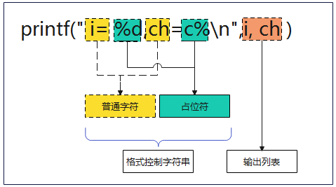

其中，

- `"格式控制字符串"`是用双引号括起来的一个字符串。包括：
  - 普通字符：普通字符即需要在输出时原样输出的字符。
  - 占位符：由“%”和格式字符组成。这个位置可以用其它值代入。

- `"输出列表"`是程序需要输出的一些数据，可以是常量、变量或表达式。用于替换占位符的位置。

> 注意：printf() 参数与占位符是一一对应关系。如果参数个数少于对应的占位符， printf() 可能会输出内存中的任意值。

### 7.2 占位符

占位符的第一个字符是 `%` ，第二个字符表示占位符的类型。

printf() 的占位符有许多种类，与 C 语言的数据类型相对应。

下面按照字母顺序，列出占位符如下，方便查阅(红色为常用的)：

> %a ：浮点数(仅C99有效)
> %A ：浮点数(仅C99有效)
> **%c ：char型数据**
> **%d ：十进制整数(int)**
> %e ：使用科学计数法的浮点数，指数部分的 e 为小写
> %E ：使用科学计数法的浮点数，指数部分的 E 为大写
> %i ：整数，基本等同于 %d 
> **%f ：浮点数(float)**
> %g ：6个有效数字的浮点数。整数部分一旦超过6位，就会自动转为科学计数法，指数部分的 e 为小写
> %G ：等同于 %g ，唯一的区别是指数部分的 E 为大写
> %hd ：十进制 short int 类型
> %ho ：八进制 short int 类型
> %hx ：十六进制 short int 类型
> %hu ：unsigned short int 类型
> **%ld ：十进制整数(long)**
> %lo ：八进制 long int 类型
> %lx ：十六进制 long int 类型
> %lu ：unsigned long int 类型
> %lld ：十进制 long long int 类型
> %llo ：八进制 long long int 类型
> %llx ：十六进制 long long int 类型
> %llu ：unsigned long long int 类型
> %le ：科学计数法表示的 long double 类型浮点数
> **%lf ：十进制浮点数(double)**
> %n ：已输出的字符串数量。该占位符本身不输出，只将值存储在指定变量之中
> %o ：八进制整数
> **%p ：指针**
> **%s ：字符串**
> **%u ：十进制无符号整数（unsigned int）**
> %x ：十六进制整数
> %zd ： size_t 类型
> %% ：输出一个百分号

### 7.3 举例

**举例1：%d**

```c
int num = 10;
printf("count is %d\n",num);  //输出：count is 10  
```

```c
printf("There are %i students\n", 5);   //输出：There are 5 students
```

**举例2：%lf 和 %f**

```c
float f = 3.1415926535f;    // 单精度浮点数
double d = 3.1415926535;  // 双精度浮点数

// 使用 %f 输出单精度浮点数
printf("Float: %f\n", f);  //Float: 3.141593
// 使用 %lf 输出双精度浮点数
printf("Double: %lf\n", d); //Double: 3.141593

// 使用 %f 输出单精度浮点数
printf("Float: %.8f\n", f);  //Float: 3.14159274
// 使用 %lf 输出双精度浮点数
printf("Double: %.8lf\n", d); //Double: 3.14159265
```

**举例3：%c**

```c
char level = 'A';
printf("this score level is:%c\n",level); //输出：this score level is:A
```

**举例4：%s**

```c
printf("%s是我最喜欢的冷门歌手.\n","孙燕姿"); //输出：孙燕姿是我最喜欢的冷门歌手.
```

**举例5：多个占位符**

输出文本里面可以使用多个占位符。

```c
printf("%s有%d部手机\n", "老板", 2); //输出：老板有2部手机
```


### 7.4 输出格式

printf() 可以定制占位符的输出格式。

**格式1：限定宽度**

printf() 允许限定占位符的最小宽度。

```c
printf("%5d\n", 123); // 输出为 "  123" 
```

说明：%5d 表示这个占位符的宽度至少为5位。如果不满5位，对应的值的前面会添加空格。

输出的值默认是右对齐，即输出内容前面会有空格；如果希望改成左对齐，在输出内容后面添加空格，可以在占位符的 % 的后面插入一个 - 号。

```c
printf("%-5d\n", 123); // 输出为 "123  "
```

对于小数，这个限定符会限制所有数字的最小显示宽度

```c
printf("%12f\n", 123.45); // 输出 "  123.450000"
```

%12f 表示输出的浮点数最少要占据12位。由于小数的默认显示精度是小数点后6位，所以123.45 输出结果的头部会添加2个空格。

**格式2：总是显示正负号**

默认情况下， printf() 不对正数显示 + 号，只对负数显示 - 号。如果想让正数也输出 + 号，可以在占位符的 % 后面加一个 + 。

```c
printf("%+d\n", 11); // 输出 +11
printf("%+d\n", -11); // 输出 -11
```

**格式3：限定小数位数**

输出小数时，有时希望限定小数的位数。举例来说，希望小数点后面只保留两位，占位符可以写成 %.2f 。

```c
printf("Number is %.2f\n", 0.8); // 输出 Number is 0.80
```

这种写法可以与限定宽度占位符，结合使用。

```c
printf("%6.2f\n", 0.8); // 输出为 "  0.80"
```

说明：%6.2f 表示输出字符串最小宽度为6，小数位数为2。整体长度不足 6 位时，右对齐显示。

最小宽度和小数位数这两个限定值，都可以用 * 代替，通过 printf() 的参数传入。

```c
printf("%*.*f\n", 6, 2, 0.8);
//等同于
printf("%6.2f\n", 0.8);
```


>  【华南理工大学2018研】十六进制形式输出整数的格式说明符是（　）。
>
>  A．%u
>  B．%ld
>  C．%x
>  D．%o
>
>  【答案】C
>
>  【解析】A表示输出的是无符号整型；B表示输出的是有符号长整型；D表示输出的是八进制。


## 8、练习

练习1：开发一个 ILoveC.c 程序，可以输出 "某某 is studying c!"

```c
#include<stdio.h>

int main(){
    //printf("谷小妹 is studying C!\n");
    //printf("%s is studying C!\n","谷小妹");
    return 0;
}
```


练习2：控制台打印：5 + 3 = 8

```c
#include <stdio.h>

int main() {
    printf("%d + %d = %d\n", 5, 3, (5 + 3));
    return 0;
}								//函数结束
```


## 附录：C/C++ Single File Execution插件的安装

**1、为何安装C/C++ Single File Execution插件？**

前面已经创建了一个demo1工程，项目文件夹内存在一个代码文件，名为`main.c`。如果再创建一个C源文件，内部如果也包含main()函数，则会报错！因为默认C工程下只能有一个main()函数。如何解决此问题呢？

2、安装并测试

1）在 File - Settings - Plugins 中搜索 `C/C++ Single File Execution` 插件并安装

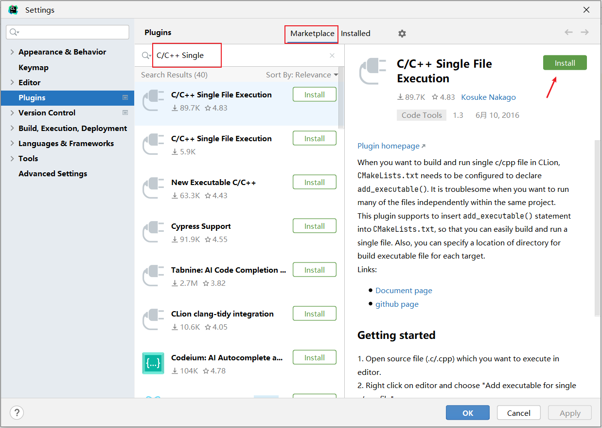

2）在需要运行的代码中右键，点击 Add executable for single c/cpp file

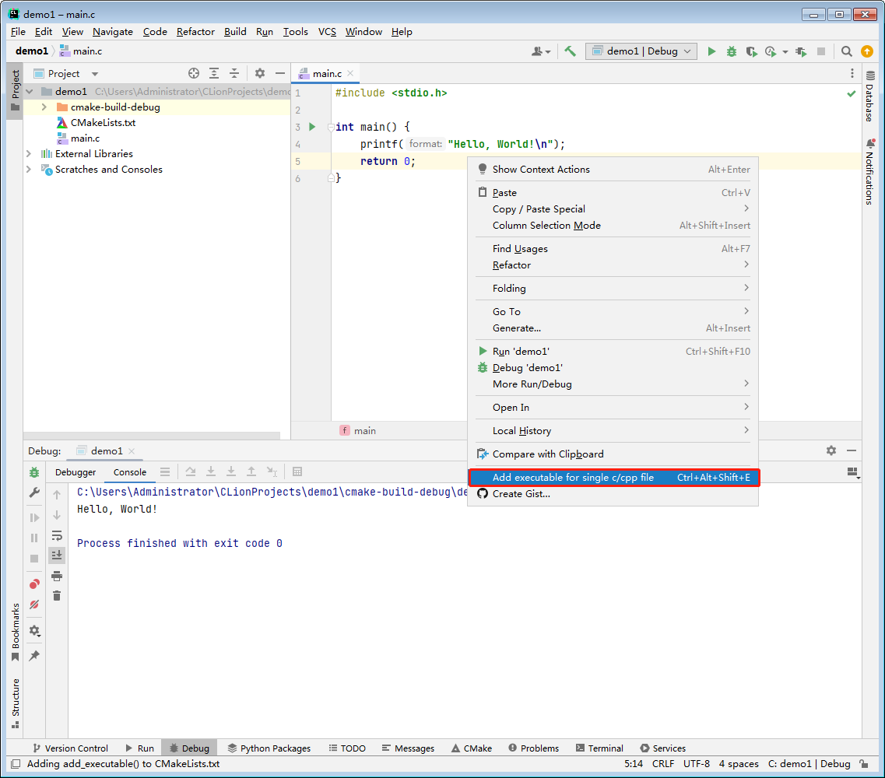

3）此时可以在 Cmakelists.text 文件中看到多出的这一行代码，这就是插件帮我们完成的事情

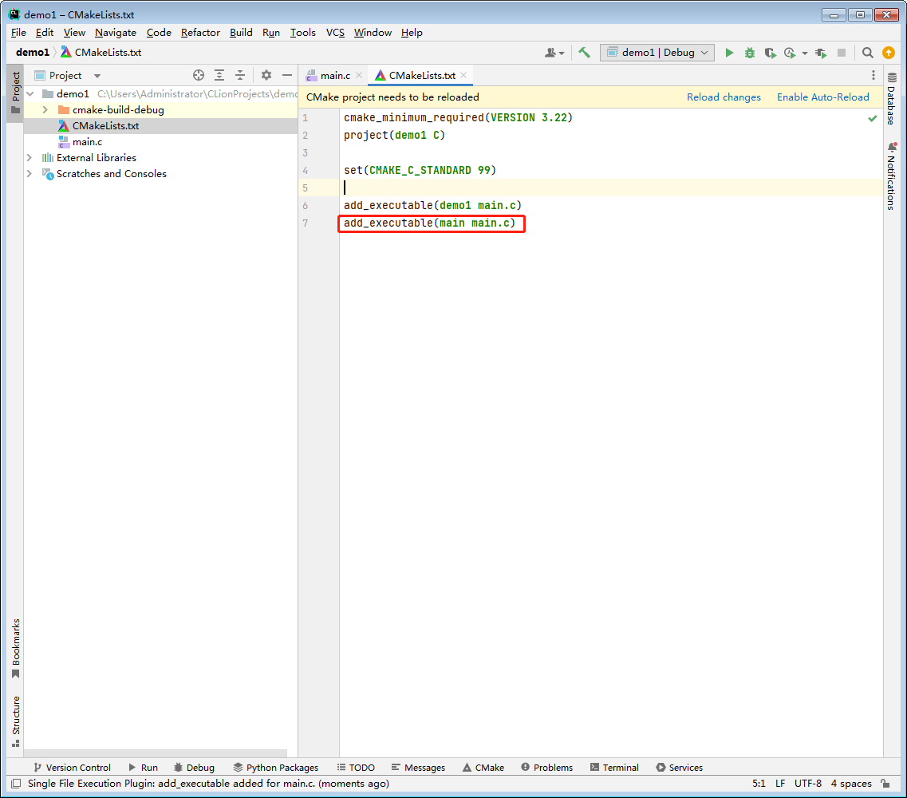

4）右键项目文件夹，点击 Reload CMake Project 进行刷新

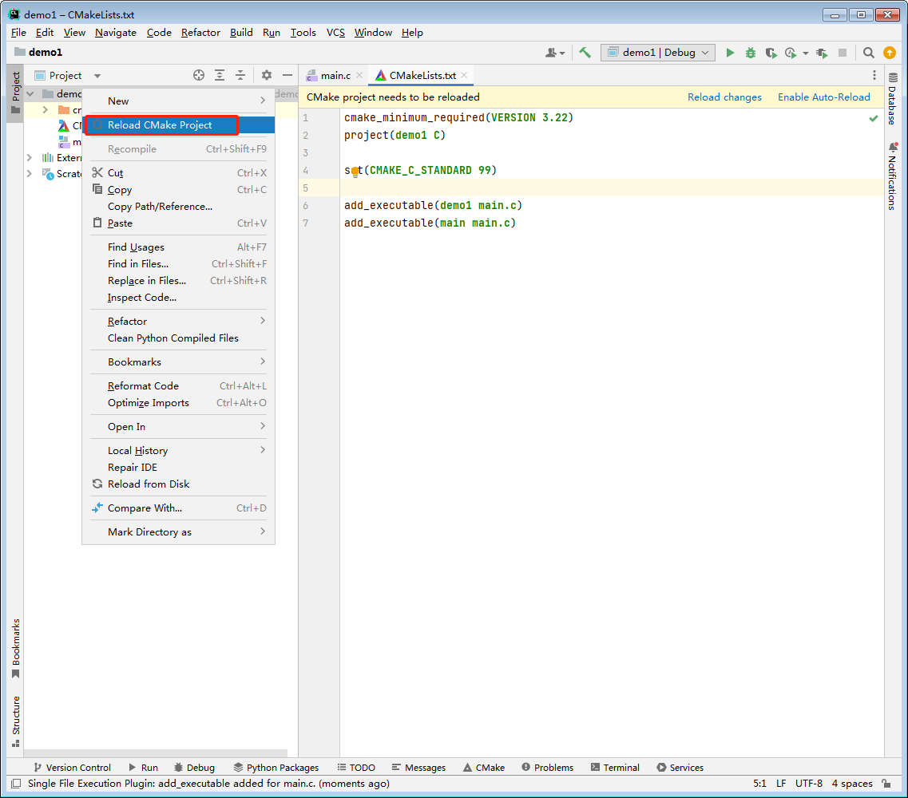

5）此时右上角标签处已经增加了我们的文件选项，选择需要的标签

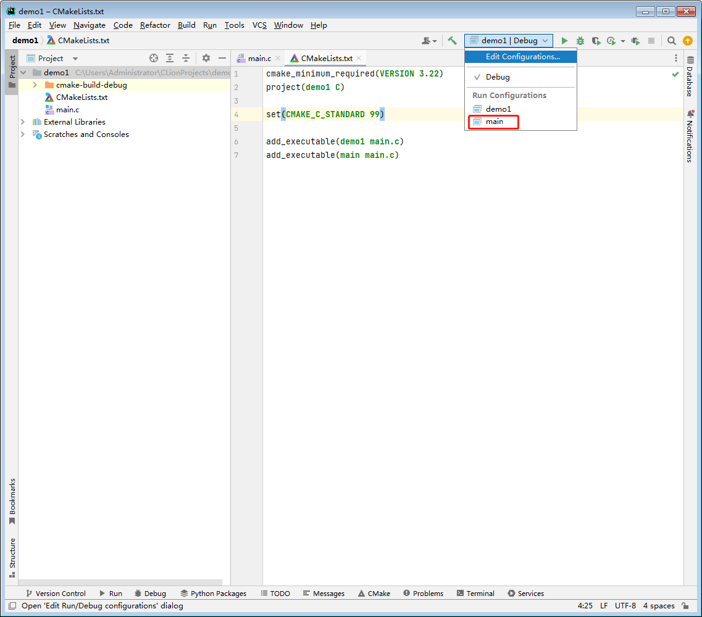

6）点击小三角，或右键代码处点击 Run 选项，即可运行代码。

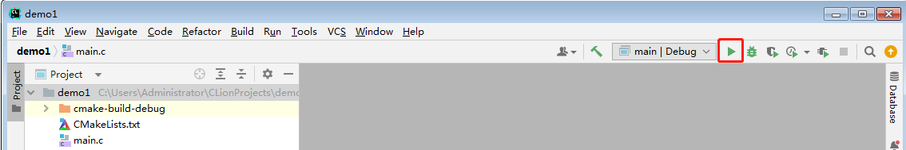

7）在该工程下创建main2.c文件，文件中的代码如下所示，执行上面相同的步骤。

```c
#include <stdio.h>

int main() {
    printf("Hello, World2!\n");
    return 0;
}
```

可以发现一个工程中允许存在多个main方法了，而且可以独立允许。

 <p id = "第02章_变量与进制"></p> 

# 第02章_变量与进制

## 本章专题脉络

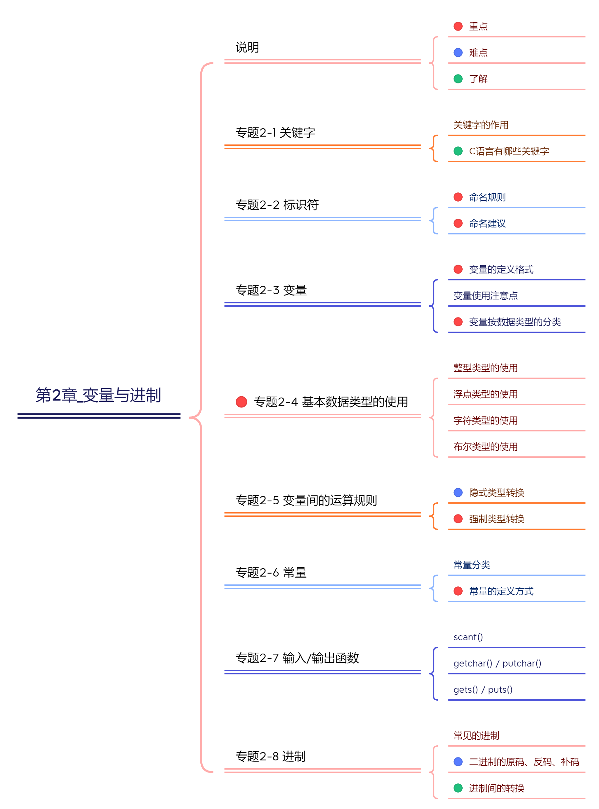

## 1、关键字(keyword)

定义：**被C语言赋予了特殊含义，用做专门用途的字符串（或单词）。**

特点：全部关键字都是`小写字母`。

举例：HelloWorld案例中，出现的关键字有 `int`、`return`等，这些单词已经被C语言定义好了。

传统的C语言（ANSI C）有32个关键字。如下：

| 类型                    | 具体关键字                                                   |
| ----------------------- | ------------------------------------------------------------ |
| 控制语句关键字（12 个） | break, case, continue, default, do, else, for, goto, if, return, switch, while |
| 数据类型关键字（12 个） | char, enum, double, long, float, int, short, signed, struct, unsigned, union, void |
| 存储类型关键字（4 个）  | auto, extern, register, static                               |
| 其他关键字（4 个）      | const, sizeof, typedef, volatile                             |

后续，1999年，C99标准增加了5个关键字：`inline`、`restrict`、`_Bool`、`_Complex`和`_Imaginary`。

2011年，C11标准又增加了7个关键字：`_Alignas`、`_Alignof`、`_Atomic`、`_Static_assert`、`_Noreturn`、`_Thread_local`和`_Generic`。

> 说明：
>
> 1、ANSI C、C99和C11，它们之间差别并不大，在大多数情况下，它们都是和谐共处的。
>
> 2、不需要死记硬背，学到哪里记到哪里即可。

## 2、标识符(Identifier)

C语言中变量、函数、数组名、结构体等要素命名时使用的字符序列，称为标识符。

技巧：凡是自己可以起名字的地方都叫标识符。

**标识符的命名规则**（必须遵守的`硬性规定`）

- 只能由26个英文字母大小写，0-9 或 _ 组成
- 数字不可以开头
- 不可以是关键字，但可以包含关键字
- C99和C11允许使用更长的标识符名，但是编译器只识别前63个字符。(会忽略超出的字符)
- 不允许有空格。
- 严格区分大小写字母。比如：Hello、hello是不同的标识符。

**标识符的命名建议**（建议遵守的`软性要求`）

- 在起名字时，为了提高阅读性，要尽量有意义，“见名知意”。如：sum，name，max，year，total 等。

- 不要出现仅靠大小写区分不同的标识符。如：name、Name 容易混淆

- 尽量避免名字中出现数字编号，如value1、value2等，除非逻辑上需要编号。

- 习惯上，所有宏定义、枚举常数、常量(只读变量)全用大写字母命名，用下划线分隔单词。

  比如： const double TAX_RATE = 0.08; //TAX_RATE 只读变量

- 系统内部使用了一些下划线开头的标识符（比如两个下划线开头的变量名、一个下划线 + 大写英文字母开头的变量名）。比如，C99 标准添加的类型 `_Bool`。为防止冲突，建议用户尽量避免使用下划线开头的标识符。

- 下划线通常用于连接一个比较长的变量名。如：max_classes_per_student。

- 变量名、函数名：多单词组成时，第一个单词首字母小写，第二个单词开始每个单词首字母大写：xxxYyyZzz (驼峰法，小驼峰)。比如：`short stuAge = 20; `，`tankShotGame`。 


举例：合法的标识符：

```c
a、BOOK1、_sun、MAX_SIZE、Mouse、student23、Football、FOOTBALL、max、_add、num_1、sum_of_numbers
```

举例：非法的标识符：

```
$zj、3sum、ab#cd、23student、Foot-baii、s.com、b＆c、j**p、book-1、tax rate、don't
```


> 【武汉科技大学2019研】
>
> 以下均是合法变量名的是（　）。
> A．#name   total
> B．node 　value_max
> C．_var 　long
> D．stu－code   a＋b
>
> 【答案】B
>
> 【解析】C语言中变量名只能包含数字，字母和下划线，且只能以字母和下划线开始。A项含非法字符#，错误；C中long为关键字，变量不能以关键字命名；D中含非法字符－和＋。


>  【四川大学2017研】以下不合法的用户标识符是（　　）。
>  A．J2_KEY
>  B．Double
>  C．4d
>  D．\_8_
>
>  【答案】C
>
>  【解析】标识符只能包含数字，字母，下划线，且不能以数字开头，选项C错误。


> 练习
>
> 下列定义变量的语句中错误的是（　　）。
> A．double int_；
> B．float US$；
> C．char For；
> D．int _int；
>
> 【答案】B【解析】标识符由字母、数字、下划线组成。$是非法字符，不能出现在标识符中。答案选择B选项。


## 3、变量(variable)

### 3.1 为什么需要变量


一花一世界，如果把一个程序看做一个世界或一个社会的话，那么变量就是程序世界的花花草草、万事万物。即，**变量是程序中不可或缺的组成单位，最基本的存储单元**。


### 3.2 初识变量

- 变量的概念：

  - 内存中的一个存储区域，该区域的数据可以在同一类型范围内不断变化。

  - 通过变量名，可以访问这块内存区域，获取里面存储的值。

  - 变量的构成包含三个要素：`数据类型`、`变量名`、`存储的值`

  - C语言中变量声明的格式：`数据类型 变量名 = 变量值`

    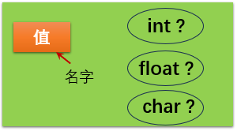

- 变量的作用：用于在内存中保存数据。

- 使用变量注意：

  - C语言中每个变量必须先声明，后使用。
  - 不同的数据类型，占用的空间大小不一样。
  - 一旦声明，变量的类型就不能在运行时修改。

### 3.3 变量的声明与赋值

#### 步骤1：变量的声明

格式：

```c
数据类型  变量名;  //声明变量的语句必须以分号结尾
```

举例1：

```c
int width;
```

举例2：

```c
int width,height;

// 等同于
int width;
int height;
```

#### 步骤2：变量的赋值

变量声明时，就为它分配内存空间，但是不会清除内存里面原来的值。这导致声明变量以后，变量会是一个随机的值。所以，变量一定要赋值以后才能使用。

```c
int age; //变量的声明
age = 18;  //变量的赋值
```

变量的声明和赋值，也可以写在一行。

```c
int age = 18;
```

多个相同类型变量的赋值，可以写在同一行。

```c
int a = 1, b = 2;
```

```c
int a, b;
a = 1;
b = (a = 2 * a);
```

```c
int a, b, c, x, y;
a = b = c = x = y = 10;  //连续赋值
```

> 注意：声明变量以后，不用忘记初始化赋值！定义变量时编译器并不一定清空了这块内存，它的值可能是无效的数据，运行程序，会异常退出。

### 3.4 变量的作用域(scope)

- 变量的作用域：其定义所在的一对{ }内。
- 变量只有在其`作用域`内才有效。出了作用域，变量不可以再被调用。
- 同一个作用域内，不能定义重名的变量。

- C 语言的变量作用域主要有两种：文件作用域（file scope）和块作用域（block scope）。


`文件作用域（file scope）`指的是，在源码文件顶层声明的变量，从声明的位置到文件结束都有效。

```c
int x = 1;
int main() {
	printf("%d\n", x);
    return 0;
}
```

`块作用域（block scope）`指的是由大括号（ {} ）组成的代码块，它形成一个单独的作用域。凡是在块作用域里面声明的变量，只在当前代码块有效，代码块外部不可见。

```c
int main() {
    int m = 10;
    if (m == 10) {
        int n = 20;
        printf("%d %d\n", m, n);  // 10 20
    }
    printf("%d\n", m);  // 10
    printf("%d\n", n);  // 超出作用域，报错
    
    return 0;
}
```

最常见的块作用域就是函数，函数内部声明的变量，对于函数外部是不可见的。 for 循环也是一个块作用域，循环变量只对循环体内部可见，外部是不可见的。

```c
for (int i = 0; i < 10; i++){
	printf("%d\n", i);
}
printf("%d\n", i); // 超出作用域，报错
```

### 3.5 变量按类型的分类

变量可以按`数据类型`来分，也可以按`声明的位置`来分（全局变量、局部变量）。本节主讲变量的不同类型。

C 语言中的变量按照数据类型分为：

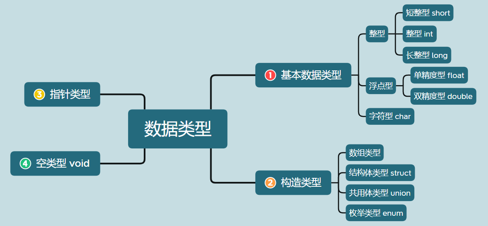

> 注意1：这里列举的是C语言的常用类型，后续C语言版本还有新增的类型。
>
> 注意2：空类型：void 表示空类型（无类型）。通常应用于函数的返回值类型、函数的参数、指针类型。
>
> 注意3：在C语言中，没有`字符串类型`，使用字符数组表示字符串。


## 4、基本数据类型

### 4.1 整数类型

#### 4.1.1 类型说明

- C语言规定了如下的几类整型：短整型(short)、整型(int)、长整型(long)、更长的整型(long long)

- 每种类型都可以被 signed 和unsigned 修饰。其中，

  - 使用 `signed 修饰`，表示该类型的变量是带符号位的，有正负号，可以表示负值。`默认是signed`。
  - 使用 `unsigned 修饰`，表示该类型的变量是不带符号位的，没有有正负号，只能表示零和正整数。

- bit(位)：计算机中的最小存储单位。

  byte(字节)：计算机中基本存储单元。

  1byte = 8bit

| 类型        | 修饰符   | 占用空间       | 取值范围                                                   |
| ----------- | -------- | -------------- | ---------------------------------------------------------- |
| short [int] | signed   | 2个字节(=16位) | -32768 ~ 32767 (-$2^{15}$ ~ $2^{15}$-1)                    |
| short [int] | unsigned | 2个字节(=16位) | 0 ~ 65535  (0 ~ $2^{16}$-1)                                |
| int         | signed   | 通常4个字节    | -2147483648 ~ 2147483647 (-$2^{31}$ ~ $2^{31}$-1)          |
| int         | unsigned | 通常4个字节    | 0 ~ 4294967295  (0 ~ $2^{32}$-1)                           |
| long [int]  | signed   | 4个或8个字节   | 4字节时：-2147483648 ~ 2147483647 (-$2^{31}$ ~ $2^{31}$-1) |
| long [int]  | unsigned | 4个或8个字节   | 4字节时：-0 ~ 4294967295  (0 ~ $2^{32}$-1)                 |

long long int是`C99新增`的：

| 类型            | 修饰符   | 占用空间       | 取值范围                                                     |
| --------------- | -------- | -------------- | ------------------------------------------------------------ |
| long long [int] | signed   | 8个字节(=64位) | -9223372036854775808~ 9223372036854775807(-$2^{63}$ ~ $2^{63}$-1) |
| long long [int] | unsigned | 8个字节(=64位) | 0 ~ 18446744073709551615(0 ~ $2^{64}$-1)                     |

> 说明1：不同计算机的 int 类型的大小是不一样的。比较常见的是使用4个字节（32位）存储一个 int 类型的值，具体情况如下：

| 类型          | 16位编译器 | 32位编译器 | 64位编译器 |
| ------------- | ---------- | ---------- | ---------- |
| short int     | 2字节      | 2字节      | 2字节      |
| int           | 2字节      | 4字节      | 4字节      |
| unsigned int  | 2字节      | 4字节      | 4字节      |
| long          | 4字节      | 4字节      | 8字节      |
| unsigned long | 4字节      | 4字节      | 8字节      |
| long long     | 8字节      | 8字节      | 8字节      |

> 说明2：C标准虽然没有具体规定各种类型数据所占用存储单元的长度，但几条铁定的原则（ANSI/ISO制订的）：
> ① sizeof(short int) ≤ sizeof(int) ≤ sizeof(long int) ≤ sizeof(long long)，具体由各编译系统自行决定的。其中，sizeof是测量类型或变量长度的运算符。
>
> ② short int至少应为2字节，long int至少应为4字节。

这样约定的好处就是使得C语言可以长久使用。`现在的主流CPU是64位`，可以预测不久的将来会推出128位甚至256位的CPU，但是在C语言刚刚出现的时候，CPU还是以8位和16位为主。如果那时候就将整型定死为8位或16位，那么现在我们肯定不会再学习C语言了。

> 说明3：
>
> 最常用的整型类型为：int类型。
>
> 整数型常量，默认为int类型。

#### 4.1.2 举例

举例1：对于 int 类型，默认是带有正负号的。即 int 等同于 signed int 。一般情况下，关键字signed省略不写。

```c
signed int m;  //声明了一个带符号的整数变量 m 
// 等同于
int m;   //声明了一个带符号的整数变量 m
```

举例2：int 类型也可以不带正负号，只表示非负整数。这时就必须使用关键字 unsigned 声明变量。表数范围为：0~4294967295

```c
unsigned int a;   //声明了一个不带符号的整数变量a，表数范围为：0~4294967295
```

unsigned int 里面的 int 可以省略，所以上面的变量声明也可以写成这样：

```c
unsigned a;
```

举例3：

int 类型使用4个字节表示一个整数，对于小整数，这样做很浪费空间。另一方面，某些场合需要更大的整数，8个字节还不够。此时，可以使用short int （简写为 short ）、long int （简写为 long ）、long long int （简写为 long long ）

```c
signed short int a; 
signed long int b;
signed long long int c;
```

默认情况下， short 、 long 、 long long 都是带符号的（signed），即 signed 关键字可以省略。代码简写为：

```c
short a; 
long b;
long long c;
```

它们也可以声明为不带符号（unsigned），使得能够表示的最大值扩大一倍。

```c
unsigned short a;  //无符号短整型，表数范围：0~65535
unsigned long b;   //无符号长整型，表数范围：0~4294967295
unsigned long long c;  //无符号长整型，表数范围：0~18446744073709551615
```

#### 4.1.3 关于后缀

编译器将一个整数字面量指定为 int 类型，但是如果希望将其指定为 long 类型，需要在该字面量末尾加上后缀 `l` 或 `L` ，编译器会把这个字面量的类型指定为 long 。

```c
long x = 123L; //或者写成 123l
```

如果希望字面量指定为long long类型，则后缀以`ll`或`LL`结尾。

```c
long long y = 123LL;
```

如果希望指定为无符号整数 unsigned int ，可以使用后缀 `u` 或 `U` 。

```c
unsigned int x = 123U;
```

L 和 U 可以结合使用，表示 unsigned long 类型。 L 和 U 的大小写和组合顺序无所谓。

u 还可以与其他整数后缀结合，放在前面或后面都可以，比如 10UL 、 10ULL 和 10LLU 都是合法的。

```c
unsigned long int      x = 1234UL;
unsigned long long int x = 1234ULL;
```

#### 4.1.4 精确宽度类型(了解)

C 语言的整数类型（short、int、long）在不同计算机上，占用的字节宽度可能是不一样的，无法提前知道它们到底占用多少个字节。程序员有时控制准确的字节宽度，这样的话，代码可以有更好的可移植性，头文件 stdint.h 创造了一些新的类型别名。

**精确宽度类型(exact-width integer type)**：保证某个整数类型的宽度是确定的。

- int8_t ：8位有符号整数


- int16_t ：16位有符号整数


- int32_t ：32位有符号整数


- int64_t ：64位有符号整数


- uint8_t ：8位无符号整数


- uint16_t ：16位无符号整数


- uint32_t ：32位无符号整数


- uint64_t ：64位无符号整数


上面这些都是类型别名，编译器会指定它们指向的底层类型。比如，某个系统中，如果 int 类型为32位， int32_t 就会指向 int ；如果 long 类型为32位， int32_t 则会指向 long 。

```c
#include <stdio.h>
#include <stdint.h>

int main() {
	int32_t x32 = 45933945;  //变量 x32 声明为 int32_t 类型，可以保证是32位的宽度。
	printf("x32 = %d\n", x32);
	return 0;
}
```

#### 4.1.5 整型的极限值(了解)

有时候需要查看，当前系统不同整数类型的最大值和最小值，C 语言的头文件 `limits.h` 提供了相应的常量。比如：INT_MIN 代表 signed int 类型的最小值 -2147483648， INT_MAX 代表 signed int 类型的最大值 2147483647。

```c
#include <limits.h>

int main() {
    printf("%d\n", INT_MIN  );  // -2147483648
    printf("%d\n", INT_MAX  );  // 2147483647
    return 0;
}
```

为了代码的可移植性，需要知道某种整数类型的极限值时，应该尽量使用这些常量。

- SCHAR_MIN ， SCHAR_MAX ：signed char 的最小值和最大值。

- SHRT_MIN ， SHRT_MAX ：short 的最小值和最大值。

- INT_MIN ， INT_MAX ：int 的最小值和最大值。

- LONG_MIN ， LONG_MAX ：long 的最小值和最大值。

- LLONG_MIN ， LLONG_MAX ：long long 的最小值和最大值。

- UCHAR_MAX ：unsigned char 的最大值。

- USHRT_MAX ：unsigned short 的最大值。

- UINT_MAX ：unsigned int 的最大值。

- ULONG_MAX ：unsigned long 的最大值。

- ULLONG_MAX ：unsigned long long 的最大值。


### 4.2 浮点类型

#### 4.2.1 类型说明

浮点型变量，也称为实型变量，用来存储小数数值的。因为32位浮点数提供的精度或者数值范围还不够，C 语言又提供了另外两种更大的浮点数类型。

在C语言中，浮点型变量分为三种：单精度浮点型(float)、双精度浮点型(double)、长双精度浮点型(long double)。

| 类型        | 占用空间        | 取值范围                                                     |
| ----------- | --------------- | ------------------------------------------------------------ |
| float       | 4个字节 (=32位) | $-1.4*10^{-45}$ ~ $-3.4*10^{+38}$，$1.4*10^{-45}$ ~ $3.4*10^{+38}$ |
| double      | 8个字节 (=64位) | $-4.9*10^{-324}$ ~ $-1.7*10^{+308}$，$4.9*10^{-324}$ ~ $1.7*10^{+308}$ |
| long double | 12个字节(=96位) | 太大了...                                                    |

其中，

| 类型   | 16位编译器 | 32位编译器 | 64位编译器 |
| ------ | ---------- | ---------- | ---------- |
| float  | 4字节      | 4字节      | 4字节      |
| double | 8字节      | 8字节      | 8字节      |

C语言的第3种浮点类型是long double，以满足比double类型更高的精度要求。不过，C只保证long double类型至少与double类型的精度相同。

浮点型变量不能使用signed或unsigned修饰符。

最常用的浮点类型为：double 类型，因为精度比float高。

浮点型常量，默认为 double 类型。

**关于后缀：**

对于浮点数，编译器默认指定为 double 类型，如果希望指定为float类型，需要在小数后面添加后缀 `f`或`F`；如果希望指定为long double类型，需要在小数后面添加后缀 `l`或`L`。

```c
float x       = 3.14f;
double x      = 3.14;
long double x = 3.14L;
```

#### 4.2.2 举例

**举例1：**

```c
float f = 123.4f;　　//后面必须加上字母f
double d1 = 101.1;　//后面可以省略字母d
double d2 = 299.4;　　//后面可以加上字母d
```

**举例2：**

C 语言允许使用科学计数法表示浮点数，使用字母 e 来分隔小数部分和指数部分。注意，e 的前后，不能存在空格。

```c
double x = 123.456e+3; // 123.456 x 10^3
// 等同于
double x = 123.456e3;
```

另外，科学计数法的小数部分如果是 0.x 或 x.0 的形式，那么 0 可以省略。

```c
0.3E6
// 等同于
.3E6
    
3.0E6
// 等同于
3.E6
```

**举例3：** 可以在常量的末尾加专用字符，强制指定常量的类型

```c
float a = 3.14159f; //把此3.14159按单精度浮点常量处理
long double a = 1.23L; //把此1.23作为long double型处理
```

**举例4：**

有人用温度计测量出用华氏法表示的温度(如64°F），今要求把它转换为以摄氏法表示的温度(如17.8℃)。转换的公式为：$c = \frac{5}{9}(f - 32)$。

其中，f 代表华氏温度，c 代表摄氏温度。

```c
#include <stdio.h>

int main() {
    float f, c; //定义f和c分别表示华氏温度、摄氏温度
    f = 64.0; //指定f的值
    c = (5.0 / 9) * (f - 32); //利用公式计算c的值
    printf("f=%f\nc=%f\n", f, c); //输出c的值
    return 0;
}
```

#### 4.2.3 存储规则(了解)

任何有小数点的数值，都会被编译器解释为浮点数。所谓“浮点数”就是使用 m * b^e 的形式，存储一个数值， m 是小数部分， b 是基数， e 是指数部分。

**从十进制的角度：**

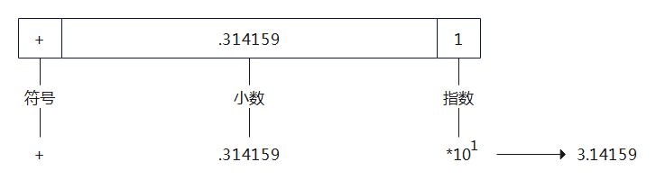

**从二进制的角度：**

根据国际标准IEEE（电气和电子工程协会） 754，任意一个二进制浮点数V可以表示成下面的形式：$(-1)^S * M * 2^E$

其中：

- $(-1)^s$表示符号位，当s=0，V为正数；当s=1，V为负数。

- M表示有效数字，大于等于1，小于2。

- $2^E$表示指数位。

举例来说：

十进制的5.0，写成二进制是 101.0 ，相当于 1.01×2^2 。即，按照上面V的格式，可以得出s=0，M=1.01，E=2。

十进制的-5.0，写成二进制是 -101.0 ，相当于 -1.01×2^2 。即，s=1，M=1.01，E=2。

`IEEE 754规定：`

对于32位的浮点数，最高的1位是符号位s，接着的8位是指数E，剩下的23位为有效数字M。

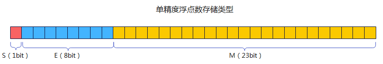

对于64位的浮点数，最高的1位是符号位S，接着的11位是指数E，剩下的52位为有效数字M。

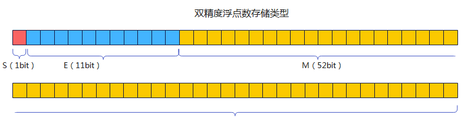


浮点数的存储方式，决定了浮点数精度控制在一定范围内。有效数字部分可能丢失，造成精度损失。


### 4.3 字符类型

C语言中，使用 char 关键字来表示字符型，用于存储一个`单一字符`。

字符型变量赋值时，需要用一对英文半角格式的单引号（`''`）把字符括起来。

每个字符变量，在16位、32位或64位编译器中都是`占用 1 个字节(=8位)`。

**表示方式1：最常见**

```c
char c = 'A';　//为一个char类型的变量赋值字符'A'
```

每个字符对应一个整数（由 ASCII 码确定），比如 A 对应整数 65 。

只要在字符类型的范围之内，整数与字符是可以互换的，都可以赋值给字符类型的变量。

**表示方式2：ASCII 码值**

```c
char c = 66;
// 等同于
char c = 'B';
```

两个字符类型的变量可以进行数学运算。

```c
char a = 'B'; // 等同于 char a = 66;
char b = 'C'; // 等同于 char b = 67;
printf("%d\n", a + b); // 输出133
```

`常见的ASCII值与对应的字符如下：(ASCII数值范围为0-127)`


> ASCII码：上个世纪60年代，美国制定了一套字符编码，对**英语字符**与**二进制位之间的关系**，做了统一规定。这被称为ASCII码。ASCII码一共规定了**127**个字符的编码，比如空格“SPACE”是32（二进制00100000），大写的字母A是65（二进制01000001）。这128个符号（包括32个不能打印出来的控制符号），只占用了一个字节的后面7位，最前面的1位统一规定为0，也就是说，ASCII虽然用8位二进制编码表示字符，但是其有效位为7位。


举例1：字符′1′和整数1是不同的概念。（参看ASCII码表）

```c
char c1 = 1;
char c2 = '1';
printf("c1 = %d\n",c1); // c1 = 1
printf("c2 = %d\n",c2); // c2 = 49
```

举例2：

```c
char c='?'; //定义c为字符型变量并使初值为字符'?'。'?'的ASCII代码是63，系统把整数63赋给变量c。
printf("%d %c\n",c,c); //用"%d"格式输出十进制整数63，用"%c"格式输出字符'?'
```

**signed 和 unsigned 修饰：**

根据C90标准，C语言允许在关键字char前面使用signed或unsigned。

```c
signed char c; // 范围为 -128 到 127
unsigned char c; // 范围为 0 到 255
```

注意，C 语言规定 char 类型默认是否带有正负号，由当前系统决定，这一点与 int 不同， int 等同于 signed int 。这就是说， char 不等同于signed char ，它有可能是 signed char（范围-128 到 127） ，也有可能是 unsigned char （范围0 到255）。不管是哪种，范围都正好都能覆盖 0 到 127 的 ASCII 字符范围。

**表示方式3：使用转义字符**

单引号本身也是一个字符，如果要表示这个字符常量，必须使用反斜杠转义。

```c
char t = '\'';
```

char还可以用来表示转义字符。比如：

| 字符形式 | 含义                                               |
| -------- | -------------------------------------------------- |
| `\n`     | 换行符（光标移动到下行行首）                       |
| `\t`     | 水平制表符，光标移到下一个Tab位置                  |
| `\'`     | 单引号字符 '                                       |
| `\"`     | 双引号字符 "                                       |
| `\\`     | 反斜杠字符 ’\’                                     |
| `\r`     | 回车符，光标移到本行开头                           |
| `\0`     | null 字符，代表没有内容。注意，这个值不等于数字0。 |
| `\b`     | 退格键，光标回退一个字符，但不删除字符             |


### 4.4 布尔类型

C语言标准（C89）没有为布尔值单独设置一个类型，所以在判断真假时，使用整数 0 表示假，所有非0表示真。比如：

```c
int main(){
    int handsome = 1;
    
    if (handsome) {
        printf("我好帅!\n");
    }
    
	return 0;
}
```

上述做法不直观，可以借助于C语言的宏定义处理。比如：

```c
// 定义布尔类型的宏
#define BOOL int   //可以使用 typedef int BOOL; 替换
#define TRUE 1
#define FALSE 0


int main(){
    BOOL handsome = TRUE;
    
    if(handsome){
        printf("好帅~");
    }

    return 0;
}
```

此外，C99 标准添加了类型 `_Bool`，表示布尔值，即逻辑值true和false。但是，这个类型的值其实只是整数类型的别名，还是使用 0 表示false， 1 表示true，其它非0的值都会被存储为1。所以_Bool类型实际上也是一种整数类型。

```c
#include <stdio.h>

int main() {
    _Bool isFlag = 1;
    if (isFlag)
        printf("你好毒~~\n");
    return 0;
}
```

与此同时，C99还提供了一个头文件 stdbool.h，文件中定义了`bool`代表`_Bool`，并且定义了 true 代表 1 、 false 代表 0 。只要加载这个头文件，就可以使用 bool 定义布尔值类型，以及 false 和 true 表示真假。

```c
#include <stdio.h>
#include <stdbool.h>

int main() {
    bool isFlag = true;
    if (isFlag)
        printf("你好毒~~\n");
    return 0;
}
```


> 【武汉科技大学2019研】
>
> 以下选项中不属于C语言类型的是（　　）。
> A．short int
> B．unsigned long int
> C．char
> D．bool
>
> 【答案】D
>
> 【解析】C语言中没有bool型，只有C++才有boolean型，也称bool。C语言中一般用“0”表示“假”，用“1”表示“真”。


> 【四川大学2017研】有4个圆塔，圆心分别为（2，2）、（－2，2）、（－2，－2）、（2，－2），圆半径为1。这4个塔的高度为10m，塔以外无建筑物。今输入任一点的坐标，求该点的建筑高度（塔外的高度为零）。
>
> 【答案】
> N-S图如图1所示。
>
> 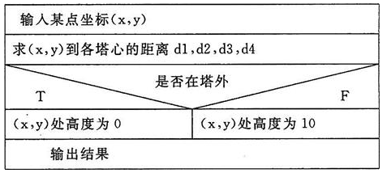
>
> ​										图1　计算某点建筑高度的N-S流程图
> 程序如下：
>
> ```c
> #include<stdio.h>
> 
> int main() {
> 
>  int h = 10;
>  float x1 = 2, y1 = 2, x2 = -2, y2 = -2, x3 = -2, y3 = -2, x4 = 2, y4 = -2;
>  float x, y; //表示随意选中的一个点的坐标
>  float d1, d2, d3, d4; //(x,y)这个点的坐标到各个圆心的距离
>  printf("请输入一个点(x,y)：");
>  scanf("%f,%f", &x, &y);
>  d1 = (x - x1) * (x - x1) + (y - y1) * (y - y1); //求该点到各中心点距离
>  d2 = (x - x2) * (x - x2) + (y - y2) * (y - y2);
>  d3 = (x - x3) * (x - x3) + (y - y3) * (y - y3);
>  d4 = (x - x4) * (x - x4) + (y - y4) * (y - y4); 
>  if (d1 > 1 && d2 > 1 && d3 > 1 && d4 > 1) //判断该点是否在塔外  
>      h = 0;
>  printf("该点高度为%d\n", h);
>  return 0;
> }
> ```


## 5、变量间的运算规则

在C语言编程中，经常需要对不同类型的数据进行运算，运算前需要先转换为同一类型，再运算。为了解决数据类型不一致的问题，需要对数据的类型进行转换。

### 5.1 隐式类型转换

**情况1：窄类型自动转为宽类型**

即，系统自动将`字节宽度较小`的类型转换为`字节宽度较大`的数据类型，它是由系统自动转换完成的。

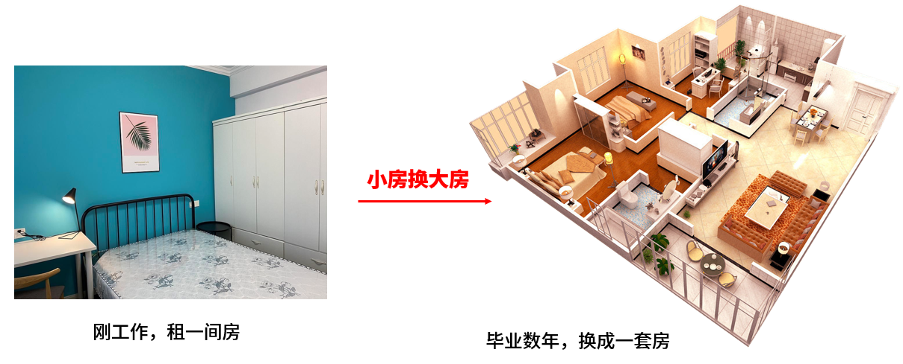

基本数据类型的转换规则如图所示：

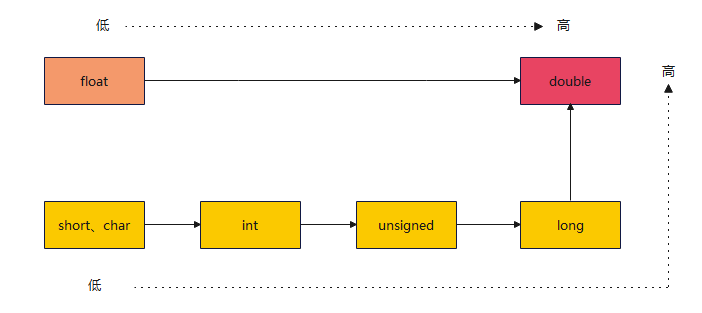

> 注意：最好避免无符号整数与有符号整数的混合运算。因为这时 C 语言会自动将 signed int 转为unsigned int ，可能不会得到预期的结果。

举例1：

- 不同的整数类型混合运算时，宽度较小的类型会提升为宽度较大的类型。比如 short 转为 int ，int 转为 long 等。
- 不同的浮点数类型混合运算时，宽度较小的类型转为宽度较大的类型，比如 float 转为double ， double 转为 long double 。

```c
float y = 12 * 2; //整数赋值给浮点数变量时，会自动转为浮点数。结果24.0
```

```c
//char类型 与 int类型运算，会自动提升为 int 。
char c = 10;
int i = 10;
int j = c + i;  //ok
```

```c
short s1 = 10;
int num1 = s1;    //ok
double num2 = s1; //ok
```

```c
int i = 10;
double d1 = 12.3;
double d2 = i + d1; //系统自动将i的类型由int转换为double类型，故i+d1结果为double类型
```

```c
double d;
d = 2 + 'A' + 1.5F;
```

举例2：

两个相同类型的整数运算时，或者单个整数的运算，一般来说，运算结果也属于同一类型。但是有例外，宽度小于 int 的类型，运算结果会自动提升为 int 。

```c
char c1 = 10;
short s1 = 10;
int i1 = c1 + s1;  //char类型和short类型的变量运算的结果默认为int类型
```

```c
unsigned char a = 1;
unsigned char b = 255;
unsigned char c = 255;

if ((a - 5) < 0) 
    do_something();

if ((b + c) > 300) 
    do_something();
```

说明：表达式 a - 5 和 b + c 都会自动转为 int 类型，所以函数 do_something() 会执行两次。


**情况2：宽类型赋值给窄类型**

`字节宽度较大`的类型，赋值给`字节宽度较小`的变量时，会发生类型降级，自动转为后者的类型。这时可能会发生截值（truncation），系统会自动截去多余的数据位，导致精度损失。

> 这反映了C语言在检查类型匹配方面不太严格。最好不要养成这样的习惯。

举例1：

```c
double pi = 3.14159;
int i = pi; // i 的值为 3
```

C编译器把浮点数转换成整数时，会直接丢弃（截断）小数部分，而不进行四舍五入。

举例2：

```c
int x = 3.14; //浮点数赋予整数变量时，C 语言直接丢弃小数部分。结果 3
```

```c
int cost = 12.99;         	 // double类型的值转为int类型,结果为：12
float pi = 3.1415926536;     // double类型的值转为float类型,结果为：3.141593
```

举例3：

```c
int i = 322;
char ch = i; // ch 的值是 66
```

图示：

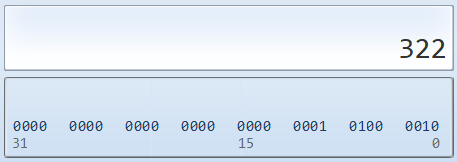

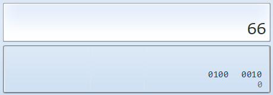

举例4：

```c
float f1 = 1.1f; //ok
double d2 = 4.58667435;
f1 = d2; // 出现精度损失 (double -> float )

printf("f1=%.8f", f1); // 期望： 4.58667435

```

由于存在精度限制，浮点数只是一个近似值，它的计算是不精确的。

举例5：

```c
float a = 3.14159; //3.14159为双精度浮点常量，分配8个字节；a为float变量，分配4个字节
```

编译时系统会发出警告(warning: truncation from ′const double′ to′float′)，提醒用户注意这种转换可能损失精度。

### 5.2 强制类型转换

隐式类型转换中的宽类型赋值给窄类型，编译器是会产生警告的，提示程序存在潜在的隐患。如果非常明确地希望转换数据类型，就需要用到`强制(或显式)类型转换`。

形式： **(类型名称)(变量、常量或表达式)**

功能：将“变量、常量或表达式”的运算结果强制转换为“类型名称”所表示的数据类型。

注意：强制类型转换会导致精度损失。

举例：

```c
double x = 12.3;
int y = 10;
int z = (int)x + y; //将变量x的值转换成int后,再与y相加
```

将浮点数转换为整数时，将舍弃浮点数的小数部分，只保留整数部分。

```c
float f1,f2;
f1 = (int)1.2 + 3.4;
f2 = (int)(1.2 + 3.4);
printf("f1=%f,f2=%f",f1,f2);
```

输出结果：f1=4.4，f2=4.0。

举例2：

```c
int i = 40000;
short s = (short)i;
printf("%d\n",s); //-25536
```

举例3：

```c
long y = (long) 10 + 12; // (long) 将 10 显式转为 long 类型。这里的显示转换其实是不必要的,因为可以自动转换
```

### 5.3 运算的溢出问题

每一种数据类型都有数值范围，如果存放的数值超出了这个范围（小于最小值或大于最大值），需要更多的二进制位存储，就会发生溢出。大于最大值，叫做`向上溢出（overflow）`；小于最小值，叫做`向下溢出（underflow）`。

一般来说，编译器不会对溢出报错，会正常执行代码，但是会忽略多出来的二进制位，只保留剩下的位，这样往往会得到意想不到的结果。所以，应该避免溢出。

举例1：

```c
unsigned char x = 255;
x = x + 1;
printf("%d\n", x); // 0
```

 x 是 unsign char 类型，最大值是255 （二进制 11111111 ），加 1 后就发生了溢出， 256 （二进制 100000000 ）的最高位 1 被丢弃，剩下的值就是 0 。

举例2：

```c
unsigned int ui = UINT_MAX;  // 4,294,967,295
ui++;
printf("ui = %u\n", ui); // 0
ui--;
printf("ui = %u\n", ui); // 4,294,967,295
```

常量 UINT_MAX 是 unsigned int 类型的最大值。如果加 1 ，对于该类型就会溢出，从而得到 0 ；而 0 是该类型的最小值，再减 1 ，又会得到 UINT_MAX 。

> 溢出很容易被忽视，编译器又不会报错，所以必须非常小心。


## 6、常量

### 6.1 常量分类

程序运行时，其值不能改变的量，即为`常量`。

C语言中的常量分为以下以下几种：

- 字面常量
- \#define 定义的标识符常量
- const 修饰的常变量
- 枚举常量

举例：字面常量

1、2、12是整型常量，2.1、12.5、3.14是实型常量，'a'、 'b'、'c'是字符型常量。

```c
#include <stdio.h>

int main(){
	//字面常量
	3.14;//字面常量
	1000;//字面常量
}
```

### 6.2 多种方式定义常量

#### 6.2.1 使用#define

这种方式是在文件开头用 #define 来定义常量，也叫作“宏定义”。所谓宏定义，**就是用一个标识符来表示一个常量值**，如果在后面的代码中出现了该标识符，那么编译时就全部替换成指定的常量值。即用宏体替换所有宏名，简称`宏替换`。

定义格式：`#define 符号常量名 常量值`

- 符号常量名，称为`宏体`，属于标识符，一般定义时用大写字母表示。
- 常量值，称为`宏名`，可以是数值常量，也可以是字符常量。

习惯上，**宏名用大写字母表示**，以便于与变量区别。但也允许用小写字母。

举例1：

```c
#include <stdio.h>

#define ZERO 0   //#define的标识符常量

int main() {
	printf("zero = %d\n", ZERO);
    return 0;
}
```

> 跟#include一样，“#”开头的语句都是“预处理语句”，在编译之前，预处理器会查找程序中所有的“ZERO”，并把它替换成0，这个过程称为预编译处理。
>
> 然后将预处理的结果和源程序一起再进行通常的编译处理，以得到目标代码 (OBJ文件)。

举例2：

```c
#include <stdio.h>

#define PI = 3.14  // 定义常量 PI，常量值 3.14。因为宏定义不是 C 语句，后面不能有分号

int main() {
   //PI = 3.1415  可以吗? => 不可以
  double area;
  double r = 1.2;
  area = PI * r * r;
  printf("面积 : %.2f", area);
  getchar();
  return 0;
}

```

举例3：

```c
//函数结果状态代码
#define OK 1
#define ERROR 0
#define OVERFLOW -2
```

> #define 对于考研数据结构来说没有什么贡献，我们只要认得它就行。
>
> 例如1，`#define MAX_Size 50`这句，即定义了常量`MAX_Size`(此时x = 50;等价于x = MAX_Size;)。
>
> 例如2，你要定义一个数组，如`int A[MAX_Size];`，加上一句注释“`/*MAX_Size为已经定义的常量，其值为50*/`”即可。

#### 6.2.2 使用const限定符

C99中新的声明方式，这种方式跟定义一个变量是一样的，只需要在变量的数据类型前再加上一个const关键字，这被称为“限定符”。

格式：

```c
const 数据类型 常量名 = 常量值;
```

举例：

```c
#include <stdio.h>

int main(){
	//const 修饰的常变量
	const float PI = 3.14f;
	//PI = 5.14;//是不能直接修改的！

	return 0;
}
```

const修饰的对象一旦创建就不能改变，所以必须初始化。

跟使用 #define定义宏常量相比，const定义的常量有详细的数据类型，而且会在编译阶段进行安全检查，在运行时才完成替换，所以会更加安全和方便。

#### 6.3.3 定义枚举常量

举例：

```c
#include <stdio.h>

//使用enum定义枚举类
enum Sex{
    //括号中的MALE,FEMALE,SECRET是枚举常量
	MALE,
	FEMALE,
	SECRET
};

int main(){
	//枚举常量
	printf("%d\n", MALE);
	printf("%d\n", FEMALE);
	printf("%d\n", SECRET);
	//注：枚举常量默认是从0开始，依次向下递增1的
	return 0;
}

```


> 【北京航空航天大学2018研】若已知有如下宏定义
>
> ```c
> #define  CANBERRA(x,y)  ((x－y)/(x＋y))
> ```
>
> 则以下表达式中，返回结果值最大的是（　　）。
> A．CANBERRA（3.0，2.0）；
> B．CANBERRA（4.0，1.0）；
> C．CANBERRA（1.0＋2.0，0.0＋2.0）；
> D．CANBERRA（1.0＋2.0，1.0＋1.0）；
>
> 【答案】C
>
> 【解析】A项中为1.0/5.0，结果为0.2；B项中为3.0/5.0，结果为0.6；C项中的宏替换后为（1.0＋2.0－0.0＋2.0）/（1.0＋2.0＋0＋2.0）＝1.0；D项中宏替换后为（1.0＋2.0－1.0＋1.0）/（1.0＋2.0＋1.0＋1.0）＝0.6，因此最后答案为C。


> 【中央财经大学2018研】若有如下宏定义：
>
> ```c
> #define  N  2
> #define  y(n)  ((N＋1)*n)
> ```
>
> 则执行下列语句：z＝4\*(N＋y(5))；后的结果是（　　）。
> A．语句有错误
> B．z值为68
> C．z值为60
> D．z值为180
>
> 【答案】B
>
> 【解析】y(5)＝15，z＝4\*(N＋y(5))＝4*17＝68，答案选B。


## 7、输入/输出函数

所谓输入输出是以计算机主机为主体而言的。

- 输出：从计算机向外部输出设备(显示器、打印机)输出数据。
- 输入：从输入设备(键盘、鼠标、扫描仪)向计算机输入数据。

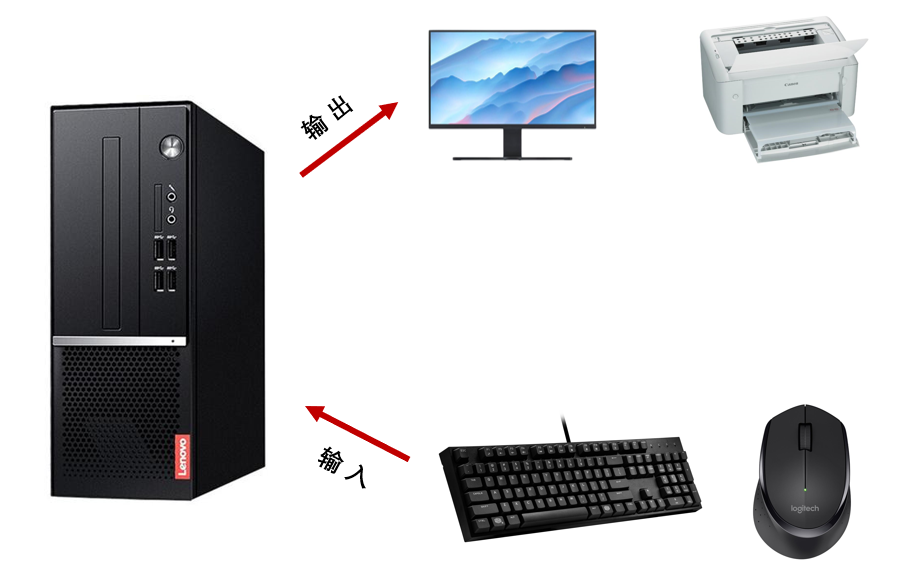

c语言本身没有提供专门的输入输出语句，所有的输入输出都是由调用标准库函数中的输入输出函数来实现的。

**输入函数：scanf() 、 getchar()、gets()：** 

- scanf()，是格式输入函数，可接收`任意类型`的数据。 
- getchar()，是`字符`输入函数， 只能接收`单个字符`。
- gets()，是`字符串`输入函数。

**输出函数：printf() 、 putchar()、puts()：**

- printf()，是格式输出函数，可按指定的格式显示任意类型的数据。
- putchar()，`字符`显示函数，只能显示`单个字符`。
- puts()，是`字符串`输出函数。

### 7.1 scanf()的使用

scanf()函数的作用：把从键盘上输入的数据根据找到的地址存入内存中，即给变量赋值。

格式： `scanf("格式控制字符串",参数地址列表); `

- “格式控制字符串”：约定输入数据的类型和格式，参数的个数必须与变量地址的个数一致。
- “参数地址列表”：以逗号 “, ”分隔的、`输入数据变量地址`序列。

举例：

```c
scanf("%d%d%d",&a,&b,&c)
```

其中，&a,&b,&c中的`&`是寻址操作符，&a表示对象a在内存中的地址。

注意，

- 如果scanf中%d是连着写的，如“`%d%d%d`”，在输入数据时，数据之间不可以用逗号分隔，只能用空白字符（空格或tab键或者回车键）分隔。即“`2(空格)3(tab)4`” 或 “`2(tab)3(回车)4`”等。
- 如果是“`%d,%d,%d`”，则在输入数据时需要加“,”，如“`2,3,4`”。

举例1：计算圆的面积，其半径由用户指定

```c
#include <stdio.h>

int main() {
    float radius, area;
    printf("请输入半径值：  ");
    scanf("%f", &radius);      //输入半径
    area = 3.14 * radius * radius;
    printf("area=%f\n", area); //输出圆的面积
    
    return 0;
}

```

> 注意：变量名之前要加上&运算符，表示取变量的地址，如“&a，&b”。否则将会出现错误。

举例2：输入一个整数，求其绝对值。

```c
#include <stdio.h>

int main() {

    int num;
    printf("输入一个整数:");

    scanf("%d", &num);
    int absNum = num;
    if(absNum < 0)
        absNum = -absNum;
    printf("\n 整数:%d--->绝对值为:%d\n", num, absNum);

    return 0;
}
```

举例3：输入多个变量的值，求乘积

```c
#include <stdio.h>

int main() {
    int a,b,c;
    printf("请输入整数a,b:");
    scanf("%d%d",&a,&b);
    c=a*b;
    printf("%d*%d=%d\n",a,b,c);
    
    return 0;
}
```

> 【武汉科技大学2019研】若有声明语句：int x； char y[20]； double z；则正确的输入语句是（　）。
> A．scanf（"%d%c%le\n"，&x，&y，&z）；
> B．scanf（"%2d%s%lf"，&x，&y，&z）；
> C．scanf（"%d%s%lf"，&x，y，&z）；
> D．scanf（"%x%s%3.2f"，&x，y，&z）；
>
> 【答案】C
>
> 【解析】y为一维数组名，指向数组首元素的地址，因此不需要再使用取地址运算符&，AB错误；D中%3.2f表示长度为3，小数为2位，但是小数点也占一位，因此D错误，答案选C。

### 7.2 getchar()与putchar()的使用

- getchar()：输入字符数据
  - 格式：getchar()
  - 功能：从键盘缓冲区读入一个字符

- putchar()：输出字符
  - 格式： putchar(ch)，其中ch是一个字符变量
  - 功能：从标准输出设备输出一个字符

举例：

```c
#include <stdio.h>

int main() {
    char c = 0;
	putchar('A'); //输出单个字符A
	putchar(c);   //输出变量c的ASCII对应字符
	putchar('\n'); //执行换行效果，屏幕不显示
}
```

```c
#include <stdio.h>

int main() {
    char ch;
    ch = getchar();
    putchar(ch);
    return 0;
}
```

### 7.3 gets()与puts()的使用(超纲)

**puts()：**

在C语言中，puts() 是一个用于输出字符串的标准库函数，其原型定义在 `<stdio.h>` 头文件中。`puts()` 函数的作用是将一个以 null 字符（`\0`）结尾的字符串打印到标准输出（通常是控制台）上，并自动添加一个换行符。

```c
int main() {

    char str1[]={"China\nBeijing"};
    char str2[] = "helloworld";

    puts(str1);

    puts(str2);

    return 0;
}

```

注意，puts()函数只能用于输出字符串，而不能输出其他类型的数据。如果需要输出其他类型的数据，应使用 `printf()` 函数。

**gets()：**

读取标准输入设备输入的字符串，直到遇到【Enter】键才结束。

```c
char str[20];   //定义一个数组
gets(str);      //获取输入的字符串,存放到字符数组中
```

举例：字符串的读写

```c
int main() {

    char str[15];
    printf("enter your name:");
    gets(str);        //输入字符串至数组变量str
    printf("your name is ");
    puts(str);        //输出字符串

    return 0;
}
```


## 8、变量按声明位置的分类(后面讲)

变量按照声明的位置，可以分为：局部变量 和 全局变量。

- **局部变量**
  - 在`函数体内定义`的变量，也称内部变量。局部变量只能在定义它的函数中使用。

- **全局变量**
  - 在`函数之外`定义的变量称为外部变量，外部变量是`全局变量`（也称全程变量）。

  - 一个程序中，凡是在全局变量之后定义的函数，都可以使用在其之前定义的全局变量。

举例：

```c
#include <stdio.h>

int global = 2023;//全局变量
int main(){
    int local = 2022;//局部变量
    
    //下面定义的global会不会报错？
    int global = 2024;//局部变量
    printf("global = %d\n", global);
    return 0;
}
```

> 当局部变量和全局变量同名的时候，局部变量优先使用。


## 9、常见的进制

### 9.1 二进制概述

**计算机底层如何存储数据呢？**

> 计算机世界中只有二进制，所以计算机中存储和运算的`所有数据`都要转为`二进制`。包括数字、字符、图片、声音、视频等。


> **世界上有10种人 ，认识和不认识二进制的。**

**二进制的由来**

二进制，是计算技术中广泛采用的一种数制，由德国数理哲学大师`莱布尼茨`于1679年发明。

二进制数据是用0和1两个数码来表示的数。它的基数为2，进位规则是“`逢二进一`”。

**二进制的应用**

二进制广泛应用于我们生活的方方面面。比如，广泛使用的摩尔斯电码（Morse Code），它由两种基本信号组成：短促的点信号“`·`”，读“`滴`”；保持一定时间的长信号“`—`”，读“`嗒`”。然后，组成了26个字母，从而拼写出相应的单词。


我们偶尔会看到的：SOS，即为：


### 9.2 进制的分类

- **十进制（decimal）**

  - 数字组成：0-9
  - 进位规则：满十进一
  - C 语言的整数默认都是十进制数

- **二进制（binary）**

  - 数字组成：0-1
  - 进位规则：满二进一，以`0b`或`0B`开头

  ```c
  int x = 0b101010;
  ```

- **八进制（octal）：很少使用**

  - 数字组成：0-7
  - 进位规则：满八进一，以数字`0`开头表示

  ```c
  int a = 012; // 八进制，相当于十进制的10
  int b = 017; // 八进制，相当于十进制的15
  ```

- **十六进制**

  - 数字组成：0-9，a-f
  - 进位规则：满十六进一，以`0x`或`0X`开头表示。此处的 a-f 不区分大小写

  ```c
  int a = 0x1A2B; // 十六进制，相当于十进制的6699
  int b = 0X10;   // 十六进制，相当于十进制的16
  ```

### 9.3 进制的换算举例

| 十进制 | 二进制 | 八进制 | 十六进制 |
| ------ | ------ | ------ | -------- |
| 0      | 0      | 0      | 0        |
| 1      | 1      | 1      | 1        |
| 2      | 10     | 2      | 2        |
| 3      | 11     | 3      | 3        |
| 4      | 100    | 4      | 4        |
| 5      | 101    | 5      | 5        |
| 6      | 110    | 6      | 6        |
| 7      | 111    | 7      | 7        |
| 8      | 1000   | 10     | 8        |
| 9      | 1001   | 11     | 9        |
| 10     | 1010   | 12     | a或A     |
| 11     | 1011   | 13     | b或B     |
| 12     | 1100   | 14     | c或C     |
| 13     | 1101   | 15     | d或D     |
| 14     | 1110   | 16     | e或E     |
| 15     | 1111   | 17     | f或F     |
| 16     | 10000  | 20     | 10       |

### 9.4 输出格式

不同的进制只是整数的书写方法不同，不会对整数的实际存储方式产生影响。不同进制可以混合使用，比如 10 + 015 + 0x20 是一个合法的表达式。

printf() 的进制相关占位符如下：

- %d ：十进制整数。


- %o ：八进制整数。


- %x ：十六进制整数。


- %#o ：显示前缀 0 的八进制整数。


- %#x ：显示前缀 0x 的十六进制整数。


- %#X ：显示前缀 0X 的十六进制整数。


```c
int x = 100;
printf("dec = %d\n", x); // 100
printf("octal = %o\n", x); // 144
printf("hex = %x\n", x); // 64
printf("octal = %#o\n", x); // 0144
printf("hex = %#x\n", x); // 0x64
printf("hex = %#X\n", x); // 0X64
```

### 9.5 进制间的转换(了解)

#### 9.5.1 二进制如何表示整数？

- 计算机数据的存储使用二进制`补码`形式存储，并且`最高位是符号位`。
  - 正数：`最高位是0`
  - 负数：`最高位是1`


- 规定1：正数的补码与反码、原码一样，称为`三码合一`
- 规定2：负数的补码与反码、原码不一样：
  - 负数的`原码`：把十进制转为二进制，然后最高位设置为1
  - 负数的`反码`：在原码的基础上，最高位不变，其余位取反（0变1,1变0）
  - 负数的`补码`：反码+1

#### 9.5.2 二进制与十进制间的转换

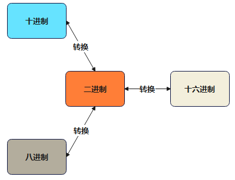

**二进制转十进制：权相加法**

针对于一个字节的数据举例来说：

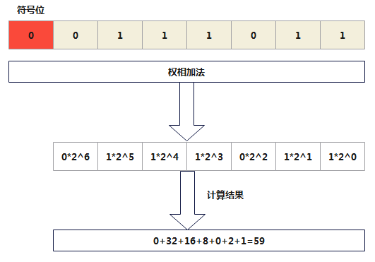


- 例如：1个字节（8位）

  25 ==> 原码  0001 1001 ==> 反码  0001 1001 -->补码  0001 1001

  -25 ==>原码  1001 1001 ==> 反码1110 0110 ==>补码 1110 0111

```java
整数：
正数：25   00000000 00000000 000000000 00011001（原码）
正数：25   00000000 00000000 000000000 00011001（反码）
正数：25   00000000 00000000 000000000 00011001（补码）

负数：-25  10000000 00000000 000000000 00011001（原码）
负数：-25  11111111 11111111 111111111 11100110（反码）
负数：-25  11111111 11111111 111111111 11100111（补码）
```

**一个字节可以存储的整数范围是多少？**

```java
//1个字节：8位

0000 0001  ~  0111 111 ==> 1~127

1000 0001 ~ 1111 1111 ==> -127 ~ -1

0000 0000 ==>0

1000 0000 ==> -128（特殊规定）=-127-1
```

**十进制转二进制**

十进制转二进制：`除2取余的逆`

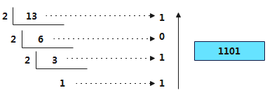

#### 9.5.3 二进制与八进制、十六进制间的转换

**二进制转八进制**

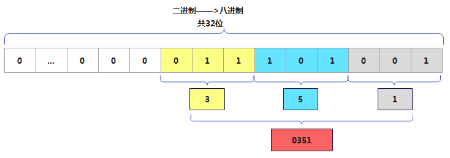

**二进制转十六进制**

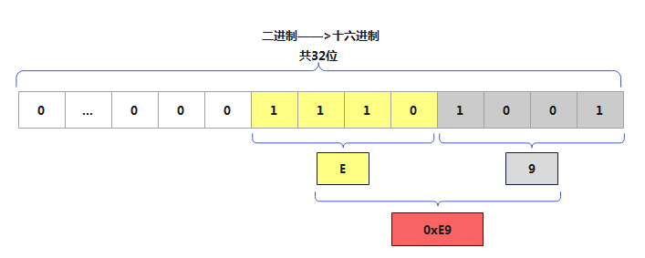

**八进制、十六进制转二进制**

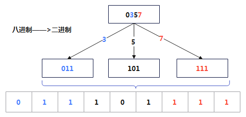

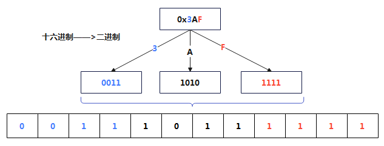

> 练习：以下叙述中错误的是（　　）。
> A．C程序在运行过程中所有计算都以十进制方式进行
> B．C程序在运行过程中所有计算都以二进制方式进行
> C．所有C程序都需要编译链接无误后才能运行
> D．C程序中字符变量存放的是字符的ASCII值
>
> 【答案】A
>
> 【解析】C程序在运行过程中所有计算都以二进制方式进行。答案选择A选项。


>  【华南理工大学2018研】与十进制1100等值的十六进制数是（　　）。
>  A．44A
>  B．44C
>  C．54A
>  D．54C
>
>  【答案】B
>
>  【解析】1100转换成二进制为0100 0100 1100，因此转换为十六进制为44C。

 <p id = "第03章_运算符与流程控制"></p> 

# 第03章_运算符与流程控制

## 本章专题脉络

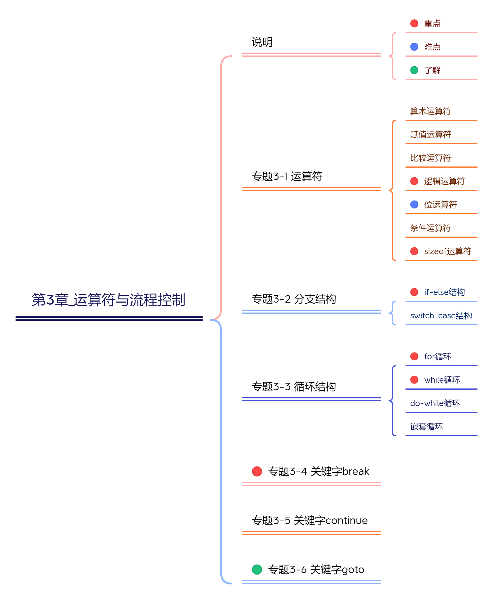

## 1. 运算符（Operator）

运算符是一种特殊的符号，用以表示数据的运算、赋值和比较等。

运算符的分类：

- 按照`功能`分为：算术运算符、赋值运算符、比较(或关系)运算符、逻辑运算符、位运算符、条件运算符、sizeof运算符

|        分类        |           运算符            |
| :----------------: | :-------------------------: |
|     算术运算符     | +、-、+、-、*、/、%、++、-- |
|     赋值运算符     |   =、+=、-=、*=、/=、%=等   |
| 比较(或关系)运算符 |    >、>=、<、<=、==、!=     |
|     逻辑运算符     |         &&、\|\|、!         |
|      位运算符      |     &、\|、^、~、<<、>>     |
|     条件运算符     |  (条件表达式)?结果1:结果2   |
|    sizeof运算符    |          sizeof()           |

* 按照`操作数个数`分为：一元运算符（单目运算符）、二元运算符（双目运算符）、三元运算符 （三目运算符）

|           分类            |                  运算符                  |
| :-----------------------: | :--------------------------------------: |
| 一元运算符（单目运算符）  |    正号（+）、负号（-）、++、--、!、~    |
| 二元运算符（双目运算符）  | 除了一元和三元运算符剩下的都是二元运算符 |
| 三元运算符 （三目运算符） |         (条件表达式)?结果1:结果2         |

### 1.1 算术运算符

算术运算符专门用于算术运算，主要有下面几种。

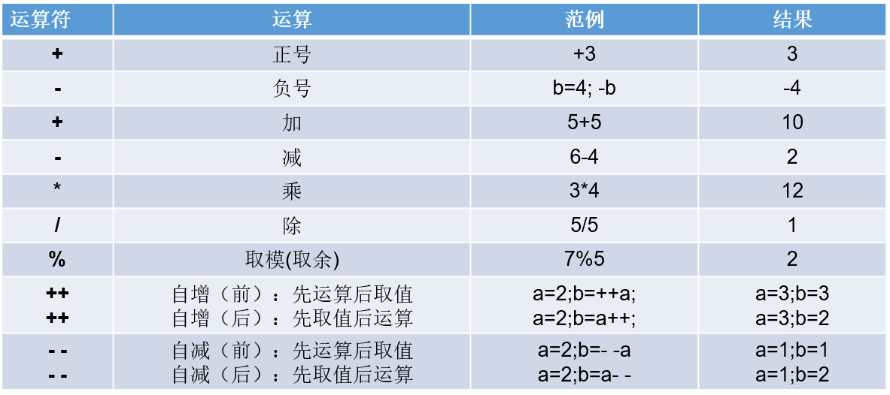

举例1：

```c
int x = -12;
int y = -x;
int z = +y; //+可以省略
```

举例2：

```c
int a = 4 + 2;

int num = 5;
printf("%d\n", num * num); // 输出 25

float x = 6 / 4;
printf("%f\n", x); // 输出 1.000000

float x = 6.0 / 4; // 或者写成 6 / 4.0
printf("%f\n", x); // 输出 1.500000
```

举例3：%，运算结果的符号与被模数相同

```c
int x1 = 6 % 4; // 2
int x2 = -6 % 4; // -2
int x3 = 6 % -4; // 2
int x4 = -6 % -4; // -2
```

举例4：自加自减运算

理解：`++`  运算，表示`自增1`。同理，`--` 运算，表示`自减1`，用法与++ 一致。

1、单独使用

* 变量在单独运算的时候，变量`前++`和变量`后++`，是没有区别的。
* 变量`前++`   ：例如 `++a` 。
* 变量`后++`   ：例如 `a++` 。

```c
int main() {
    int a = 10;

    //++a;
    a++;
    //无论是变量前++还是变量后++，结果都是11
    printf("%d\n",a);

    return 0;
}
```

2、复合使用

* 和`其他变量放在一起使用`或者和`输出语句放在一起使用`，`前++`和`后++`就产生了不同。

- 变量`前++` ：变量先自增1，然后再运算。
- 变量`后++` ：变量先运算，然后再自增1。

```c
int main() {
    // 其他变量放在一起使用
    int x = 3;
    //int y = ++x; // y的值是4，x的值是4，
    int y = x++; // y的值是3，x的值是4

    printf("%d\n",x);
    printf("%d\n",y);
    printf("==========\n");

    // 和输出语句一起
    int z = 5;
    //printf("%d\n",++z);// 输出结果是6，z的值也是6
    printf("%d\n",z++);// 输出结果是5，z的值是6
    printf("%d\n",z);

    return 0;
}
```

与此对应的：

- 变量`前--` ：变量先自减1，然后再运算。
- 变量`后--` ：变量先运算，然后再自减1。

**案例1：**

```
随意给出一个整数，打印显示它的个位数，十位数，百位数的值。
格式如下：
数字xxx的情况如下：
个位数：
十位数：
百位数：

例如：
数字153的情况如下：
个位数：3
十位数：5
百位数：1

```

```c
#include <stdio.h> 
    
int main() {
    int num = 153;

    int bai = num / 100;
    int shi = num % 100 / 10;//int shi = num / 10 % 10;
    int ge = num % 10;

    printf("百位为：%d\n", bai);
    printf("十位为：%d\n", shi);
    printf("个位为：%d\n", ge);

    return 0;
}

```

**案例2：** 为抵抗洪水，战士连续作战89小时，编程计算共多少天零多少小时？

```c
#include <stdio.h>

int main() {
    int hours = 89;
    int day = hours / 24;
    int hour = hours % 24;
    printf("为抵抗洪水，战士连续作战%d小时：是%d天%d小时\n",hours,day,hour);

    return 0;
}
```


### 1.2 赋值运算符

- 符号 = 
  - 当“=”两侧数据类型不一致时，可以使用自动类型转换或使用强制类型转换原则进行处理。
  - 支持`连续赋值`。
- 扩展赋值运算符： +=、 -=、*=、 /=、%=

| 运算符 | 名称       | 实例 | 展开形式 |
| ------ | ---------- | ---- | -------- |
| +=     | 复合加赋值 | a+=b | a=a+b    |
| -=     | 复合减赋值 | a-=b | a=a-b    |
| *=     | 复合乘赋值 | a*=b | a=a*b    |
| /=     | 复合除赋值 | a/=b | a=a/b    |
| %=     | 复合模赋值 | a%=b | a=a%b    |

举例：

```c
i += 3;  // 等同于 i = i + 3
i -= 8;  // 等同于 i = i - 8
i *= 9;  // 等同于 i = i * 9
i /= 2;  // 等同于 i = i / 2
i %= 5;  // 等同于 i = i % 5
```

举例：

```c
//连续赋值的测试
//以前的写法
int a1 = 10;
int b1 = 10;

//连续赋值的写法
int a2,b2;
a2 = b2 = 10;

int a3 = 10,b3 = 20;
```

举例：

```c
int a = 10;
a += 1.7;  // a=a+1.7 => 11.7 => 11
printf("a=%d", a);  // a=11
```

举例：

```c
int a, b, c;
a = (b = 5);    //表达式的值为5,将5赋值给b，接着将b的值赋值给a
a = 5 + (c = 6);        //表达式值为11，a值为11，c值为6
a = (b = 4) + (c = 6);    //表达式值为10，a值为10，b等于4，c等于6
a = (b = 10) / (c = 2);    //表达式值为5，a等于5，b等于10，c等于2
a = (b = 3 * 4);        //表达式值为12，a,b值均为12
```


> 【武汉科技大学2019研】
>
> 若a、b和t都为int变量，则下面不能交换变量a和b值的是（　　）。
> A．t＝a； a＝b； b＝t；
> B．a＝t； t＝b； b＝a；
> C．t＝b； b＝a； a＝t；
> D．a＝a＋b； b＝a－b； a＝a－b；
>
> 【答案】B
>
> 【解析】B中首先把t的值赋值给了a，则a的值已经被取代了，后面执行b＝a，则ab的值都等于t的值。


>  【中央财经大学2018研】以下程序运行后的输出结果是（　　）。
>
>  ```c
>  int main(){  
>    double d;  
>    float f;  
>    long l;  
>    int i;  
>    i = f = l = d = 20/3;  
>    printf("%d %ld %.1f %.1f\n",i,l,f,d);  
>    return 0;
>  } 
>  ```
>
>  A．6 6 6.0 6.0
>  B．6 6 6.7 6.7
>  C．6 6 6.0 6.7
>  D．6 6 6.7 6.0
>
>  【答案】A
>
>  【解析】赋值运算符是自右向左结合的，所以首先执行d＝20/3＝6，同时i、l、f也全为6，在进行输出时，f和d要保留一位小数，所以答案选A。


> 练习：
>
> 以下选项中正确的定义语句是（　　）。
> A．double a；b；
> B．double a＝b＝7；
> C．double a＝7，b＝7；
> D．double，a，b；
>
> 【答案】C
>
> 【解析】同一类型变量的定义时，不同变量之间需要用“，”分隔，选项A错误；定义变量时初始化赋值不能用等号连接，选项B错误；变量类型说明后面不能用逗号，而是用空格分离，选项D错误。答案选择C选项。


### 1.3 比较运算符(或关系运算符)

常用的比较运算符：

| 关系运算符 | 含义     | 举例      |
| ---------- | -------- | --------- |
| >          | 大于     | num > 10  |
| >=         | 大于等于 | num >= 10 |
| <          | 小于     | num < 10  |
| <=         | 小于等于 | num <= 10 |
| `==`       | 等于     | num == 10 |
| !=         | 不等于   | num != 10 |

- 比较运算的结果只有两个取值，要么是真(非0 表示，默认使用1)，要么是假(0 表示)。
  - 比如， 20 > 12 返回 1 ， 12 > 20 返回 0 。
- 比较运算符“`==`”不能误写成“`=`” 

举例1：

```c
int i1 = 10;
int i2 = 20;

printf("%d\n",i1 == i2);//0
printf("%d\n",i1 != i2);//1
printf("%d\n",i1 >= i2);//0


int m = 10;
int n = 20;
printf("%d\n",m == n);//0
printf("%d\n",m = n);//20
```

举例2：多个关系运算符不宜连用。

```c
i < j < k   //期望判断j是否大于i，且小于k
```

这是合法表达式，不会报错，但是通常达不到想要的结果，即不是保证变量 j 的值在 i 和 k 之间。比如：

```c
//i < j < k
int j = 10;
if(15 < j < 20){
    printf("j大于15,且小于20"); //输出此语句
}else{
    printf("j不在15到20之间");
}
```

因为关系运算符是从左到右计算，所以实际执行的是：

```c
(i < j) < k; //i < j 返回 0 或 1 ，所以最终是 0 或 1 与变量 k 进行比较
```

期望的效果应该写为：

```c
//i < j < k
int j = 10;
if(15 < j && j < 20){
    printf("j大于15,且小于20"); 
}else{
    printf("j不在15到20之间"); //输出此语句
}
```


>  【北京航空航天大学2018研】若变量a，b，c的取值分别是1，2，3，则表达式“!((b＋c)＞(a＋4))”的值是（　）。
>  A．0
>  B．1
>  C．2
>  D．3
>
>  【答案】B
>
>  【解析】首先b＋c等于5，a＋4也等于5，因此 (b＋c)＞(a＋4)为“假”，即0，对0取非结果为1，因此答案为B。


### 1.4 逻辑运算符

主要有下面三个运算符：

| 逻辑运算符 | 描述     | 功能                 | 举例                              |
| ---------- | -------- | -------------------- | --------------------------------- |
| &&         | 与运算符 | 两个条件都要满足     | num1 >= 10 && num2 >= 20          |
| \|\|       | 或运算符 | 两个条件只需满足其一 | num1 >= 10 \|\| num2 >= 20        |
| !          | 非运算符 | 否定条件             | !(num1 >= 10)（等价于 num1 < 10） |

逻辑运算符提供逻辑判断功能，用于构建更复杂的表达式。

举例：

| a       | b       | a && b  | a \|\| b | !a      |
| ------- | ------- | ------- | -------- | ------- |
| 1（真） | 1（真） | 1（真） | 1（真）  | 0（假） |
| 1（真） | 0（假） | 0（假） | 1（真）  | 0（假） |
| 0（假） | 1（真） | 0（假） | 1（真）  | 1（真） |
| 0（假） | 0（假） | 0（假） | 0（假）  | 1（真） |

> 对于逻辑运算符来说，任何非零值都表示真，零值表示伪。比如， 5 || 0 会返回 1 ， 5 && 0 会返回0 。

举例1：

```c
int x = 5;
int y = 11;
if (x < 10 && y > 20)
	printf("今天天气真晴朗\n");
```

举例2：**短路现象**

- &&：a && b
  - 当 a 为假(或0)时，因为a && b 结果必定为 0，所以不再执行表达式 b
  - 当 a 为真(非0)时，因为a && b 结果不确定，所以会继续求解表达式b

```c
int i = 0;
int j = 10;
if(i && j++ > 0){
    printf("床前明月光");
}else{
    printf("我叫郭德纲");
}

printf("%d\n",j); //10
```

- || ：a || b
  - 当 a 为真(非0)时，因为a || b 结果必定为 1，所以不再执行表达式 b
  - 当 a 为假(或0)时，因为a || b 结果不确定，所以会继续求解表达式b

```c
int i = 1;
int j = 10;
if(i || j++ > 0){
    printf("床前明月光");
}else{
    printf("我叫郭德纲");
}

printf("%d\n",j); //10
```

练习：请写出如下程序运行后的结果

```c
int main() {
    int x = 1;
    int y = 0;
    short z = 42;

    if ((z++ == 42) && (y = 1)) {
        z++; // z = 44
    }
    if ((x = 0) || (++z == 45)) {
        z++;  // z = 46
    }

    printf("z=%d", z);

    return 0;
}
```

> 答案：z=46

>  【华南理工大学2018研】设int a＝3；，下列哪一个表达式的值等于0（　　）。
>  A．a&&(a＞0)
>  B．!a||a
>  C．a%＝a
>  D．a＞＝a
>
>  【答案】C
>
>  【解析】A中a!＝0且a＞0所以表达式的值为1；B中||表示或，所以值也为1；D中表达式值也为1；答案选C。


>  【四川大学2017研】语句：printf("%d",(a＝2) && (b＝－2))；的输出结果是（　　）。
>  A．无输出
>  B．结果不确定
>  C．－1
>  D．1
>
>  【答案】D
>
>  【解析】a＝2为真，b＝－2也为真，所以输出1，答案选D。


### 1.5 位运算符

- C 语言提供一些位运算符，用来操作二进制位（bit）。

- 位运算符的运算过程都是基于二进制的补码运算。

| 运算符 | 描述       | 运算规则                                                     |
| ------ | ---------- | ------------------------------------------------------------ |
| <<     | 二进制左移 | 将一个数的各二进制位全部左移指定的位数，左边的二进制位丢弃，右边补0。 |
| >>     | 二进制右移 | 将一个数的各二进制位全部右移指定的位数，正数左补0，负数左补1，右边丢弃。 |
| &      | 按位与     | 两个二进制位都为 1，结果为1，否则为0。                       |
| \|     | 按位或     | 两个二进制位只要有一个为1（包含两个都为 1 的情况），结果为1，否则为0。 |
| ^      | 按位异或   | 两个二进制位一个为0，一个为1，结果为1，否则为0。             |
| ~      | 按位取反   | 将每一个二进制位变成相反值，即 0 变成 1 ， 1 变成 0 。       |

- 结合赋值运算符的经验，这里有：<<= 、 >>= 、 &= 、 ^= 等

**举例1：**

`（1）左移：<<`

> 运算规则：在一定范围内，数据每向左移动一位，相当于原数据*2。（正数、负数都适用）

【注意】当左移的位数n超过该数据类型的总位数时，相当于左移（n-总位数）位

```c
3<<4  类似于  3*2的4次幂 => 3*16 => 48
```

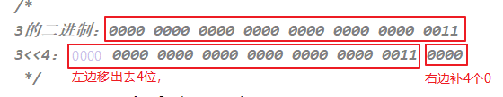

```c
-3<<4  类似于  -3*2的4次幂 => -3*16 => -48
```

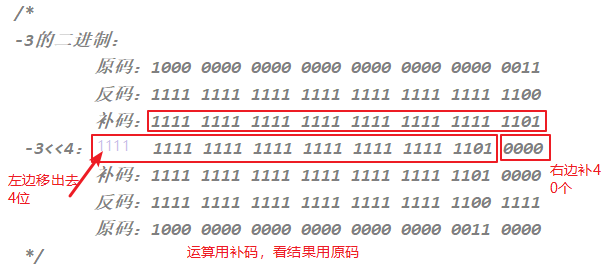

`（2）右移：>>`

> 运算规则：在一定范围内，数据每向右移动一位，相当于原数据/2。（正数、负数都适用）

【注意】

1、如果不能整除，`向下取整`。

2、右移运算符最好只用于无符号整数，不要用于负数。因为不同系统对于右移后如何处理负数的符号位，有不同的做法，可能会得到不一样的结果。

```java
69>>4  类似于  69/2的4次幂 = 69/16 =4
```

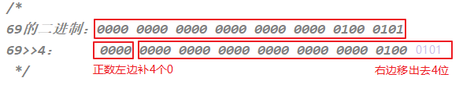

```c
-69>>4  类似于  -69/2的4次幂 = -69/16 = -5
```

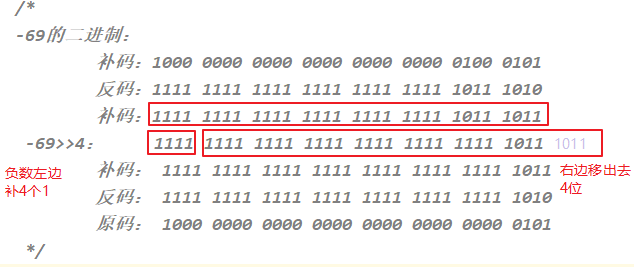

练习：高效的方式计算2 * 8的值（经典面试题）

```
答案：2 << 3 、  8  << 1
```

**举例2：**

`（1）按位与：&`

运算规则：对应位都是1才为1，否则为0。

- 1 & 1 结果为1

- 1 & 0 结果为0

- 0 & 1 结果为0


- 0 & 0 结果为0


```c
9 & 7 = 1
```

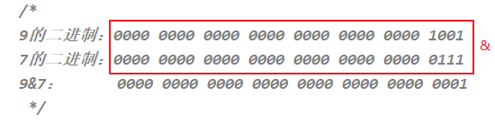

```c
-9 & 7 = 7
```

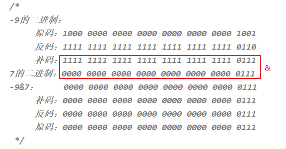

`（2）按位或：|`

运算规则：对应位只要有1即为1，否则为0。

- 1 | 1 结果为1

- 1 | 0 结果为1

- 0 | 1 结果为1

- 0 & 0 结果为0


```c
9 | 7  //结果： 15
```

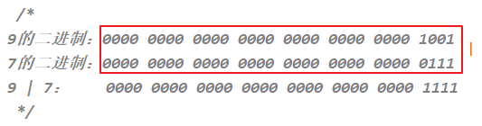

```c
-9 | 7 //结果： -9
```

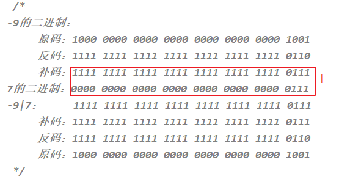

`（3）按位异或：^`

运算规则：对应位一个为1一个为0，才为1，否则为0。

- 1 ^ 1 结果为0

- 1 ^ 0 结果为1

- 0 ^ 1 结果为1


- 0 ^ 0 结果为0


```c
9 ^ 7  //结果为14
```

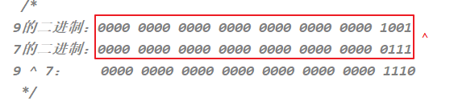

```c
-9 ^ 7 //结果为-16
```

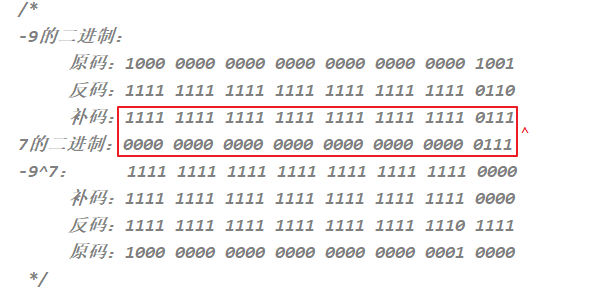

`（4）按位取反：~`

运算规则：对应位为1，则结果为0；对应位为0，则结果为1。

- ~0就是1  

- ~1就是0

```c
~9  //结果：-10
```

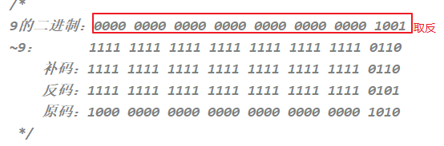

```c
~-9  //结果：8
```

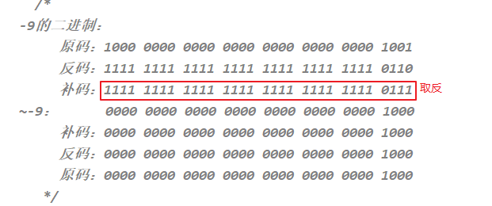

练习1：

```c
int i = 12,j = 5;

printf("%d\n",i & j); //4
printf("%d\n",i | j); //13
printf("%d\n",i ^ j); //9
```

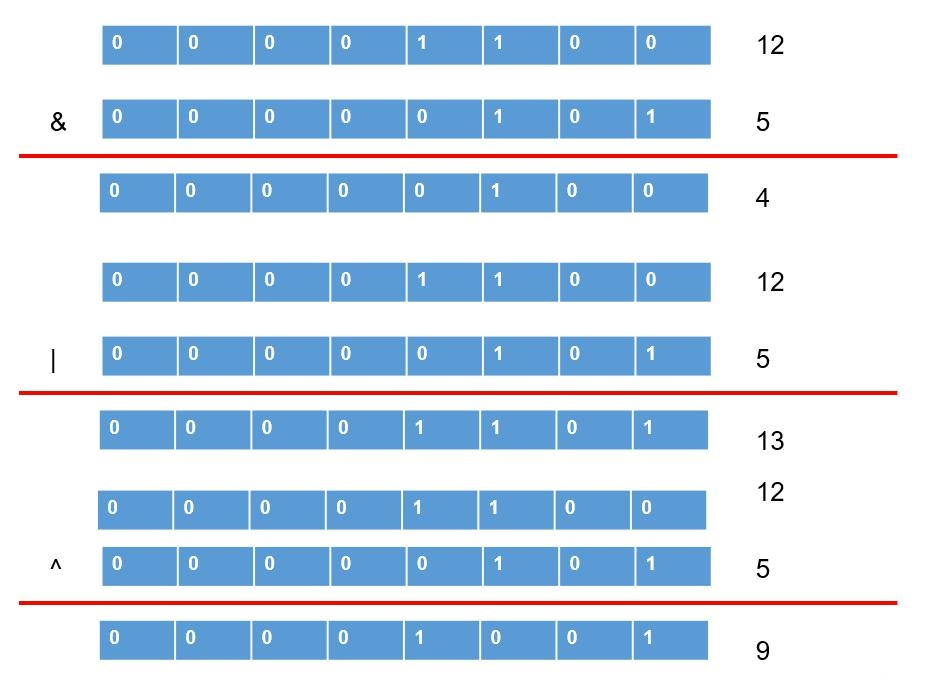

**练习2：特定位清零**

技巧：待清零的位与0，其它位与1

示例：设字符型 x 的当前值为 53，将其最低两位清 0，其余位保持不变

分析：与二进制的0b11111100数值求&运算即可。

```c
int main() {
    char x = 53; // 0b00110101
    x = x & 252; // 0b11111100
    printf("%d", x); //0b00110100
    return 0;
}
```

举例：判断特定位是否为零

技巧：待判定位与 1，其它位与 0；判与运算结果是否为 0

示例：设字符型 x 的当前值为 53，判定其最高位是否为 0

分析：与二进制的0b10000000求&运算，若结果为 0，则最高位为 0，否则为 1

```c
int main() {
    char x = 53; // 0b00110101
    x = x & 128; // 0b10000000
    if(x == 0)
        printf("最高位为0");
    else
        printf("最高位不为0");
    
    return 0;

}
```

举例：保留特定位

技巧：待保留位全部与 1，其余位与 0

示例：设字符型 x 的当前值为 53，保留其最低 4 位，其余位清零

分析：与二进制的0b00001111求&运算即可。

```c
int main() {
    char x = 53; // 0b00110101
    x = x & 15;  // 0b00001111

    printf("%d\n",x); //0b00000101

    return 0;

}
```

举例：待置 1 或 1，保持位或 0

示例：设字符型 x 的当前值为 53，将其最低两位置 1，其余位保持不变

分析：与二进制0b00000011求或运算即可

```c
int main() {
    char x = 53; // 0b00110101
    x = x | 3;   // 0b00000011

    printf("%d\n",x); //0b00110111

    return 0;

}
```

举例：特定位取反

待取反位异或 1，保持位异或 0

示例：设字符型 x 的当前值为 53，将其最低两位取反，其余位保持不变

分析：与二进制0b00000011求异或运算即可

```c
int main() {
    char x = 53; // 0b00110101
    x = x ^ 3;   // 0b00000011

    printf("%d\n",x); //0b00110110

    return 0;

}
```

### 1.6 条件运算符

- 条件运算符格式：


```c
(条件表达式)? 表达式1:表达式2
```

- 说明：条件表达式是如果为 true (非0值)，就执行表达式1，否则执行表达式2。

  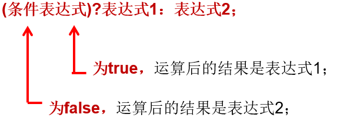

- 如果运算后的结果赋给新的变量，要求表达式1和表达式2为同种或兼容的类型

**举例1：** 获取两个数中的较大值

```c
int main() {
    //获取两个数的较大值
    int m1 = 10;
    int m2 = 20;

    int max1 = (m1 > m2)? m1 : m2;
    printf("m1和m2中的较大值为%d\n",max1);

    return 0;

}
```

**举例2：** 获取三个数中的最大值

```c
int main() {
    int n1 = 23;
    int n2 = 13;
    int n3 = 33;
    //写法1：
    int tempMax = (n1 > n2)? n1:n2;
    int finalMax = (tempMax > n3)? tempMax : n3;
    printf("三个数中最大值为%d\n",finalMax);

    //写法2：不推荐，可读性差
    int finalMax1 = (((n1 > n2)? n1:n2) > n3)? ((n1 > n2)? n1:n2) : n3;
    printf("三个数中最大值为%d\n",finalMax1);

    return 0;

}
```


>  【华南理工大学2018研】输入一个字符，判别它是否为大写字母，如果是，将它变为小写字母；如果不是，不转换。然后输出最后得到的字符。请在下面空白处填上适当语句。
>
>  ```c
>  #include<stdio.h>
>  int main(){ 
>    char ch;  
>    scanf("%c", ① );  
>    ch=(ch>='A'&& ② )?(ch+32): ③ ;  
>    printf( ④ ,ch);  
>    return ⑤ ;
>  } 
>  ```
>
>  【答案】①&ch②ch＜＝'Z'③ch④"%c"⑤0
>
>  【解析】程序进行输入时要加上地址符&；main函数中的第三行为一个三目运算符，当ch在A～Z之间时ch为真，此时ch＋32变为小写字母，否则不变；程序进行输出时应用%加上数据类型进行输出，最后用return 0来结束程序。


### 1.7 sizeof 运算符

sizeof 运算符：sizeof(参数)

- 参数可以是`数据类型`的关键字，也可以是`变量名`或某个`具体的值`。
- 返回某种数据类型或某个值占用的字节数量。

举例1：参数为数据类型

```c
int x = sizeof(int);  //通常是 4 或 8
```

举例2：参数为变量

```c
int i;
sizeof(i); //通常是 4 或 8

// 参数为数值
sizeof(3.14); //浮点数的字面量一律存储为double类型,故返回 8
```

**sizeof返回值的类型说明**

sizeof 运算符的返回值，C 语言只规定是无符号整数，并没有规定具体的类型，留给系统自己去决定sizeof 到底返回什么类型。不同的系统中，返回值的类型有可能是 unsigned int ，也有可能是unsigned long ，甚至是 unsigned long long ，对应的 printf() 占位符分别是 %u 、 %lu和 %llu 。这样不利于程序的可移植性。

C 语言提供了一个解决方法，创造了一个类型别名 `size_t` ，用来统一表示 sizeof 的返回值类型。该别名定义在 `stddef.h` 头文件里面，对应当前系统的 sizeof 的返回值类型，可能是 unsigned int ，也可能是 unsigned long 。

printf() 有专门的占位符 `%zd` 或 `%zu` ，用来处理 size_t 类型的值。

```c
printf("%zd\n", sizeof(int));
```

上面代码中，不管 sizeof 返回值的类型是什么， %zd 占位符（或 %zu ）都可以正确输出。

如果当前系统不支持 %zd 或 %zu ，可使用 %u （unsigned int）或 %lu （unsigned long int）代替。


### 1.8 运算符的优先级

运算符有不同的优先级，所谓优先级就是在表达式运算中的运算符顺序。

上一行中的运算符总是优先于下一行的。

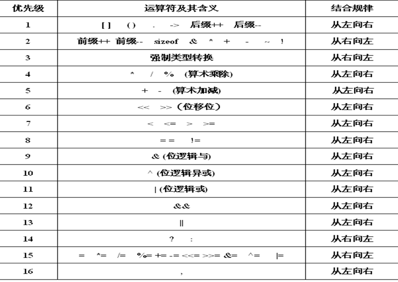

> 开发建议：
>
> 1. 不要过多的依赖运算的优先级来控制表达式的执行顺序，这样可读性太差，尽量`使用()来控制`表达式的执行顺序。
> 2. 不要把一个表达式写得过于复杂，如果一个表达式过于复杂，则把它`分成几步`来完成。例如：
>    ​ (num1 + num2) * 2 > num3 && num2 > num3 ? num3 : num1 + num2;


## 2. 流程控制结构

- 流程控制结构是用来控制程序中各`语句执行顺序`的语句，可以把语句组合成能`完成一定功能`的小逻辑模块。
- 程序设计中规定的`三种`流程结构，即：
  - **顺序结构**
    - 程序从上到下逐行地执行，中间没有任何判断和跳转。
  - **分支结构**
    - 根据条件，选择性地执行某段代码。
    - 有`if…else`和`switch-case`两种分支语句。
  - **循环结构**
    - 根据循环条件，重复性的执行某段代码。
    - 有`for`、`while`、`do-while`三种循环语句。
- 生活中、工业生产中流程控制举例


### 2.1 顺序结构

程序`从上到下逐行`地执行。表达式语句都是顺序执行的。并且上一行对某个变量的修改对下一行会产生影响。


```c
int main() {
    int x = 1;
    int y = 2;
    printf("x = %d\n", x);
    printf("y = %d\n", y);
    //对x、y的值进行修改
    x++;
    y = 2 * x + y;
    x = x * 10;
    printf("x = %d\n", x);
    printf("y = %d\n", y);

    return 0;

}
```

c语言中定义变量时采用合法的`前向引用`。如：

```c
int main() {
	int num1 = 12;
	int num2 = num1 + 2;
    
    return 0;
}
```

错误形式：

```c
int main() {
	int num2 = num1 + 2; //use of undeclared identifier 'num1'
	int num1 = 12;
    
    return 0;
}
```

### 2.2 分支结构1：if-else

#### 2.2.1 基本语法

**结构1：单分支**

```java
if(条件表达式)｛
  	语句块;
｝
```

`执行流程：`条件表达式为真（值不为 0 ）时，就执行语句块。

`图示：`

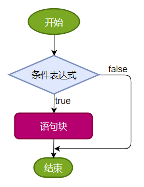

`举例：`成年人心率的正常范围是每分钟60-100次。体检时，如果心率不在此范围内，则提示需要做进一步的检查。

```c
int main(){
    int heartBeats = 89;

    if(heartBeats < 60 || heartBeats > 100){
        printf("你需要做进一步的检查");
    }

    printf("体检结束");
    return 0;
}
```

**结构2：双分支**

```java
if(条件表达式) { 
  	语句块1;
}else {
  	语句块2;
}
```

`执行流程：`

1. 首先判断条件表达式看其结果是为真（值不为 0 ）还是假（值为0）
2. 如果是真，就执行语句块1
3. 如果是假，就执行语句块2


`举例：`定义一个整数，判定是偶数还是奇数

```c
int main() {
    int a = 10;

    if (a % 2 == 0) {
        printf("%d是偶数\n", a);
    } else {
        printf("%d是奇数\n", a);
    }
    
    return 0;
}
```

**结构3：多重分支**

```java
if (条件表达式1) {
  	语句块1;
} else if (条件表达式2) {
  	语句块2;
}
...
}else if (条件表达式n) {
 	语句块n;
} else {
  	语句块n+1;
}
```

`执行流程：`

1. 首先判断关系表达式1看其结果是真（值不为0）还是假（值为0）
2. 如果是真，就执行语句块1，然后结束当前多分支
3. 如果是假，就继续判断条件表达式2，看其结果是真还是假
4. 如果是真，就执行语句块2，然后结束当前多分支
5. 如果是假，就继续判断条件表达式…看其结果是真还是假

​    …

   n.  如果没有任何关系表达式为真，就执行语句块n+1，然后结束当前多分支。

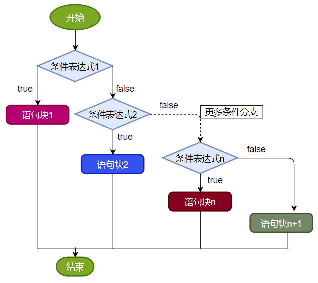

`举例：`

```
岳小鹏参加C语言考试，他和父亲岳不群达成承诺：
如果：
成绩为100分时，奖励一辆跑车；
成绩为(80，99]时，奖励一辆山地自行车；
当成绩为[60,80]时，奖励环球影城一日游；
其它时，胖揍一顿。

说明：默认成绩是在[0,100]范围内
```

```c
int main() {
    int score = 67;//岳小鹏的期末成绩
    //写法一：默认成绩范围为[0,100]
    if (score == 100) {
        printf("奖励一辆跑车");
    } else if (score > 80 && score <= 99) {    //错误的写法：}else if(80 < score <= 99){
        printf("奖励一辆山地自行车");
    } else if (score >= 60 && score <= 80) {
        printf("奖励环球影城玩一日游");
    }
    //else{
    //	printf("胖揍一顿");
    //}


    //写法二：
    // 默认成绩范围为[0,100]
    if (score == 100) {
        printf("奖励一辆跑车");
    } else if (score > 80) {
        printf("奖励一辆山地自行车");
    } else if (score >= 60) {
        printf("奖励环球影城玩一日游");
    } else {
        printf("胖揍一顿");
    }

    return 0;
}
```

> 当条件表达式之间是“`互斥`”关系时（即彼此没有交集），条件判断语句及执行语句间顺序无所谓。
>
> 当条件表达式之间是“`包含`”关系时，“`小上大下 / 子上父下`”，否则范围小的条件表达式将不可能被执行。

> 当if-else结构是“多选一”时，最后的`else是可选的`，根据需要可以省略

> 语句块只有一条执行语句时，一对`{}可以省略`，但建议保留

练习：判断输出结果

```c
int main() {
    int number = 20;
    if (number > 6)
        if (number < 12)
            printf("The number >= 6,且 <= 12.\n");
    else
        printf("判断不成功.\n");

    return 0;
}
```

> 说明：
>
> 如果有多个 if 和 else ，没有{}的情况下， else 总是跟最接近的 if 匹配。
>
> 为了提供代码的可读性，建议使用大括号，明确 else 匹配哪一个 if 。

如果希望else与外层的if匹配，改写为如下：

```c
int main() {
    int number = 20;
    if (number > 6) {
        if (number < 12) {
            printf("The number >= 6,且 <= 12.\n");
        }
    } else {
        printf("判断不成功.\n");
    }

    return 0;
}

```

#### 2.2.2 举例

举例1：

```c
#include <stdio.h>

int main() {

    int age = 0;
    scanf("%d", &age);
    if (age < 18) {
        printf("未成年\n");
    } else {
        printf("成年\n");
    }

    return 0;
}

```

举例2：

编写一个程序，判定某个年份是否为闰年。年份满足如下条件之一，即是闰年：

⑴ year 是 400 的整倍数： year%400==0

(2) 能被4整除，但不能被100整除：year % 4 == 0 && year % 100 != 0

```c
#include<stdio.h>

int main() {
	int year;
    printf("输入年份: ");
    scanf("%d", &year);
    if (year % 400 == 0 || (year % 4 == 0 && year % 100 != 0))
        printf("%d 是闰年\n", year);
    else
        printf("%d 不是闰年\n", year);
    
    return 0;
}
```

举例3：解方程

设计求解一元二次方程 $ax^2+bx+c=0$ （a≠0）的程序

```c
#include<stdio.h>
#include <math.h>

int main() {
    float a, b, c;
    float x1, x2, d;
    printf("输入方程中的系数与常量 a,b,c: ");
    scanf("%f%f%f", &a, &b, &c);
    d = b * b - 4 * a * c;

    if (d >= 0) {
        x1 = (-b + sqrt(d)) / (2 * a);
        x2 = (-b - sqrt(d)) / (2 * a);
        printf("x1=%f,x2=%f\n", x1, x2);
    } else
        printf("方程没有根\n");

    return 0;
}

```

举例4：判断水的温度

```
如果大于95℃，则打印“开水”；

如果大于70℃且小于等于95℃，则打印“热水”；

如果大于40℃且小于等于70℃，则打印“温水”；

如果小于等于40℃，则打印“凉水”。
```

```c
int main() {

    int waterTemperature = 85;

    if (waterTemperature > 95) {
        printf("开水");
    } else if (waterTemperature > 70 && waterTemperature <= 95) {
        printf("热水");
    } else if (waterTemperature > 40 && waterTemperature <= 70) {
        printf("温水");
    } else {
        printf("凉水");
    }


    return 0;
}
```

举例5：**if-else的嵌套**

出票系统：根据淡旺季的月份和年龄，打印票价。要求，月份和年龄从键盘获取输入。

4_10 旺季：
	成人（18-60）：60
	儿童（< 18）   :  半价
	老人（> 60）   :  1/3
淡季：
	成人   :  40
	其他   :  20

```c
int main() {
    int month, age;
    double price = 60.0;

    printf("请输入月份（1-12）：");
    scanf("%d", &month);

    printf("请输入年龄：");
    scanf("%d", &age);

    if (month >= 4 && month <= 10) {  // 旺季
        if (age < 18) {
            price = price / 2;  // 半价
        } else if (age > 60) {
            price = price / 3;  // 1/3价格
        }
    } else {  // 淡季
        if (age >= 18) {
            price = 40.0;
        } else {
            price = 20.0;
        }
    }

    printf("您的票价是：￥%.2f\n", price);

    return 0;

}
```


> 【武汉科技大学2019研】对下述程序段的描述正确的是（　　）。
>
> ```c
> scanf("%d,%d",&a,&b);
> if(a>b)  
> a=b;b=a;
> else  
> a++;b++;
> printf("a=%d,b=%d",a,b); 
> ```
>
> A．若输入4，5则输出a＝5，b＝6
> B．若输入5，4则输出a＝4，b＝5
> C．若输入5，4则输出a＝5，b＝5
> D．有语法错误，不能通过编译
>
> 【答案】D
>
> 【解析】if（表达式）后面如果没有用花括号括起来，那么if的子语句只包括第一条语句，即在程序中只有a＝b是属于if语句块的，if和else中间隔了一条语句b＝a，编译无法通过。


>  【华南理工大学2018研】两次运行下面的程序，如果从键盘上分别输入6和4，则输出的结果是（　　）
>
>  ```c
>  void main(void){
>    int x;
>    scanf("%d",&x);
>    if(x++>5)
>        printf("%d\n",x);
>    else
>    	printf("%d\n",x--);
>    return 0;
>  } 
>  ```
>
>  A．7和5
>  B．6和3
>  C．7和4
>  D．6和4
>
>  【答案】A
>
>  【解析】当输入6时，判断 x++＞5为真，进入if语句块，此时x＝7，输出7；当输入4时，进入else语句块，此时x＝5，然后因为--是先运算后自减，所以先输出5，后x的值为4，答案选A。


### 2.3 分支结构2：switch-case

#### 2.3.1 基本语法

switch 语句用于判断条件有多个常量结果的情况。它把多重的 else if 改成更易用、可读性更好的形式。

```c
switch(表达式){
	case 常量值1: 
        语句块1;
        //break;
	case 常量值2: 
        语句块2;
        //break;
	┇ ┇
	case 常量值n: 
        语句块n; 
        //break;
	[default: 
        语句块n+1;
    ]
}
```

**执行流程图：**


**执行过程：**

第1步：根据switch中表达式的值，依次匹配各个case。如果表达式的值等于某个case中的常量值，则执行对应case中的执行语句。

第2步：执行完此case的执行语句以后，
​              情况1：如果遇到break，则执行break并跳出当前的switch-case结构
​		        情况2：如果没有遇到break，则会继续执行当前case之后的其它case中的执行语句。--->`case穿透`
​		         ...
​		        直到遇到break关键字或执行完所有的case及default的执行语句，跳出当前的switch-case结构

**使用注意点：**

- case子句中的值必须是常量，不能是变量名或不确定的表达式值或范围。

- 同一个switch语句，所有case子句中的常量值互不相同。
- 如果没有break，程序会顺序执行到switch结尾；从使用频率说，一般switch-case结构中，都需要编写break。
- default子句是可选的。同时，位置也是灵活的。当没有匹配的case时，执行default语句。

#### 2.3.2 举例

举例1：

```c
int main() {
    int grade = 1;
    switch (grade) {
        case 0:
            printf("zero\n");
            break;
        case 1:
            printf("one\n");
            break;
        case 2:
            printf("two\n");
            break;
        case 3:
            printf("three\n");
            break;
        default:
            printf("other\n");
    }
    return 0;
}
```

与如下代码对比：

```c
int main() {
    int grade = 1;
    switch (grade) {
        case 0:
            printf("zero\n");
            //break;
        case 1:
            printf("one\n");
            //break;
        case 2:
            printf("two\n");
            //break;
        case 3:
            printf("three\n");
            //break;
        default:
            printf("other\n");
    }
    return 0;
}
```

举例2：使用switch-case实现：对学生成绩大于60分的，输出“合格”。低于60分的，输出“不合格”。

```c
int main() {
    int score = 83;

    //方式1：
    switch(score / 10){
        case 0:
            printf("不及格");
            break;
        case 1:
            printf("不及格");
            break;
        case 2:
            printf("不及格");
            break;
        case 3:
            printf("不及格");
            break;
        case 4:
            printf("不及格");
            break;
        case 5:
            printf("不及格");
            break;
        case 6:
            printf("及格");
            break;
        case 7:
            printf("及格");
            break;
        case 8:
            printf("及格");
            break;
        case 9:
            printf("及格");
            break;
        case 10:
            printf("及格");
            break;
        default:
            printf("成绩输入有误");
            break;
    }
    return 0;
}

```

如果多个 case 分支对应同样的语句体，可以改写如下：

```c
int main() {
    int score = 83;

    //方式2：体会case穿透
    switch(score / 10){
        case 0:
        case 1:
        case 2:
        case 3:
        case 4:
        case 5:
            printf("不及格");
            break;
        case 6:
        case 7:
        case 8:
        case 9:
        case 10:
            printf("及格");
            break;
        default:
            printf("成绩输入有误");
            break;
    }

    return 0;
}
```

从算法层面，还可以优化下代码，改为如下：

```c
int main() {
    int score = 83;

    //方式3：算法层面优化
    switch(score / 60){
        case 0:
            printf("不及格");
            break;
        case 1:
            printf("及格");
            break;
        default:
            printf("成绩输入有误");
            break;
    }

    return 0;
}
```

错误举例：

```c
int main() {

    int key = 10;
    switch (key) {
        case key > 0 :  //提示：Expression is not an integer constant expression
            printf("正数");
            break;
        case key < 0:
            printf("负数");
            break;
        default:
            printf("零");
            break;
    }

    return 0;
}
```


> 【武汉科技大学2019研】若有定义：int a＝1，b＝2； float x＝3，w； 则合法的switch语句是（　）。
>
> A.
>
> ```c
> switch (a) {
> case 1:
>   w = a / b;
>   break;
> case 2:
>   w = a % b;
>   break;
> }
> ```
>
>
> B．
>
> ```c
> switch (b) {
> case 1:
>   z = a % b;
> case 2:
>   z = a / b;
>   break;
> }
> ```
>
> C．
>
> ```c
> switch (x) {
> case 2:
>   w = a % b;
>   break;
> case 1:
>   w = a / b;
>   break;
> }
> ```
>
> D．
>
> ```c
> switch (a + b);{
> case 3:
> case 2:
> w = a % b;
> break;
> }
> ```
>
> 【答案】A
>
> 【解析】B中，变量z未定义；C中x为浮点型，switch后面的表达式不能是浮点型，只能是整型和字符型；D中swith表达式后面不能加分号，答案选A。


> 【北京航空航天大学2018研】对于下列代码：
>
> ```c
> switch(option){
> case 'H':
>   printf("Hello ");
> case 'W':
>   printf("Welcome ");
> case 'B':
>   printf("Bye");
>   break;
> }
> ```
>
> 若option的取值为'W'，则该代码段的输出结果是（　　）。
> A．Welcome
> B．Welcome Bye
> C．Hello Welcome Bye
> D．以上结果都不对
>
> 【答案】B
>
> 【解析】由于option为'W'，所以首先应该输出Welcome，但是由于该语句后面没有break语句来终止选择语句switch，因此会继续执行下面的语句，直到遇上break，所以最后输出Welcome Bye，答案为B。


#### 2.3.3 if-else与switch-case比较

- 结论：凡是使用switch-case的结构都可以转换为if-else结构。反之，不成立。
- 开发经验：如果既可以使用switch-case，又可以使用if-else，建议使用switch-case。因为效率稍高。

- 细节对比：
  - if-else语句优势
    - if语句的条件可以用于范围的判断，也可以用于等值的判断，`使用范围更广`。
    - switch语句的条件是一个常量值，只能判断某个变量或表达式的结果是否等于某个常量值，`使用场景较狭窄`。
  - switch语句优势
    - 当条件是判断某个变量或表达式是否等于某个固定的常量值时，使用if和switch都可以，习惯上使用switch更多。因为`效率稍高`。当条件是区间范围的判断时，只能使用if语句。
    - 使用switch可以利用`穿透性`，同时执行多个分支，而if...else没有穿透性。


### 2.4 循环结构之1：for循环

- 循环结构的理解：循环语句具有在`某些条件`满足的情况下，`反复执行`特定代码的功能。

- 循环结构分类：
  - for 循环
  - while 循环
  - do-while 循环 

- 循环结构`四要素`：

  - 初始化部分
  - 循环条件部分
  - 循环体部分
  - 迭代部分

#### 2.4.1 基本语法

**语法格式：**


```c
for (①初始化部分; ②循环条件部分; ④迭代部分)｛
         	③循环体部分;
｝
```

**执行过程：** ①-②-③-④-②-③-④-②-③-④-.....-②

**图示：**


**说明：**

- for(;;)中的两个；不能多也不能少
- ①初始化部分，用于初始化循环变量，只执行一次。可以声明多个变量，但必须是同一个类型，用逗号分隔
- ②循环条件部分，只要为 true ，就会不断执行循环体；当值为false时，退出循环
- ④迭代部分，每轮循环结束后执行，使得循环变量发生变化。可以有多个变量更新，用逗号分隔

#### 2.4.2 举例

**案例1：使用for循环重复执行某些语句**

题目：输出5行HelloWorld

```c
int main() {

    //写法1：
//    printf("Hello World!\n");
//    printf("Hello World!\n");
//    printf("Hello World!\n");
//    printf("Hello World!\n");
//    printf("Hello World!\n");

    //写法2：
    for (int i = 1; i <= 5; i++) {
        printf("Hello World!\n");
    }

    return 0;
}
```

**案例2：格式的多样性**

题目：写出输出的结果

```c
int main() {

    int num = 1;
    for(printf("a");num < 3;printf("c"),num++){
        printf("b");

    }
    return 0;
}
```

```c
int main() {

    int i, j;
    for (i = 0, j = 999; i < 10; i++, j--) {
        printf("%d, %d\n", i, j);
    }

    return 0;
}
```

**案例3：累加的思想**

题目：遍历1-100以内的偶数，并获取偶数的个数，获取所有的偶数的和

```c
int main() {

    int count = 0;//记录偶数的个数
    int sum = 0;//记录偶数的和

    for (int i = 1; i <= 100; i++) {

        if (i % 2 == 0) {
            printf("%d\n", i);
            count++;
            sum += i;
        }

        //printf("偶数的个数为：" + count);
    }

    printf("偶数的个数为：%d\n", count);
    printf("偶数的总和为：%d\n", sum);
    
    return 0;
}
```

**案例4：结合分支结构使用**

题目：输出所有的水仙花数，所谓水仙花数是指一个3位数，其各个位上数字立方和等于其本身。例如： `153 = 1*1*1 + 3*3*3 + 5*5*5`

```c
int main() {

    //定义统计变量，初始化值是0
    int count = 0;

    //获取三位数，用for循环实现
    for (int x = 100; x < 1000; x++) {
        //获取三位数的个位，十位，百位
        int ge = x % 10;
        int shi = x / 10 % 10;
        int bai = x / 100;

        //判断这个三位数是否是水仙花数，如果是，统计变量++
        if ((ge * ge * ge + shi * shi * shi + bai * bai * bai) == x) {
            printf("水仙花数：%d\n", x);
            count++;
        }
    }

    //输出统计结果就可以了
    printf("水仙花数共有%d个", count);

    return 0;
}

```

拓展：

```
打印出四位数字中“个位+百位”等于“十位+千位”并且个位数为偶数，千位数为奇数的数字，并打印符合条件的数字的个数。
```

**案例5：结合break的使用**

说明：输入两个正整数m和n，求其最大公约数和最小公倍数。

比如：12和20的最大公约数是4，最小公倍数是60。

```c
int main() {

    //需求1：最大公约数
    int m = 12, n = 20;
    //取出两个数中的较小值
    int min = (m < n) ? m : n;

    for (int i = min; i >= 1; i--) {//for(int i = 1;i <= min;i++){

        if (m % i == 0 && n % i == 0) {
            printf("最大公约数是：%d\n", i); //公约数

            break; //跳出当前循环结构
        }
    }


    //需求2：最小公倍数
    //取出两个数中的较大值
    int max = (m > n) ? m : n;

    for (int i = max; i <= m * n; i++) {

        if (i % m == 0 && i % n == 0) {

            printf("最小公倍数是：%d\n", i);//公倍数

            break;
        }
    }

    return 0;
}

```

> 说明：
>
> 1、我们可以在循环中使用break。一旦执行break，就跳出当前循环结构。
>
> 2、小结：如何结束一个循环结构？
>
> ​      结束情况1：循环结构中的循环条件部分返回false
>
> ​      结束情况2：循环结构中执行了break。
>
> 3、如果一个循环结构不能结束，那就是一个死循环！我们开发中要避免出现死循环。


> 【华南理工大学2018研】有一个分数序列$2/1,3/2,5/3,8/5,13/8,21/13,...$,求这个数列的前20项之和。请在下面空白处填上适当语句。
>
> ```c
> int main(){  
>  int i,n=20;  
>  double a=2,b=1,s=0,t;  
>  for(i=1; ① ;i++){    
>     s= ② ;        
>     ③ ;   
>     a=a+b;        
>     ④ ;  
>  }  
>  printf("sum=%16.10f\n", ⑤ );  
>  return 0;
> } 
> ```
>
> 【答案】①i＜＝n②s＋a/b③t＝a④b＝t⑤s
>
> 【解析】此程序循环是从＝1开始，所以要计算数列前20项，则循环条件应为i＜＝n；s用来累加求和，所以每次进行累加操作，即s＝s＋a/b；通过分析数列可知，数列中分子是上一项的分子分母之和，而分母是上一项的分子，依照此关系可以通过中间变量t进行换算，最后输出所求结果s。


> 【华南理工大学2018研】从键盘输入10个整数，编程求其中大于3且小于100的数的平均值并输出结果。
>
> 【答案】
> 此题可以先利用循环从屏幕读取10个数，然后依次判断数值是否大于3且小于100的数，最后取平均值进行输出，程序如下：
>
> ```c
> #include<stdio.h>
> int main() {
>  int n = 10;
>  int num; //输入的整数
>  int sum; //记录总和
>  int count;//记录个数
>  for(int i = 1;i <= n;i++){
>      scanf("%d",&num);
> 
>      if(num > 3 && num < 100){
>          sum += num;
>          count++;
>      }
>  }
> //    printf("%d\n",sum);
> //    printf("%d\n",count);
>  printf("%d\n",sum / count);
>  return 0;
> }
> ```


### 2.5 循环结构之2：while循环

#### 2.5.1 基本语法

**语法格式：**

```c
①初始化部分
while(②循环条件部分)｛
    ③循环体部分;
    ④迭代部分;
}
```

**执行过程：** ①-②-③-④-②-③-④-②-③-④-...-②

**图示：**


**说明：**

- while(循环条件部分)中循环条件为非零值，表示true、真；为零值，表示false、伪。
- 注意不要忘记声明④迭代部分。否则，循环将不能结束，变成死循环。
- for循环和while循环`可以相互转换`。二者没有性能上的差别。实际开发中，根据具体结构的情况，选择哪个格式更合适、美观。
- for循环与while循环的区别：`初始化条件部分的作用域不同`。

#### 2.5.2 举例

**案例1：** 输出5行HelloWorld!

```c
int main() {
    int i = 1;
    while (i <= 5) {
        printf("Hello World!\n");
        i++;
    }
    return 0;
}
```

**案例2：** 遍历1-100的偶数，并计算所有偶数的和、偶数的个数（累加的思想）

```c
int main() {
    //遍历1-100的偶数，并计算所有偶数的和、偶数的个数（累加的思想）
    int num = 1;

    int sum = 0;//记录1-100所有的偶数的和
    int count = 0;//记录1-100之间偶数的个数

    while (num <= 100) {

        if (num % 2 == 0) {
            printf("%d\n", num);
            sum += num;
            count++;
        }

        //迭代条件
        num++;
    }

    printf("偶数的总和为：%d\n", sum);
    printf("偶数的个数为：%d\n", count);
    return 0;
}

```

**案例3：折纸珠穆朗玛峰**

```
世界最高山峰是珠穆朗玛峰，它的高度是8848.86米，假如我有一张足够大的纸，它的厚度是0.1毫米。
请问，我折叠多少次，可以折成珠穆朗玛峰的高度?
```

```c
int main() {
    //定义一个计数器，初始值为0
    int count = 0;

    //定义珠穆朗玛峰的高度
    int zf = 8848860;//单位：毫米

    double paper = 0.1;//单位：毫米

    while (paper < zf) {
        //在循环中执行累加，对应折叠了多少次
        count++;
        paper *= 2;//循环的执行过程中每次纸张折叠，纸张的厚度要加倍
    }

    //打印计数器的值
    printf("需要折叠：%d次\n", count);
    printf("折纸的高度为%f米，超过了珠峰的高度", paper / 1000);

    return 0;
}
```


>  【武汉科技大学2019研】如果有定义：int x＝0，s＝0； 则下面程序段的执行结果是（　　）。
>
>  ```c
>  while(!x!= 0)  
>  	s+=x++;
>  printf("%d",s);
>  ```
>
>  A．1
>  B．0
>  C．无限循环
>  D．控制表达式非法，无法编译
>
>  【答案】B
>
>  【解析】while后面的表达式中，首先执行!运算符，然后再执行!＝运算符，第一次判断中，x＝0则!x!＝0满足条件，进入循环中，执行s += x++，x++是先运算，再自加，执行完后s＝0，x＝1，再回到while的判断条件，判断为false，跳出循环，输出s的值为0，答案选B。


### 2.6 循环结构之3：do-while循环

do-while 结构是 while 的变体，它会先执行一次循环体，然后再判断是否满足条件。如果满足的话，就继续执行循环体，否则跳出循环。

#### 2.6.1 基本语法

**语法格式：**

```c
①初始化部分;
do{
	③循环体部分
	④迭代部分
}while(②循环条件部分); 
```

**执行过程：** ①-③-④-②-③-④-②-③-④-...-②

**图示：**


**说明：**

- do{}while();最后有一个分号
- do-while结构的循环体语句是至少会执行一次，这个和for和while是不一样的
- 循环的三个结构for、while、do-while三者是可以相互转换的。

#### 2.6.2 举例

**案例1：** 遍历1-100的偶数，并计算所有偶数的和、偶数的个数（累加的思想）

```c
int main() {
    //遍历1-100的偶数，并计算所有偶数的和、偶数的个数（累加的思想）
    //初始化部分
    int num = 1;

    int sum = 0;//记录1-100所有的偶数的和
    int count = 0;//记录1-100之间偶数的个数

    do {
        //循环体部分
        if (num % 2 == 0) {
            printf("%d\n", num);
            sum += num;
            count++;
        }

        num++;//迭代部分


    } while (num <= 100); //循环条件部分


    printf("偶数的总和为：%d\n", sum);
    printf("偶数的个数为：%d\n", count);

    return 0;
}
```

**案例2：** 体会do-while至少会执行一次循环体

```c
int main() {
    //while循环:
    int num1 = 10;
    while (num1 > 10) {
        printf("hello:while\n");
        num1--;
    }

    //do-while循环:
    int num2 = 10;
    do {
        printf("hello:do-while\n");
        num2--;
    } while (num2 > 10);

    return 0;
}
```

**案例3：ATM取款**

```
声明变量balance并初始化为0，用以表示银行账户的余额，下面通过ATM机程序实现存款，取款等功能。

=========ATM========
   1、存款
   2、取款
   3、显示余额
   4、退出
请选择(1-4)：
```

```c
int main() {
    //初始化条件
    double balance = 0.0;//表示银行账户的余额
    int selection; //记录客户的选择

    double addMoney, minusMoney; //分别记录存钱、取钱的额度

    int isFlag = 1;//用于控制循环的结束

    do {
        printf("=========ATM========\n");
        printf("\t1、存款\n");
        printf("\t2、取款\n");
        printf("\t3、显示余额\n");
        printf("\t4、退出\n");
        printf("请选择(1-4)：");

        scanf("%d", &selection);

        switch (selection) {
            case 1:
                printf("要存款的额度为：");
                scanf("%lf", &addMoney);
                if (addMoney > 0) {
                    balance += addMoney;
                }
                break;
            case 2:
                printf("要取款的额度为：");
                scanf("%lf", &minusMoney);
                if (minusMoney > 0 && balance >= minusMoney) {
                    balance -= minusMoney;
                } else {
                    printf("您输入的数据非法或余额不足\n");
                }
                break;
            case 3:
                printf("当前的余额为：%lf\n", balance);
                break;
            case 4:
                printf("欢迎下次进入此系统。^_^\n");
                isFlag = 0;
                break;
            default:
                printf("请重新选择！\n");
                break;
        }

    } while (isFlag);

    return 0;
}

```

#### 2.6.3 小结：三种循环结构

- **三种循环结构都具有四个要素：**
  - 循环变量的初始化条件
  - 循环条件
  - 循环体语句块
  - 循环变量的修改的迭代表达式

* **从循环次数角度分析**
  * do-while循环至少执行一次循环体语句。
  * for和while循环先判断循环条件语句是否成立，然后决定是否执行循环体。
* **如何选择**
  * 遍历有明显的循环次数（范围）的需求，选择for循环
  * 遍历没有明显的循环次数（范围）的需求，选择while循环
  * 如果循环体语句块至少执行一次，可以考虑使用do-while循环
  * 本质上：三种循环之间完全可以互相转换，都能实现循环的功能

### 2.7 "无限"循环


#### 2.7.1 基本语法

**语法格式：**

- 最简单"无限"循环格式：`while(1)` , `for(;;)` 

**适用场景：**

- 开发中，有时并不确定需要循环多少次，需要根据循环体内部某些条件，来控制循环的结束（使用break）。
- 如果此循环结构不能终止，则构成了死循环！开发中要避免出现死循环。

#### 2.7.2 举例

**案例1：**实现爱你到永远...

```c
int main() {
    for (;;) {
        printf("我爱你！\n");
    }
    //printf("end\n");//永远无法到达的语句

    return 0;
}
```

```c
int main() {
    for (int i = 1; i <= 10; ){ //循环变量没有修改，条件永远成立，死循环
        printf("我爱你！\n");
    }

    return 0;
}
```

思考：如下代码执行效果

```c
int main() {
    for (int i = 1; i >= 10;) { //一次都不执行
        printf("我爱你！");
    }
    return 0;
}
```

**案例2：** 从键盘读入个数不确定的整数，并判断读入的正数和负数的个数，输入为0时结束程序。

```c
int main() {

    int positiveNumber = 0;//统计正数的个数
    int negativeNumber = 0;//统计负数的个数
    int num;  //记录输入的整数

    while(1){   //for (;;){
        printf("请输入一个整数(输入为0时结束程序):");
        scanf("%d", &num);
        if (num > 0) {
            positiveNumber++;
        } else if (num < 0) {
            negativeNumber++;
        } else {
            printf("程序结束\n");
            break;
        }
    }
    printf("正数的个数为：%d\n", positiveNumber);
    printf("负数的个数为：%d\n", negativeNumber);


    return 0;
}
```

### 2.8 嵌套循环(或多重循环)

#### 2.8.1 使用说明

- **所谓嵌套循环**，是指一个循环结构A的循环体是另一个循环结构B。比如，for循环里面还有一个for循环，就是嵌套循环。其中，for ,while ,do-while均可以作为外层循环或内层循环。
  - 外层循环：循环结构A
  - 内层循环：循环结构B

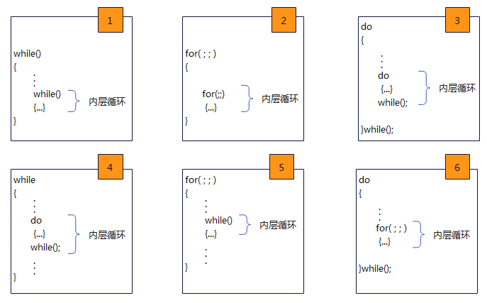


- 实质上，`嵌套循环就是把内层循环当成外层循环的循环体`。只有当内层循环的循环条件为false（值为0）时，才会完全跳出内层循环，才可结束外层的当次循环，开始下一次的外层循环。
- 设外层循环次数为`m`次，内层为`n`次，则内层循环体实际上需要执行`m*n`次。
- **技巧：**从二维图形的角度看，外层循环控制`行数`，内层循环控制`列数`。
- **开发经验：**实际开发中，我们最多见到的嵌套循环是两层。一般不会出现超过三层的嵌套循环。如果将要出现，一定要停下来重新梳理业务逻辑，重新思考算法的实现，控制在三层以内。否则，可读性会很差。

例如：两个for嵌套循环格式	

```c
for(初始化语句①; 循环条件语句②; 迭代语句⑦) {
    for(初始化语句③; 循环条件语句④; 迭代语句⑥) {
      	循环体语句⑤;
    }
}

//执行过程：① - ② - ③ - ④ - ⑤ - ⑥ - ④ - ⑤ - ⑥ - ... - ④ - ⑦ - ② - ③ - ④ - ⑤ - ⑥ - ④..
```

**执行特点：** 外层循环执行一次，内层循环执行一轮。

#### 2.8.2 举例

**案例1：** 打印5行6个*

```c
int main() {

    /*

    ******
    ******
    ******
    ******
    ******

    */

    for (int j = 1; j <= 5; j++) {

        for (int i = 1; i <= 6; i++) {
            printf("*");
        }

        printf("\n");
    }

    return 0;
}
```

**案例2：** 打印5行直角三角形

```
*
**
***
****
*****
```

```c
int main() {

    for (int i = 1; i <= 5; i++) {
        for (int j = 1; j <= i; j++) {
            printf("*");
        }
        printf("\n");
    }

    return 0;
}	
```

**案例3：** 打印5行倒直角三角形

```
		i	j(*的上限)   i + j = 6  --> j = 6 - i
*****   1	5
****	2	4
***		3	3
**		4	2
*		5	1
```

```java
int main() {

    for (int i = 1; i <= 5; i++) {
        for (int j = 1; j <= 6 - i; j++) {
            printf("*");

        }
        printf("\n");
    }

    return 0;
}
```

**案例4：九九乘法表**


```c
int main() {

    for (int i = 1; i <= 9; i++) {
        for (int j = 1; j <= i; j++) {
            printf("%d*%d=%d\t", i, j, i * j);
        }
        printf("\n");
    }
    return 0;
}
```


> 【北京航空航天大学2018研】对于下列for循环语句，请将其改写为功能完全相同的while循环语句。
>
> ```c
> int i,j,count=0;
> for(i=0;i<100;i++){  
> for(j=100;j>=i;j-=2)  {    
> count+=j-i;  
> }
> } 
> ```
>
> 【答案】
> 此题可以在定义时先令i＝0，j＝100，在第一层while循环时只需判断i＜100即可，在第二层while循环时只需判断j＞＝i即可，j－＝2放在内层循环体中即可，具体程序如下：
>
> ```c
> int i=0, j=100, count=0;
> while(i<100){  
> while(j>=i)  {    
> count+=j-i;    
> j-=2;  
> }  
> i++;
> } 
> ```


### 2.9 break和continue关键字

#### 2.9.1 使用说明

| 关键字   | 适用范围    | 循环结构中的作用                     | 相同点                       |
| -------- | ----------- | ------------------------------------ | ---------------------------- |
| break    | switch-case | -                                    | -                            |
| break    | 循环结构    | 一旦执行，就结束(或跳出)当前循环结构 | 此关键字的后面，不能声明语句 |
| continue | 循环结构    | 一旦执行，就结束(或跳出)当次循环结构 | 此关键字的后面，不能声明语句 |

代码验证：

```c
int main() {

    for (int i = 1; i <= 10; i++) {
        if (i % 4 == 0) {
            break;//123
            //continue;//123567910
            //如下的语句不可能被执行!
            //printf("今晚迪丽热巴要约我吃饭");
        }

        printf("%d", i);
    }

    printf("\n####\n");

    //嵌套循环中的使用
    for (int i = 1; i <= 4; i++) {

        for (int j = 1; j <= 10; j++) {
            if (j % 4 == 0) {
                break; //结束的是包裹break关键字的最近的一层循环！
                //continue;//结束的是包裹break关键字的最近的一层循环的当次！
            }
            printf("%d", j);
        }
        printf("\n");
    }
    return 0;
}
```

#### 2.9.2 举例

举例1：在全系1000名学生中举行慈善募捐，当总数达到10万元时就结束，统计此时捐款的人数以及平均每人捐款的数目。

```c
#include <stdio.h>

#define SUM 100000 //指定符号常量SUM代表10万

//在全系1000名学生中举行慈善募捐，当总数达到10万元时就结束，统计此时捐款的人数以及平均每人捐款的数目。
int main() {
    double amount, total = 0;//分别代表着每人捐款的数额，总捐款额
    int count = 0; //捐款人数
    for (int i = 1; i <= 1000; i++) {
        printf("请输入你的捐款额:");
        scanf("%lf", &amount);
        total = total + amount;
        count++;
        if (total >= SUM)
            break;
    }
    double aver = total / count; //人均捐款额度
    printf("捐款总人数是：%d\n人均捐款额为：%10.2f\n", count, aver);
    return 0;
}
```

举例2：要求输出100～200之间的不能被3整除的数。

```c
int main() {
    int n;
    for (n = 100; n <= 200; n++) {
        if (n % 3 == 0)
            continue;
        printf("%d ", n);
    }
    printf("\n");
    return 0;
}
```


> 【华南理工大学2018研】编程求100～200间的全部素数。
>
> 【答案】
> 素数意思是只能被1和本身整除，因此将1到本身之间的数做除数，进行求余，如果余数为0，则不是素数，否则是素数。根据经验，假设所要判断的数为n，则一般只需要判断1到根号n之间的数即可，具体程序如下：
>
> ```c
> #include <stdio.h>
> #include<math.h>
> 
> int main() {
>  int count = 0; //记录是否有约数
>  for (int i = 100; i <= 200; i++) {
>      for (int j = 2; j <= sqrt(i); j++) {
>          if (i % j == 0){
>              count++;
>              break;
>          }
>      }
>      if (count == 0)
>          printf("%d\n", i);
> 
>      count = 0;
>  }
> }
> ```


> 【武汉科技大学2019研】以下正确的描述是（　　）。
> A．从多层循环嵌套中退出时，只能使用break语句
> B．在循环体内使用continue和break语句，作用相同
> C．只能在循环体内和switch体内使用break语句
> D．continue语句的作用是结束整个循环的执行
>
> 【答案】C
>
> 【解析】从多层嵌套中退出不是只能使用break语句，也可以使用return或者程序自己执行完，A错误；在循环体内continue代表不执行该次循环中的剩余未执行语句，break代表直接跳出本层循环，BD错误，答案选C。


>  【北京航空航天大学2018研】以下关于循环语句的叙述中，正确的是（　　）。
>  A．for循环语句的三个部分必须都要有表达式
>  B．while循环语句的循环体内至少要有一条语句
>  C．do…while循环语句的循环体至少会被执行一次
>  D．continue语句可以退出包含它的整个循环体
>
>  【答案】C
>
>  【解析】for循环的三个表达式都可以省略，但是之间的分号不能省略，同时要有退出循环的机制，因此A项错误；while循环语句的循环体内可以为空，并不违反相应语法，只不过循环什么也不执行，因此B项错误；continue语句只是不执行本次循环的剩余语句，而并非退出整个循环，因此D项错误，答案选C。


### 2.10 goto关键字

使用goto，可以实现无条件的语句的转移。

**一般格式：** 

```c
goto 标号;
```

> 其中，标号，属于标识符，以“:”为标记，位于某语句前面。

执行 goto 语句后，程序将跳转到指定标号处执行。这样可以随意将控制转移到程序中的任意一条语句上，然后执行它。

**举例1：**

```c
int main() {
    
    loop_label:printf("Hello, world!\n");
    goto loop_label;

    return 0;
}
```

loop_label是一个标签名，可以放在正常语句的前面。程序执行到 goto 语句，就会跳转到它指定的标签名位置继续执行。因此，上面的代码会产生无限循环。

实际使用中，goto语句通常与条件语句配合。可用来实现条件转移，跳出循环体等功能。

**举例2：** 录入学生成绩，并计算学生的平均分。当输入-1时程序结束。

```c
int main() {
    int score, i = 0, sum = 0;
    next:printf("请输入第 %d 个学生成绩(输入-1结束)：", i+1);
    scanf("%d", &score);
    if (score != -1) {
        sum += score;
        i++;
        goto next;
    }
    if (i != 0)
        printf("%d个学生的平均分是 %d\n",i, sum / i);

    return 0;
}
```

> 注意：goto 只能在同一个函数之中跳转，并不能跳转到其他函数。

**举例3：** goto 的一个主要用法是跳出多层循环

```c
for(...) {
  for (...) {
    while (...) {
      do {
        if (some_error_condition)
          goto bail;    
     } while(...);
   }
 }
}
    
bail:
// ... ...
```

上面代码有很复杂的嵌套循环，不使用 goto 的话，想要完全跳出所有循环，写起来很麻烦。

**举例4：** goto 的另一个用途是提早结束多重判断

```c
if (do_something() == ERR)
  goto error;
if (do_something2() == ERR)
  goto error;
if (do_something3() == ERR)
  goto error;
if (do_something4() == ERR)
  goto error;
```

上面示例有四个判断，只要有一个发现错误，就使用 goto 跳过后面的判断。


> 小结：
>
> 从理论上 goto语句是没有必要的，实践中没有goto语句也可以很容易的写出代码。使用goto反而容易造成程序流程的混乱，致使程序容易出错。故建议不要轻易使用。
>
> 这里只是为了语法的完整，介绍一下它的用法。

 <p id = "第04章_数组"></p> 

# 第04章_数组

## 本章专题脉络

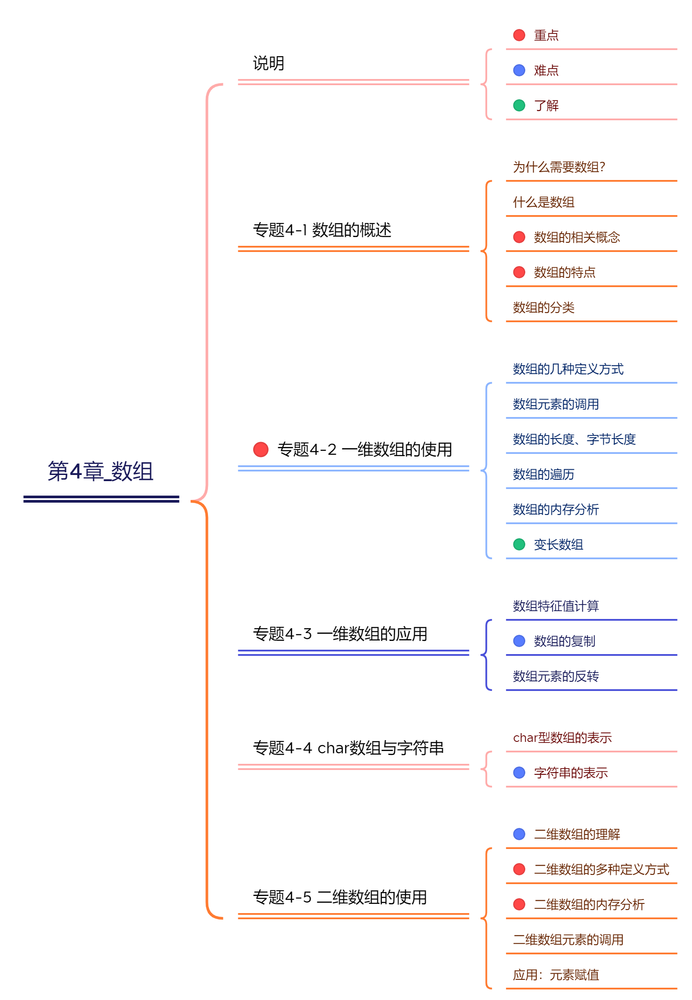

## 1、数组的概述

### 1.1 为什么需要数组

**需求分析1：**

需要统计某公司50个员工的工资情况，例如计算平均工资、找到最高工资等。用之前知识，首先需要声明`50个变量`来分别记录每位员工的工资，这样会很麻烦。因此我们可以将所有的数据全部存储到一个容器中统一管理，并使用容器进行计算。

**需求分析2：**


容器的概念：

- **生活中的容器**：水杯（装水等液体），衣柜（装衣服等物品），集装箱（装货物等）。
- **程序中的容器**：将多个数据存储到一起，每个数据称为该容器的元素。

### 1.2 数组的概念

- 数组(Array)，是多个`相同类型`数据按`一定顺序`排列的集合，并使用一个名字命名，并通过编号的方式对这些数据进行统一管理。

- 数组中的概念
  - 数组名
  - 下标（或索引、index）
  - 元素
  - 数组的长度

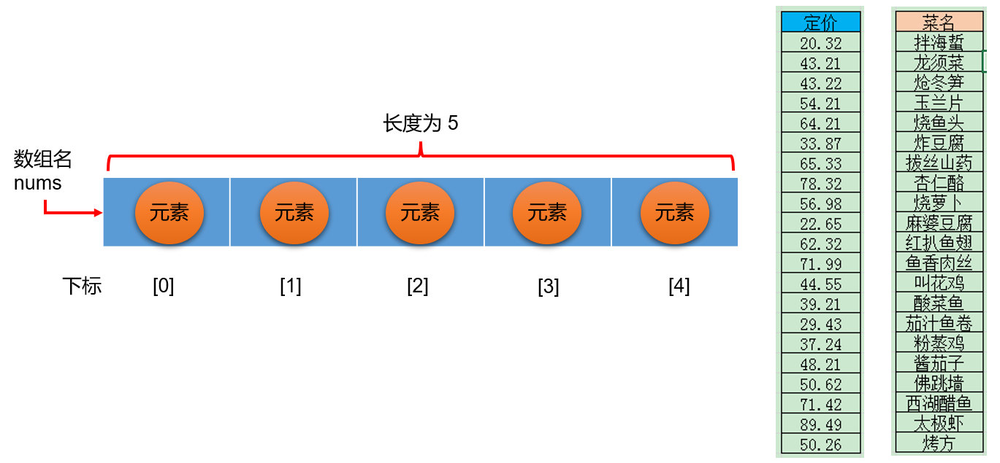

**数组的特点：**

- 数组中的元素在内存中是依次紧密排列的，有序的。
- 创建数组对象会在内存中开辟一整块`连续的空间`。占据的空间的大小，取决于数组的长度和数组中元素的类型。
- 我们可以直接通过下标(或索引)的方式调用指定位置的元素，速度很快。
- 数组，一旦初始化完成，其长度就是确定的。数组的`长度一旦确定，就不能修改`。
- 数组名中引用的是这块连续空间的首地址。

### 1.3 数组的分类

**按照数组维度分：**

- 一维数组：存储一组数据
- 二维数组：存储多组数据，相当于二维表，一行代表一组数据。每一行长度可以不同。
- 三维数组、四维数组、....

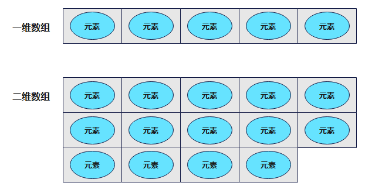

**按照元素的数据类型分：**

- int类型数组
- char类型数组
- double类型数组
- ....

## 2、一维数组的定义

### 2.1 数组的定义方式1

数组通过变量名后加方括号表示，方括号里面是数组可以容纳的成员数量（即长度）。

```c
int arr[10];  //数组 arr ，里面包含10个成员，每个成员都是 int 类型
```

```c
#define NUM 10
int arr1[NUM];
```

注意，声明数组时，必须给出数组的大小。

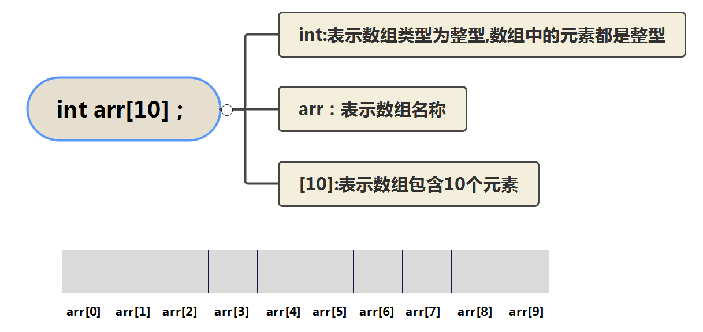

### 2.2 数组元素的调用

- 格式：`数组名[下标]`

- 数组的`下标从0开始`，用“int arr[10];”定义数组，则`最大下标值为9`，不存在数组元素arr[10]。

```c
arr[0] = 13;       //对该位置数组元素进行赋值
int score = arr[0]; //调用此位置的元素值
```

**数组角标越界：**

假设数组有n个元素，如果使用的数组的下标小于0，或者大于n-1，就是数组越界访问了，超出了数组合法空间的访问。

C语言不做数组下标越界的检查，编译器也不一定报错，但是编译器不报错，并不意味着程序就是正确！

```c
int scores[20];
scores[20] = 51;
```

> 说明：数组 scores 只有20个成员，因此 scores[20] 这个位置是不存在的。但是，引用这个位置并不会报错。赋值操作会导致紧跟在 scores 后面的那块内存区域被赋值(这实际是其它变量的区域)，因此不知不觉就更改了其它变量的值。这很容易引发错误，而且难以发现。

### 2.3 关于长度

**数组的字节长度**

sizeof 运算符会返回整个数组的字节长度。

```c
int arr[10];
printf("数组的字节长度为：%zd\n",sizeof(arr)); //40
```

**数组的长度**

在定义数组时，需要指定数组中元素的个数，方括号中的常量表达式用来表示元素的个数，即数组长度。

由于数组成员都是同一个类型，每个成员的字节长度都是一样的，所以数组整体的字节长度除以某个数组元素的字节长度，就可以得到数组的成员数量。

```c
//数组中元素的个数：
int arrLen = sizeof(arr) / sizeof(arr[0]);
```

```c
int a[10];
printf("数组的字节长度为：%zu\n", sizeof(a));   // 40
printf("数组每个元素的字节长度为：%zu\n", sizeof(int)); // 4
printf("数组的长度为：%zu\n", sizeof(a) / sizeof(int)); // 10
```

> 复习： sizeof 返回值的数据类型是 `size_t` ，所以 sizeof(a) / sizeof(a[0]) 的数据类型也是size_t 。在 printf() 里面的占位符，要用 %zd 或 %zu 。

注意：数组一旦声明/定义了，其**长度就固定了，不能动态变化**。

### 2.4 数组的遍历

将数组中的每个元素分别获取出来，就是`遍历`。for循环与数组的遍历是绝配。

举例1：声明长度为10的int类型数组，给数组元素依次赋值为0,1,2,3,4,5,6,7,8,9，并遍历数组所有元素

```c
int main() {

    int arr[10];
    
    //给数组中的每个元素赋值
    for (int i = 0; i < sizeof(arr)/sizeof(int); i++) { //对数组元素arr[0]~arr[9]赋值
        arr[i] = i;
    }
    //遍历数组中的元素
    printf("遍历数组中的元素：\n");
    for (int i = 0; i < sizeof(arr)/sizeof(int); i++) { //输出arr[0]~arr[9]共10个数组元素
        printf("%d ", arr[i]);
    }
    printf("\n");
    return 0;
}
```

### 2.5 数组的其它定义方式

**定义方式2：**(定义方式1在2.1节讲的)

数组可以在声明时，使用大括号，同时对每一个成员赋值。

```c
int arr[5] = {22, 37, 90, 48, 95};
```

`变形形式1：`C 语言允许省略方括号里面的数组成员数量，这时根据大括号里面的值的数量，自动确定数组的长度。

```c
int arr[3] = {10,20,30};
// 等同于
int arr[] = {10,20,30};  //数组 arr 的长度，将根据大括号里面的值的数量，确定为 3
```

`变形形式2：`

对数组部分元素赋初值：如果大括号里面的值，少于数组的成员数量，那么未赋值的成员自动初始化为 0 。

```c
int arr[5] = {10, 20, 30};
// 等同于
int arr[5] = {10,20,30, 0, 0};
```

`变形方式3`：

将整个数组的每一个成员都设置为零，最简单的方式如下

```c
int a[100] = {0};
```

`错误方式：`

使用大括号赋值时，大括号里面的值不能多于数组的长度，否则编译时会报错。

```c
int arr[3] = {1,2,3,4};  // 报错
```

**定义方式3：** 数组初始化时，可以指定为哪些位置的成员赋值。

```c
int arr[15] = {[2] = 10, [5] = 20, [14] = 30};  //非角标2、5、14的位置自动赋值为0

//等同于
int arr[15] = {[5] = 20, [14] = 30, [2] = 10}; //指定位置的赋值可以不按角标从小到大的顺序
```

`变形形式1：`指定位置的赋值与顺序赋值，可以结合使用。

```c
int arr[15] = {1, [5] = 10, 11, [10] = 20, 21}; //角标0、5、6、10、11的位置被赋值
```

`变形形式2：`省略成员数量时，如果同时采用指定位置的赋值，那么数组长度将是最大的指定位置再加1。

```c
int arr[] = {[2] = 6, [9] = 12};  //此时数组的长度是10
```

## 3、一维数组内存分析

### 3.1 数组内存图

针对于如下代码：

```c
int a[5] = {1,2,3,4,5};
```

对应的内存结构：

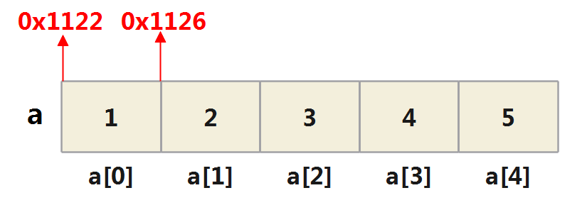

说明：

1）数组名，记录该数组的首地址 ，即 a[0]的地址。

2）数组的各个元素是连续分布的， 假如 a[0] 地址是0x1122，则`a[1]地址= a[0]的地址+int字节数(4)` = 0x1122 + 4 = 0x1126，后面 `a[2] 地址 = a[1]地址 + int 字节数(4)` = 0x1126 + 4 = 0x112A，依次类推...

### 3.2 注意事项

**C 语言规定，数组变量一旦声明，数组名指向的地址就不可更改。** 因为声明数组时，编译器会自动为数组分配内存地址，这个地址与数组名是绑定的，不可更改。

因此，当数组定义后，再用大括号重新赋值，是不允许的。下面的代码会报错。

错误举例1：

```c
int nums[5];
nums = {22, 37, 3490, 18, 95}; // 使用大括号赋值时，必须在数组声明时赋值，否则编译时会报错。
```

错误举例2：

```c
int nums[5] = {1, 2, 3, 4, 5};
nums = {6, 7, 8, 9, 10}; // 报错
```

错误举例3：

```c
int ints[100];
ints = NULL; //报错
```

这也导致不能将一个数组名赋值给另外一个数组名。

```c
int a[5] = {1, 2, 3, 4, 5};
// 写法一
int b[5] = a; // 报错
// 写法二
int b[5];
b = a; // 报错
```

上面两种写法都会更改数组 b 的地址，导致报错。

### 3.3 变长数组

数组声明的时候，数组长度除了使用常量，也可以使用变量或表达式来指定数组的大小。这叫做`变长数组`（variable-length array，简称 VLA）。

**方式1：**

```c
int n = 10;
int arr[n];
```

变长数组的根本特征是数组长度只有`运行时才能确定`。它的好处是程序员不必在开发时，随意为数组指定一个估计的长度，程序可以在运行时为数组分配精确的长度。

任何长度需要运行时才能确定的数组，都是变长数组。比如，

```c
int i = 10;
int a1[i];
int a2[i + 5];
int a3[i + k];
```

> 注意：变长数组在C99标准中被引入，在C11标准中被标记为可选特性。某些编译器可能不支持变长数组，或者可能有特定的限制和行为。

**方式2：**

如果你的编译器版本不支持变长数组，还可以考虑使用动态内存分配（使用`malloc()函数` ）来创建动态大小的数组。

分配：

```c
int length = 5;
int *arr = (int *)malloc(length * sizeof(int));
```

释放：

```c
free(arr);
```


## 4、一维数组的应用

### 4.1 数值型数组特征值统计

这里的特征值涉及到：平均值、最大值、最小值、总和等

举例1：定义一个int型的一维数组，包含10个元素，然后求出数组中的最大值，最小值，总和，平均值，并输出出来。

```c
int main() {
    int arr[10] = {34, 54, 2, 32, 54, 57, 3, 32, 87, 43};

    int max = arr[0];//用于记录数组的最大值
    int arrLen = sizeof(arr) / sizeof(int);//获取数组中元素的个数
    for (int i = 1; i < arrLen; i++) {
        if (max < arr[i]) {
            max = arr[i];
        }
    }
    printf("最大值为：%d\n", max);

    //获取数组的最小值
    int min = arr[0];
    for (int i = 1; i < arrLen; i++) {
        if (min > arr[i]) {
            min = arr[i];
        }
    }
    printf("最小值为：%d\n", min);

    //获取数组的总和
    int sum = 0;
    for (int i = 0; i < arrLen; i++) {
        sum += arr[i];
    }
    printf("总和为：%d\n", sum);

    //获取数组的平均值
    int avg = sum / arrLen;
    printf("平均值为：%d\n", avg);


    return 0;
}
```

举例2：评委打分

分析以下需求，并用代码实现：

（1）在编程竞赛中，有10位评委为参赛的选手打分，分数分别为：5，4，6，8，9，0，1，2，7，3

（2）求选手的最后得分（去掉一个最高分和一个最低分后其余8位评委打分的平均值）

```c
int main() {
    int scores[10] = {5,4,6,8,9,0,1,2,7,3};

    int max = scores[0]; //记录最高分
    int min = scores[0]; //记录最低分
    int sum = 0; //记录总分
    int arrLen = sizeof(scores) / sizeof(int); //记录数组长度
    for(int i = 0;i < arrLen;i++){
        if(max < scores[i]){
            max = scores[i];
        }

        if(min > scores[i]){
            min = scores[i];
        }

        sum += scores[i];
    }
    //计算平均分
    double avg = (double)(sum - max - min) / (arrLen - 2);

    printf("选手去掉最高分和最低分之后的平均分为：%.2lf\n" , avg);

    return 0;
}
```


### 4.2 数组的复制

由于数组名是指针，所以复制数组不能简单地复制数组名。

```c
int a[3] = {10,20,30};
int* b;
b = a;
```

上面的写法，结果不是将数组 a 复制给数组 b ，而是让 a 和 b 指向同一个数组。

**正确方式1：使用循环**

这是复制数组最简单的方法，将数组元素逐个进行复制。比如，将数组 a 的成员逐个复制给数组 b。

```c
#include <stdio.h>

#define LENGTH 3

int main() {
    int a[LENGTH] = {10, 20, 30};
    int b[LENGTH];

    // 复制数组 a 到数组 b
    for (int i = 0; i < LENGTH; i++) {
        b[i] = a[i];
    }

    // 打印数组 b 的内容
    printf("复制后的数组 b：");
    for (int i = 0; i < LENGTH; i++) {
        printf("%d ", b[i]);
    }
    printf("\n");

    return 0;
}
```

**正确方式2：使用 memcpy() 函数**

 memcpy() 函数定义在头文件 string.h 中，直接把数组所在的那一段内存，再复制一份。3个参数依次为：`目标数组`、`源数组`以及`要复制的字节数`。

```c
#include <stdio.h>
#include <string.h>

#define LENGTH 3

int main() {
    int a[LENGTH] = {10, 20, 30};
    int b[LENGTH];

    // 使用 memcpy 函数复制数组 a 到数组 b
    memcpy(b, a, LENGTH * sizeof(int));

    // 打印数组 b 的内容
    printf("复制后的数组 b：");
    for (int i = 0; i < LENGTH; i++) {
        printf("%d ", b[i]);
    }
    printf("\n");

    return 0;
}
```

**两种方式对比：**

下面是对两种方式进行比较的一些要点：

1. 循环复制：
   - 优点：`简单直观`，容易理解和实现。不需要引入额外的头文件。
   - 缺点：需要编写循环代码来遍历数组并逐个赋值，相对而言可能`稍显繁琐`。不适用于复制大型数组或复杂数据结构。
2. memcpy函数复制：
   - 优点：使用标准库提供的函数，可以实现`快速且高效`的内存复制。适用于`大型数组或复杂数据`结构的复制。可以直接复制字节数，不需要遍历数组。
   - 缺点：需要包含 `<string.h>` 头文件。对于简单的数组复制，可能有些`过于繁重`。

### 4.3 数组元素的反转

**实现思想：** 数组对称位置的元素互换。

方式1：

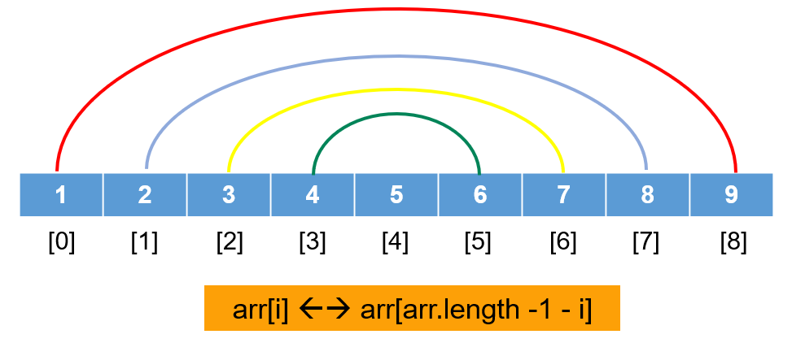

代码实现

```c
int main() {
    int arr[] = {1,2,3,4,5,6,7,8,9};
    int size = sizeof(arr) / sizeof(arr[0]); //数组的长度

    printf("原始数组：");
    for (int i = 0; i < size; i++) {
        printf("%d ", arr[i]);
    }
    printf("\n");

    for(int i = 0;i < size / 2;i++){
        int temp = arr[i];
        arr[i] = arr[size - 1 - i];
        arr[size - 1 - i] = temp;
    }

    printf("反转后的数组：");
    for (int i = 0; i < size; i++) {
        printf("%d ", arr[i]);
    }
    printf("\n");

    return 0;
}
```

方式2：

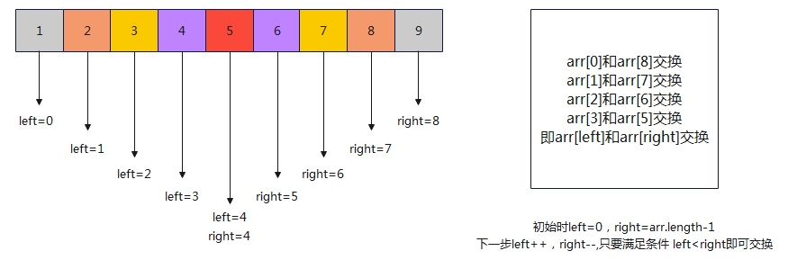

```c
int main() {
    int arr[] = {1, 2, 3, 4, 5,6,7,8,9};
    int size = sizeof(arr) / sizeof(arr[0]); //数组的长度

    printf("原始数组：");
    for (int i = 0; i < size; i++) {
        printf("%d ", arr[i]);
    }
    printf("\n");

    int left = 0; // 起始指针
    int right = size - 1; // 结尾指针

    while (left < right) {
        // 交换起始指针和结尾指针指向的元素
        int temp = arr[left];
        arr[left] = arr[right];
        arr[right] = temp;

        // 更新指针位置
        left++;
        right--;
    }

    printf("反转后的数组：");
    for (int i = 0; i < size; i++) {
        printf("%d ", arr[i]);
    }
    printf("\n");

    return 0;
}
```

### 4.4 char型数组与字符串

#### 4.4.1 char型数组

字符型数组，顾名思义，数组元素的数据类型为字符型的数组。

一方面，可以看做普通的数组，初始化、常用操作如前所述。比如：

```c
char arr[] = {'a','b','c','d'};
```

另一方面，字符型数组可以用于存储字符串。

#### 4.4.2 字符串的使用

```c
"helloworld"
"abc"
"a"
"123"
```

这种由双引号引起来的一串字符称为字符串字面值(String Literal)，简称字符串(String)。

通常把`""`称为`空串`，即一个不包含任意字符的字符串；而`" "`则称为`空格串`，是包含一个空格字符的字符串。二者不能等同。

C语言没有专门用于存储字符串的变量类型，字符串都被存储在char类型的数组中。在字符串结尾，C 语言会自动添加一个`'\0' `的转义字符作为字符串结束的标志，所以字符数组也必须以 '\0'字符结束。

**声明方式1：标准写法**

```c
//显式以'\0'为最后一个字符元素结束
char str[] = {'h','e','l','l','o',' ','w','o','r','l','d','\0'};
```

如果一个字符数组声明如下，由于必须留一个位置给 `\0` ，所以最多只能容纳9个字符的字符串。

```c
char str1[10];
```

**声明方式2：简化写法**

字符串写成数组的形式，是非常麻烦的，C 语言提供了一种简化写法。双引号之中的字符，会被自动视为字符数组。

```c
//自动在末尾添加'\0'字符
char str1[12] = {"hello world"};  //注意使用双引号，非单引号
//或者
char str2[12] = "hello world";   //可以省略一对{}来初始化数组元素
```

由于字符数组的长度可以让编译器自动计算，所以声明时可以省略字符数组的长度：

```c
char str1[] = {"hello world"};
//或者
char str2[] = "hello world"; 
```

双引号里面的字符串，不用自己添加结尾字符 \0 ，C 语言会自动添加。所以，代码中数组 str1或str2的元素依次为 'h', 'e', 'l', 'l', 'o', ' ', 'w', 'o', 'r', 'l', 'd', '\0'。

**字符串对应数组的长度**

对应的存储为：

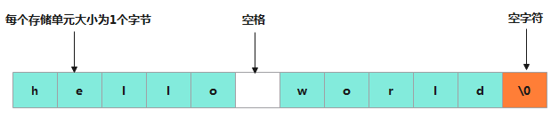

其中，数组由连续的存储单元组成，字符串中的字符被存储在相邻的存储单元中，每个单元存储一个字符。所以，上述两个数组的长度不是11，而是12。

**字符串的长度**

```c
char nation[10]={"China"};
```

数组nation的前5个元素为: ′C′,′h′,′i′,′n′,′a′，第6个元素为′\0′，后4个元素也自动设定为空字符。

 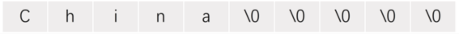

> 注意：在计算字符串长度的时候，'\0' 是结束标志，不算作字符串内容。

```c
#include <stdio.h>
#include <string.h>    //需要加载此头文件

int main() {
    char nation[10] = "China";
    printf("%d\n", strlen(nation));     //5
}
```

**区分：'\0'、0、'0'**

字符 '\0' 不同于字符 '0' ，前者的ASCII 码是0（二进制形式 00000000 ），后者的 ASCII 码是48（二进制形式 00110000 ）。

**练习1：字符数组、字符串的长度**

```c
char s1[50] = "hello";  //声明1

char s2[] = "hello";    //声明2

char s3[5] = "hello";   //声明3
```

对于声明1：赋给的元素的个数小于该数组的长度，则会自动在后面加 '\0', 表示字符串结束。所以，字符数组 s1 的长度是 50 ，但是字符串“hello”的实际长度只有5（不包含结尾符号 '\0' ），所以后面空出来的45个位置，都会被初始化为 '\0'。

对于声明2：字符数组 s2 的长度是 6（包含结尾符号 '\0' ），但是字符串“hello”的实际长度只有5。

对于声明3：赋给的元素的个数等于该数组的长度，则不会自动添加 '\0'。但字符串要求以'\0'结束，所以这种写法是错误的，要避免。

**练习2：比较"x"和'x'的不同**

- 书写形式不同：字符串常量用双引号，字符常量用单引号。

- 存储空间不同：在内存中，字符常量只占用一个字节的存储空间，而字符串存储时自动加一个结束标记'\0'，所以'x'占用1个字节，而"x"占用2个字节。

  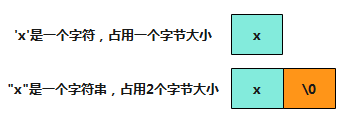

- 二者的操作也不相同。例如，可对字符常量进行加减运算，字符串常量则不能。

**练习3：输出字符数组**

```c
#include <stdio.h>

int main() {

    char str1[]={"China\nBeijing"};
    char str2[] = "helloworld";

    puts(str1);

    puts(str2);

    return 0;
}
```


>  【中央财经大学2018研】若有定义和语句：char s[10]; s="abcd"; printf("%s\n",s);，则结果是（　）。
>  A．输出abcd@#$
>  B．输出a
>  C．输出abcd
>  D．编译不通过
>
>  【答案】D
>
>  【解析】在定义一维字符数组时，s为数组名，指向数组首元素的地址，为地址常量，不可更改，因此语句s＝"abcd"是非法的，编译不会通过。


## 5、多维数组

### 5.1 理解

二维数组、三维数组、...都称为多维数组。本节主要讲解二维数组，三维及以上的数组，以此类推即可。

举例：公司有3个攻坚小分队，每队有6名同事，要把这些同事的工资用数组保存起来以备查看。

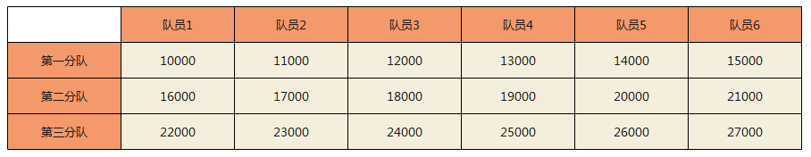

此时建立数组salary用于存储工资，它应当是二维的。第一维用来表示第几分队，第二维用来表示第几个同事。例如用`salary2,3`表示角标2对应分队的角标3对应队员的工资。

> 对于二维数组的理解，可以看作是由一维数组嵌套而成的。即一维数组array1又作为另一个一维数组array2的元素而存在。

### 5.2 二维数组的定义方式1

**定义方式1：**

```c
int a[3][4]; //二维数组
```

二维数组a可看成由三个一维数组构成，它们的数组名分别为 a[0]、a[1]、a[2]。这三个一维数组各有 4 个元素，如，一维数组 a[0] 的元素为 `a[0][0]`、`a[0][1]`、`a[0][2]`、`a[0][3]`。二维数组a共有12个成员（3 x 4 = 12）。

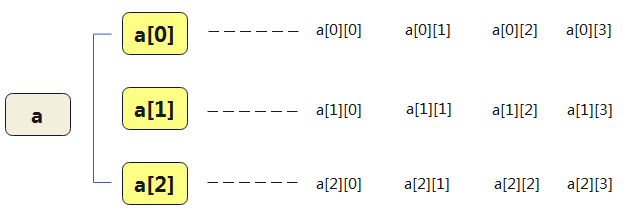

也可以简化理解为：

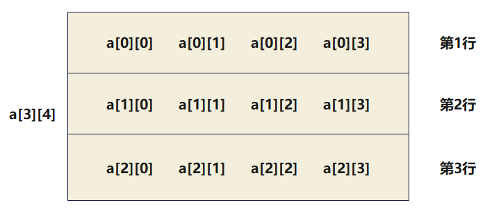

二维数组，常称为`矩阵(matrix)`。把二维数组写成`行(row)`和`列(column)`的排列形式，可以形象化地理解二维数组的逻辑结构。

三维数组如下：

```c
int arr1[3][4][5]; //三维数组
```

> 技巧：C 语言允许声明多维数组，有多少个维度，就用多少个方括号，比如二维数组就使用两个方括号。

**错误方式：**

```c
float a[3,4];  //在一对方括号内不能写两个下标
```

### 5.3 二维数组的内存分析

用`矩阵形式`（如3行4列形式）表示二维数组，是`逻辑`上的概念，能形象地表示出行列关系。而在`内存`中，各元素是连续存放的，不是二维的，是`线性`的。

C语言中，二维数组中元素排列的顺序是`按行存放`的。即：先顺序存放第一行的元素，再存放第二行的元素。（最右边的下标变化最快，第一维的下标变化最慢）。

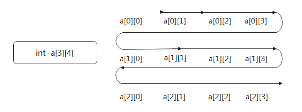

举例，整型数组`b[3][3]`在内存中的存放：

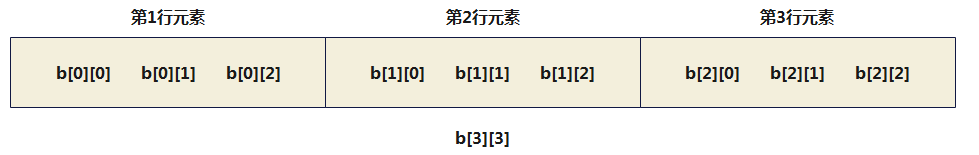

举例：关于长度

```c
int b[3][3];
printf("%d\n",sizeof(b)); //36
printf("%d\n",sizeof(b)/sizeof(int)); //9
```

### 5.4 成员的调用

格式：**数组名[下标] [下标]**

跟一维数组一样，多维数组每个维度的第一个成员也是从 0 开始编号。

举例1：给指定索引位置的元素赋值

```c
int arr1[3][5];
//给指定索引位置的元素赋值
arr1[0][0] = 12;
arr1[3][4] = 5;
```

举例2：查看数组元素的地址

```c
int main() {

    int arr2[3][4];

    for (int i = 0; i < 3; i++) {
        for (int j = 0; j < 4; j++) {
            printf("&arr2[%d][%d] = %p\n", i, j, &arr2[i][j]);
        }
    }

    return 0;
}
```

输出结果如下：

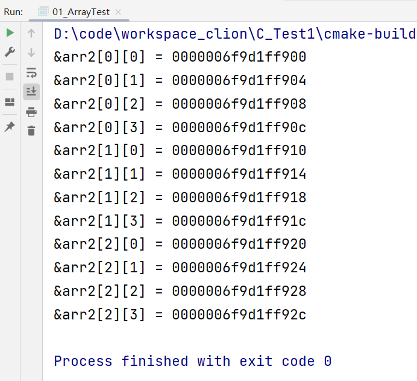

### 5.5 二维数组其它定义方式

**定义方式2：声明与初始化同时进行**

多维数组也可以使用大括号，在声明的同时，一次性对所有成员赋值。

```c
int a[3][4] = {{1,2,3,4},
               {5,6,7,8},
               {9,10,11,12}};
```

上例中， a 是一个二维数组，这种赋值写法相当于将第一维的每个成员写成一个数组。

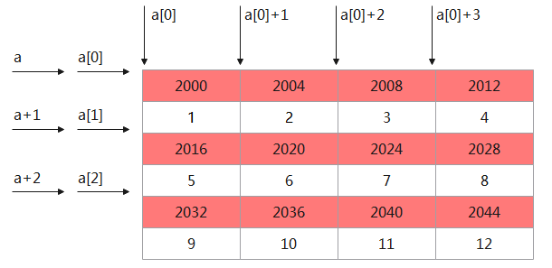

> 说明：这里的地址以十进制数值进行的说明。

```c
int main() {

    int a[3][4] = {{1,2,3,4},
                   {5,6,7,8},
                   {9,10,11,12}};

    printf("%p\n",a[0]);     //0000006ac71ffd30
    printf("%p\n",a[0] + 1); //0000006ac71ffd34
    printf("%p\n",a[0] + 2); //0000006ac71ffd38
    printf("%p\n",a[0] + 3); //0000006ac71ffd3c
    printf("%p\n",a[0] + 4); //0000006ac71ffd40
    printf("%p\n",a + 1);    //0000006ac71ffd40

    printf("%p\n",a[1]);     //0000006ac71ffd40
    printf("%p\n",a[1] + 1); //0000006ac71ffd44

    return 0;
}
```

**定义方式3：部分元素赋值**

多维数组也可以仅为指定的位置进行初始化赋值，未赋值的成员会自动设置为“零”值 。

```c
//指定了 [0][0] 和 [1][1] 位置的值，其他位置就自动设为 0 。
int a[2][2] = {[0][0] = 1, [1][1] = 2};  
```

**定义方式4：使用单层大括号赋值**

多维数组也可以使用单层大括号赋值。不管数组有多少维度，在内存里面都是线性存储。对于`a[2][2]`来说， `a[0][0]` 的后面是 `a[0][1]` ，再后面是`a[1][0]` ，以此类推。

```c
int a[2][2] = {1, 0, 0, 2};  //会自动匹配到各行各列
```

**定义方式5：方式4的简化**

在方式4的基础上，如果对全部元素赋值，那么第一维的长度可以不给出。

```c
//int a[2][3] = {1, 2, 3, 4, 5, 6}; 
//可以写为：
int a[][3] = {1, 2, 3, 4, 5, 6}; 
//也可以写为：
int a[][3] = {{1, 2, 3},{4, 5, 6}}; //行数自然判定为2
```

练习：下面哪些赋值操作是正确的？（都对）

```c
int arr1[3][2]={{1,2},{3,4},{5,6}};  //对应定义方式2

int arr2[3][2]={1,2,3,4,5,6};  //对应定义方式4

int arr3[][2]={1,2,3,4,5,6};  //对应定义方式5

int arr4[][2]={{1,2},{3,4},{5,6}}; //对应定义方式5

int arr5[][2]={1,2,3,4,5};  //对应定义方式5。未显式赋值的位置默认赋值为0
```

**错误方式：** 在定义二维数组时，必须指定列数（即一行中包含几个元素）

```c
int array[][];  //错误，必须指定列数
int array[3][]; //错误，必须指定列数
```

### 5.6 举例

举例1：获取arr数组中所有元素的和

提示：使用for的嵌套循环即可。

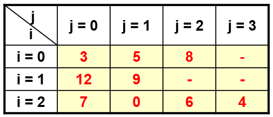

```c
#include <stdio.h>


#define ROWS 3
#define COLS 4

int main() {

    int arr[ROWS][COLS] = {{3, 5, 8},
                           {12, 9},
                           {7, 0, 6, 4}};

    int sum = 0;//记录总和

    for (int i = 0; i < ROWS; i++) {
        for (int j = 0; j < COLS; j++) {
            sum += arr[i][j];
        }
    }

    printf("总和为%d\n", sum);
    return 0;
}
```

举例2：求二维数组最大值以及对应的行列角标

```c
#include <stdio.h>

#define ROWS 3
#define COLS 4

int main() {
    int a[ROWS][COLS] = {{1,   2,  3,  4},
                         {9,   8,  7,  6},
                         {-10, 10, -5, 2}};

    int maxValue = a[0][0];
    int maxRow = 0;
    int maxCol = 0;

    for (int i = 0; i < ROWS; i++) {
        for (int j = 0; j < COLS; j++) {
            if (maxValue < a[i][j]) {
                maxValue = a[i][j];
                maxRow = i;
                maxCol = j;
            }
        }
    }

    printf("最大值: %d\n", maxValue);
    printf("对应的行索引: %d\n", maxRow);
    printf("对应的列索引: %d\n", maxCol);

    return 0;
}

```

举例3：将一个二维数组行和列的元素互换，存到另一个二维数组中。

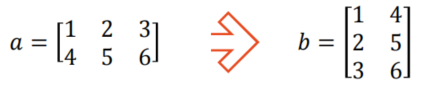

> `a[i][j] ---> b[j][i]`

```c
#include <stdio.h>

#define ROWS 2
#define COLS 3

int main() {
    int a[ROWS][COLS] = {{1, 2, 3},
                         {4, 5, 6}};
    int b[COLS][ROWS];
    printf("数组 a:\n");
    for (int i = 0; i < ROWS; i++) { //处理a数组中的一行中各元素
        for (int j = 0; j < COLS; j++) { //处理a数组中某一列中各元素
            printf("%5d", a[i][j]); //输出a数组的一个元素
        }
        printf("\n");
    }

    for (int i = 0; i < ROWS; i++) { //处理a数组中的一行中各元素
        for (int j = 0; j < COLS; j++) { //处理a数组中某一列中各元素
            b[j][i] = a[i][j]; //将a数组元素的值赋给b数组相应元素
        }
    }

    printf("数组 b:\n"); //输出b数组各元素
    for (int i = 0; i < COLS; i++) { //处理b数组中一行中各元素
        for (int j = 0; j < ROWS; j++) //处理b数组中一列中各元素
            printf("%5d", b[i][j]); //输出b数组的一个元素
        printf("\n");
    }
    return 0;
}

```

运行结果：

 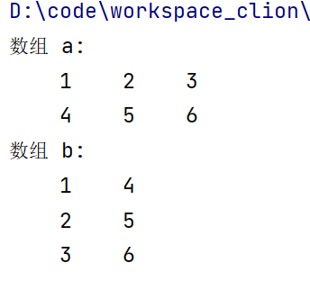

举例4：二维char型数组

将"Apple"、"Orange"、"Grape"、"Pear"、"Peach"存储在数组中。

```c
char fruit[][7]={"Apple","Orange","Grape","Pear","Peach"};
```

对应图示：

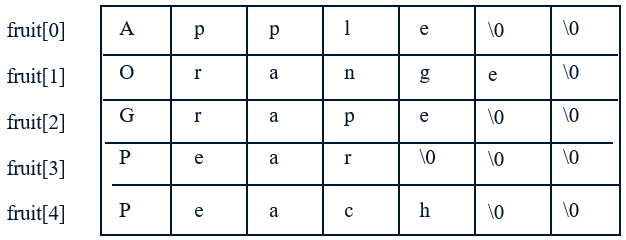

举例5：使用二维数组打印一个 10 行杨辉三角。

提示：

1. 第一行有 1 个元素, 第 n 行有 n 个元素

2. 每一行的第一个元素和最后一个元素都是 1

3. 从第三行开始, 对于非第一个元素和最后一个元素的元素。即：

   ```
   yanghui[i][j] = yanghui[i-1][j-1] + yanghui[i-1][j];
   ```

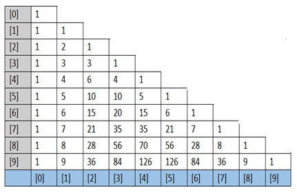

```c
#include <stdio.h>

#define ROWS 10

int main() {
    int yangHui[ROWS][ROWS];


    for (int i = 0; i < ROWS; i++) {
        //初始化第一列和对角线上的元素为1
        yangHui[i][0] = 1;
        yangHui[i][i] = 1;
        //给其他位置元素赋值
        for (int j = 1; j < i; j++) {
            yangHui[i][j] = yangHui[i - 1][j - 1] + yangHui[i - 1][j];
        }
    }

    // 打印杨辉三角
    for (int i = 0; i < ROWS; i++) {
        // 打印每行的元素
        for (int j = 0; j <= i; j++) {
            printf("%5d ", yangHui[i][j]);
        }
        printf("\n");
    }

    return 0;
}
```

 <p id = "第05章_指针"></p> 

# 第05章_指针

指针是 C 语言`最重要`的概念之一，也是最`难理解`的概念之一。

指针是C语言的`精髓`，要想掌握C语言就需要深入地了解指针。

指针类型在考研中用得最多的地方，就是和结构体结合起来`构造结点`(如链表的结点、二叉树的结点等)。

## 本章专题脉络

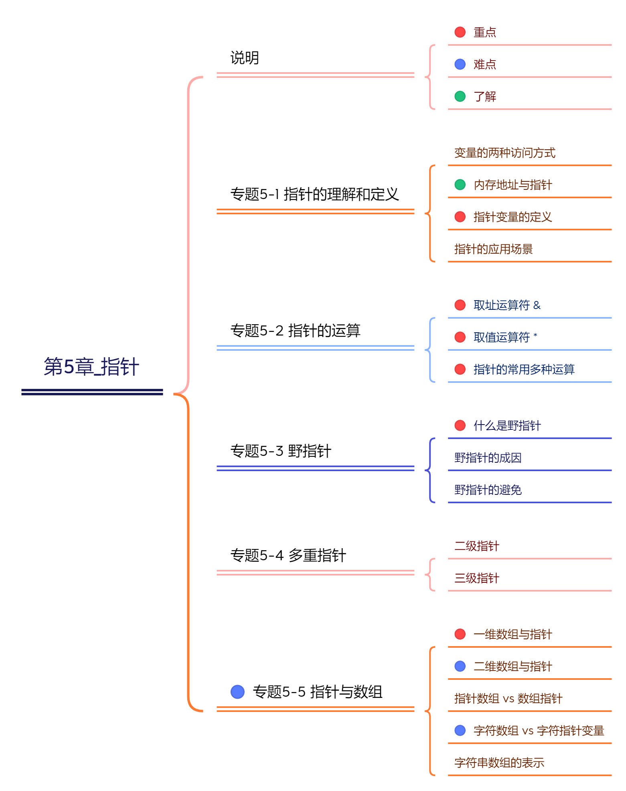

## 1、指针的理解与定义

### 1.1 变量的访问方式

计算机中程序的运行都是在内存中进行的，变量也是在内存中分配的空间，且不同类型的变量占用不同大小的空间。那如何访问内存中变量存储的数据呢？有两种方式：`直接访问`和`间接访问`。直接访问，直接使用变量名进行的访问，以前的程序中都是采用这种方式。

```c
int num1 = 10;
int num2 = 20;
int num3 = num1 + num2;
```

间接访问，通过指针来实现。下面看如何理解指针。

### 1.2 内存地址与指针

为了能够有效的访问到内存的每个单元(即一个字节)，就给内存单元进行了编号，这些编号被称为该**内存单元的地址**。因为每个内存单元都有地址，所以变量存储的数据也是有地址的。

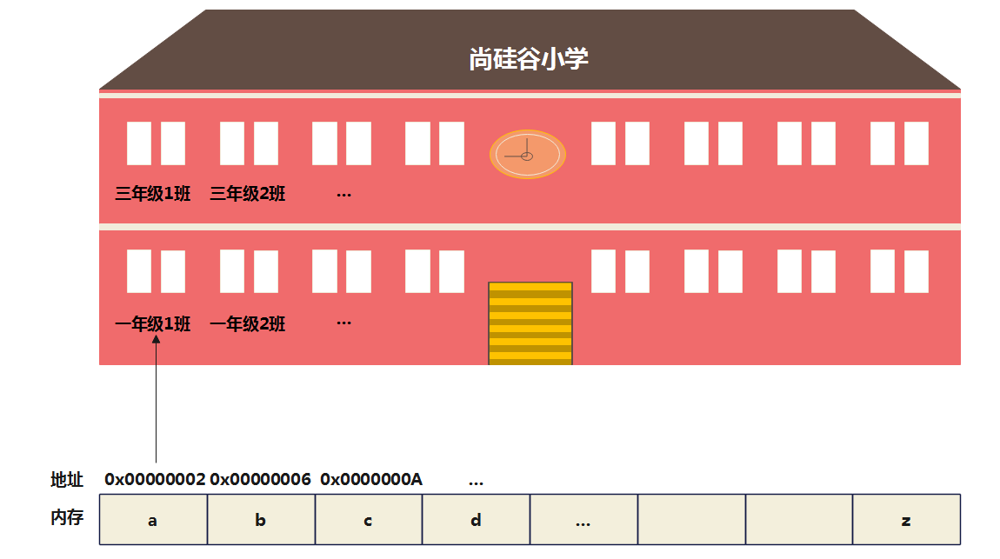

```c
int num = 5;
```

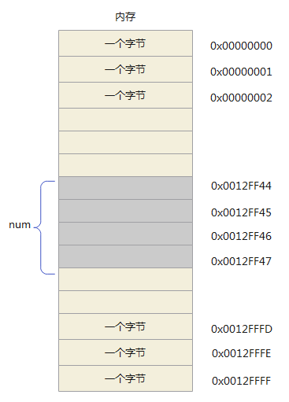

通过地址能找到所需的变量单元，可以说，**地址指向该变量单元**，将**地址形象化地称为“指针”**。即：

- `变量`：命名的内存空间，用于存放各种类型的数据。


- `变量名`：变量名是给内存空间取的一个容易记忆的名字。
- `变量值`：在变量单元中存放的数据值。

- `变量的地址`：变量所使用的内存空间的地址，即`指针`。

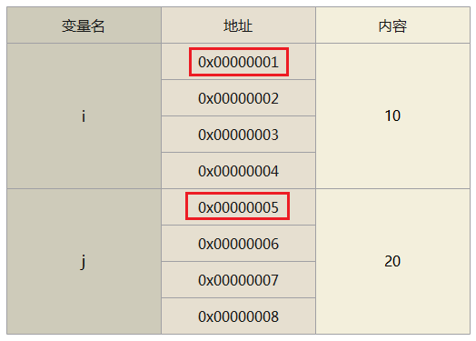

- `指针变量`：一个变量专门用来存放另一变量在内存中数据的地址 (即指针)，则它称为“指针变量”。我们可以通过访问指针变量达到访问内存中另一个变量数据的目的。(有时为了阐述方便，将指针变量直接说成指针。)


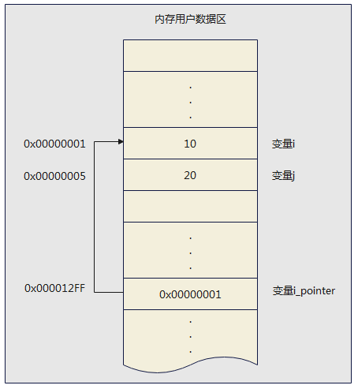

上图中，地址0x00000001是变量 i 的指针，i_pointer就是一个指针变量。

> 体会：指针就是内存地址，使用指针访问变量，就是直接对内存地址中的数据进行操作。

### 1.3 指针变量的定义

**一般格式：**

```c
数据类型 *指针变量名 [=初始地址值];
```

- 数据类型是指针变量所指向变量数据类型。可以是 int、char、float 等基本类型，也可以是数组等构造类型。


- 字符 `*` 用于告知系统这里定义的是一个指针变量，通常跟在类型关键字的后面。比如， char * 表示一个指向字符的指针， float * 表示一个指向 float 类型的值的指针。此外，还有指向数组的指针、指向结构体的指针。

**举例1：**

```c
int *p;  //读作：指向int的指针”或简称“int指针”
```

这是一个指针变量，用于存储int型的整数在内存空间中数据的地址。

变形写法：

```c
int* p;
int * p;
```

> 注意：
>
> 1、指针变量的名字是 p，不是*p。
>
> 2、指针变量中只能存放地址，不要将一个整数（或任何其它非地址类型的数据）赋给一个指针变量。

举例2：同一行声明两个指针变量

```c
// 正确
int * a, * b;
// 错误
int* a, b;   //此时a是整数指针变量，而b是整数变量
```

举例3：一个指针指向的可能还是指针，这时就要用两个星号 ** 表示。(后面讲)

```c
int **foo;
```

### 1.4 指针的应用场景

场景1：使用指针访问变量或数组的元素。

场景2：应用在数据结构中。比如：

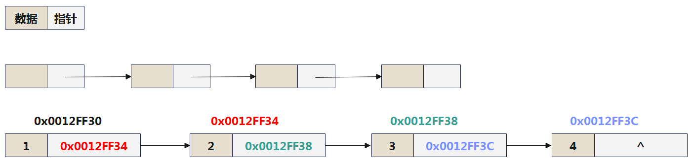

## 2、指针的运算

指针作为一种特殊的数据类型可以参与运算，但与其他数据类型不同的是，指针的运算都是针对内存中的地址来实现的。

### 2.1 取址运算符：&

取址运算符，使用“`&`”符号来表示。作用：`取出指定变量在内存中的地址`，其语法格式如下：

```c
&变量
```

举例1：

```c
int num = 10; 
printf("num = %d\n", num); // 输出变量的值。 num = 10
printf("&num = %p\n", &num); // 输出变量的内存地址。&num = 00000050593ffbbc
```

> 说明：
>
> 1、在输出取址运算获得的地址时，需要使用“%p”作为格式输出符。
>
> 2、这里num的4个字节，每个字节都有地址，取出的是第一个字节的地址（较小的地址）。

举例2：将变量的地址赋值给指针变量

```c
int num = 10;
int *p; //p为一个整型指针变量
p = &num; 
```

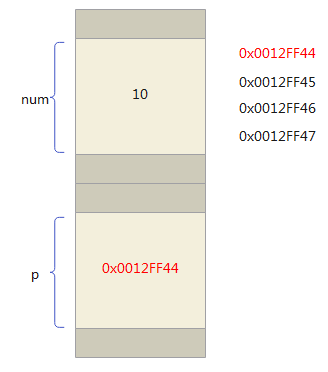

举例3：

```c
int d = 10;
int *e, *f;
e = &d;
f = e;
```

**指针变量的赋值**

1、指针变量中只能存放地址（指针），不要将一个整数（或任何其它非地址类型的数据）赋给一个指针变量。

2、C语言中的地址包括位置信息(内存编号，或称纯地址)和它所指向的数据的类型信息，即它是“`带类型的地址`”。所以，一个指针变量只能指向同一个类型的变量，不能抛开类型随意赋值。

- char* 类型的指针是为了存放 char 类型变量的地址。
- short* 类型的指针是为了存放 short 类型变量的地址。
- int* 类型的指针是为了存放 int 类型变量的地址。

3、在没有对指针变量赋值时，指针变量的值是不确定的，可能系统会分配一个未知的地址，此时使用此指针变量可能会导致不可预料的后果甚至是系统崩溃。为了避免这个问题，通常给指针变量赋初始值为0(或NULL)，并把值为0的指针变量称为`空指针变量`。

举例4：通过指针变量修改指向的内存中的数据

```c
int main() {

    int num = 10, *ptr;
    ptr = &num;
    printf("%d\n",num);

    scanf("%d", ptr); //等价于scanf("%d", &num);
    
    printf("%d\n",num);

    return 0;
}
```

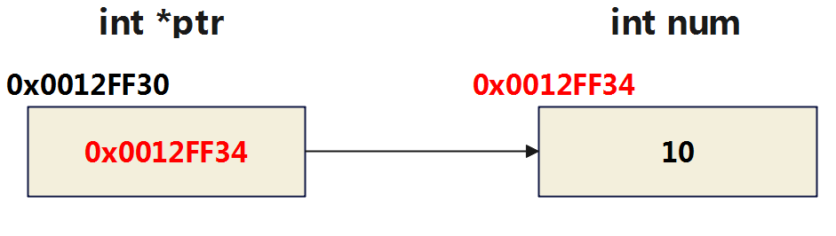

### 2.2 取值运算符：*

在C语言中针对指针运算还提供了一个取值运算符，使用“`*`”符号表示。其`作用与&相反`，根据一个给定的内存地址取出该地址对应变量的值。也称为`解引用符号`。其格式如下：

```c
*指针表达式
```

其中，“`*`”不同于定义指针变量的符号，这里是运算符。“指针表达式”用于得到一个内存地址，与“*”结合以获得该内存地址对应变量的值。

举例1：

```c
int main() {

    int a = 2024;
    int *p;
    p = &a;
    
    printf("%p\n",&a); //0000005cc43ff6d4
    printf("%p\n",p);  //0000005cc43ff6d4
    printf("%d\n", *p); //2024
    
    return 0;
}
```

举例2：

```c
int main() {

    int num = 10; //这里定义一个整型变量num
    printf("num = %d\n", num); //输出变量num的值。输出：num = 10
    printf("&num = %p\n", &num); //输出变量num的地址。输出：&num = 000000e6a11ffa1c
    
    int *p = &num;
    printf("%p\n",p); //000000e6a11ffa1c
    printf("%d\n",*p);//10
    
    printf("*&num = %d\n", *&num);//通过num地址读取num中的数据。输出：*&num = 10
    
    return 0;
}
```

> `&` 运算符与 `*` 运算符互为逆运算，下面的表达式总是成立：
>
> ```c
> int i = 5;
> if (i == *(&i)) // 正确
> ```

举例3：通过指针变量修改指向内存地址位置上的值

```c
int main() {

    int num = 10;
    int *p = &num;
    *p = 20;
    printf("num = %d\n",num);  //num = 20

    char ch = 'w';
    char* pc = &ch;
    *pc = 's';
    printf("ch = %c\n", ch); //ch = 's'

    return 0;
}
```

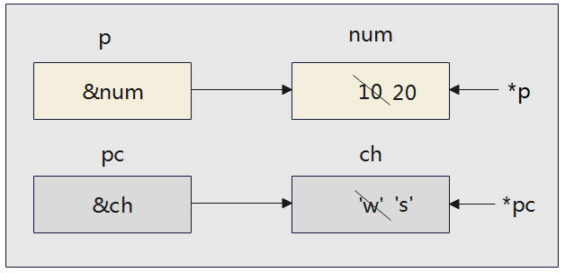

举例4：

定义指针变量 p1、p2，默认各自指向整数a、b，a、b从键盘输入。设计程序，使得 p1 指向其中的较大值，p2 指向其中的较小值 。

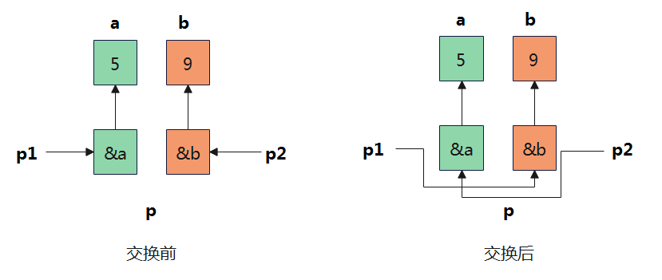

```c
int main() {

    int *p1, *p2, *p, a, b;
    printf("请输入两个整数: ");
    scanf("%d,%d", &a, &b);
    p1 = &a;
    p2 = &b;
    if (a < b) {
        p = p1;
        p1 = p2;
        p2 = p;
    }

    printf("输出p1、p2: ");
    printf("%d,%d\n", *p1, *p2);

    return 0;
}
```

举例5：已有代码如下：

```c
int a = 10;
int *p;
p = &a;
```

请看问题：

问题1：`&*p`的含义是什么?

- `“&”`和`“*”`两个运算符的优先级别相同，但按自右而左方向运算。因此，`&*p`与`&a`相同，即变量a的地址。
- 如果有`p1 = &*p; `它的作用是将`&a` (a的地址)赋给`p1` ，如果`p1`原来指向 b，经过重新赋值后它已不再指向b了，而指向了a。

问题2：`*&a`的含义是什么?

- 先进行`&a`运算，得a的地址，再进行`*`运算。`*&a`和`*p`的作用是一样的，它们都等价于变量a。即`*&a`与 a 等价。

### 2.3 指针的常用运算

指针本质上就是一个无符号整数，代表了内存地址。除了上面提到的取址运算外，指针还可以与整数加减、自增自减、同类指针相减运算等。但是规则并不是整数运算的规则。

#### 2.3.1 指针与整数值的加减运算

格式：`指针±整数`

指针与整数值的加减运算，表示指针所指向的内存地址的移动（加，向后移动；减，向前移动）。指针移动的单位，与指针指向的数据类型有关。**数据类型占据多少个字节，每单位就移动多少个字节。**

通过此操作，可以快速定位你要的地址。 

```c
short *s;
s = (short *) 0x1234;
printf("%hx\n", s + 1); //0x1236   复习：%hx ：十六进制 short int 类型
printf("%hx\n", s - 1); //0x1232

int *i;
i = (int *) 0x1234;
printf("%x\n", i + 1); //0x1238    复习：%x ：十六进制整数
```

说明：s + 1 表示指针向内存地址的高位移动一个单位，而一个单位的 short 类型占据两个字节的宽度，所以相当于向高位移动两个字节。

再比如：变量a、b、c、d和e都是整型数据int类型，它们在内存中占据一块连续的存储区域。指针变量p指向变量a，也就是p的值是0xFF12，则：

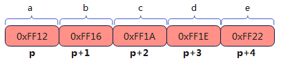

说明：指针p+1并不是地址+1，而是指针p指向数组中的下一个数据。比如，int *p，p+1表示当前地址+4，指向下一个整型数据。

举例1：

```c
int main() {

    int arr[5] = {1, 2, 3, 4, 5};
    int *p = &arr[1];
    printf("p的地址为：%p,对应的值为%d\n", p, *p); //p1的地址为：000000df21bff6e4,对应的值为2
    printf("p+1=的地址为：%p,对应的值为%d\n", p + 1, *(p + 1)); //p1+1=的地址为：000000df21bff6e8,对应的值为3
    printf("p-1=的地址为：%p,对应的值为%d\n", p - 1, *(p - 1)); //p1-1=的地址为：000000df21bff6e0,对应的值为1

    return 0;
}
```

> 注意：只有指向连续的同类型数据区域，指针加、减整数才有实际意义。

举例2：

对于长度是 N 的一维数组 a，当使用指针 p 指向其首元素后，即可通过指针 p 访问数组的各个元素。

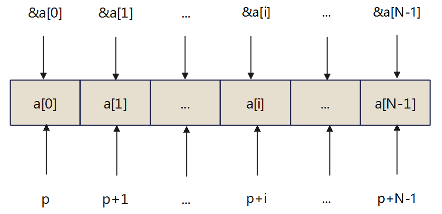

其中：

- `a[0]`用 `*p` 表示

- `a[1]`用`*(p+1)`表示

- `a[i]`用`*(p+i)`表示

遍历数组操作如下：

```c
#include <stdio.h>
#define LENGTH 5

int main() {

    int arr[LENGTH] = {10,20,30,40,50};

    //方式1：传统直接访问的方式
    for(int i = 0;i < LENGTH;i++){
        printf("%d ",arr[i]);
    }

    printf("\n");

    //方式2：使用指针访问
    int *p = &arr[0];
    for(int i = 0;i < LENGTH;i++){
        printf("%d ",*(p+i));
    }

    return 0;
}
```

#### 2.3.2 指针的自增、自减运算

指针类型变量也可以进行自增或自减运算，如下：

```c
p++ 、 p-- 、 ++p 、--p
```

++和--在运算符章节已经讲过，这里针对指针的增加或减少指的是内存地址的向前或向后移动。

针对于数组来说，由于数组在内存中是连续分布的。

- 当对指针进行++时，指针会按照它指向的数据类型字节数大小增加，比如 int * 指针，每 ++ 一次， 就增加4个字节。
- 当对指针进行--时，指针会按照它指向的数据类型字节数大小减少，比如 int \* 指针，每 -- 一次， 就减少4个字节。

举例1：

```c
int main() {
    int arr[5] = {1, 2, 3, 4, 5};
    int *p1 = &arr[0];
    int *p2 = &arr[3];
    printf("p1的值为：%d\n", *p1);        //1
    printf("++p1的值为：%d\n", *(++p1));  //2
    printf("p1的值为：%d\n", *p1);        //2

    printf("p1的地址为：%p\n", p1);      //00000055c0bff704
    printf("p1++的地址为：%p\n", ++p1);  //00000055c0bff708


    printf("p2的值为：%d\n", *p2);       //4
    printf("--p2的值为：%d\n", *(--p2)); //3
    printf("p2的值为：%d\n", *p2);       //3

    return 0;
}
```

举例2：请分析下面几种情况。

初始情况：

```c
int a[5] = {10,20,30,40,50};
```

情况1：

```c
int *p = a;  //p开始时指向数组a的首元素    等同于 int *p = &a[0];

p++; //使p指向下一元素a[1]
printf("%d\n",*p); //得到下一个元素a[1]的值，即20
```

情况2：

```c
int *p = a;  //p开始时指向数组a的首元素

printf("%d\n",*p++); //10   分析：由于++和*同优先级，结合方向自右而左，因此它等价于*(p++)
printf("%d\n",*p);   //20
```

拓展：

```c
*(p++); //先取*p值，然后使p自增1
*(++p); //先使p自增1，再取*p
```

拓展：如果 p 当前指向 a 数组中第 i 个元素a[i]，则：

```c
*(p--) //相当于a[i--]，先对p进行“*”运算，再使p自减
*(++p) //相当于a[++i]，先使p自加，再进行“*”运算
*(--p) //相当于a[--i]，先使p自减，再进行“*”运算
```

情况3：

```c
int *p = &a[2];  //p开始时指向数组a的第3个元素
printf("%d\n",*(p--)); //30
    
p = &a[2];
printf("%d\n",*(++p)); //40

p = &a[2];
printf("%d\n",*(--p)); //20
```

情况3：

```c
int *p = a;            //p开始时指向数组a的首元素
printf("%d\n",++(*p)); //11

/*
分析：表示p所指向的元素值加1，如果p=a, 则相当于++a[0]，若a[0]的值为10，则a[0]的值为11。
注意: 是元素a[0]的值加1，而不是指针p的值加1
*/
```

#### 2.3.3 同类指针相减运算

格式：`指针 - 指针`

相同类型的指针允许进行减法运算，返回它们之间的距离，即`相隔多少个数据单位（注意：非字节数）`。高位地址减去低位地址，返回的是正值；低位地址减去高位地址，返回的是负值。

返回的值属于 `ptrdiff_t` 类型，这是一个带符号的整数类型别名，具体类型根据系统不同而不同。这个类型的原型定义在头文件 stddef.h 里面。

举例1：

```c
int main() {

    short *ps1;
    short *ps2;
    ps1 = (short *) 0x1234;
    ps2 = (short *) 0x1236;
    ptrdiff_t dist = ps2 - ps1;
    printf("%d\n", dist); // 1   相差2个字节正好存放1个 short 类型的值。

    int *pi1;
    int *pi2;

    pi1 = (int *) 0x1234;
    pi2 = (int *) 0x1244;

    ptrdiff_t dist1 = pi2 - pi1;
    printf("%d\n",dist1);  //4   相差16个字节正好存放4个 int 类型的值。

    return 0;
}
```

举例2：

```c
int main() {
    int arr[5] = {1, 2, 3, 4, 5};
    int *p1 = &arr[0];
    int *p2 = &arr[3];
    printf("p1的地址为：%d\n", p1); //497022544
    printf("p2的地址为：%d\n", p2); //497022556
    printf("p2-p1=%d\n", p2 - p1); //3 等同于 (497022556 - 497022544)/4 ==> 3

    return 0;
}
```

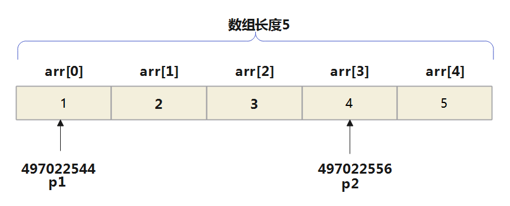

> 体会：两个指针相减，通常两个指针都是指向同一数组中的元素才有意义。结果是两个地址之差除以数组元素的长度。不相干的两个变量的地址，通常没有做减法的必要。

举例：

```c
int main() {

    int i = 10;
    int j = 20;
    int *p1 = &i;
    int *p2 = &j;

    ptrdiff_t dist = p1 - p2;
    printf("%d\n",dist);   //通常没有计算减法的必要

    return 0;
}
```

**非法：同类指针相加运算**

两个指针进行加法是`非法的`，所得结果是没有意义的。

```c
int i = 10,j = 20;
int *p1 = &i;
int *p2 = &j;
int *p3 = p1 + p2; //非法
```

#### 2.3.4 指针间的比较运算

指针之间的比较运算，比如 ==、!= 、<、 <= 、 >、 >=。比较的是各自的内存地址的大小，返回值是整数 1 （true）或 0 （false）。

举例：

```c
int arr[5] = {1, 2, 3, 4, 5};
int *p1 = &arr[0];
int *p2 = &arr[3];

printf("%d\n",p1 > p2);  //0
printf("%d\n",p1 < p2);  //1
printf("%d\n",p1 == p2); //0
printf("%d\n",p1 != p2); //1
```

练习：

```c
int main() {

    int arr[] = {10, 20, 30};
    int *ptr;
    ptr = arr;  //ptr指向arr首地址(第一个元素)
    if (ptr == arr[0]) { //错误,类型不一样
        printf("ok1\n");
    }
    if (ptr == &arr[0]) { // 可以
        printf("ok2\n"); //输出
    }
    if (ptr == arr) { //可以
        printf("ok3\n"); //输出
    }
    if (ptr >= &arr[1]) { //可以比较,但是返回false
        printf("ok4\n");//不会输出
    }

    if (ptr < &arr[1]) { //可以比较,返回true
        printf("ok5\n");//输出
    }

    return 0;
}
```


> 【华南理工大学2018研】若有说明：int \*p，m＝5，n；，以下正确的程序段是（　　）。
> A．
>
> ```c
> p=&n;  
> scanf("%d",n); 
> ```
>
> B．
>
> ```c
> p=&n;  
> scanf("%d",*p); 
> ```
>
> C．
>
> ```c
> scanf("%d",&n);  
> p=n 
> ```
>
> D．
>
> ```c
> p=&n;  
> *p=n; 
> ```
>
> 【答案】D
>
> 【解析】scanf语句中第二个参数应该是变量的地址，AB错误；C中p为指针变量，不可以直接把一个int型变量赋值给指针型，C错误；答案选D。


>  【华南理工大学2018研】若有定义：int \*p，\*s，c；，且各变量已正确赋值，则非法的赋值表达式是（　）。
>  A．p＝s
>  B．c＝\*s
>  C．*s＝&p
>  D．p＝&c
>
>  【答案】C
>
>  【解析】C中p为指针变量，则&p表示的是指针的地址，若要赋值，则左边变量应该是一个二级指针，而*s代表的是s所指向地址的变量值，这个变量是一个int型，显然不正确。


> 【中央财经大学2018研】有如下说明
>
> ```c
> int a[10]={1,2,3,4,5,6,7,8,9,10}, *p=a;
> ```
>
> 则数值为9的表达式是（　　）。
> A．\*p＋9
> B．\*(p＋8)
> C．*p += 9   
> D．p＋8
>
> 【答案】B
>
> 【解析】A中\*p＝1，\*p＋9＝10，A错误。C中*p得到的是1，加9后结果是10，C错误。D中p是地址，p＋8仍然表示一个地址。因此B项正确，p＋8指向元素9，进行取值得9。


## 3、野指针

### 3.1 什么是野指针

野指针：就是指针指向的位置是不可知（`随机性`，`不正确`，`没有明确限制的`）。

### 3.2 野指针的成因

#### ① 指针使用前未初始化

指针变量在定义时如果未初始化，`其值是随机的`，此时操作指针就是去访问一个不确定的地址，所以结果是不可知的。此时p就为野指针。

```c
int main() {
    int *p;
    printf("%d\n",*p);

    return 0;
}
```

在没有给指针变量显式初始化的情况下，一系列的操作(包括修改指向内存的数据的值)也是错误的。

```c
#include<stdio.h>
int main(){
	int* p;                       
	*p = 10;  
	
	return 0;
}
```

拓展：注意如下的赋值操作也是错误的

```c
int main() {
    int num = 10;
    int *p;
    p = num;

    return 0;
}
```

#### ② 指针越界访问 

```c
#include <stdio.h>

int main() {
    int arr[10] = {0};
    int *p = arr;
    for (int i = 0; i <= 10; i++,p++) {
        *p = i;                   //i=10时越界
    }
    return 0;
}
```

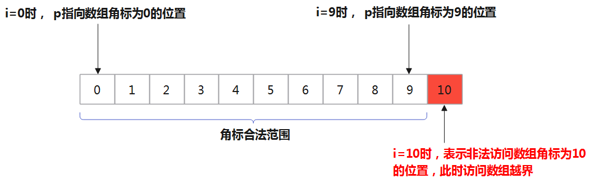

当i=10时，此时`*p`访问的内存空间不在数组有效范围内，此时`*p`就属于非法访问内存空间，p为野指针。

#### ③ 指针指向已释放的空间

```c
#include <stdio.h>

int *test() {
    int a = 10;
    return &a;          //&a=0x0012ff40
}

int main() {
    int *p = test();
    printf("%d", *p);
    return 0;
}
```

调用test函数将返回值赋给p，test函数的返回值是局部变量a的地址。由于a只在test函数内有效，出了test函数其内存空间就被释放，也就意味着`a的地址编号不存在`，若将其赋值给p，导致p获取到的地址是`无效`的。

如果短时间内再次利用这块地址，它的值还未被改变也就是0x0012ff40还存在，p的值为0x0012ff40，*p时还是10，可以打印出。

但如果在打印之前有其他函数调用了这块地址，这块地址的名称就会发生变化，不再是0x0012ff40，打印*p时不再为10。

总之，此时p为野指针。

### 3.3 野指针的避免

**1、指针初始化**

定义指针的时候，如果没有确切的地址赋值，为指针变量赋一个 NULL 值是好的编程习惯。即

```c
int *p = NULL;
```

> 赋为 NULL 值的指针被称为`空指针`，NULL 指针是一个定义在标准库 <stdio.h>中的值为零的常量 **#define NULL 0**

后面如果用到指针的话再让指针指向具有实际意义的地址，然后通过指针的取值符号(*)改变其指向的内容。

练习：

```c
#include<stdio.h>

int main() {
    int *p = NULL; //空指针不要与未初始化的指针混淆

    int b = 8;
    p = &b;   //显式赋值
    *p = 100;
    printf("%d\n", *p);  //100
    printf("%d\b", b);   //100

    return 0;
}
```

**2、小心指针越界**

**3、避免返回局部变量的地址**

**4、指针指向空间释放，及时置NULL**

```c
int a = 10;			
int* pa = &a;
printf("%d\n", *pa);
 
pa = NULL;				//把pa指针置成NULL
 
printf("%d\n",pa);
```

**5、指针使用之前检查有效性**

```c
if (pa != NULL){
	//进行使用
}

if (pa == NULL){
	//不进行使用
}
```


## 4、二级指针(多重指针)

一个指针p1记录一个变量的地址。由于指针p1也是变量，自然也有地址，那么p1变量的地址可以用另一个指针p2来记录。则p2就称为`二级指针`。

简单来说，二级指针即一个指针变量的值是另外一个指针变量的地址。通俗来说，二级指针就是指向指针的指针。

**格式：**

```
数据类型 **指针名;
```

举例1：

```c
int a = 10;
int *pa = &a;  //pa是一级指针
int **ppa = &pa; //ppa是二级指针，类型为int **
```

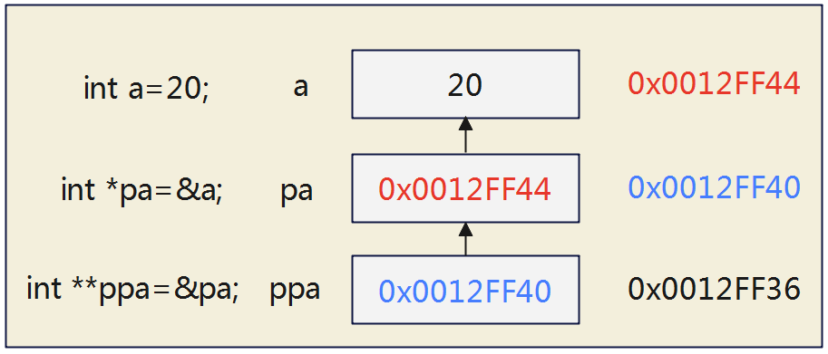

> 进而推理，会有int ***pppa = &ppa; 等情况，但这些情况一般不会遇到。

在上述代码基础上，

```c
int b = 20;
ppa = &b; //报错
```

将 ppa（类型为 `int **`，即二级指针）赋值为 &b，但 &b是一个 `int *` 类型的指针，而不是 `int **` 类型。这会导致类型不匹配的错误。

如果您想要将 ppa 指向 b，可以找一个额外的一级指针作为中介。如下操作：

```c
int b = 20;
int *pb = &b;     // 使用一级指针来指向b
ppa = &pb;        // 将ppa指向pb的地址，ppa是二级指针
```

举例2：

```c
int main() {
    int var = 3000;
    int *ptr = &var;        // 一级指针指向 var
    int **pptr = &ptr;      // 二级指针指向 ptr
    int ***ppptr = &pptr;   // 三级指针指向 pptr

    printf("Value of var: %d\n", var);
    printf("Value of ptr: %d\n", *ptr);         // 解引用一次
    printf("Value of pptr: %d\n", **pptr);      // 解引用两次
    printf("Value of ppptr: %d\n", ***ppptr);   // 解引用三次

    return 0;
}
```

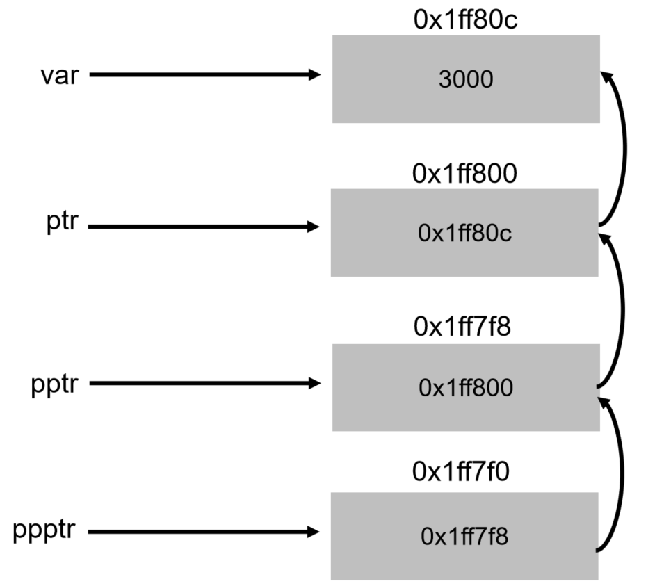

举例3：使用malloc()函数创建二维数组

malloc()函数用于动态分配堆内存，free()函数用于释放堆内存。这两个函数通常都是配合一起使用的。

```c
#include <stdio.h>
#include <stdlib.h>


int main() {
    int rows, cols;// 定义二维数组的行和列
    printf("第一维为：");
    scanf("%d", &rows);
    printf("第二维为：");
    scanf("%d", &cols);

    int **array = (int **) malloc(sizeof(int *) * rows);//先创建第一维
    for (int i = 0; i < rows; i++) {
        //在内层循环中动态创建第二维
        array[i] = (int *) malloc(sizeof(int) * cols);
        //
        for (int j = 0; j < cols; j++) {
            array[i][j] = 1;
            printf("%d　", array[i][j]);
        }
        printf("\n");
    }

    free(array);

    return 0;
}
```


## 5、专题：指针与数组

复习：


- "`*`"，也称为解引用符号，其`作用与&相反`。
- "`*`"，后面只能跟指针(即地址)或指针变量，"`&`"后面跟的是普通变量(包括指针变量)。

### 5.1 一维数组与指针

#### 5.1.1 指向一维数组的指针变量

所谓`数组元素的指针就是数组元素的地址`。可以用一个指针变量指向一个数组元素。

```c
int a[10]={2,4,6,8,10,12,14,16,18,20}; 
int *p; //定义p为指向整型变量的指针变量
p = &a[0]; //把a[0]元素的地址赋给指针变量p
```

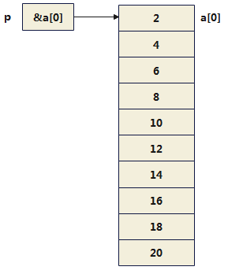

如下几个写法是等价的：

```c
int *p;
p = &a[0];  //千万不要写成*p = &a[0];，那就错了
```

```c
int *p = &a[0];
```

```c
int *p = a; //a不代表整个数组，所以这里不是将数组a赋给p。而代表数组元素a[0]的首地址。
```

注意：

因为数组名a保存的是`数组首元素a[0]的地址`，所以在scanf函数中的输入项如果是数组名，`不要再加地址符&`。

```c
int main() {
    char arr[10];
    scanf("%s", arr);  //arr前不应加 &

    puts(arr);

    return 0;
}
```

#### 5.1.2 使用指针访问数组的元素

如果指针变量p的初值为`&a[0]`，则：

- `p+i`和`a+i`就是数组元素`a[i]`的地址。或者说，它们指向a数组序号为i的元素。

- `*(p+i)`或`*(a+i)`是`p+i`或`a+i`所指向的数组元素的值，即a[i]的值。

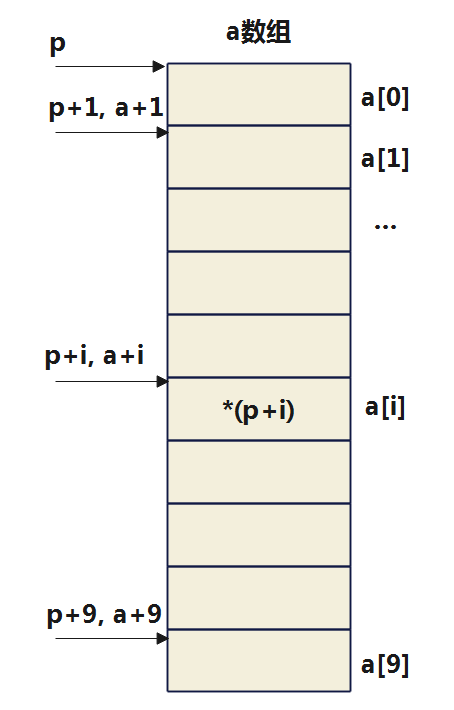

举例1：数组元素赋值、遍历

方式1：下标法

```c
#include <stdio.h>
#define N 5

int main() {
    int a[N];

    printf("请输入%d个整数：\n",N);
    for (int i = 0; i < N; i++)
        scanf("%d", &a[i]); //数组元素用数组名和下标表示

    for (int i = 0; i < N; i++)
        printf("%d ", a[i]);

    printf("\n");
    return 0;
}
```

方式2：

```c
#include <stdio.h>
#define N 5

int main() {
    int a[N];

    printf("请输入%d个整数：\n",N);
    for (int i = 0; i < N; i++)
        scanf("%d", &a[i]); //数组元素用数组名和下标表示

    for (int i = 0; i < N; i++)
        printf("%d ", *(a + i));

    printf("\n");
    return 0;
}
```

方式3：使用指针变量

```c
#include <stdio.h>

#define N 5

int main() {
    int a[N];
    int *p = a;
    printf("请输入%d个整数：\n", N);
    for (int i = 0; i < N; i++)
        scanf("%d", p + i);

    for (int i = 0; i < N; i++)
        printf("%d ", *(p + i));

    printf("\n");
    return 0;
}
```

或者

```c
#include <stdio.h>

#define N 5

int main() {
    int a[N];
    int *p = a;
    printf("请输入%d个整数：\n", N);
    for (int i = 0; i < N; i++)
        scanf("%d", p + i);

    for (p = a; p < (a + N); p++)
        printf("%d ", *p);

    printf("\n");
    return 0;
}
```

> 第(1)和第(2)种方法执行效率是相同的。C编译系统是将a[i]转换为*(a+i)处理的，即先计算元素地址。因此用第(1)和第(2)种方法找数组元素`费时较多`。
>
> 第(3)种方法比第(1)、第(2)种方法快，用指针变量直接指向元素，不必每次都重新计算地址，像p++这样的自加操作是比较快的。这种有规律地改变地址值(p++)能大大`提高执行效率`。但第(1)方法比较直观，适合初学者。

**思 考：**

可以通过改变指针变量p的值指向不同的元素。如果不用p变化的方法而用数组名a变化的方法（例如，用a++）行不行呢？ （不行）

```c
for(p = a;a < (p + N);a++)
	printf("%d",*a);
```

因为数组名a代表数组的首地址（或数组首元素的地址），它是一个指针型`常量`，它的值在程序运行期间是固定不变的。所以a++是无法实现的。必须将 a 的地址赋值给指针变量 p ，然后对 p 进行自增。

举例2：获取数组的最大值

```c
#include<stdio.h>
#define N 5

int main() {
    int a[N];
    int *p;
    p = a;
    printf("请输入%d个数据：\n", N);
    for (int i = 0; i < N; i++)
        scanf("%d", p + i);
    //获取最大值
    int max = *p;
    for (int i = 1; i < N; i++)
        if (max < *(p + i))
            max = *(p + i);
    printf("Max: %d\n", max);

    return 0;
}
```

#### 5.1.3 指针带下标的使用

指向数组元素的指针变量也可以带下标，如`p[i]`。p[i]被处理成`*(p+i)`，如果p是指向一个整型数组元素a[0]，则p[i]代表a[i]。但是必须弄清楚p的当前值是什么？**如果当前p指向a[3]，则p[2]并不代表a[2]，而是a[3+2]，即a[5]。**

举例：

```c
int main() {
    int a[5] = {10,20,30,40,50};
    int *p = a;

    //遍历数组元素
    for(int i = 0;i < 5;i++){
        printf("%d ",p[i]);
    }
    printf("\n");

    //注意：
    p++;
    printf("%d ",p[0]); //20

    return 0;
}
```

#### 5.1.4 &数组名

举例1：

```c
//复习
int main() {
    int arr[5] = {0};
    int *p = arr;
    printf("%p\n",p);  //000000000034fa50
	printf("%p\n",&p); //000000000037fbd8
    
    return 0;
}
```

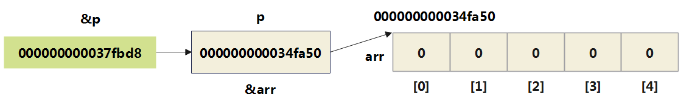

进一步思考：

```c
printf("%p\n", arr);  //000000000034fa50
printf("%p\n", &arr); //000000000034fa50
```

发现，`数组名` 和 `&数组名` 打印的地址是一样的。

举例2：

```c
#include <stdio.h>

int main() {
    int arr[5] = {0};
    printf("arr = %p\n", arr);        //000000cade5ff750
    printf("&arr= %p\n", &arr);       //000000cade5ff750
    printf("arr+1 = %p\n", arr + 1);    //000000cade5ff754
    printf("&arr+1= %p\n", &arr + 1);   //000000cade5ff764

    return 0;
}
```

&arr 理解为`数组的地址`，而不要理解为数组首元素a[0]的地址。

本例中 &arr 的类型是： int(*)[5] ，是一种数组指针类型。数组的地址+1，跳过整个数组的大小，所以 &arr+1 相对于 &arr 的差值是20。


> 【北京航空航天大学2018研】若有以下变量的声明语句：
>
> ```c
> int i = 1,a[] = {0,2,4}, *b;
> b = &i;
> ```
>
> 则下列选项中，其结果与表达式“\*(a＋1)”相等的是（　）。
> A．a[0]
> B．\*a＋i
> C．\*(a＋b)
> D．\*(a＋*b)
>
> 【答案】D
>
> 【解析】a指向数组的首元素，因此\*(a＋1) 表示取数组第二个元素的值，为2。A项，a[0]＝0，不相等；B项，\*a为数组第一个元素的值为0，再加上i＝1，因此结果为1，不相等；C项，a和b都是指针，相加没有意义，错误；D项，\*b的值i的值，即1，*(a＋1) 表示取数组第二个元素的值为2，相等，因此答案选D。


### 5.2 二维数组与指针

#### 5.2.1 使用数组名访问

设有一个二维数组 a 定义为：

```c
int a[3][4] = {{1, 2,  3,  4},
               {5, 6,  7,  8},
               {9, 10, 11, 12}};
```

二维数组 a，可视为三个一维数组：a[0]、a[1]、a[2]；而每个一维数组又是一维数组，分别由 4 个元素组成。首先，理解如下的操作：

```c
printf("%d\n",a[0][0]);  //二维数组中元素a[0][0]的值
printf("%p\n",&a[0][0]); //二维数组中元素a[0][0]的值对应的地址
printf("%p\n",a[0]);     //二维数组中a[0][0]的地址
printf("%p\n",a);        //二维数组中a[0]的地址
printf("%p\n",&a);       //二维数组a的地址
```

对应图示

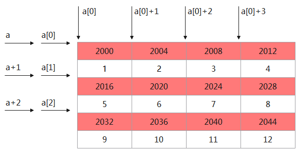

举例：

| 表示形式                         | 含义                                            | 地址        |
| -------------------------------- | ----------------------------------------------- | ----------- |
| `a`                              | 二维数组名，指向一维数组a[0]，<br>即0行起始地址 | 2000        |
| `&a[0][0],a[0],*a `              | 0行0列元素地址                                  | 2000        |
| `a[0][0],*(a[0]),**a`            | 0行0列元素`a[0][0]`的值                         | 1           |
| `&a[1],a+1`                      | 指向索引为1行的起始地址                         | 2016        |
| `&a[1][0],a[1],*(a+1)`           | 1行0列元素`a[1][0]`的地址                       | 2016        |
| `a[1][0],*(a[1]),*(*(a+1))`      | 1行0列元素`a[1][0]`的值                         | 5           |
| `&a[1][2],a[1]+2,*(a+1)+2`       | 1行2列元素`a[1][2]`的地址                       | 2024        |
| `a[1][2],*(a[1]+2),*(*(a+1)+2) ` | 1行2列元素`a[1][2]`的值                         | 是元素值，7 |

总结：

> ```
> &a:二维数组a的地址
> a: 二维数组中a[0]的地址
> a[0]:二维数组中a[0][0]的地址
> 
> 讨论：a[0][0]相关的
> a[0][0]的地址：&a[0][0],a[0],*a,
> a[0][0]的值： a[0][0],*(a[0]),**a,
> 
> 讨论：a[1]相关的
> a[1]的地址：&a[1],a + 1
> 
> 讨论：a[1][0]相关的
> a[1][0]的地址：&a[1][0],a[1],*(a+1)
> a[1][0]的值：a[1][0],*a[1],*(*(a+1))
> 
> 讨论：a[1][2]相关的
> a[1][2]的地址：&a[1][2],a[1]+2,*(a+1)+2
> a[1][2]的值：a[1][2],*(a[1]+2),*(*(a+1)+2)
> ```

> 注意：
>
> 如果 a 是二维数组，则 a[i]代表一个数组名， a[i]并不占内存单元，也不能存放a 数组元素值。它只是一个地址。所以：a、a+i、a[i]、\*(a+i)、\*(a+i)+j、a[i]+j 都是地址。

获取数组元素值的三种表示形式：

1） `a[i][j]` 下标法

2） `*(a[i]+j)` 用一维数组名

3） `*(*(a+i)+j)` 用二维数组名

#### 5.2.2 使用指针变量访问

设 p 是指针变量，若p 指向数组首元素，即`p = a[0];`，那`a[i][j]`的指针如何表示？

先看一个代码：

```c
int main() {
    int a[3][2] = {{10, 20},
                   {30, 40},
                   {50, 60}};

    int *p;
    p = &a[0][0];
    printf("%p\n", p);     //000000f2f49ff7b0
    printf("%p\n", p + 1); //000000f2f49ff7b4
    printf("%p\n", p + 2); //000000f2f49ff7b8

    int *q;
    q = a[0];
    printf("%p\n", q);      //000000f2f49ff7b0
    printf("%p\n", q + 1);  //000000f2f49ff7b4
    printf("%p\n", q + 2);  //000000f2f49ff7b8

    int *r;
    r = a;  //代码片段1
    printf("%p\n", r);      //000000f2f49ff7b0
    printf("%p\n", r + 1);  //000000f2f49ff7b4
    printf("%p\n", r + 2);  //000000f2f49ff7b8

    return 0;
}
```

进而：

- p+j 将指向 a[0] 数组中的元素 `a[0][j]`。

- 对于二维数组`a[M][N]`来讲，由于 a[0]、a[1]、... 、a[M-1]等各行数组在内存中是依次连续存储，则对于 a 数组中的任一元素 `a[i][j]`：
  - 地址表示：`p+i*N+j`
  - 值表示：`*(p+i*N+j)`、`p[i*N+j]`

> 注意：上述代码中，代码片段1中的赋值操作会存在类型不匹配的情况，我们在5.6节中展开说明。

举例1：

```c
int b[4][3] = {{10, 20, 30},
               {40, 50, 60},
               {70, 80, 90},
               {100, 110, 120}};

int *p = b[0];
```

则：元素 `b[1][2]`对应的地址/指针、元素值为：

```c
printf("b[1][2]对应的地址/指针为：%p\n",p+1*3+2);
printf("b[1][2]对应的值为：%d\n",*(p+1*3+2));
printf("b[1][2]对应的值为：%d\n",p[1*3+2]);
```

举例2：用指针访问二维数组，求二维数组元素的最大值。

```c
#include <stdio.h>

#define ROWS 3
#define COLS 4

int main() {
    int a[ROWS][COLS] = {{10,  20,  30,  40},
                   {50,  60,  70,  80},
                   {120, 110, 100, 90}};

    //方式1：
//    int max = a[0][0];
//    for (int i = 0; i < ROWS; i++) {
//        for (int j = 0; j < COLS; j++) {
//            if (max < a[i][j]) {
//                max = a[i][j];
//            }
//        }
//    }

    //方式2：
    int *p = a[0];
    int max;
    for (int i = 0; i < ROWS; i++) {
        for (int j = 0; j < COLS; j++) {
            if (max < *(p + i * COLS + j)) {
                max = *(p + i * COLS + j);
            }
        }
    }
    printf("max=%d\n", max);

    //方式3：
    int *q, max1;
    for (q = a[0], max1 = *q; q < a[0] + ROWS * COLS; q++)
        if (max1 < *q)
            max1 = *q;
    printf("Max=%d\n", max1);


    return 0;
}
```

### 5.3 指针数组

#### 5.3.1 数组指针 vs 指针数组

**数组指针：**

当指针变量里存放一个数组的首地址时，此指针变量称为指向数组的指针变量，简称`数组指针`。

数组指针是指针？还是数组？

```
答案是：指针。
```

整型指针： int * pint; 能够指向整型数据的指针。

浮点型指针： float * pf; 能够指向浮点型数据的指针。

数组指针：能够指向数组的指针。

**指针数组：**

数组是用来存放一系列相同类型的数据，当然数组也可以用来存放指针，这种用来`存放指针的数组`被称为指针数组，它要求存放在数组中指针的`数据类型必须一致`。

问题：指针数组是指针还是数组？

```
答案：是数组。是存放指针的数组。
```

#### 5.3.2 指针数组的使用

格式：

```c
数据类型 *指针数组名[大小];
```

举例1：

```c
int *arr[5];
```

arr是一个数组，有5个元素，每个元素是一个整型指针，需要使用下标来区分。

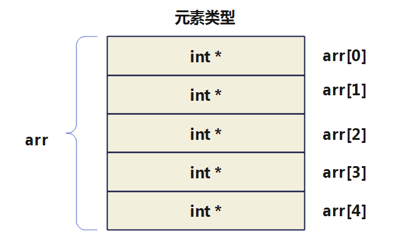

举例2：

```c
int main() {
    int a, b, c, d, e;
    a = 1;
    b = 2;
    c = 3;
    d = 4;
    e = 5;
    int *arr[] = {&a, &b, &c, &d, &e};//定义一个int类型的指针数组

    for(int i = 0;i < 5;i++){
        printf("%d ",*arr[i]);
    }

    return 0;
}
```

举例3：

```c
#include <stdio.h>

int main() {
    int line1[] = {1, 2, 3, 4};         //声明数组，矩阵的第一行
    int line2[] = {5, 6, 7, 8};         //声明数组，矩阵的第二行
    int line3[] = {9, 10, 11, 12};         //声明数组，矩阵的第三行
    int *p_line[3];              //声明整型指针数组
    p_line[0] = line1;           //初始化指针数组元素
    p_line[1] = line2;
    p_line[2] = line3;
    printf("矩阵:\n");
    for (int i = 0; i < 3; i++) {      //对指针数组元素循环

        for (int j = 0; j < 4; j++) {    //对矩阵每一列循环
            printf("%d\t", p_line[i][j]); //或改为printf("%d\t", *(p_line[i] + j));
        }
        printf("\n");
    }
    return 0;
}
```

运行结果：


### 5.4 字符数组 vs 字符指针变量

一个字符串，可以使用`一维字符数组`表示，也可以使用`字符指针`来表示。

- 字符数组由若干个元素组成，每个元素放一个字符
- 字符指针变量中存放的是地址（字符串/字符数组的首地址），绝不是将字符串放到字符指针变量中。

举例1：

```c
char str[] = "hello tom";  //使用字符数组

char * pStr = "hello tom";  //使用字符指针
```

图示：

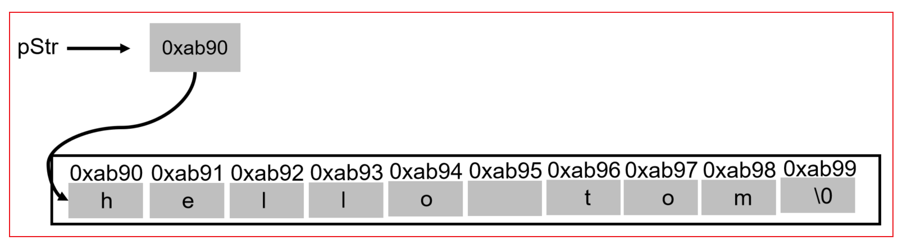

**两种方式的对比：**

对已声明好的字符数组，只能一一对各个元素赋值，不能用以下错误方法对字符数组赋值

```c
char str[14];

str[0] = 'i'; //正确

str = "hello Tom"; //错误
```

对字符指针变量，采用如下方式赋值是可以的。

```c
char * pStr = "hel";

pStr = "hello tom"; //正确
```

图示：

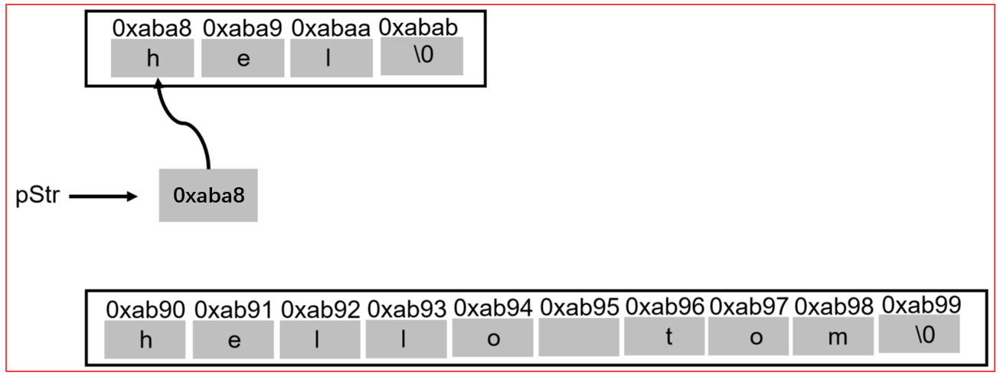

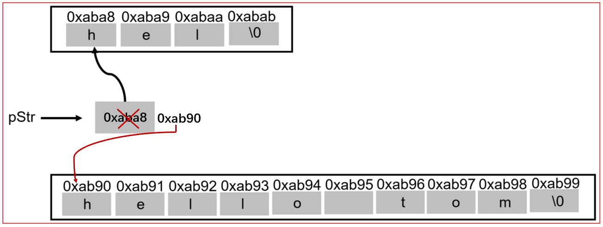

> 一个字符数组，因为它有确定的内存地址，所以字符数组名是一个`常量`。而定义一个字符指针变量时，它在指向某个确定的字符串数据的情况下，也可以多次`重新赋值`。

举例2：体会字符串字面量的不可变性

情况1：针对于整型数组、整型指针变量

```c
int main() {
    int arr[10] = {1, 2, 3, 4, 5, 6, 7, 8, 9, 10};

    int *p = arr;

    printf("%d\n", p[1]); //2

    p[1] = 50;
    printf("%d\n", p[1]); //50
    printf("%d\n", arr[1]);  //50

    //
    int num = 30;
    p = &num;
    printf("%d\n",*p);    //30
    printf("%d\n",p[0]);  //30

    return 0;
}
```

情况2：针对于字符数组、字符指针变量

```c
int main() {
    
    char arr[] = "hello";

    arr[1] = "m";    	//运行时错误 
    printf("%s\n",arr);

    return 0;
}
```

因为字符串字面量存储在只读内存区域，是不可变的，不能修改其值。

拓展：

```c
int main() {
    char *pStr = "hello";
    pStr = "hello tom"; //正确

    pStr[1] = 'm';      //运行时错误
    printf("%s\n",pStr);

    return 0;
}
```

### 5.5 字符串数组的表示

字符串可以使用一维字符数组或字符指针变量等两种方式表示，那么字符串数组如何表示呢？

如果一个数组的每个成员都是一个字符串，则构成了字符串数组。字符串数组有两种表示方式：`① 二维字符数组` ；`②字符指针数组`。

举例1：

方式1：使用二维字符数组

```c
char fruit[][7]={"Apple","Orange","Grape","Pear","Peach"};  //上一章5.6节举例4
```

```c
char weekdays[7][10] = {   //行数7也可以省略
	"Monday",
	"Tuesday",
	"Wednesday",
	"Thursday",
	"Friday",
	"Saturday",
	"Sunday"
};
```

字符串数组，一共包含7个字符串，所以第一维的长度是7。其中，最长的字符串的长度是10（含结尾的终止符 \0 ），所以第二维的长度统一设为10。

**思考：** 数组的第二维，长度统一定为10，有点浪费空间，因为大多数成员的长度都小于10。解决方法就是把数组的第二维，从字符数组改成字符指针。

方式2：使用字符指针数组

```c
char* weekdays[7] = {  //7也可以省略
  "Monday",
  "Tuesday",
  "Wednesday",
  "Thursday",
  "Friday",
  "Saturday",
  "Sunday"
};
```

上面的字符串数组，其实是一个一维数组，成员就是7个字符指针，每个指针指向一个字符串（字符数组）。

类似的：定义表示颜色的指针数组 colors，存储“red”、“yellow”、“blue”、“white”、“black” 5 种颜色。

```c
char *colors[5] = {"red", "yellow", "blue", "white", "black"};
```

**遍历字符指针数组：**

```c
for (int i = 0; i < 7; i++) {
	printf("%s\n", weekdays[i]);
}
```

举例2：

请编写程序，定义一个字符指针数组，用来存储四大名著的书名， 并通过遍历该指针数组，显示字符串信息 ， (即：定义一个指针数组，该数组的每个元素，指向的是一个字符串)

方式1：二维字符数组

```c
int main() {

    char books[4][13] = {"三国演义", "西游记", "红楼梦", "水浒传"};
    int len = 4;
    for(int i = 0;i < len;i++){
        printf("books[%d] : %s\n",i,books[i]);
    }

    return 0;
}
```

方式2：字符指针数组

```c
int main() {
    //定义一个指针数组，该数组的每个元素，指向的是一个字符串
    char *books[] = {
            "三国演义",
            "西游记",
            "红楼梦",
            "水浒传",
    };

    //遍历
    int len = 4;
    for (int i = 0; i < len; i++) {
        printf("books[%d] : %s\n", i, books[i]);
    }

    return 0;
}
```


### 5.6 拓展：指向固定长度数组的指针变量

定义一个整型指针变量指向一维数组，一维数组的每个元素包含 m 个元素。

定义格式：

```
(*标识符)[一维数组元素个数];
```

例如：定义一个指针变量 p，它指向包含有 4 个元素的一维数组。

```
int (*p)[4];
```

> 说明：p先和*结合，说明p是一个指针变量，指向一个大小为4的整型数组。
>
> 注意：此时定义的是一个指针变量，并非是一个指针数组。(*p 必须放在括弧内，否则就变成了定义指针数组。)

由于 p 是指向有 4 个整型元素的一维数组的指针变量，因此，p+1 是将地址值加上 4*4，即指向下一个一维数组。

举例：

```c
int a[3][4] = {{1, 2,  3,  4},
               {5, 6,  7,  8},
               {9, 10, 11, 12}};
int (*q)[4];
q = a;
```

则：

`q` 为二维数组第 0 行首地址，与 `a` 相同；

`q+1` 为二维数组第 1 行首地址，与 `a+1`相同；

`q+2` 为二维数组第 2 行首地址，与 `a+2`相同；

`*(q+i)`为二维数组第 i 行第 0 列元素的地址，与`*(a+i)`相同；

`*(q+i)+j `为二维数组第 i 行第 j 列元素的地址，与`*(a+i)+j` 相同；

`*(*(q+i)+j) `为二维数组第 i 行第 j 列元素值，与`*(*(a+i)+j)`相同，即 `a[i][j]`。

举例：

```c
int main() {
    int arr[3][4] = {{1, 2,  3,  4},
                     {5, 6,  7,  8},
                     {9, 10, 11, 12}};
    int (*q)[4];
    q = arr;

    printf("arr[0]的地址为：%p\n", arr);            //0000006460dffb40
    printf("arr[0]的地址为：%p\n", q);              //0000006460dffb40
    printf("arr[0][1]的地址为：%p\n", *arr + 1);    //0000006460dffb44
    printf("arr[0][1]的地址为：%p\n", *q + 1);      //0000006460dffb44
    printf("arr[0][1]的地址为：%p\n", arr[0] + 1);  //0000006460dffb44
    printf("arr[0][1]的地址为：%p\n", q[0] + 1);    //0000006460dffb44

    printf("arr[1]的地址为：%p\n", arr + 1);       //0000006460dffb50
    printf("arr[1]的地址为：%p\n", q + 1);         //0000006460dffb50

    printf("arr[1][0]的值为：%d\n", *(*(arr + 1))); //5
    printf("arr[1][0]的值为：%d\n", *(*(q + 1)));   //5
    printf("arr[1][1]的值为：%d ", *(*(q + 1) + 1));//6

    //遍历arr[0]中的几个元素
    for (int i = 0; i < 4; i++) {
        printf("%d ", *(*q + i)); //输出1 2 3 4
    }
    printf("\n");

    return 0;
}
```


>【华南理工大学2018研】若有以下说明：
>
>```c
>int w[3][4]={{0,1},{2,4},{5,8}};
>int (*p)[4]=w;
>```
>
>则数值为4的表达式是（　）。
>A．\*w[1]＋1
>B．p++，*(p＋1)
>C．w\[2][2]
>D．p\[1][1]
>
>【答案】D
>
>【解析】A中\*w[1]表示的是数值2，则表达式的值为3，错误；B中p++表示指向二维数组第二行w[1]的地址，而*(p＋1)代表的是第三行w\[2][0]元素的地址，B错误；C中表示的是数值0，答案选D。

 <p id = "第06章_函数"></p> 

# 第06章_函数

## 本章专题脉络

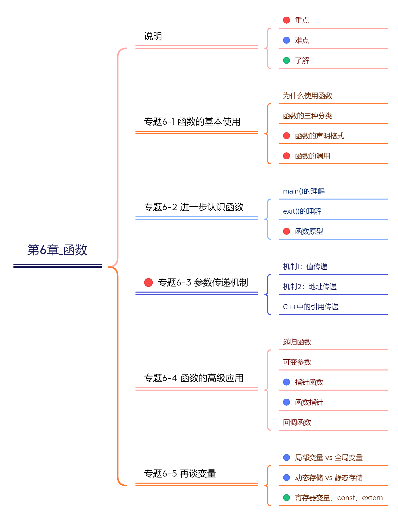

## 1、函数的基本使用

### 1.1 为什么需要函数


《街霸》游戏中，每次人物出拳、出脚或跳跃等动作都需要编写50-80行的代码，在每次出拳、出脚或跳跃的地方都需要`重复地编写`这50-80行代码，这样程序会变得`很臃肿`，可读性也非常差。为了解决代码重复编写的问题，可以将出拳、出脚或跳跃的`代码提取`出来放在一个{}中，并为这段代码起个名字，这样在每次的出拳、出脚或跳跃的地方通过这个名字来调用这个{}的代码就可以了。

> 提取出来的代码可以看作是程序中定义的一个`函数`，程序在需要出拳、出脚或跳跃时调用该函数即可。

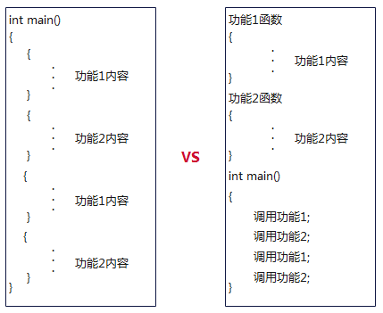

- 将特定功能的代码封装为函数的好处：`实现代码重用，减少冗余，简化代码`。

- 一个C源程序可以由一个或多个源文件构成（C文件扩展名是“.c”），一个源文件是一个编译单位。一个源文件可以由若干个函数构成，函数之间可以相互调用。也就是说，`函数是C程序基本的组成单位`。

  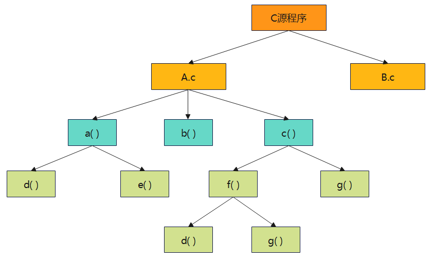

> 练习：
>
> C语言主要是借助以下（　　）功能来实现程序模块化的。
> A．定义函数
> B．定义常量和外部变量
> C．三种基本结构语句
> D．丰富的数据类型
>
> 【答案】A
>
> 【解析】C程序的模块化主要通过函数来实现。C语言允许对函数单独进行编译，从而可以实现模块化。

### 1.2 函数的分类

**角度1：从程序执行的角度看**

- 主函数：main()函数
- 子函数：非main()函数

每个C应用程序只有一个，且必须有一个main()主函数。无论主函数写在什么位置，C程序总是从main()函数开始执行。main()函数可以调用其它的子函数，子函数之间可以相互调用任意多次。

**角度2：是否允许源文件外调用角度看**

- 内部函数
- 外部函数

**角度3：从用户使用的角度看**

`① 库函数(或标准函数)`

它是由C系统提供的，用户不必自己定义，可直接使用它们。注意，不同的C语言编译系统提供的库函数的数量和功能会有一些不同，但是一些基本的函数是共同的。比如：

- 字符串操作函数
- 字符操作函数
- 时间/日期函数
- 数学函数
- IO函数
- 内存操作函数
- 其它库函数

> 使用库函数，必须包含 `#include` 对应的头文件。

`② 用户自己定义的函数`

它是用以解决用户特定业务需求的函数。

### 1.3 函数的声明格式

**函数定义的格式：**

```
返回值类型 函数名(数据类型1 形参1,数据类型2 形参2,…,数据类型n 形参n){
	函数体;
}
```

**举例：**

```c
//计算两个整数的和，并返回
int add(int m,int n) {
	return m + n;
}
```

```c
//计算两个整数的较大值，并返回
int max(int a, int b){  //定义函数max()
    int c;
    c = a > b ? a : b;     //求a,b两个数的最大值，赋给c
    return c;     //将最大值返回
}
```

```c
void printMax(int x,int y){
	int z;
    z = x > y ? x : y;     //求x,y两个数的最大值，赋给z
    printf("%d\n",z);
}
```

**具体说明：**

`1) 返回值类型`

函数调用后，是否需要在主调函数(比如main()函数)中得到一个确定的、返回的值，针对这个返回值的描述，就是返回值类型。返回值常常是一个计算的结果，或是用来作为判断函数执行状态(完成还是出错)的标记。

函数按是否有返回值来分类的话，分为：

- `无返回值的类型`：针对函数无返回值或明确不需返回值的情况，使用 `void` (即空类型)表示。
  - 举例：输出函数 void printf(const char *format, ...)。
- `有返回值的类型`：指明具体的类型。比如， int、float、char 等。如果省略，默认为int类型。
  - 有返回值类型，则需要在函数体内与“`return 返回值`”搭配使用。返回值需要与返回值类型一致。
  - 举例：int rand()，调用后返回一个随机整数

```c
#include <stdio.h>
#include <stdlib.h>

void printHello() {
    printf("Hello!\n");
}

int getRandomNumber() {
    return rand() % 100;
}

//在main()中调用printHello()、getRandomNumber()，相对于这两个方法，main()称为主调函数
int main() { 
    //调用printHello()
    printHello();
    
    //调用getRandomNumber()
    int randomNumber = getRandomNumber();
    printf("Random number: %d\n", randomNumber);
    
    return 0;
}
```

> 特殊的：如果返回值类型非 void，但被调函数中没有 return 语句，函数会返回一个不确定的值。

```c
int test(){
    printf("hello");
    //return 12;
}

int main(){
    int i = test();
    printf("%d\n",i);
    return 0;
}
```

运行结果：

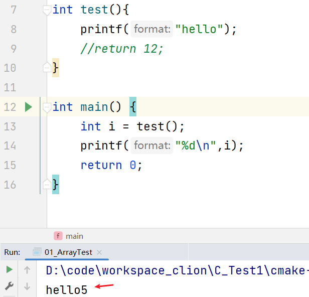

`2) 函数名`

函数名，属于标识符。要遵循标识符的命名规则，同时要`见名知意`，以增强程序的可读性。

`3) 参数列表`

函数名后面的圆括号里面，可以声明参数的类型和参数名。表示完成函数体功能时需要外部提供的数据列表。

根据是否有参数，函数可以分为：

- `无参函数`，在调用无参函数时，主调函数不向被调用函数传递数据。但函数名后的()不能省略。
  - 举例：abort()：立即终止程序的执行，不接受任何形参。
- `有参函数`，在调用函数时，主调函数在调用被调用函数时，通过参数向被调用函数传递数据。
  - 函数参数为多个参数时，其间用逗号隔开。
  - 举例：add(int m,int n)，strcmp(const char *str1, const char *str2)

```c
//打印5行6列的*型矩形
void print(){
    for(int i = 0;i < 5;i++){
        for(int j = 0;j < 6;j++){
            printf("*");
        }
        printf("\n");
    }
}

//打印m行n列的*型矩形
void printGraph(int m,int n){
    for(int i = 0;i < m;i++){
        for(int j = 0;j < n;j++){
            printf("*");
        }
        printf("\n");
    }
}

int main() {
//    print();

    printGraph(5,10);
}
```

`4) 函数体`

函数体要写在大括号{}里面，是函数被调用后要执行的代码。

对于调用者来说，不了解函数体如何实现的，并不影响函数的使用。

`5) 关于return 语句`

- return语句的作用：① 结束函数的执行 ②将函数运算的结果返回。
- return语句后面就不能再写其它代码了，否则会报错。(与break、continue情况类似)
- 下面分两种情况讨论：
  - 情况1：返回值类型不是void时，函数体中必须保证一定有 `return 返回值; `语句，并且要求该返回值结果的类型与声明的返回值类型一致或兼容。
  - 情况2：返回值类型是void时，函数体中可以没有return语句。如果要用return语句提前结束函数的执行，那么return后面不能跟返回值，直接写`return;` 就可以。

```c
#include <stdio.h>

int addInt(int m ,int n){
    int sum = m + n;
    return sum;
}

double addDouble(double d1,double d2){
    double sum = d1 + d2;
    return sum;
}

void printNum(int start,int limit){
    for(int i = start;i <= limit;i++){
        if(i % 5 == 0){
            return;
            //printf("今天买彩票，一定能中奖");
        }
        printf("i = %d\n", i);
    }
	printf("over!\n", i);
}

int main() {

    int result = addInt(10,20);
    printf("result = %d\n",result);

    printNum(1,20);
}
```

**类比举例：**


### 1.4 声明注意事项

1、C程序中的所有函数都是互相独立的。一个函数并不从属于另一个函数，即函数不能嵌套定义。

```c
//错误演示
int func1(int a,int b){   //第1个函数的定义
    ...
    int func2(int c,int d){    //第2个函数的定义
       ...
    }
    ...
}
```

2、同一个程序中函数不能重名，`函数名用来唯一标识一个函数`。即在标准的 C 语言中，并不支持函数的重载。

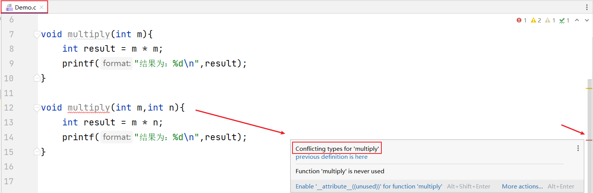

`什么是函数的重载？`

函数的重载是一种编程语言特性，像C++、Java等语言都支持。它允许在同一个作用域内(比如同一个"类"中)定义多个`函数名相同`但`参数列表不同`(即参数个数不同或参数类型不同)的函数。此时的多个函数彼此构成重载。

调用时，编译器会根据传递的参数类型和数量来确定调用哪个函数。

如果想在 C 中模拟函数的重载有两种方式。不过，都不如 C++ 中的函数重载那样灵活和方便。

- 方式1：使用不同的函数名来区分不同的函数
- 方式2：为函数添加后缀来表示不同的版本。

```c
void multiply(int m){
    int result = m * m;
    printf("结果为：%d\n",result);
}

void multiply1(int m,int n){
    int result = m * n;
    printf("结果为：%d\n",result);
}
```


>  【华南理工大学2018研】在C语言中，当函数的返回值缺省时，表示该函数返回值的类型是（　　）。
>  A．char
>  B．float
>  C．long
>  D．int
>
>  【答案】D
>
>  【解析】在C语言中，当函数的返回值缺省时，函数返回值的类型默认为int型。


> 【华南理工大学2018研】以下叙述中不正确的是（　）。
> A．在不同的函数中可以使用相同名字的变量
> B．函数中的形式参数是局部变量
> C．在一个函数内定义的变量只能在本函数范围内有效
> D．在一个函数的复合语句中定义的变量在本函数范围内有效
>
> 【答案】D
>
> 【解析】在一个函数的复合语句中定义的变量只在该复合语句中有效。

```c
void func(){
    int i = 10;
    
    {
        int j = 10;
        //
    }
    //不能调用j
}
```


> 【四川大学2017研】已定义如下函数：
>
> ```c
> fun(int *p){
> 	return *p;
> }
> ```
>
> 该函数的返回值是（　　）。
>
> A．不确定的值
> B．形参p中存放的值
> C．形参p所指存储单元中的值
> D．形参p的地址值
>
> 【答案】C
>
> 【解析】p是一个指向int型的指针变量，*p表示的是p所指向内存存放的变量，是一个int型，所以return *p表示返回p所指存储单元中的值，答案选C。


> 【华南理工大学2018研】下列函数的功能是（　）。
>
> ```c
> int fun1(char *x) {
> 	char *y = x;
> 	while (*y++);
> 	return (y - x - 1);
> }
> ```
>
> A．求字符串的长度
> B．比较两个字符串的大小
> C．将字符串X复制到字符串Y
> D．将字符串X连接到字符串Y后
>
> 【答案】A
>
> 【解析】while后面的表达式是指针依次遍历直到碰到\0，此时y指向字符串最后一个元素的后一个位置，但是由于y++，因此y会继续后移一位，而x指向字符串的头部，后面的y－x－1显然是用于计算字符串的长度。


### 1.5 函数的调用

调用函数时，需要传入实际的参数值。如果没有参数，只要在函数名后面加上圆括号就可以了。

举例1：

函数的声明

```c
void func() {
    printf("这是我的第一个函数！\n");
}
```

函数的调用

```c
int main() {
    func();
    
    //func(10);     // 报错
	//func(10,20);  // 报错
    
    return 0; //程序正常结束，默认返回0
}
```

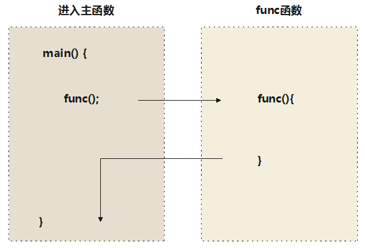

举例2：

```c
void func(int x, int y) {
    int sum = x + y;
    printf("x+y=%d\n", sum);
}

int main() {
    func(3, 5);
    
    return 0;
}
```

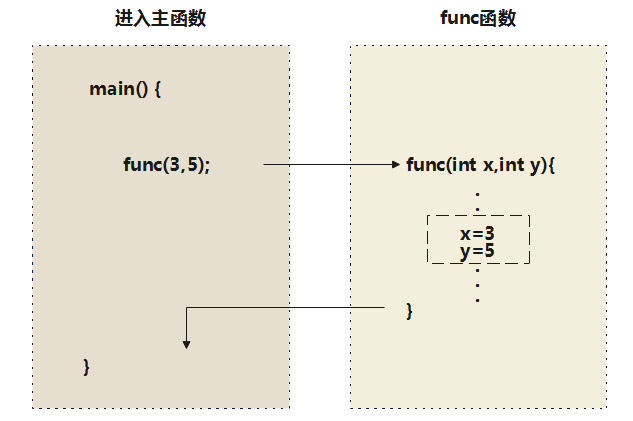

举例3：

```c
int func(int x, int y) {
    return x + y;
}

int main() {
    int sum = func(3, 5);
    printf("x+y=%d\n", sum);
    
    return 0;
}
```

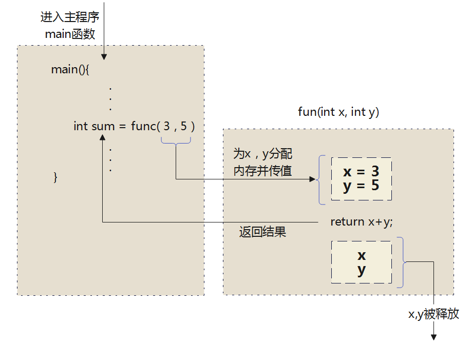

> 说明：
>
> 1、调用时，参数个数必须与函数声明里的参数个数一致，参数过多或过少都会报错。
>
> 2、函数间可以相互调用，但不能调用main函数，因为main函数是被操作系统调用的，作为程序的启动入口。反之，main() 函数可以调用其它函数。
>
> 3、函数的参数和返回值类型，会根据需要进行自动类型转换。
>
> ```c
> void func(int num){
> 	printf("%d\n",num);
> }
> 
> char func1() {
> 	int a = 65;
>  return a;  //变量a的类型由int自动转换为char了。
> }
> 
> 
> 
> int main() {
> 	//函数体
> 	short b = 10;
> 	func(b);
> 
> 	char c = func1();
> 	printf("%c\n",c);
> }
> ```

### 1.6 练习

练习1：

① 编写程序，声明一个print1()函数，在函数中打印一个`10*8的*型矩形`。

② 编写程序，声明一个print2()函数，除打印一个`10*8的*型矩形`外，再计算该矩形的面积，并将其作为函数返回值。

③ 编写程序，声明一个print3()函数，函数提供m和n两个参数，函数中打印一个`m*n的*型矩形`，并计算该矩形的面积， 将其作为返回值。

```c
void print1(){
    for(int i = 0;i < 10;i++){
        for(int j = 0;j < 8;j++){
            printf("* ");
        }
        printf("\n");
    }
}
```

```c
int print2(){
    for(int i = 0;i < 10;i++){
        for(int j = 0;j < 8;j++){
            printf("* ");
        }
        printf("\n");
    }
    return 10 * 8;
}
```

```c
int print3(int m,int n){
    for(int i = 0;i < m;i++){
        for(int j = 0;j < n;j++){
            printf("* ");
        }
        printf("\n");
    }
    return m * n;
}
```

练习2：定义函数max()，求两个double型变量的最大值，求三个double型变量的最大值

```java
#include <stdio.h>

double dualMax(double x, double y) {
    return x > y ? x : y;
}

double triMax(double x, double y, double z) {
    return dualMax(dualMax(x, y), z);  //嵌套调用
}

int main() {
    double a, b, c;
    printf("a,b,c: ");
    scanf("%lf,%lf,%lf", &a, &b, &c);
    printf("%.2lf和%.2lf的最大值是：%.2lf\n",a,b,dualMax(a, b));
    printf("%.2lf、%.2lf、%.2lf的最大值是：%.2lf\n",a,b,c,triMax(a,b,c));

    return 0;
}
```

练习3：定义求和函数getSum，求 1+2+…+n，并返回结果

```c
#include<stdio.h>

int getSum(int n) {
    int sum = 0;
    for (int i = 1; i <= n; i++) {
        sum += i;
    }
    return sum;
}

int main() {
    int n = 100;
    int result = getSum(n);

    printf("1+2+...+%d = %d\n", n, result);
}
```

练习4：哥德巴赫猜想

任一大于 2 的偶数都可写成两个素数之和。利用判断素数的函数 prime()验证哥德巴赫猜想。

```java
#include <stdio.h>

#include <math.h>

int prime(int n) {  //判断素数函数

    for (int i = 2; i <= sqrt(n); i++) {
        if (n % i == 0)
            return 0;
    }

    return 1;
}

int main() {
    int num;
    printf("请输入一个大于2的偶数：");
    scanf("%d", &num);
    for (int i = 2; i <= num / 2; i++) {
        if (prime(i) && prime(num - i)) {
            printf("%d = %d + %d\n", num, i, num - i);
            break;
        }
    }
    return 0;
}
```

练习5：

编写一组函数，用于处理日期和时间相关的操作。使用这些函数，可以进行日期和时间相关的计算。

① 编写一个函数 `char *getWeekName(int week)`，该函数接收一个代表星期的整数（1表示星期一，7表示星期日），并返回相应的星期名称。如果输入无效，则返回空字符串。

② 编写一个函数 `char *getMonthName(int month)`，该函数接收一个代表月份的整数（1表示一月，12表示十二月），并返回相应的月份名称。如果输入无效，则返回空字符串。

③ 编写一个函数 `int isLeapYear(int year)`，该函数接收一个年份，并检查它是否为闰年。如果是闰年，则返回1，否则返回0。如果输入年份为负数，则返回-1作为错误标志。

提示：能被4整除但不能被100整除，或者能被400整除的年份，即为闰年。

④ 编写一个函数 `int getTotalDaysOfMonth(int year, int month)`，该函数接收一个年份和月份，并返回指定月份的总天数。如果输入无效，则返回-1作为错误标志。

⑤ 编写一个函数 `int getTotalDaysOfYear(int year)`，该函数接收一个年份，并返回指定年份的总天数。如果输入无效，则返回-1作为错误标志。

模板：

```c
// 函数：getWeekName
// 描述：根据输入的星期数，返回相应的星期名称
// 参数：week - 代表星期的整数（1表示星期一，7表示星期日）
// 返回值：返回表示星期名称的字符串，如果输入无效则返回空字符串
char *getWeekName(int week) {
    
}

// 函数：getMonthName
// 描述：根据输入的月份数，返回相应的月份名称
// 参数：month - 代表月份的整数（1表示一月，12表示十二月）
// 返回值：返回表示月份名称的字符串，如果输入无效则返回空字符串
char *getMonthName(int month) {
    
}

// 函数：isLeapYear
// 描述：检查输入的年份是否为闰年
// 参数：year - 待检查的年份
// 返回值：如果是闰年则返回1，否则返回0，如果输入为负数则返回-1作为错误标志
//提示：能被4整除但不能被100整除，或者能被400整除的年份，即为闰年。
int isLeapYear(int year) {
    
}

// 函数：getTotalDaysOfMonth
// 描述：获取指定年份和月份的总天数
// 参数：year - 年份，month - 月份
// 返回值：返回该月份的总天数，如果输入无效则返回-1作为错误标志
int getTotalDaysOfMonth(int year, int month) {
    
}

// 函数：getTotalDaysOfYear
// 描述：获取指定年份的总天数
// 参数：year - 年份
// 返回值：返回该年份的总天数，如果输入无效则返回-1作为错误标志
int getTotalDaysOfYear(int year) {
    
}
```

完整代码：

```c
#include <stdio.h>

// 函数：getWeekName
// 描述：根据输入的星期数，返回相应的星期名称
// 参数：week - 代表星期的整数（1表示星期一，7表示星期日）
// 返回值：返回表示星期名称的字符串，如果输入无效则返回空字符串
char *getWeekName(int week) {
    switch (week) {
        case 1:
            return "Monday";
        case 2:
            return "Tuesday";
        case 3:
            return "Wednesday";
        case 4:
            return "Thursday";
        case 5:
            return "Friday";
        case 6:
            return "Saturday";
        case 7:
            return "Sunday";
    }
    return "";
}

// 函数：getMonthName
// 描述：根据输入的月份数，返回相应的月份名称
// 参数：month - 代表月份的整数（1表示一月，12表示十二月）
// 返回值：返回表示月份名称的字符串，如果输入无效则返回空字符串
char *getMonthName(int month) {
    char *months[] = {"January", "February", "March", "April", "May", "June", "July",
                   "August", "September", "October", "November", "December"};
    if (month >= 1 && month <= 12) {
        return months[month - 1];
    }
    return "";
}

// 函数：isLeapYear
// 描述：检查输入的年份是否为闰年
// 参数：year - 待检查的年份
// 返回值：如果是闰年则返回1，否则返回0，如果输入为负数则返回-1作为错误标志
// 提示：能被4整除但不能被100整除，或者能被400整除的年份，即为闰年。
int isLeapYear(int year) {
    if (year >= 0) {
        return year % 4 == 0 && year % 100 != 0 || year % 400 == 0;
    }
    return -1; // 输入年份为负数，返回错误标志
}

// 函数：getTotalDaysOfMonth
// 描述：获取指定年份和月份的总天数
// 参数：year - 年份，month - 月份
// 返回值：返回该月份的总天数，如果输入无效则返回-1作为错误标志
int getTotalDaysOfMonth(int year, int month) {
    int days[] = {31, 28, 31, 30, 31, 30, 31, 31, 30, 31, 30, 31};
    if (isLeapYear(year)) {
        days[1]++; // 闰年2月有29天
    }
    if (month >= 1 && month <= 12) {
        return days[month - 1];
    }
    return -1; // 输入月份无效，返回错误标志
}

// 函数：getTotalDaysOfYear
// 描述：获取指定年份的总天数
// 参数：year - 年份
// 返回值：返回该年份的总天数，如果输入无效则返回-1作为错误标志
int getTotalDaysOfYear(int year) {
    int result = isLeapYear(year);
    switch(result){
        case 1:
            return 366;
        case 0:
            return 365;
    }
    return -1;
}

int main() {
    // 在主函数中使用这些函数的示例代码
    int result = getTotalDaysOfMonth(2023, 2);
    printf("Total days in February 2023: %d\n", result);

    char *monthName = getMonthName(4);
    printf("Month 4: %s\n", monthName);

    return 0;
}
```


>  【武汉科技大学2019研】函数fun和实参数组的声明形式为：void fun（char ch，float x[]）； float a[5]；
>  以下对函数的调用语句中，正确的是（　）。
>  A．fun（"a"，a[]）；
>  B．fun（'D'，a）；
>  C．fun（'65'，2.8）；
>  D．fun（32，a[5]）；
>
>  【答案】B
>
>  【解析】调用函数fun需要传入两个实参，第一个实参的类型是char字符型，第二个实参的类型是float数组型，只有选项B满足条件。其中C项'65'本身有语法错误，D项在传递数组时只需要数组名即可。


>  【武汉科技大学2019研】设有定义int a\[3][3]；和函数调用语句sort(a,3)；则正确的函数声明是（　　）。
>  A．void sort（int a，n）；
>  B．void sort（int a\[][]，int n）；
>  C．void sort（int a\[][3]，int n）；
>  D．void sort（int a[][3]，n）；
>
>  【答案】C
>
>  【解析】根据函数调用语句可以知道sort函数有两个参数，第一个参数的类型是一个二维int型数组，第二个参数是一个int型数据，所以A错误；B中因为二维数组一定要指定列数，B错误；D中形参n没有指定数据类型，错误；答案选C。


## 2、进一步认识函数

### 2.1 关于main()

**main()的作用**

C 语言规定， main() 是程序的入口函数，即所有的程序一定要包含一个 main() 函数。程序总是从这个函数开始执行，如果没有该函数，程序就无法启动。

main()函数可以调用其它函数，但其它函数不能反过来调用main()函数。main()函数也不能调用自己。

**main() 的一般格式**

```c
int main() {
  //函数体（略）
  return 0;
}
```

C 语言约定：返回值 0 表示函数运行成功；返回其它非零整数值，表示运行失败，代码出了问题。系统根据 main() 的返回值，作为整个程序的返回值，确定程序是否运行成功。

正常情况下，如果 main() 里面省略 return 0 这一行，编译器会自动加上，即 main() 的默认返回值为0。所以，也可以声明如下：

```c
int main() {
  //函数体（略）
}
```

> 注意，C 语言只会对 main() 函数默认添加返回值，对其它函数不会这样做，所以建议书写时保留 return 语句，以便形成统一的代码风格。

**main()函数的其它写法**

main()的声明中可以带有两个参数，格式如下。

```c
int main(int argc, char *argv[]) {
   //函数体
} 
```

其中，形参argc，全称是argument count，表示传给程序的参数个数，其值至少是1；而argv，全称是argument value，argv[]则是指向字符串的指针数组。

这种方式可以通过命令行的方式，接收指定的字符串传给参数argv。举例：

```c
#include <stdio.h>

int main(int argc, char *argv[]) {
    printf("argc = %d\n",argc);
    //函数体
    for(int i = 0;i < argc;i++){
        printf("%s\n",argv[i]);
    }
    
    return 0;
}
```

命令行执行参考：

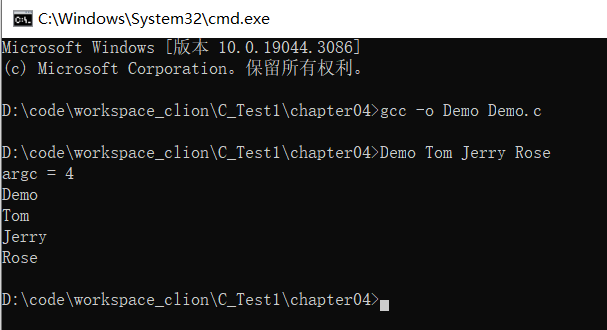

或者

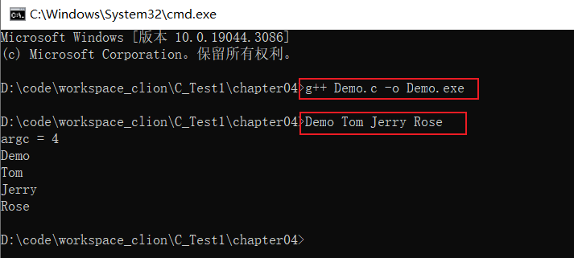

> 练习：
>
> 以下叙述中错误的是（　　）。
> A．一个C程序可以包含多个不同名的函数
> B．一个C程序只能有一个主函数
> C．C程序在书写时，有严格的缩进要求，否则不能编译通过
> D．C程序的主函数必须用main作为函数名
>
> 【答案】C
>
> 【解析】一个C程序有且只有一个主函数main。一个C程序可以包含多个不同名字的子函数。C程序在书写时没有严格的缩进要求。答案选择C选项。


> 【北京航空航天大学2018研】已知有以下sample.c程序的定义：
>
> ```c
> /*sample.c*/
> #include <stdio.h>
> 
> int main(int argc,char *argv[]){  
> 	printf("%c",*++argv[2]);  
> 	return 0;
> } 
> ```
>
> 将该程序编译成可执行文件sample后，若在命令行下输入如下命令：
> sample  January  February  March
> 则该命令正确的输出是（　　）。
> A．J
> B．a
> C．F
> D．e
>
> 【答案】D
>
> 【解析】根据命令行的输入可知，四个字符串赋给相应的指针数组，所以argv[2]表示第三个字符串February，再进行++操作，指针指向字符串的第二个字符e，最后进行取值操作，结果为e，答案为D。

### 2.2 关于exit()

exit() 函数用来终止整个程序的运行。一旦执行到该函数，程序就会立即结束。该函数的原型定义在头文件 `stdlib.h` 里面。

exit() 可以向程序外部返回一个值，它的参数就是程序的返回值。一般来说，使用两个常量作为它的参数，这两个常量也是定义在 stdlib.h 里面： 

- EXIT_SUCCESS （相当于 0）表示程序运行成功，正常结束；

- EXIT_FAILURE （相当于 1）表示程序异常中止。

```c
// 程序运行成功
// 等同于 exit(0);
exit(EXIT_SUCCESS);

// 程序异常中止
// 等同于 exit(1);
exit(EXIT_FAILURE);
```

在main()函数结束时也会隐式地调用exit()函数，exit() 等价于使用 return 语句。其它函数使用 exit() ，就是终止整个程序的运行，没有其它作用。

C 语言还提供了一个 atexit() 函数，用来登记 exit() 执行时额外执行的函数，用来做一些退出程序时的收尾工作。该函数的原型也是定义在头文件 stdlib.h 。

```c
int atexit(void (*func)(void));
```

atexit() 的参数是一个函数指针。注意，它的参数函数（下例的 print ）不能接受参数，也不能有返回值。

```c
void print(void) {
  printf("something wrong!\n");
}

atexit(print);
exit(EXIT_FAILURE);
```

上例中， exit() 执行时会先自动调用 atexit() 注册的 print() 函数，然后再终止程序。

### 2.3 函数原型

函数必须先声明，后使用。由于程序总是先运行 main() 函数，所以其它函数都必须在main()之前声明。

```c
#include <stdio.h>

void func1() {
    //...
}
void func2() {
    //...
}
int main() {
  func1();
  func2();
  return 0;
}
```

上面代码中， main() 函数必须在最后声明，否则编译时会产生警告，找不到 func1() 或 func2() 的声明。

```c
#include <stdio.h>

int main() {
    func1();  //报错
    func2();  //报错
    return 0;
}
void func1() {
    //...
}
void func2() {
    //...
}
```

对于函数较多的程序，保证每个函数的顺序正确，会变得很麻烦。C 语言提供的解决方法是，只要在程序开头处给出函数原型，函数就可以先使用、后声明。

```c
int add(int, int);   //函数原型

int main() {
    int m = 10, n = 20;
    int sum = add(m, n);
    printf("sum = %d\n", sum);
}

int add(int num1, int num2) {
    return num1 + num2;
}
```

所谓`函数原型(function prototype)`，就是函数在调用前提前告诉编译器每个函数的基本信息(它包括了返回值类型、函数名、参数个数、参数类型和参数顺序)，其它信息都不需要（不用包括函数体、参数名），函数具体的实现放在哪里，就不重要了。在函数调用时，检查函数原型和函数声明是否一致，只要一致就可以正确编译、调用。

函数原型中包括参数名也可以，虽然这样对于编译器是多余的，但是阅读代码时，有助于理解函数的意图。

```c
int add(int,int);
// 等同于
int add(int num1,int num2);
```

举例：

```c
#include <stdio.h>

// 函数原型
int add(int, int);

int main() {
    int num1 = 5;
    int num2 = 3;
    int result = add(num1, num2); // 调用函数

    printf("Sum: %d\n", result);
    return 0;
}

// 函数定义
int add(int a, int b) {
    return a + b;
}
```

有时，也会看到如下的写法。虽然理论上可以在 main() 函数的首行放置函数原型，但这不是推荐的做法。

```c
#include <stdio.h>

int main() {
    int add(int, int);  // 函数原型
    
    int num1 = 5;
    int num2 = 3;
    int result = add(num1, num2); // 调用函数

    printf("Sum: %d\n", result);
    return 0;
}

// 函数定义
int add(int a, int b) {
    return a + b;
}
```


> 在C语言中，通常在main()函数之前或是程序源码文件的开头，给出当前脚本使用的所有函数的原型。以确保在main()函数内部调用其他函数时编译器已经了解这些函数的信息。


## 3、参数传递机制

### 3.1 复习：函数内变量的传递

```c
int main() {
    //情况1：针对于基本数据类型的变量，将变量的值传递过去
    int a = 10;
    int b = a;

    printf("a = %d\n",a);

    b = 20;


    printf("a = %d\n",a);

    //情况2：针对于数组，将数组的地址传递过去
    int arr1[5] = {1,2,3,4,5};
    int *arr2;
    arr2 = arr1;

    //遍历数组arr1
    for(int i = 0;i < 5;i++){
        printf("%d ",arr1[i]);
    }
    printf("\n");

    arr2[0] = 10;

    //遍历数组arr1
    for(int i = 0;i < 5;i++){
        printf("%d ",arr1[i]);
    }
    printf("\n");

    //情况3：针对于指针，将指针保存的地址传递过去
    int i = 10;
    int *p = &i;

    printf("%d\n",*p);

    int *q = p;

    *q = 20;
    printf("%d\n",*q);


    return 0;
}
```

### 3.2 形参、实参

* `形参（formal parameter）`：在定义函数时，函数名后面括号()中声明的变量称为`形式参数`，简称`形参`。
* `实参（actual parameter）`：在调用函数时，函数名后面括号()中使用的值/变量/表达式称为`实际参数`，简称`实参`。

举例：

```java
int add(int x, int y) {  //x,y是add()中的形参
    int z;
    z = x + y;
    return (z); 
}

int main() {
    int c;
    int a = 10,b = 20;
    c = add(a, b); //此时将实参a,b赋值给add()的形参
    printf("sum is %d\n", c);
    return 0;
}
```

> 说明：
>
> 1、实参与形参的类型应相同或赋值兼容，个数相等、一一对应。
>
> 2、形参只是一个形式，在调用之前并不分配内存。函数调用时，系统为形参分配内存单元，然后将主调函数中的实参传递给被调函数的形参。被调函数执行完毕，通过return语句返回结果，系统将形参的内存单元释放。

形参和实参的功能主要是数据传递，按照传递的是“数据”还是“地址”，分为“`值传递`”和“`地址传递`”两种方式。

### 3.3 参数传递机制1：值传递

值传递，又称传值方式、数据复制方式，就是把主调函数的实参值`复制`给被调用函数的`形参`，使形参获得初始值。接着在函数内对形参值的修改，不影响实参值。

值传递，是`单向传递`，只能把实参的值传递给形参，而不能把形参的值再传回给实参。

**默认传递值的类型：基本数据类型 (整型类型、浮点类型，字符类型)、结构体、共用体、枚举类型。**

举例1：

```c
void increment(int a) {
    a++;
    printf("a = %d\n",a); // a = 11
}

int main(){
    int i = 10;
    printf("i = %d\n", i); // i = 10
    increment(i);
    printf("i = %d\n", i); // i = 10
    return 0;
}
```

调用 increment(i)，因为传入函数的是 i 的数据值，将数据值赋给遍历a，而不是 i 本身。修改a数据值，影响不到原始变量 i。

如果希望获取变化的参数值，可以把它作为返回值传回。

```c
int increment(int a) {
    a++;
    printf("a = %d\n", a);// a = 11
    return a;
}

int main() {
    int i = 10;
    printf("i = %d\n", i); // i = 10
    i = increment(i);
    printf("i = %d\n", i); // i = 11
    return 0;
}
```

体会：`形参、实参各占独立的存储空间`。函数在被调用时，给形参动态分配临时存储空间，函数返回释放。

举例2：交换两个变量的值

```c
void swap(int a, int b) {
    int temp = a;
    a = b;
    b = temp;
    //printf("a = %d,b = %d\n", a, b);  //输出交换后的结果
}

int main() {
    int x = 6, y = 8;
    printf("调用函数之前：\n");
    printf("x = %d,y = %d\n", x, y); //输出调用swap()函数之前x,y的值

    swap(x, y);               //调用swap()函数
    printf("调用函数之后:\n");
    printf("x = %d,y = %d\n", x, y); //输出调用swap()函数之后x,y的值
}
```

分析：为什么在swap()函数内变量a和b的值互换了，而主调函数main()中实参x和y却没有交换呢？这是参数按值传递的缘故。

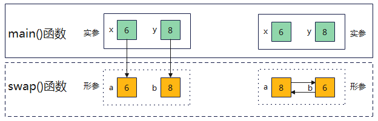

如果想要实现值的交换，那就需要传入变量本身，这就需要传入变量的地址，即`地址传递`。

### 3.4 参数传递机制2：地址传递

地址传递，又称传地址方式、地址复制方式、指针传递，就是把实参地址常量进行复制，传送给形参。

**默认传递地址的类型：指针、数组**。实参将地址传递给形参，二者地址值相同。

- 比如1：当指针作为函数的形参时，实参传递给形参的是地址，在函数中通过形参保存的地址访问实参，进而在函数中通过地址对实参的修改影响到实参的值。这也称为`双向传递`。


- 比如2：当传递数组首元素地址时，即把实参数组的起始地址传递给形参。这样形参和实参数组就占用了共同的存储空间。在被调函数中，如果通过形参修改了数组元素值，调用函数后实参数组元素值也发生相应变化。

#### 3.4.1 简单变量指针作为形参

当函数的形参类型是指针类型时，使用该函数时，需要传递指针，或者地址，或者数组给该形参。函数内以指针的方式操作变量(*指针)。

举例1：

```c
int num = 100;
int *p1 = &num;
int *p2 = p1;
*p2 = 50;
```

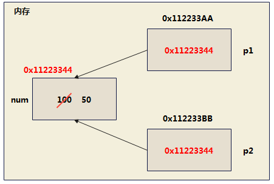

举例2：

```c
void increment(int *a) {
    (*a)++;
    printf("a = %d\n", *a); // a = 11
}

int main() {
    int i = 10;
    printf("i = %d\n", i); // i = 10
    increment(&i);
    printf("i = %d\n", i); // i = 11
    return 0;
}
```

因为传入的是地址，函数体内部对该地址包含的值的操作，会影响到函数外部变量的值。

举例3：针对上节举例2，交换两个变量的值

```c
void swap(int *a, int *b) { //函数参数为指针类型
    int temp = *a;
    *a = *b;
    *b = temp;
    printf("*a = %d,*b = %d\n", *a, *b);  //输出交换后的结果
}

int main() {
    int x = 6, y = 8;
    printf("调用函数之前：\n");
    printf("x = %d,y = %d\n", x, y); //输出调用swap()函数之前x,y的值

    swap(&x, &y);               //调用swap()函数
    printf("调用函数之后:\n");
    printf("x = %d,y = %d\n", x, y); //输出调用swap()函数之后x,y的值
}
```

通过传入变量 x 和 y 的地址，函数内部就可以直接操作该地址，从而实现交换两个变量的值。

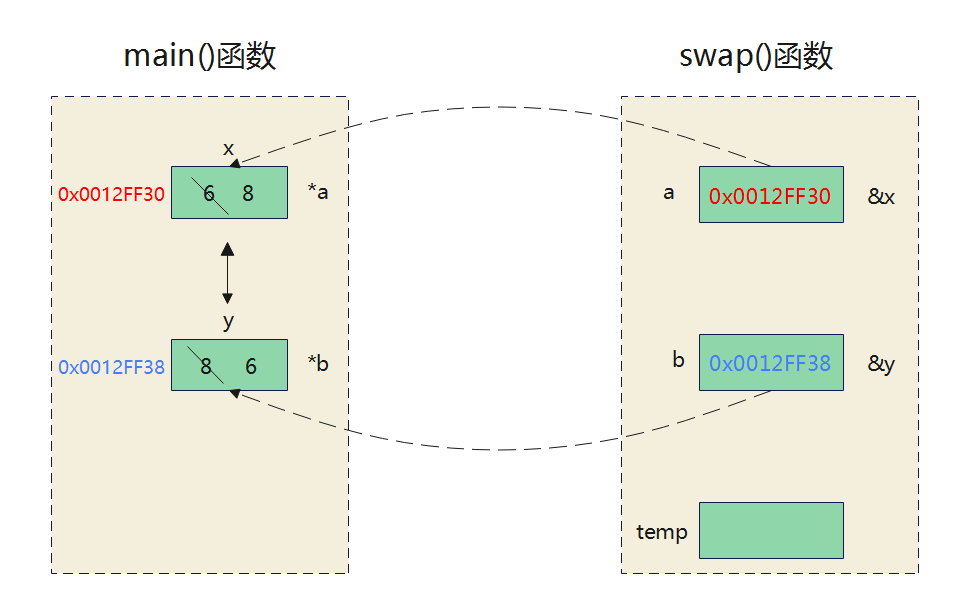

**错误：**

错误方式1：

```c
void swap(int *p1, int *p2) {
    int *temp;
    *temp = *p1;
    *p1 = *p2;
    *p2 = *temp;
}
```

上述代码中存在错误。问题出在临时指针 temp 没有分配内存空间，因此不能正确保存变量的值。因此对*temp的赋值就没有意义。

错误方式2：

```c
void swap(int *p1, int *p2) { //形参是指针变量
    int *temp;
    temp = p1;
    p1 = p2;
    p2 = temp;
    //printf("*p1 = %d,*p2 = %d\n", *p1, *p2); //*p1 = 8,*p2 = 6
}
```

在函数内部，只是交换了指针变量本身的值，而没有影响到原始调用函数时传递给 swap 函数的指针变量。

**复习：**虽然跟传参无关，这里特别提醒，函数不要返回内部变量的指针。

```c
int* f() {
  int i;
  // ...
  return &i;
}
```

函数返回内部变量 i 的指针，这种写法是错的。因为当函数结束运行时，内部变量就失效了，这时指向内部变量 i 的内存地址就是无效的，再使用这个地址是错误的。

#### 3.4.2 数组作为形参

数组名本身就代表该数组首地址，传数组的本质就是传地址。

因此，把数组名传入一个函数，就等同于传入一个指针变量。在函数内部，就可以通过这个指针变量获得整个数组。

举例1：对比传值与传址的方式

```c
void test1(int a, int b, int c) {
    a += 1;
    b += 1;
    c += 1;
}

void test2(int arr[], int n) {
    for (int i = 0; i < n; i++) {
        arr[i] += 1;
    }
}

int main() {
    //测试test1()
    int arr1[3] = {1, 2, 3};
    printf("调用函数前数组各元素值为： ");
    printf("%d,%d,%d\n", arr1[0], arr1[1], arr1[2]); //1,2,3
    test1(arr1[0], arr1[1], arr1[2]);
    printf("调用函数后数组各元素值为： ");
    printf("%d,%d,%d\n", arr1[0], arr1[1], arr1[2]); //1,2,3 

    //测试test2()
    int arr2[3] = {1, 2, 3};
    printf("调用函数前数组各元素值为：");
    printf("%d,%d,%d\n", arr2[0], arr2[1], arr2[2]); //1,2,3
    test2(arr2, 3);
    printf("调用函数后数组各元素值为： ");
    printf("%d,%d,%d\n", arr2[0], arr2[1], arr2[2]); //2,3,4

    return 0;
}
```

举例2：定义一个数组，通过函数给数组元素赋值

```c
#include <stdio.h>

#define MAXLEN 5

void setValue(int vals[], int len) {  
    int i;
    for (i = 0; i < len; i++) {
        vals[i] = i * 10;
    }
}

int main() {
    int nums[MAXLEN] = {0};           //数组初始化
    printf("调用函数前输出结果：\n");
    for (int i = 0; i < MAXLEN; i++)  //遍历数组元素
        printf("nums[%d] = %d\n", i, nums[i]);

    setValue(nums, MAXLEN);           //调用函数，传递数组名和简单变量

    printf("调用函数后输出结果：\n");
    for (int i = 0; i < MAXLEN; i++)  //遍历数组元素
        printf("nums[%d] = %d\n", i, nums[i]);

    return 0;
}
```

上例中，传入一个整数数组，与传入一个整数指针是同一回事，数组符号 [] 与指针符号 * 是可以互换的。比如，

```c
void setValue1(int *vals, int len) {  
    int i;
    for (i = 0; i < len; i++) {
        vals[i] = i * 10;
    }
}
```

举例3：数组的元素的反转操作

```c
#include<stdio.h>

#define N 5

//遍历数组
void print(int arr[],int len){
    for(int i = 0;i < len;i++){
        printf("%d ",arr[i]);
    }
    printf("\n");
}

//反转数组元素
void reverse(int arr[],int len){
    for(int i = 0,j = len - 1;i < j;i++,j--){
        int temp = arr[i];
        arr[i] = arr[j];
        arr[j] = temp;
    }
}

int main() {
    int data[N] = {23,54,96,7,8};

    print(data,N);

    reverse(data,N);

    print(data,N);
    return 0;
}
```

> 说明：
>
> void f(int x[], int n){
> 	…………;
> }
>
> 参数1：数组的定义，只需写出中括号即可，不需要限定数组长度。
>
> 参数2：数组作为参数的习惯操作。将函数中要操作的数组元素的长度传入（并不是指数组的总长度）。
>
> 由于数组名就是一个指针，如果只传数组名，那么函数只知道数组开始的地址，不知道结束的地址，所以才需要把数组长度也一起传入。


小结：实参与形参的对应关系有以下4种情况：

（1）形参和实参都用数组名

（2）实参形参都用指针变量

（3）实参用数组名，形参用指针变量

（4）实参为指针变量，形参为数组名

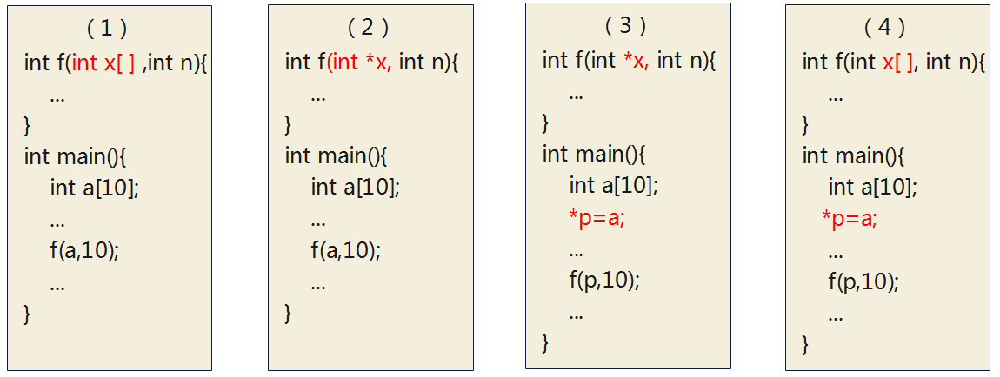


#### 3.4.3 字符串(字符指针)作为形参

字符串(或字符指针)作为函数的参数，与数组指针作为函数参数没有本质的区别，传递的都是地址值，所不同的仅是指针指向对象的类型不同而已。

举例1：定义函数，要求字符串作函数参数，统计数字字符出现的个数。

```c
#include<stdio.h>

#define N 100

int digitalCount(char *p) {
    int count = 0;
    for (; *p != '\0'; p++)
        if (*p >= '0' && *p <= '9')
            count++;

    return count;
}

int main() {
    char strs[N] = "a12bc43hec22b68o";
    printf("数字字符的个数为 % d个\n", digitalCount(strs)); //8

    return 0;
}
```

#### 3.4.4 指针数组作为形参

指针数组的元素是指针变量，用指针数组能够实现一组字符串的处理。

举例：编写能对多个字符串排序的函数

```c
#include <stdio.h>

#include <string.h>

void stringSort(char *[], int);

void stringPrint(char *[], int);

int main() {
    char *days[7] = {"Sunday", "Monday",
                     "Tuesday", "Wednesday", "Thursday", "Friday", "Saturday"};

    stringSort(days, 7);
    stringPrint(days, 7);

    return 0;
}

void stringSort(char *string[], int n) {
    char *temp;
    for (int i = 0; i < n - 1; i++) {
        for (int j = 0; j < n - 1 - i; j++)
            if (strcmp(string[j], string[j + 1]) > 0) { 
                temp = string[j];
                string[j] = string[j + 1];
                string[j + 1] = temp;
            }
    }
}

void stringPrint(char *string[], int n) {
    for (int i = 0; i < n; i++)
        printf("%s ", string[i]);

}
```

### 3.5 举例

**举例1：定义函数，求一维数组元素的最大值**

原型：int pMax(int *p,int n)

功能：在长度为 n、由 p 指向的一维数组中求元素最大值

```c
#include<stdio.h>

#define N 5

int pMax(int *p, int n) {
    int max = *p;
    for (int i = 1; i < n; i++){
        if (max < *(p + i)){
            max = *(p + i);
        }
    }
    return max;
}

int main() {
    int a[N];
    for (int i = 0; i < N; i++)
        scanf("%d", &a[i]);

    printf("Max = %d\n", pMax(a, N));

    return 0;
}
```

**举例2：多维数组名作为形参**

有一个3×4的矩阵，求所有元素中的最大值。

```c
#include <stdio.h>

#define N 3

int maxValue(int array[][4], int n) { //n:第一维的长度
    int max = array[0][0];
    for (int i = 0; i < n; i++)
        for (int j = 0; j < 4; j++)
            if (max < array[i][j])
                max = array[i][j]; //把较大值重新赋值给max
    return max;
}

int main() {
    int a[N][4] = {{11,  33, 3,  17},
                   {32, 54, 6,  68},
                   {24, 17, 34, 12}};
    printf("Max value is %d\n", maxValue(a, N));
    return 0;
}
```

> 说明：
>
> 如果函数的参数是二维数组，那么除了第一维的长度可以当作参数传入函数，其他维的长度需要写入函数的定义。也就是说，在定义二维数组时，必须指定列数(即一行中包含几个元素) ，由于形参数组与实参数组类型相同，所以它们是由具有相同长度的一维数组所组成的。所以必须指定第2维(列数)。
>
> 在第2维大小相同的前提下，形参数组的第1维可以与实参数组不同。因为C语言编译系统不检查第一维的大小。例如，实参数组定义为`int score[5][10]`;而形参数组定义为`int array[][10]`;或`int array[8][10]`;均可以。这时形参数组和实参数组都是由相同类型和大小的一维数组组成的。

练习：

```c
void f(int x[][5]){
	…………;
}

//1、int a[10][5]; 可以传给f函数吗？  可以！

//2、int b[10][3];可以传给f函数吗？   不可以！
```

**举例3：变长数组作为参数**

变长数组作为函数参数时，写法略有不同。

```c
#include <stdio.h>

//int sum_array(int a[n],int n) { //报错
//    // ...
//}

int sumArray(int n, int a[n]) {
    // ...
}

int main() {
    int a[] = {1, 3, 5, 7};
    int sum = sumArray(4, a);
    return 0;
}
```

数组 a[n] 是一个变长数组，它的长度取决于变量 n 的值，只有运行时才能知道。所以，变量 n 作为参数时，顺序一定要在变长数组前面，这样运行时才能确定数组 a[n] 的长度，否则就会报错。

因为函数原型可以省略参数名，所以变长数组的原型中，可以使用 * 代替变量名，也可以省略变量名。

```c
int sumArray(int, int [*]);
int sumArray(int, int []);
```

变长数组作为函数参数有一个好处，就是多维数组的参数声明，可以把后面的维度省掉了。

```c
// 原来的写法
int sumArray(int a[][4], int n);
// 变长数组的写法
int sumArray(int n, int m, int a[n][m]);
```

说明：函数 sum_array() 的参数是一个多维数组，按照原来的写法，一定要声明第二维的长度。但是使用变长数组的写法，就不用声明第二维长度了，因为它可以作为参数传入函数。

### 3.6 C++中的引用传递

```c
void f(int x){
    x++;
}

int main() {
    int a = 1;
    f(a);
    printf("a = %d",a); // a = 1

    return 0;
}
```

如果想让a实现+1，使用C语言的话，可以如下操作：

```c
void f1(int *x){
    //(*x)++;
    *x = *x + 1;
}

int main() {
    int a = 1;
    f1(&a);
    printf("a = %d",a); // a = 2

    return 0;
}
```

C语言是靠传入变量地址的方式实现的，相对麻烦且容易出错。这里还可以使用C++的语法来操作。

**情况1：传入数值类型变量**

```c
#include <iostream>

void f2(int &x) {
    x = x + 1;
}

int main() {
    int a = 1;
    f2(a);
    std::cout << "a = " << a << std::endl; // a = 2

    return 0;
}
```

> 上述代码在c语言环境中执行会报错，必须在c++环境中执行。
>
> 在这个C++版本中，我们使用了C++的`#include <iostream>` 来代替C的 `<stdio.h>`，并使用 `std::cout` 来替代 `printf` 函数。此外，f1函数的参数类型也从指针 `int *x` 改为引用 `int &x`，这是C++的引用特性，允许更直观地操作变量，而不需要使用指针。其他部分保持不变，代码仍然具有相同的功能，将整数`a`的值增加1并打印结果。

**情况2：传入结构体变量**

如果传入的是结构体变量，如果内部需要改变结构体的成员，则需要如下声明：

```c
void insert(SqList &L,int x){
	//修改L内部data[]数组的内容，则认为修改了L,因此需要传入引用型L
	//....
}
```

**情况3：传入指针型变量**

上述是普通变量的传入方式，如果传入的变量是指针型变量，且在函数内部需要对传入的指针进行改变，则：

```c
void f(int *&x){  //指针型变量在函数体中需要改变的写法
	x++; //将指针 x 向后移动一个整数的大小。
}
```

> `int *&x`：这里 `int *` 表示指向整数的指针，`&` 表示引用，因此 `int *&x` 表示引用指向整数的指针。这个参数允许传递一个指向整数的指针，并且在函数内部可以改变指针的值。

举例1：

```c++
#include <iostream>

void f(int *&x) {
    x++;
}

int main() {
    int arr[] = {1, 2, 3, 4, 5};
    int *ptr = arr; // 将指针指向数组的第一个元素

    std::cout << "Original value: " << *ptr << std::endl;

    f(ptr); // 传递指针给函数，函数将指针移动到下一个元素
    std::cout << "New value: " << *ptr << std::endl;

    return 0;
}
```

举例2：将A、B两个链表合并成一个C，此时C发生了改变，需要引用型。A、B没发生改变，不需要引用型。

```c
void merge(LNode *A,LNode *B,LNode *&C){
	LNode *p = A->next;
	LNode *q = B->next;
    LNode *r;
    C = A;
    //...
    
}
```

> 上述写法在树、图的算法中应用广泛。

## 4、函数的高级应用

### 4.1 递归(recursion)函数

举例1：


举例2：

```
从前有座山,山上有座庙,庙里有个老和尚,老和尚在给小和尚讲故事,讲的啥?
      从前有座山,山上有座庙,庙里有个老和尚,老和尚在给小和尚讲故事,讲的啥?
          从前有座山,山上有座庙,庙里有个老和尚,老和尚在给小和尚讲故事,讲的啥?
              从前有座山,山上有座庙,庙里有个老和尚,老和尚在给小和尚讲故事,讲的啥?...
    			...
老和尚没了,庙塌了,小和尚还俗结婚了。
```

**递归函数调用**：函数自己调用自己的现象就称为递归。

**递归的分类**：直接递归、间接递归。

* 直接递归：函数自身调用自己。

  ```java
  int func(int a){
     int b,c;
     …
     c=func(b);
     …
  }
  ```

* 间接递归：可以理解为A()函数调用B()函数，B()函数调用C()函数，C()函数调用A()函数。

  ```java
  void A(){
  	B();
  }
  
  void B(){
  	C();
  }
  
  void C(){
  	A();
  }
  ```

**说明**：

- 递归函数包含了一种`隐式的循环`。
- 递归函数会`重复执行`某段代码，但这种重复执行无须循环控制。
- 递归一定要向`已知方向`递归，否则这种递归就变成了无穷递归，停不下来，类似于`死循环`。最终发生`栈内存溢出`。
- C语言支持函数的递归调用。

举例1：计算1 ~ n的和

```c
// 递归函数，计算1到n的和
int getSum(int n) {
    // 基本情况：当n为1时，返回1
    if (n == 1) {
        return 1;
    } else {
        // 递归情况：将n与1到n-1的和相加
        return n + getSum(n - 1);
    }
}

int main() {
    int n;
    printf("输入一个正整数:");
    scanf("%d", &n);

    // 调用递归函数计算1到n的和
    int result = getSum(n);

    printf("1到%d的和为%d\n", n, result);

    return 0;
}
```

图示：

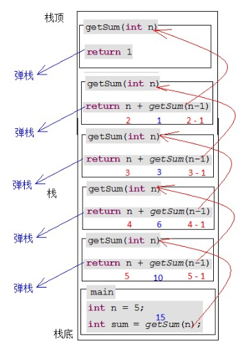

举例2：递归函数计算n!

```c
// 递归函数，计算n的阶乘
int factorial(int n) {
    // 基本情况：当n为0或1时，阶乘为1
    if (n == 0 || n == 1) {
        return 1;
    } else {
        // 递归情况：n! = n * (n-1)!
        return n * factorial(n - 1);
    }
}

int main() {
    int n = 5;

    // 调用递归函数计算n的阶乘
    int result = factorial(n);
    printf("%d! = %d\n", n, result);

    return 0;
}
```

图示：

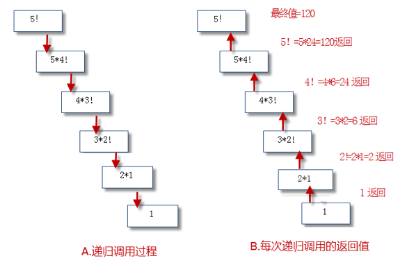

举例3：计算斐波那契数列（Fibonacci）的第n个值，斐波那契数列满足如下规律，

```java
1,1,2,3,5,8,13,21,34,55,....
```

即前两个数都是1，从第三个数开始，每个数等于前两个数之和。假设f(n)代表斐波那契数列的第n个值，那么f(n)满足：
f(n) = f(n-2) + f(n-1);  其中，n >= 3。

```c
// 递归函数，计算第n个斐波那契数
int fibonacciRecursion(int n) {
    if(n == 1 || n == 2){
        return 1;
    }else{
        return FibonacciRecursion(n - 1) + FibonacciRecursion(n - 2);
    }
}
```

如果不使用递归函数，而是使用迭代的方式计算第n个斐波那契数列，如下：

```c
int FibonacciIteration(int n){
    if(n == 1 || n == 2){
        return 1;
    }

    int a = 1;
    int b = 1;
    int temp;
    for(int i = 3;i <= n;i++){
        temp = a + b;
        a = b;
        b = temp;
    }
    return b;
}
```


> 总结：
>
> 1、使用递归函数大大简化了算法的编写。
>
> 2、递归调用会占用大量的系统堆栈，内存耗用多，在递归调用层次多时速度要比循环`慢的多`，所以在使用递归时要慎重。
>
> 3、在要求高性能的情况下尽量避免使用递归，递归调用既`花时间`又`耗内存`。考虑使用循环迭代

练习1：

有5个学生坐在一起，问第5个学生多少岁，他说比第4个学生大2岁。问第4个学生岁数，他说比第3个学生大2岁。问第3个学生，又说比第2个学生大2岁。问第2个学生，说比第1个学生大2岁。最后问第1个学生，他说是10岁。请问第5个学生多大。即：

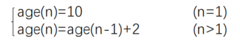

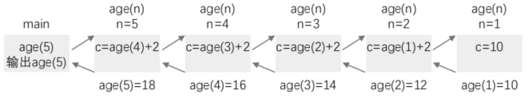

```c
#include <stdio.h>
int age(int n); //对age函数的声明

int main() {
    printf("NO.5:age is %d\n", age(5)); //输出第5个学生的年龄
    return 0;
}

int age(int n){ //定义递归函数

    int c; //c用作存放函数的返回值的变量
    if (n == 1)
        c = 10;
    else
        c = age(n - 1) + 2; //年龄是前一个学生的年龄加2(如第4个学生年龄是第3个学生年龄加2)
    return c;
}
```

练习2：走台阶问题

```
假如有10阶楼梯，小朋友每次只能向上走1阶或者2阶，请问对于n阶台阶一共有多少种不同的走法呢？
阶数：1    2    3     4
走法：1    2    3     5

fun(n) = fun(n - 1) + fun(n - 2)


【奇妙的属性】随着数列的增加，斐波那契数列前一个数与后一个数的比值越来越逼近黄金分割的数值0.618。
```

### 4.2 可变参数

有些函数的参数数量是不确定的，此时可以使用C语言提供的`可变参数函数`（Variadic Functions）。

声明可变参数函数的时候，使用省略号 ... 表示可变数量的参数。最常见的例子：

```c
#include <stdarg.h>

int printf(const char* format, ...);
```

这里的 ... 表示可以传递任意数量的参数，但是它们都需要与`format`字符串中的格式化标志相匹配。

> 注意， ... 符号必须放在`参数序列的结尾`，否则会报错。

**可变参数函数的使用：**

1. 为了使用可变参数，你需要引入`<stdarg.h>`头文件。
2. 在函数中，需要声明一个`va_list`类型的变量来存储可变参数。它必须在操作可变参数时，首先使用。
3. 使用`va_start`函数来初始化`va_list`类型的变量。它接受两个参数，参数1是可变参数对象，参数2是原始函数里面，可变参数之前的那个参数，用来为可变参数定位。
4. 使用`va_arg`函数来逐个获取可变参数的值。每次调用后，内部指针就会指向下一个可变参数。它接受两个参数，参数1是可变参数对象，参数2是当前可变参数的类型。
5. 使用`va_end`函数来结束可变参数的处理。

举例：

```c
#include <stdio.h>
#include <stdarg.h>

// 可变参数函数，计算多个整数的平均值
double average(int count, ...) {
    va_list args; // 声明一个va_list变量，存储可变参数
    va_start(args, count); // 初始化va_list，指向可变参数的位置
    double sum = 0;

    for (int i = 0; i < count; i++) {
        int num = va_arg(args, int); // 逐个获取整数参数
        sum += num;
    }

    va_end(args); // 结束可变参数的处理

    return sum / count;
}

int main() {
    double avg = average(5, 10, 20, 30, 40, 50); // 调用可变参数函数
    printf("Average: %lf\n", avg);

    return 0;
}
```

> 小结：
>
> 可变参数函数，在编写各种工具函数和格式化输出函数时非常有用。但要小心确保传递的参数数量和类型与函数的预期相匹配，以避免运行时错误。

### 4.3 指针函数(返回值是指针)

C语言允许函数的返回值是一个指针（地址），这样的函数称为`指针函数`。

指针函数的定义的一般格式

```c
返回值类型 *函数名(形参列表) {
	函数体
｝
```

函数体中的 return 命令须返回一个地址。

举例1：获取两个字符串中较长的那个字符串

```c
#include <stdio.h>
#include <string.h>

char *maxLengthStr(char *str1, char *str2) { //函数返回char * (指针)
    printf("\nstr1的长度%d,str2的长度%d", strlen(str1), strlen(str2));
    if (strlen(str1) >= strlen(str2)) {
        return str1;
    } else {
        return str2
    }
}

int main() {
    char str1[30], str2[30];
    printf("请输入第1个字符串:");
    gets(str1);
    printf("请输入第2个字符串:");
    gets(str2);

    char *str;
    str = maxLengthStr(str1, str2);
    printf("\nLonger string: %s \n", str);
    return 0;
}
```

拓展：编写函数char *maxLlen (char *string[],int n)，用于查找多个字符串中的最长字符串，并返回该字符串的地址。

```c
#include <stdio.h>
#include <string.h>

char *maxLen(char *[], int);

int main() {
    char *pString[5] = {"Atlanta1996", "Sydney2000", "Beijing2008", "London2012", "RIO2016"};

    puts(maxLen(pString, 5));

    return 0;
}

char *maxLen(char *string[], int n) {

    int posion, maxLen;

    maxLen = strlen(string[0]);

    for (int i = 1; i < n; i++){
        if (maxLen < strlen(string[i])){
            maxLen = strlen(string[i]);
            posion = i;
        }

    }
    return string[posion];

}
```

举例2：

```c
#include <stdio.h>
#include <stdlib.h>

int *func() {
    int *n = (int *)malloc(sizeof(int));  //分配动态内存
    if (n != NULL) {
        *n = 100;
    }
    return n;
}

int main() {
    int *p = func();
    int n = *p;
    printf("value = %d\n", n);

    free(p); // 释放动态分配的内存，以免出现内存泄漏

    return 0;
}
```

注意，上述操作很容易错写成如下方式：

```c
int *func() {
    int n = 100;
    return &n;
}

int main() {
    int *p = func();
    int n = *p;
    printf("value = %d\n", n);

    return 0;
}
```

在 func() 函数中，声明了一个整数变量 n，然后返回其地址 `&n`。但是，一旦 func() 函数执行完毕，局部变量 n将被销毁，它的地址也将变得无效。这意味着在 main() 函数中，尝试访问 p 指向的地址时，它实际上已经不再是一个有效的内存位置，这会导致未定义的行为。

如果确实希望返回局部变量的地址，除了使用malloc()函数的方式之外，还可以定义局部变量为 `static` 的，此时数据空间在`静态数据区`分配，静态变量在程序的生命周期内都存在，不会像局部变量那样在函数执行完毕后被销毁。比如：

```c
int *func() {
    static int n = 100;
    return &n;
}

int main() {
    int *p = func();
    int n = *p;
    printf("value = %d\n", n);

    return 0;
}
```


### 4.4 函数指针(指向函数的指针)

一个函数本身就是一段内存里面的代码，总是占用一段连续的内存区域。这段内存区域也有首地址，把函数的这个首地址（或称入口地址）赋予一个指针变量，使指针变量指向函数所在的内存区域，然后通过指针变量就可以找到并调用该函数。这种指针就是**函数指针**。

简单来说，函数指针，就是指向函数的指针。

**格式：**

```c
返回值类型 (*指针变量名)(参数列表);
```

其中，参数列表中可以同时给出参数的类型和名称，也可以只给出参数的类型，省略参数的名称。

举例：

```c
void print(int a) {
    printf("%d\n", a);
}

int main() {
    void (*print_ptr)(int); //1
    print_ptr = &print;     //2
    
    return 0;
}
```

注释1处，变量 print_ptr 是一个函数指针，它可以指向函数返回值类型为void且有1个整型参数的函数。

注释2处，print_ptr 指向函数 print() 的地址。函数 print() 的地址可以用 &print 获得。

> 注意，` (*print_ptr) `的小括号一定不能省略，否则因为函数参数 (int) 的优先级高于 * ，整个结构就变成了函数原型： `void *print_ptr(int) `，`void *` 成了返回值类型了。

有了函数指针，通过它也可以调用函数。

```c
(*print_ptr)(10);
// 等同于
print(10);
```

举例：用函数指针来实现对函数的调用，返回两个整数中的最大值。

```c
int max(int a, int b) {
    return a > b ? a : b;
}

int main() {
    int x, y;
    int (*pmax)(int, int) = &max; // 使用函数指针

    printf("输入两个整数:");
    scanf("%d %d", &x, &y);

    int maxVal = (*pmax)(x, y);
    printf("较大值为: %d\n", maxVal);

    return 0;
}

```

**拓 展**

C 语言规定，函数名本身就是指向函数代码的指针，通过函数名就能获取函数地址。也就是说， print 和 &print 是一回事。

```c
if (print == &print) // true
```

因此，上面代码的 print_ptr 等同于 print 。

```c
void (*print_ptr)(int) = &print;
// 或
void (*print_ptr)(int) = print;

if (print_ptr == print) // true
```

注意：

1、对指向函数的指针变量不能进行算术运算，如p+n，p++，p--等运算是无意义的。

2、用函数名调用函数，只能调用所指定的一个函数，而通过指针变量调用函数比较灵活，可以根据不同情况先后调用不同的函数。

>  【武汉科技大学2019研】有函数定义：int func(int *p)，x和y是int型变量，则正确的调用是（　）。
>  A．y＝func(x)；
>  B．func(x)；
>  C．func()＝x；
>  D．y＝func(&x)；
>
>  【答案】D
>
>  【解析】根据func函数的定义可以知道调用func函数需要传入一个指针，且该指针的指向类型是int型，只有D传入的是指向int型数据的指针，答案选D。


### 4.5 回调函数

指向函数a的指针变量的一个重要用途是把函数a的入口地址作为参数传递到其它函数b中，此时的函数b就称为`回调函数`。在此基础上，我们就可以在回调函数b中使用实参函数a。

它的原理可以简述如下: 有一个函数（假设函数名为fun），它有两个形参（x1和x2），定义x1和x2为指向函数的指针变量。在调用函数fun时，实参为两个函数名f1和f2，给形参传递的是函数f1和f2的入口地址。这样在函数fun中就可以调用f1和f2函数了。

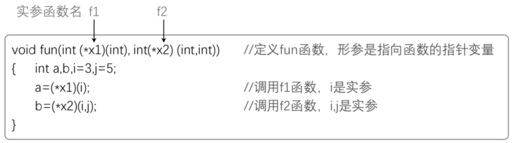

举例1：使用回调函数的方式，给一个整型数组int arr[10] 赋10个随机数。

```c
#include <stdio.h>
#include <stdlib.h>

// 回调函数
void initArray(int *array, int arrayLen, int (*f)()) {
    for (int i = 0; i < arrayLen; i++)
        array[i] = (*f)();
}

// 获取随机值
int getRandomValue() {
    return rand();
}

int main() {
    int arrLen = 10;
    int myArray[arrLen];
    initArray(myArray, arrLen, &getRandomValue);

    //遍历数组
    for (int i = 0; i < 10; i++) {
        printf("%d ", myArray[i]);
    }
    printf("\n");

    return 0;
}
```

举例2：有两个整数a和b，由用户输入1,2或3。如输入1，程序就给出a和b中的大者，输入2，就给出a和b中的小者，输入3，则求a与b之和。

```c
#include <stdio.h>

int fun(int x, int y, int (*p)(int, int)); //fun函数声明
int max(int, int); //max函数声明
int min(int, int); //min函数声明
int add(int, int); //add函数声明

int main() {
    int a = 10, b = 20, n;
    printf("please choose 1,2 or 3:");
    scanf("%d", &n); //输入1,2或3之一
    switch(n){
        case 1:
            fun(a, b, max); //输入1时调用max函数
            break;
        case 2:
            fun(a, b, min); //输入2时调用min函数
            break;
        case 3:
            fun(a, b, add); //输入3时调用add函数
            break;
    }

    return 0;
}

int fun(int x, int y, int (*p)(int, int)){ //定义fun函数
    int result;
    result = (*p)(x, y);
    printf("%d\n", result); //输出结果
}

int max(int x, int y){ //定义max函数
    int z;
    if (x > y)
        z = x;
    else
        z = y;

    printf("max=");
    return z; //返回值是两数中的大者
}

int min(int x, int y){ //定义min函数

    int z;
    if(x < y)
        z = x;
    else
        z = y;

    printf("min=");
    return z; //返回值是两数中的小者
}

int add(int x, int y){ //定义add函数
    int z;
    z = x + y;
    printf("sum=");
    return z; //返回值是两数之和
}
```


### 4.6 函数说明符

C 语言提供了一些函数说明符，让函数用法更加明确。

函数一旦定义，就可以被其它函数调用。但是当一个源程序由多个源文件组成时，在一个源文件中定义的函数能否被其他源文件中的函数调用呢？因此，C语言又把函数分为两类——`内部函数`和`外部函数`。

#### ① 内部函数(静态函数)

如果在一个源文件中定义的函数只能被本文件中的函数调用，而不能被同一源程序其他文件中的函数调用，这种函数称为内部函数。此时，内部函数需要使用static修饰。

定义内部函数的一般形式是：

```
static 类型说明符 函数名(<形参表>)
```

举例：

```c
static int f(int a,int b){
   …
} 
```

说明：f()函数只能被本文件中的函数调用，在其他文件中不能调用此函数。

但此处static的含义并不是指存储方式，而是指对函数的调用范围只局限于本文件。因此在不同的源文件中定义同名的内部函数不会引起混淆，互不影响。

#### ② 外部函数

外部函数在整个源程序中都有效，只要定义函数时，在前面加上`extern`关键字即可。

其定义的一般形式为：

```
extern 类型说明符 函数名(<形参表>) 
```

例如：

```c
extern int f(int a,int b){
  …
}
```

因为函数与函数之间都是并列的，函数不能嵌套定义，所以函数在本质上都具有外部性质。因此**在定义函数省去extern说明符时，则隐含为外部函数**。所以说，本节之前定义的使用的函数都是外部函数。

如果定义为外部函数，则它不仅可被定义它的源文件调用，而且可以被其他文件中的函数调用，即其作用范围不只局限于其源文件，而是整个程序的所有文件。在一个源文件的函数中调用其他源文件中定义的外部函数时，通常使用extern说明被调函数为外部函数。

练习：

（1）新建名称为“ExternFunction”的项目，在项目中创建下面的3个文件。
（2）新建名为“file1.c”的文件，并在代码编辑区域输入以下代码。

```c
#include<stdio.h>

extern void add(int c, int d) {       //定义外部函数add()，extern可省略不写
    printf("%d+%d=%d\n", c, d, c + d);
}
```

（3）新建名为“file2.c”的文件，并在代码编辑区域输入以下代码。

```c
#include<stdio.h>

extern void sub(int c, int d) {     //定义外部函数sub()，extern可省略不写
    printf("%d-%d=%d\n", c, d, c - d);
}
```

（4）新建名为“file3.c”的文件，并在代码编辑区域输入以下代码。

```c
#include<stdio.h>

//由于函数原型默认就是 extern ，所以这里不加 extern ，效果是一样的。
extern void add(int arg1, int arg2);  
extern void sub(int arg1, int arg2);

int main() {
    int a = 100, b = 20;

    add(a, b);
    sub(a, b);

    return 0;
}
```

整个程序是由3个文件组成的，file3.c文件的主函数中使用了4个函数的调用语句。其中，printf()、scanf()是库函数，另外两个是用户自定义的函数，它们都被定义为外部函数。

在当前file3.c文件里面，main()函数使用前需要给出外部函数的原型，并用 extern 说明该函数的定义来自其它文件。

## 5、再谈变量

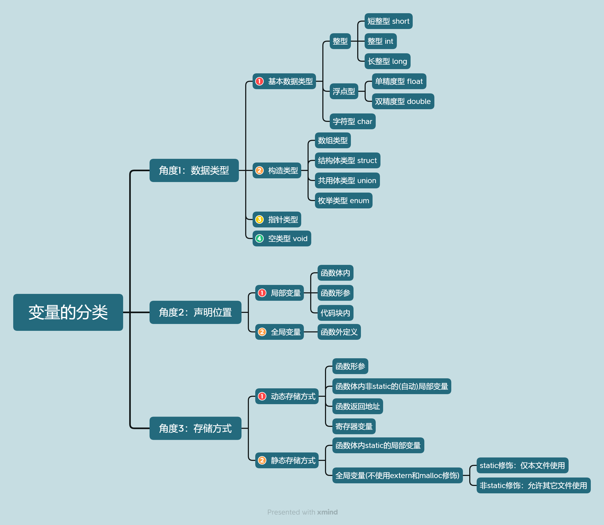

### 5.1 按声明位置的不同分类

#### ① 局部变量(Local Variable)

在函数体内定义的变量或函数的形参，都是内部变量，称为`局部变量`。局部变量只能在定义它的函数中使用。

举例1：

```c
#include <stdio.h>

void printStar();

int main() {
    int i;
    for (i = 1; i <= 5; i++) {
        printStar();
        putchar('\n');
    }
    return 0;
}

void printStar() {
    int i;
    for (i = 1; i <= 10; i++)
        putchar('*');
}
```

举例2：

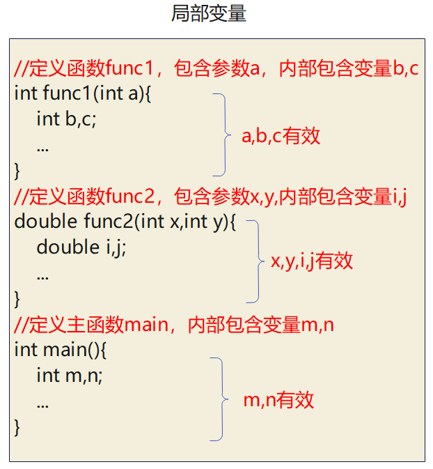

#### ② 全局变量(Global Variable)

在函数之外定义的变量就是外部变量，称为**全局变量**(或全程变量)。

一个程序中，凡是在全局变量之后定义的函数，都可以使用在函数之前定义的全局变量。也就是说，一个全局变量，可以被多个函数使用，但并不一定能被所在程序中的每一个函数使用。

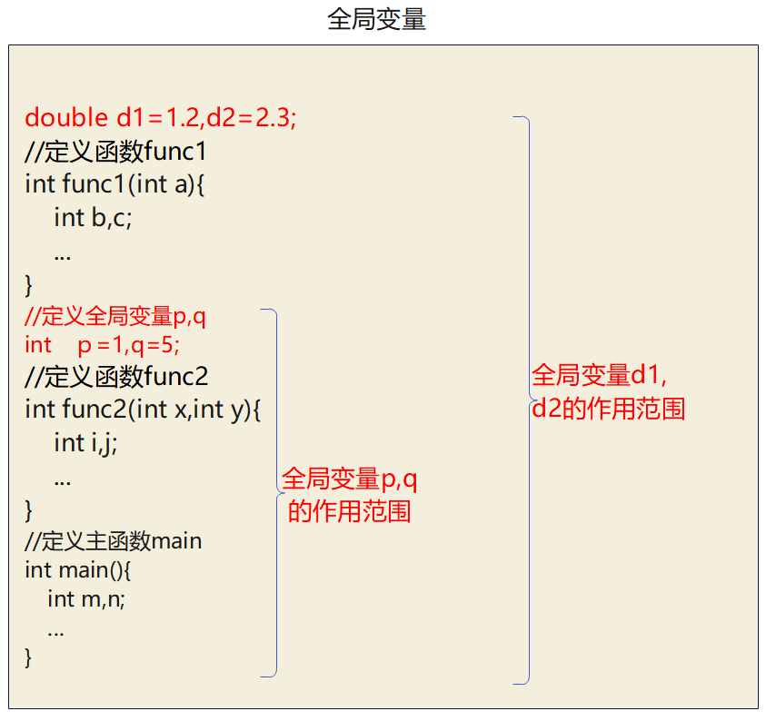

> 注意：
>
> 如果全局变量与函数中定义的局部变量重名，则在函数内部调用此同名的变量，默认是局部变量（就近原则）。

```c
#include <stdio.h>

int counter = 10;

void add(){
    counter++;
    printf("counter = %d\n",counter);
}


int main() {
    add();
    add();
    printf("counter = %d\n",counter); //counter = 12
    int counter = 100;
    printf("counter = %d\n",counter); //counter = 100
    return 0;
}

```

>  利用全局变量传递数据：
>
>  - 利用全局变量进行函数间的数据传递，简单而运行效率高。
>
>
>  - 全局变量使用过多增加了函数间联系的复杂性，降低了函数的独立性。

**局部变量与全局变量的对比：**

`1、作用域`

- 局部变量：它的作用域只能在其定义的函数或代码块内部，超出该范围将无法访问。
- 全局变量：它的作用域默认是整个程序，也就是所有的代码文件。

`2、访问权限`

- 局部变量：由于局部变量的作用域仅限于定义它们的函数或代码块，只有在该范围内才能访问它们。其他函数无法直接访问局部变量。
- 全局变量：全局变量可以被程序中的任何函数访问，只要它们在被访问之前已经被声明。

`3、生命周期`

- 局部变量：局部变量的生存周期仅限于定义它们的函数或代码块的执行时间。它们在函数或代码块执行结束后会被销毁。
- 全局变量：全局变量的生命周期从程序开始运行直到程序结束。它们在程序整个运行期间都存在。

`4、初始值`

- 局部变量：系统不会对其默认初始化，必须对局部变量初始化后才能使用，否则，程序运行后可能会异常退出。

- 全局变量：如果没有显式初始化，它们会被自动、默认初始化为零或空值，具体取决于数据类型。

  | 数据类型 | 默认初始化值 |
  | -------- | ------------ |
  | int      | 0            |
  | char     | '\0' 或 0    |
  | float    | 0.0f         |
  | double   | 0.0          |
  | 指针     | NULL         |

`5、内存中的位置`

- 局部变量：保存在`栈`中，函数被调用时才动态地为变量分配存储单元。
- 全局变量：保存在内存的`全局存储区`中，占用静态的存储单元。


**全局变量使用建议：不在必要时不要使用全局变量。**

原因如下：

① `占用内存时间长`：全局变量在程序的全部执行过程中都占用存储单元，而不是仅在需要时才开辟单元。

② `降低了函数、程序的可靠性和通用性`：如果在函数中引用了全局变量，那么执行情况会受到有关的外部变量的影响；如果将一个函数移到另一个文件中，还要考虑把有关的外部变量及其值一起移过去。但是若该外部变量与其它文件的变量同名时，就会出现问题。

一般要求把C程序中的函数做成一个相对的封闭体，除了可以通过“实参—形参”的渠道与外界发生联系外，没有其它渠道。这样的程序移植性好，可读性强。

③ `程序容易出错`：使用全局变量过多，人们往往难以清楚地判断出每个瞬时各个外部变量的值。由于在各个函数执行时都可能改变外部变量的值，程序容易出错。因此，要限制使用全局变量。

### 5.2 按存储方式的不同分类

在C语言中，每一个变量都有两个属性: `数据类型`和`数据的存储类别`。存储类别指的是数据在内存中存储的方式(如静态存储和动态存储)。在声明变量时，一般应同时指定其数据类型和存储类别，也可以采用默认方式指定（即如果用户不指定，系统会隐含地指定为某一种存储类别）。

变量的存储有两种不同的方式: **静态存储方式**和**动态存储方式**。

从变量值`存在的时间`（即`生命周期`）来观察，有的变量在程序运行的整个过程都是存在的，而有的变量则是在调用其所在的函数时才临时分配存储单元，而在函数调用结束后该存储单元就马上释放了，变量不存在了。

#### ① 动态(自动)存储方式

动态存储方式：在程序运行期间根据需要进行`动态的分配存储空间`的方式，数据存放在`动态存储区`。

**在动态存储区中存放以下数据：**

- 函数形参：在调用函数时给形参分配存储空间。
- 函数中定义的局部变量且没有用关键字static声明的变量，即自动变量。
- 函数调用时的返回地址等。

在调用该函数时，系统会给这些变量分配存储空间，**在函数调用结束时就自动释放这些存储空间**。因此这类局部变量称为**自动变量**。自动变量用关键字`auto`作存储类别的声明。

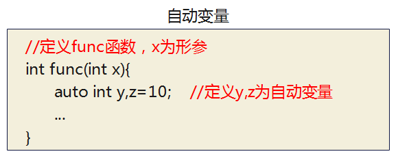

实际上，关键字auto可以省略，**不写auto则隐含指定为“自动存储类别”**，它属于动态存储方式。程序中大多数变量属于自动变量。每个函数中的局部变量的生命周期与函数的执行周期相匹配。

```c
auto int b = 3; //等价于int b = 3;
```

如果在一个程序中两次调用同一函数，而在此函数中定义了局部变量，在两次调用时，函数的内部变量都会重新初始化，不会保留上一次运行的值。分配给这些局部变量的存储空间的地址可能是不相同的。

#### ② 静态存储方式

静态存储方式：在程序运行期间数据存放在`静态存储区`。它们在程序整个运行期间都不释放，故生命周期存在于程序的整个运行过程。

`局部变量`，使用static修饰以后，则使用静态存储方式。

- 有时希望函数中的局部变量的值在函数调用结束后不消失而继续保留原值，即其占用的存储单元不释放，在下一次再调用该函数时，该变量已有值（就是上一次函数调用结束时的值）。这时就应该指定该局部变量为“**静态局部变量**”，用关键字`static`进行声明。

- 静态局部变量在声明时未赋初值，编译器也会把它初始化为0。

  ```c
  static int a;
  // 等同于
  static int a = 0;
  ```

`全局变量`大多存放在静态存储区中（不包括extern修饰和malloc函数分配的方式），在程序开始执行时给全局变量分配存储区，程序执行完毕就释放。在程序执行过程中它们占据固定的存储单元，而不是动态地进行分配和释放。

- 普通全局变量对整个工程可见，其他文件可以使用extern外部声明后直接使用。也就是说其他文件不能再定义一个与其相同名字的变量了（否则编译器会认为它们是同一个变量）。
- 而全局变量使用static修饰，则称为**静态全局变量**，静态全局变量`仅对当前文件可见`，其他文件不可访问，其他文件可以定义与其同名的变量，两者互不影响。定义不需要与其他文件共享的全局变量时，加上static关键字能够有效地降低程序模块之间的耦合，避免不同文件同名变量的冲突，且不会误使用。

举例1：

```c
#include <stdio.h>

void nonStaticFun() {
    int n = 10; //动态存储方式
    printf("n=%d\n", n);
    n++;
    printf("n++=%d\n", n);
}

void staticFun() {
    static int n = 10; //静态存储方式
    printf("static n=%d\n", n);
    n++;
    printf("n++=%d\n", n);
}

int main(void) {
    nonStaticFun();
    staticFun();
    printf("\n");

    nonStaticFun();
    staticFun();
    printf("\n");
    return 0;
}
```

运行结果：

```
n=10
n++=11
static n=10
n++=11

n=10
n++=11
static n=11
n++=12
```

> 说明： 
>
> 1、对静态局部变量是在编译时赋初值的，即只赋初值一次，在程序运行时它已有初值。以后每次调用函数时不再重新赋初值而只是保留上次函数调用结束时的值。
>
> 2、对自动变量赋初值，不是在编译时进行的，而是在函数调用时进行的，每调用一次函数就执行一次赋值语句。

举例2：

```c
#include <stdio.h>

int f(int); //函数原型

int main() {
    int a = 2, i; //(自动)局部变量
    for (i = 0; i < 3; i++)
        printf("%d\n", f(a)); //输出f(a)的值

    return 0;
}

int f(int a) {
    auto int b = 0; //(自动)局部变量
    static int c = 3; //静态局部变量
    printf("c = %d\n",c);
    b++;
    c++;
    return (a + b + c);
}
```

图示：

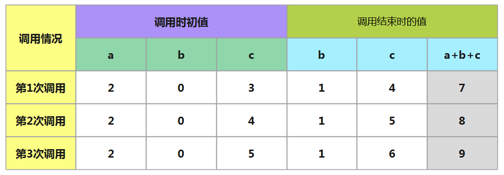

运行结果：

```
c = 3
7
c = 4
8
c = 5
9
```

> 补充说明：
>
> 1、虽然静态局部变量在函数调用结束后仍然存在，但其它函数是不能引用它的。因为它是局部变量，只能被本函数引用，而不能被其它函数引用。
>
> 2、如果在定义局部变量时不赋初值的话，则对静态局部变量来说，编译时自动赋初值0（对数值型变量）或空字符′\0′（对字符变量）。而对自动变量来说，它的值是一个不确定的值。这是由于每次函数调用结束后存储单元已释放，下次调用时又重新另分配存储单元，而所分配的单元中的内容是不可知的。

**使用静态存储的弊端及建议：**

- 静态存储要久占内存（长期占用不释放，而不能像动态存储那样一个存储单元可以先后为多个变量使用，节约内存）
- 降低了程序的可读性，当调用次数多时往往弄不清静态局部变量的当前值是什么。

因此，若非必要，不要频繁使用静态局部变量。


>  【华南理工大学2018研】设有下列程序
>
>  ```c
>  #include <stdio.h>
>  
>  void ff() {
>    int c = 9;
>    static int a = 1, b = 4;
>    if (b == 4) {
>        a += c;
>        b++;
>    } else {
>        a += c;
>        b--;
>    }
>    printf("a=%d,b=%d\n", a, b);
>  }
>  
>  int main() {
>    ff();
>    ff();
>  } 
>  ```
>
>  则该程序执行后，显示的结果为（　）。
>  A．a＝10，b＝5
>  a＝19，b＝5
>  B．a＝10，b＝4
>  a＝19，b＝5
>  C．a＝10，b＝4
>  a＝19，b＝4
>  D．a＝10，b＝5
>  a＝19，b＝4
>
>  【答案】D
>
>  【解析】第一次调用ff()时，c＝9，a＝1，b＝4，程序进入if语句块，执行完后a＝10，b＝5；第二次调用ff()，因为a、b是静态变量，所以a、b的值不会重新初始化，所以进入else语句块，执行完后a＝19，b＝4，答案选D。


### 5.3 其它变量修饰符(了解)

#### 5.3.1 寄存器变量(register变量)

一般情况下，变量（包括静态存储方式和动态存储方式）的值是存放在内存中的。当程序中用到哪一个变量的值时，由控制器发出指令将内存中该变量的值送到运算器中。 经过运算器进行运算，如果需要存数，再从运算器将数据送到内存存放。

如果有一些变量使用频繁（例如，在一个函数中执行10 000次循环，每次循环中都要引用某局部变量），则为存取变量的值要花费不少时间。为提高执行效率，允许将局部变量的值放在CPU中的寄存器中，需要用时直接从寄存器取出参加运算，不必再到内存中去存取。由于对寄存器的存取速度远高于对内存的存取速度，因此这样做可以提高执行效率。这种变量叫做寄存器变量，用关键字register作声明。如

```c
register int f; //定义f为寄存器变量
```

由于现在的计算机的速度愈来愈快，性能愈来愈高， 优化的编译系统能够识别使用频繁的变量，从而自动地将这些变量放在寄存器中，而不需要程序设计者指定。因此，现在实际上用register声明变量的必要性不大。

> 3种局部变量的存储位置是不同的：
>
> - (自动)局部变量存储在动态存储区；
>
> - 静态局部变量存储在静态存储区；
>
> - 寄存器存储在CPU中的寄存器中。


#### 5.3.2 extern修饰变量

一般来说，外部变量是在函数的外部定义的全局变量，它的作用域是从变量的定义处开始，到本程序文件的末尾。在此作用域内，全局变量可以为程序中各个函数所引用。但有时程序员希望能扩展外部变量的作用域。

**在一个文件内扩展全局变量的作用域**

如果外部变量不在文件的开头定义，其有效的作用范围只限于定义处到文件结束。 在定义点之前的函数不能引用该外部变量。如果由于某种考虑，在定义点之前的函数需要引用该外部变量，则应该在引用之前用关键字**extern**对该变量作“`外部变量声明`”，表示把该外部变量的作用域扩展到此位置。有了此声明，就可以从“声明”处起，合法地使用该外部变量。

举例：调用函数，求3个整数的最大值。

```c
#include <stdio.h>

int max(); //函数原型

extern int a, b, c; //把外部变量a,b,c的作用域扩展到从此处开始

int main() {
    printf("输入3个整数：");
    scanf("%d %d %d", &a, &b, &c); //输入3个整数给a,b,c
    printf("max is %d\n", max());
    return 0;
}

int a, b, c; //定义外部变量a,b,c
int max() {
    int m;
    m = (a > b) ? a : b; //把a和b中的大者放在m中
    m = (m > c) ? m : c; //将a,b,c三者中的大者放在m中
    return m; //返回m的值
}
```

> 注意：
>
> 1、提倡将外部变量的定义放在引用它的所有函数之前，这样可以避免在函数中多加一个extern声明。
>
> 2、用extern声明外部变量时，类型名可以写也可以省写。例如，“extern int a,b,c;”也可以写成“extern a,b,c;”。因为它不是定义变量，可以不指定类型，只须写出外部变量名即可。

**将全局变量的作用域扩展到其它文件**

如果一个程序包含两个文件，在两个文件中都要用到同一个外部变量num，不能分别在两个文件中各自定义一个外部变量num，否则在进行程序的连接时会出现“重复定义”的错误。正确的做法是: 在任一个文件中定义外部变量num，而在另一文件中用extern对num作“外部变量声明”，即“extern num; ”。

在编译和连接时，系统会由此知道num有“外部链接”，可以从别处找到已定义的外部变量num，并将在另一文件中定义的外部变量num的作用域扩展到本文件，在本文件中可以合法地引用外部变量num。

举例：给定b的值，输入a和m，求a*b和a^m的值。

【file1.c】

```c
#include <stdio.h>

int A; //定义外部变量
int power(int); //函数声明

int main() {
    int b = 3, c, d, m;
    printf("enter the number a and its power m:\n");
    scanf("%d,%d", &A, &m);

    c = A * b;
    printf("%d*%d=%d\n", A, b, c);

    d = power(m);
    printf("%d**%d=%d\n", A, m, d);
    
    return 0;
}
```

【file2.c】

```c
extern A;

//把file1中定义的外部变量的作用域扩展到本文件
int power(int n) {
    int i, y = 1;
    for (i = 1; i <= n; i++)
        y *= A;
    return (y);
}
```

> 用这种方法扩展全局变量的作用域应十分慎重，因为在执行一个文件中的操作时，可能会改变该全局变量的值，会影响到另一文件中全局变量的值，从而影响该文件中函数的执行结果。

extern既可以用来扩展外部变量在本文件中的作用域，又可以使外部变量的作用域从一个文件扩展到程序中的其它文件，系统在编译过程中遇到extern时，

- 先在本文件中找外部变量的定义，如果找到，就在本文件中扩展作用域；


- 如果找不到，就在连接时从其它文件中找外部变量的定义。如果从其它文件中找到了，就将作用域扩展到本文件；


- 如果再找不到，就按出错处理。


**将外部变量的作用域限制在本文件中**

有时在程序设计中希望某些外部变量`只限于被本文件引用`，而不能被其它文件引用。这时可以在定义外部变量时加一个static声明。

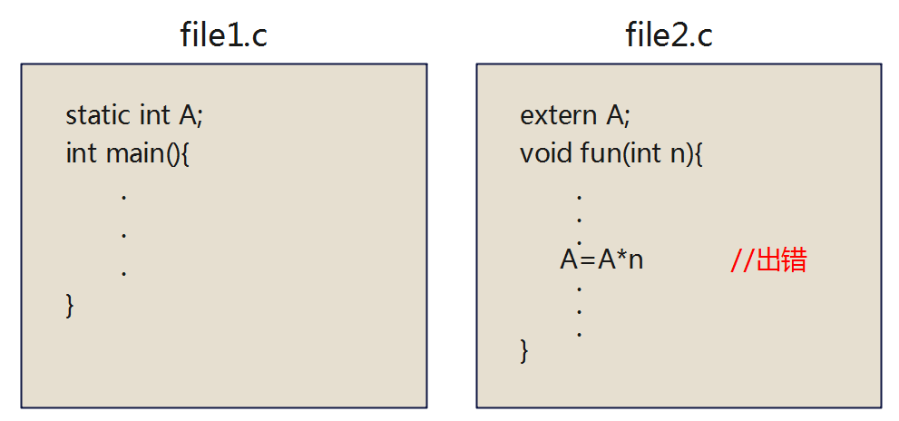

这种加上static声明、只能用于本文件的全局变量称为**静态全局变量**。在程序设计中，常由若干人分别完成各个模块，各人可以独立地在其设计的文件中使用相同的外部变量名而互不相干。只须在每个文件中定义外部变量时加上static即可。

这就为程序的模块化、通用性提供方便。如果已确认其它文件不需要引用本文件的外部变量，就可以对本文件中的外部变量都加上static，成为静态外部变量，以免被其它文件误用。

#### 5.3.3 const修饰变量

在C语言中，`const` 关键字用于创建常量，它指示编译器将标识符（变量、参数、函数等）视为不可修改的值。const关键字可以应用于不同的上下文，以下是它的主要用途和使用方法：

**1、常量变量声明**：

```c
void func1() {
    const int myConstant = 42;
    myConstant = 23; //报错，因为myConstant是常量
}
```

在上面的示例中，myConstant被声明为一个整数常量，它的值在程序的执行期间不能被修改。任何尝试修改它的操作都会导致编译器错误。

**2、指向常量的指针**：

```c
void func2() {
    int num1 = 10;
    const int *ptr;
    ptr = &num1;
    *ptr = 20; //报错

}
```

这里，ptr 是一个指向常量整数的指针，这意味着你可以使用 ptr 访问整数 x，但不能通过 ptr 修改x的值。

上面这种写法，const 只限制 *ptr 不能修改，而 ptr 本身的地址是可以修改的。

**3、常量指针**：

如果想限制 ptr不能修改 ，可以把 const 放在 ptr 前面，此时即为常量指针

```c
void func3() {

    int num1 = 10;
    int *const ptr = &num1;

    int num2 = 20;
    ptr = &num2; //报错
    
    *ptr = 20;   //未报错
}
```

或

```c
void func(int* const p) {
  int x = 13;
  p = &x; // 报错
}
```

如果想同时限制修改 ptr 和 *ptr ，需要使用两个 const 。

```c
void func3() {

    int num1 = 10;
    const int *const ptr = &num1;

    int num2 = 20;
    ptr = &num2; //报错

    *ptr = 20;   //报错
}
```

**4、常量参数**：

```c
void func4(const int param) {
    param = 20; //报错
}
```

这个函数声明中，param 是一个常量参数，这意味着在函数内部不能修改传递给它的参数的值。

**5、常量数组**：

```c
void func5() {
    const int arr[] = {1, 2, 3, 4};
    
    arr[0] = 10; //报错
    arr[1] = 20; //报错
}
```

numbers 数组被声明为一个包含整数常量的数组。这表示数组的每个元素都是常量，不能被修改。

**6、常量结构体**：

```c
struct Point {
    const int x;
    const int y;
};
```

在结构体声明中使用 const 可以创建包含常量成员的结构体，这表示结构体的每个成员都不能被修改。

> 总结： 
>
> const 关键字有助于编程中的可读性和代码的安全性，因为它使得编译器能够在编译时捕获对常量的非法修改。在编写代码时，使用 const 可以明确表达你的意图，告诉其他人或将来的自己这个值不应该被修改。


> 【四川大学2017研】在C语言中，形参的缺省存储类型是（　　）。
> A．auto
> B．register
> C．static
> D．extern
>
> 【答案】A
>
> 【解析】形参是局部变量，缺省类型为auto型。


小结：

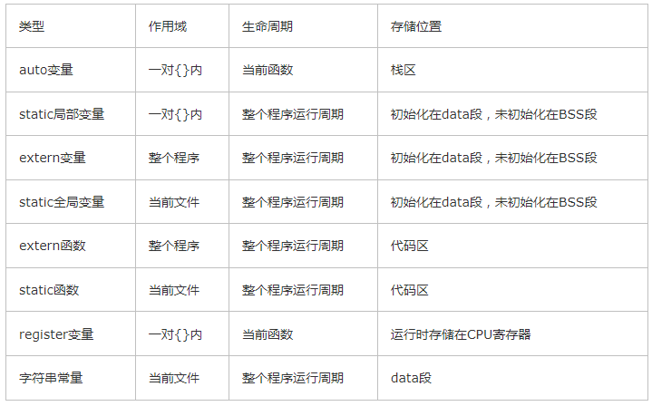

 <p id = "第07章_结构体与共用体"></p> 

# 第07章_结构体与共用体

## 本章专题脉络

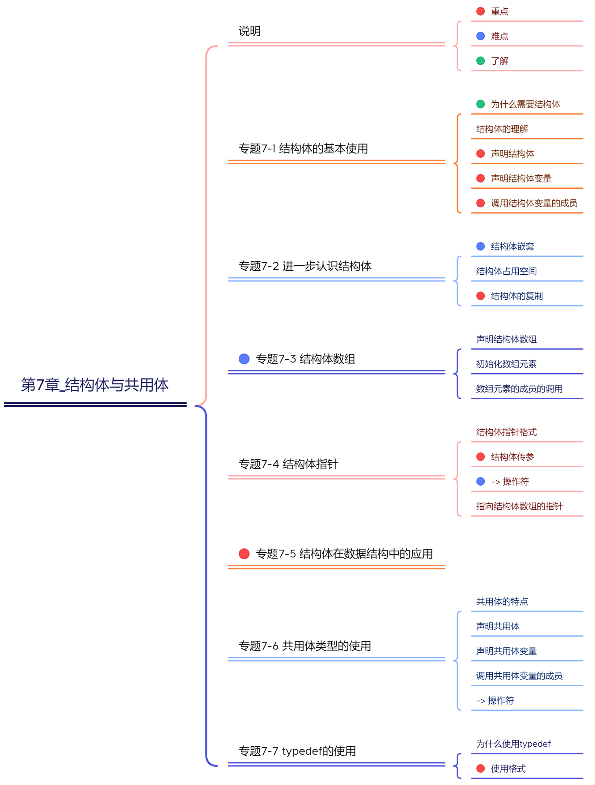

## 1、结构体(struct)类型的基本使用

### 1.1 为什么需要结构体？

C 语言内置的数据类型，除了几种原始的基本数据类型，只有数组属于复合类型，可以同时包含多个值，但是只能包含`相同类型`的数据，实际使用场景受限。

**举例1：**

现有一个需求，编写学生档案管理系统，这里需要描述一个学生的信息。该学生的信息包括学号、姓名、性别、年龄、家庭住址等，这些数据共同说明一个学生的总体情况。


显然，这些数据类型各不相同，无法使用数组进行统一管理。

**举例2：**

隔壁老王养了两只猫咪。一只名字叫小黄，今年2岁，橘色；另一只叫小黑，今年3岁，黑色。请编写一个程序，当用户输入小猫的名字时，就显示该猫的名字，年龄，颜色。如果用户输入的小猫名错误，则显示老王没有这只猫。

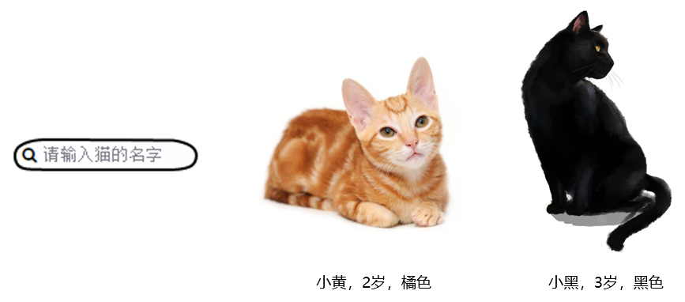

传统的解决方法

`尝试1`：单独定义多个变量存储，实现需求。但是，多个变量，不便于数据的管理。

`尝试2`：使用数组，它是一组具有相同类型的数据的集合。但在编程中，往往还需要一组类型不同的数据，例如猫的名字使用字符串、年龄是int，颜色是字符串，因为数据类型不同，不能用一个数组来存放。

`尝试3`：C语言提供了结构体。使用结构体，内部可以定义多个不同类型的变量作为其成员。

> 考研中见的最多的就是指针和结构体结合起来构造结点（如链表的结点、二叉树的结点等）。

### 1.2 结构体的理解

C 语言提供了 `struct`关键字，允许自定义复合数据类型，将不同类型的值组合在一起，这种类型称为结构体（structure）类型。

C 语言没有其他语言的对象(object)和类(class)的概念，struct 结构很大程度上提供了对象和类的功能。

比如：

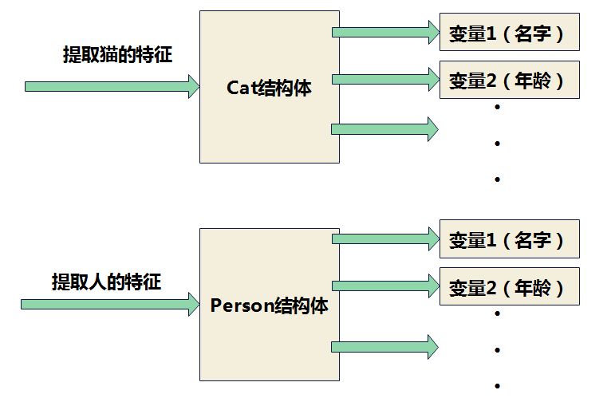

### 1.3 声明结构体

构建一个结构体类型的一般格式：

```c
struct 结构体名{ 
    数据类型1 成员名1;   //分号结尾
    数据类型2 成员名2; 
    ……
    数据类型n 成员名n;
}; //注意最后有一个分号
```

举例：学生

```c
struct Student{       // 定义结构体：学生
    int id;           //学号
    char name[20];    //姓名
    char gender;      //性别
    char address[50]; //家庭住址
};  
```

举例：猫

```c
struct Cat{
    char name[20];   //名字
    int age;         //年龄
    char color[20];  //颜色
};
```

举例：人类

```c
struct Person{
    char name[20];    //姓名
    char gender;      //性别
    int age;          //年龄
    double weight;    //体重
}; 
```

举例：通讯录

```c
struct Contacts{            
    char name[50];          //姓名
    int year;               //年
    int month;              //月
    int day;                //日
    char email[100];        //电子邮箱
    char phone_number[15]; //手机号
};
```

举例：员工

```c
struct Employee {  
    int id;               //员工编号 
    char name[20];		  //员工姓名
    char gender;		  //员工性别
    int age;			  //员工年龄
    char address[30];	  //员工住址
};
```

### 1.4 声明结构体变量并调用成员

定义了新的数据类型以后，就可以声明该类型的变量，这与声明其他类型变量的写法是一样的。

**声明结构体变量格式1：** 

```c
struct 结构体类型名称 结构体变量名;
```

> 注意，声明自定义类型的变量时，类型名前面，不要忘记加上 struct 关键字。

举例：

```c
struct Student stu1;
```

**调用结构体变量的成员：**

```c
结构体变量名.成员名 [= 常量或变量值]
```

举例：

```c
#include <stdio.h>
#include <string.h>
int main() {

    struct Student stu1; //声明结构体变量
	
    //调用结构体成员
    stu1.id = 1001;
    //stu1.name = "Tom"; //报错，不能直接通过赋值运算符来给字符数组赋值
    strcpy(stu1.name, "Tony");
    stu1.gender = 'M';
    strcpy(stu1.address, "北京市海淀区五道口");

    printf("id = %d,name = %s,gender = %c,address = %s\n", 
           stu1.id, stu1.name, stu1.gender, stu1.address);

    return 0;
}
```

> 说明：
>
> 1）先声明了一个 struct Student类型的变量 stu1，这时编译器就会为 stu1 分配内存，接着就可以为 stu1 的不同属性赋值。可以看到，struct 结构的属性通过点（ . ）来表示，比如 id 属性要写成 stu1.id。
>
> 2）字符数组是一种特殊的数组，直接改掉字符数组名的地址会报错，因此不能直接通过赋值运算符来对它进行赋值。你可以使用字符串库函数 `strcpy()` 来进行字符串的复制操作。

**声明结构体变量格式2：** 

除了逐一对属性赋值，也可以使用大括号，一次性对 struct 结构的所有属性赋值。此时，初始化的属性个数最好与结构体中成员个数相同，且成员的先后顺序一一对应。格式：

```c
struct 结构体名 结构体变量={初始化数据};
```

举例：

```c
//声明结构体
struct Car {
  char* name;
  double price;
  int speed;
};

//声明结构体变量
struct Car audi = {"audi A6L", 460000.99, 175};
```

> 注意：如果大括号里面的值的数量少于属性的数量，那么缺失的属性自动初始化为 0 。

```c
struct Student {
    int id;
    char name[20];
    char gender;
    int score;  //学生成绩

};

int main() {
    struct Student stu = {1001, "songhk", 'M'};
    printf("Name: %s\n", stu.name);
    printf("Score: %d\n", stu.score);

    return 0;
}
```


**声明结构体变量格式3：** 

方式2中大括号里面的值的顺序，必须与 struct 类型声明时属性的顺序一致。此时，可以为每个值指定属性名。

格式：

```c
struct 结构体名 结构体变量={.成员1=xxx,.成员2=yyy,...};
```

举例：

```c
struct Car audi = {.speed=175, .name="audi A6L"};
```

> 同样，初始化的属性少于声明时的属性，剩下的那些属性都会初始化为 0 。

声明变量以后，可以修改某个属性的值。

```c
struct Car audi = {.speed=175, .name="audi A6L"};
audi.speed = 185;  //将 speed 属性的值改成 185
```


**声明结构体变量格式4：** 声明类型的同时定义变量

struct 的数据类型声明语句与变量的声明语句，可以合并为一个语句。格式：

```c
struct 结构体名 {
    成员列表
} 变量名列表;
```

举例：同时声明了数据类型 Circle 和该类型的变量 c1

```c
struct Circle {
	int id;
    double radius;
} c1;
```

举例：

```c
struct Employee {
    char name[20];
    int age;
    char gender;
    char phone[11];
} emp1, emp2;
```


**声明结构体变量格式5：** 不指定类型名而直接定义结构体类型变量

如果类型标识符（比如Student、Circle、Employee等）只用在声明时这一个地方，后面不再用到，那就可以将类型名省略。 该结构体称为`匿名结构体`。

格式：

```c
struct {
    成员列表;
} 变量名列表;
```

举例：

```c
struct {
    char name[20];
    int age;
    char gender;
    char phone[11];
} emp1, emp2;
```

struct 声明了一个匿名数据类型，然后又声明了这个类型的两个变量emp1、emp2 。与其他变量声明语句一样，可以在声明变量的同时，对变量赋值。

举例：

```c
struct {
    char name[20];
    int age;
    char gender;
    char phone[11];
} emp1 = {"Lucy", 23, 'F', "13012341234"},
  emp2 = {"Tony", 25, 'M', "13367896789"};
```

上例在声明变量 emp1 和 emp2 的同时，为它们赋值。


**声明结构体变量格式6：** 使用 typedef 命令

使用 typedef 可以为 struct 结构指定一个别名，这样使用起来更简洁。

举例：

```c
//声明结构体
typedef struct cell_phone {
    int phone_no;              //电话号码
    double minutes_of_charge;  //每分钟费用
} Phone;

//声明结构体变量
Phone p = {13012341234, 5};
```

上例中， Phone 就是 struct cell_phone 的别名。声明结构体变量时，可以省略struct关键字。

这种情况下，C 语言允许省略 struct 命令后面的类型名。进一步改为：

```c
//声明匿名结构体
typedef struct {
    int phone_no;
    double minutes_of_charge;
} Phone;

//声明结构体变量
Phone p = {13012341234, 5};
```

进一步，在考研中，还会出现如下的声明方式：

```c
typedef struct {
    int phone_no;
    double minutes_of_charge;
} Phone,*pPhone;
```

这里多了个*pPhone，其实在定义一个结点指针p时，`Phone *p;` 等价于 `pPhone p; `，前者的写法类似于int *a、char *b等更方便记忆，不必再加个pPhone p来增加记忆负担。所以在考研中我们不采用这种方法，统一删掉 *pPhone的写法。

> 说明：
>
> 1、在创建一个结构体变量后，需要给成员赋值。在没有给成员赋值的情况下调用，打印的值是垃圾数据，可能导致程序异常终止。
>
> 2、不同结构体变量的成员是独立的，互不影响，一个结构体变量的成员更改，不影响另外一个。

### 1.5 举例

**练习：盒子案例**

（1）编程创建一个Box结构体，在其中定义三个成员表示一个立方体的长、宽和高，长宽高可以通过控制台输入。

（2）定义一个函数获取立方体的体积（volume）。

（3）创建一个结构体，打印给定尺寸的立方体的体积。

```c
#include <stdio.h>

// 1. 定义Box结构体
struct Box {
    double length;
    double width;
    double height;
};

// 2. 获取立方体体积的函数
double getVolume(struct Box box) {
    return box.length * box.width * box.height;
}

int main() {

    // 3. 创建结构体实例
    struct Box box;
    printf("输入长度：");
    scanf("%lf", &box.length);

    printf("输入宽度：");
    scanf("%lf", &box.width);

    printf("输入高度：");
    scanf("%lf", &box.height);

    // 调用函数获取体积并打印
    printf("体积为: %.2lf\n", getVolume(box));

    return 0;
}
```


### 1.6 小 结

区分三个概念：结构体、结构体变量、结构体变量的成员。

- 结构体是**自定义的数据类型**，表示的是一种数据类型。

- 结构体变量代表一个具体变量。类比：

  ```c
  int num1 ; // int 是数据类型, 而num1是一个具体的int变量
  
  struct Car car1; // Car 是结构体数据类型，而car1是一个Car变量
  ```

- Car 就像一个“汽车图纸”，生成出来的具体的一辆辆汽车，就类似于一个个的结构体变量。这些结构体变量都含有相同的成员，将结构体变量的成员比作“零件”，同一张图纸生产出来的零件的作用都是一样的。

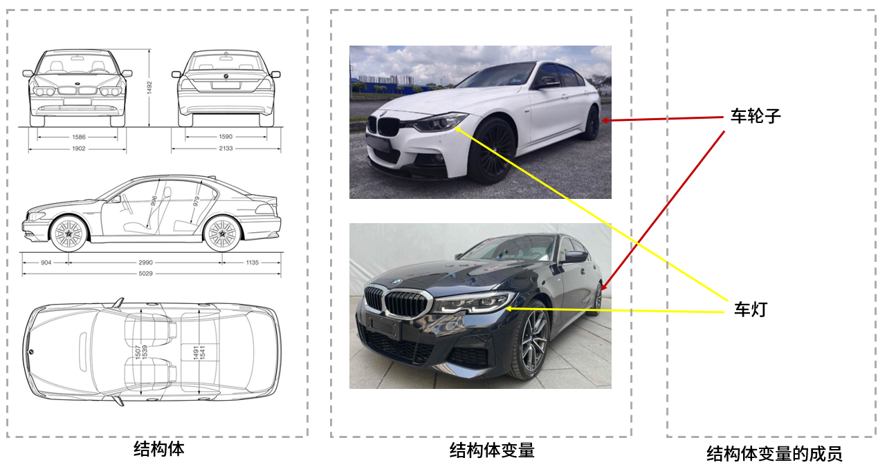

## 2、进一步认识结构体

### 2.1 结构体嵌套

结构体的成员也是变量，那么成员可以是`基本数据类型`，也可以是`数组`、`指针`、`结构体`等类型 。如果结构体的成员是另一个结构体，这就构成了结构体嵌套。

举例1：

```c
#include <stdio.h>
#include <string.h>

struct Name {
    char firstName[50];
    char lastName[50];
};

struct Student {
    int age;
    struct Name name;
    char gender;
} stu1;

int main(){
    strcpy(stu1.name.firstName, "美美");
    strcpy(stu1.name.lastName, "韩");
    //stu1.age = 18;
    //stu1.gender = 'F';

    //或者
    struct Name myname = {"美美","韩"};
    stu1.name = myname;
    //stu1.age = 18;
    //stu1.gender = 'F';
    return 0;
}
```

举例2：

```c
struct Date {    //声明一个结构体类型 struct Date 
    int year;    //年
    int month;   //月
    int day;     //日
};

struct Employee { //声明一个结构体类型 struct Employee
    int id;
    char name[20];
    int age;
    struct Date birthday; //成员birthday属于struct Date类型
};
```

声明结构体变量并调用成员：

```c
#include <stdio.h>
#include <string.h>

int main(){
    struct Employee emp1;

    emp1.id = 1001;
    strcpy(emp1.name,"Tony");
    emp1.age = 24;

    emp1.birthday.year = 2001;
    emp1.birthday.month = 3;
    emp1.birthday.day = 12;

    return 0;
}
```

说明：如果成员本身又属一个结构体类型，则要用若干个点（ . ），一级一级地找到最低的一级的成员。比如，`emp1.birthday.year`。

赋值的时候还有多种写法：

```c
#include <stdio.h>

int main() {
    //方式1：
    struct Employee emp1 = {1001, "Tony", 24, {1999, 10, 11}};

    //方式2：
    struct Date birthday = {2001, 5, 6};
    struct Employee emp2 = {1002, "Tom", 22, birthday};

    //方式3：
    struct Employee emp3 = {
            .id = 1003,
            .age = 24,
            .name = "Jerry",
            .birthday = {2001, 3, 16}};

    //方式4：
    struct Employee emp4 = {
            .id = 1003,
            .age = 27,
            .name = "Jerry",
            .birthday.year = 1998,
            .birthday.month = 8,
            .birthday.day = 12};

    return 0;
}
```

举例3：自我嵌套

单链表结构的结点定义如下：

```c
struct Node {
    int data;            //这里默认的是int型，如需其他类型可修改
    struct Node* next;   //指向Node型变量的指针
};
//等同于
typedef struct Node {
    int data;
    struct Node *next;
} LNode;
```

二叉树结构的结点定义如下：

```c
typedef struct BTNode {
    int data;              //这里默认的是int型，如需其他类型可修改
    struct BTNode *lchild;        //指向左孩子结点指针,在后续的二叉树章节中讲解
    struct BTNode *rchild;        //指向右孩子结点指针,在后续的二叉树章节中讲解
} BTNode;
```


### 2.2 结构体占用空间

结构体占用的存储空间，不是各个属性存储空间的总和。为了计算效率，C 语言的内存占用空间一般来说，都必须是 int 类型存储空间的整数倍。如果 int 类型的存储是4字节，那么 struct 类型的存储空间就总是4的倍数。

```c
struct A{
    char a;
    int b;
} s;

int main() {
    printf("%d\n", sizeof(s)); // 8
    return 0;
}
```

变量 s 的存储空间不是5个字节，而是占据8个字节。a 属性与 b 属性之间有3个字节的“空洞”。


### 2.3 结构体变量的赋值操作

同类型的结构体变量可以使用赋值运算符（ = ），赋值给另一个变量，比如

```c
student1 = student2; //假设student1和student2已定义为同类型的结构体变量
```

这时会生成一个`全新的副本`。系统会分配一块新的内存空间，大小与原来的变量相同，把每个属性都复制过去，即原样生成了一份数据。

也就是说，结构体变量的传递机制是值传递，而非地址传递。这一点跟数组的赋值不同，使用赋值运算符复制数组，不会复制数据，只是传递地址。

**举例1：**

```c
struct Car {
    double price;
    char name[30];
} a = {.name = "Audi A6L", .price = 390000.99};

int main() {
    struct Car b = a;

    printf("%p\n", &a); //结构体a变量的地址 00007ff75a019020
    printf("%p\n", &b); //结构体b变量的地址 000000a6201ffcd0

    printf("%p\n", a.name);  //结构体a变量的成员name的地址  00007ff719199028
    printf("%p\n", b.name);  //结构体b变量的成员name的地址  000000c2565ffd88

    a.name[0] = 'B';
    printf("%s\n", a.name); // Budi A6L
    printf("%s\n", b.name); // Audi A6L

    return 0;
}
```

上例中，变量 b 是变量 a 的副本，两个变量的值是各自独立的，修改掉 b.name 不影响 a.name 。

**举例2：** 将结构体内的字符数组改为字符指针

上个例子有个前提，就是 struct 结构的属性必须定义成字符数组，才可以复制数据。如果属性定义成字符指针，结果就不一样了。

```c
struct Car {
    char *name;
    double price;
} a = {"Audi A6L", 390000.99};

int main() {
    struct Car b = a;

    printf("%p\n", &a); //结构体a变量的地址 00007ff75a019020
    printf("%p\n", &b); //结构体b变量的地址 000000a6201ffcd0

    printf("%p\n", a.name); //结构体a变量的成员name的地址  00007ff7d778a000
    printf("%p\n", b.name); //结构体b变量的成员name的地址  00007ff7d778a000

    return 0;
}
```

上例中， name 属性变成了一个字符指针，这时 a 赋值给 b ，此时的b变量仍然是新开辟的内存空间。但是，a 和 b的 name 成员保存的指针相同，也就是说两个属性共享同一个"Audi A6L"。

在C语言中，相同的字符串常量通常只会保存一份，即这些字符串常量共享相同的内存。当你声明多个指针变量并让它们指向相同的字符串常量时，它们实际上都指向相同的内存地址。字符串常量的共享，有助于减小程序的内存占用。

> 注意：C 语言没有提供比较两个自定义数据结构是否相等的方法，无法用比较运算符（比如 == 和 != ）比较两个数据结构是否相等或不等。


>  【武汉科技大学2019研】已知书籍结构体定义如下，则对结构体变量bk的正确赋值是（　）。
>
>  ```c
>  struct BOOK {
>    struct {
>        int year, month, day;
>    } publish;
>  } bk; 
>  ```
>
>  A．bk.year＝1998；  bk.month＝11；  bk.day＝11；
>  B．publish.year＝1998；  publish.month＝11；  publish.day＝11；
>  C．year＝1998；  month＝11；  day＝11；
>  D．bk.publish.year＝1998；  bk.publish.month＝11；  bk.publish.day＝11；
>
>  【答案】D
>
>  【解析】变量bk是结构体BOOK的一个结构体变量，该变量含有一个成员变量publish，publish也是一个结构体变量，该结构变量含三个成员变量，分别是year、month、day，结构体变量中的成员变量不可直接访问，必须以结构体变量名.成员变量名形式访问，所以只能通过bk.publish.year形式访问到最内层的变量并为其赋值，答案选D。


## 3、结构体数组

### 3.1 对比结构体与数组

```c
//定义一个结构体A
typedef struct{
    int a ;
    char b;
    float c;
} A;
//定义一个结构体变量
A a;

//定义一个数组类型的变量
int b[3];

```

语句int b[3]；定义了一个数组，名字为b，由3个整型分量组成。而语句A a；可以类似认为定义了一个数组，名字为a，只不过组成a数组的3个分量是不同类型的。对于数组b，b[0]、b[1]、b[2]分别代表数组中第1、第2、第3个同为int类型的元素的值。而结构体a中，a. a、a. b、a. c分别对应于结构体变量a 中第1、第2、第3个元素的值，两者十分相似。

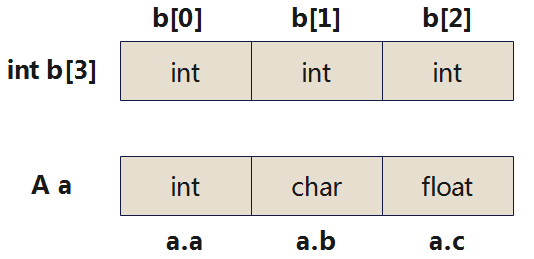

如果有3个结构体A类型的元素，如何存储呢？使用结构体数组，即：`A a[3]`

对比：`A a[3]`和`int b[3][3]`：

a数组中的每个元素都是结构型且每个元素都有3个分量，可以把它类比成一个二维数组。例如， `int b[3][3]`。

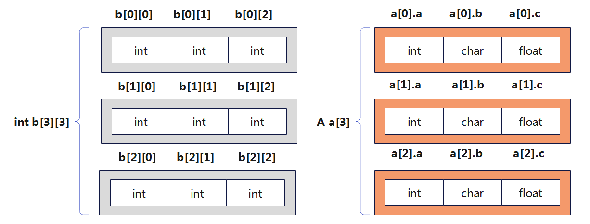

### 3.2 结构体数组的声明

**结构体数组：数组元素是结构体变量而构成的数组。** 先定义结构体类型，然后用结构体类型定义数组变量。

**方式1：** 先声明一个结构体类型，再用此类型定义结构体数组

```c
结构体类型 数组名[数组长度];
```

举例：

```c
struct Person{ 
	char name[20];
	int age;
};

struct Person pers[3]; //pers是结构体数组名
```

举例：

```c
struct Student{       // 定义结构体：学生
    int id;           //学号
    char name[20];    //姓名
    char gender;      //性别
    int age;          //年龄
}; 

struct Student stus[10]; //stus是结构体数组名
```

**方式2：** 定义结构体类型的同时，定义数组变量。

```c
struct 结构体名{
	成员列表;
} 数组名[数组长度];
```

举例：

```c
struct Person{ 
	char name[20];
	int age;
} pers[3];
```

举例：

```c
struct Date{
	int year;
	int month;
	int day;
}dates1[10],dates2[10];
```

### 3.3 初始化数组元素

**对应前面的声明方式1：**

举例：

```c
struct Student stus[3] = { {1001,"Tom",'M', 14},
                           {1002, "Jerry", 'M', 13},
                           {1003, "Lily",'F',12}};
```

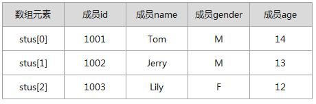

**对应前面的声明方式2：**

举例：

```c
struct Person {
    char name[20];
    int age;
} pers[3] = {{"Tom",   12},
             {"Jerry", 11},
             {"Lily",  10}};
```

或者：

```c
struct Person {
    char name[20];
    int age;
} pers[] = {{"Tom",   12},
             {"Jerry", 11},
             {"Lily",  10}};
```

> 说明：初始化结构体数组元素时，也可以不指定结构体数组的长度。系统在编译时，会自动根据初始化的值决定结构体数组的长度。

### 3.4 结构体数组元素的成员的调用

**方式1：使用数组角标方式**

```c
结构体数组名[下标].成员名
```

如：

```c
stus[1].age = 23;
```

**方式2：使用指向数组或数组元素的指针(下节讲)**

```c
指针->成员名
```

如：

```c
p->age=24;  //p为指向某个数组元素的指针
```


举例1：输入一个班级的学生信息(包含id、name、gender、score)，并把学习成绩超过全班平均成绩的学生找出来，输出这部分学生的姓名和成绩。

```c
#include <stdio.h>

#define N 4
#define MAX_NAME_LENGTH 20

struct Student {
    int id;
    char name[MAX_NAME_LENGTH];
    char gender;
    int score;
};

int main() {
    struct Student stu[N];
    int sum = 0;

    for (int i = 0; i < N; i++) {
        printf("请输入学生信息 (ID, 姓名, 性别, 成绩): \n");
        scanf("%d %19s %c %d", &stu[i].id, stu[i].name, &stu[i].gender, &stu[i].score);
        sum += stu[i].score;
    }

    double avg = (double)sum / N; //计算平均成绩
    printf("平均成绩为: %.2lf\n", avg);

    printf("高于平均分的学生:\n");
    for (int i = 0; i < N; i++) {
        if (stu[i].score > avg) {
            printf("%-20s:%d\n", stu[i].name, stu[i].score);
        }
    }
    return 0;
}
```

测试如下：

```
请输入学生信息 (ID, 姓名, 性别, 成绩):
1 Tom M 89
请输入学生信息 (ID, 姓名, 性别, 成绩):
2 Jerry F 99
请输入学生信息 (ID, 姓名, 性别, 成绩):
3 Lucy F 56
请输入学生信息 (ID, 姓名, 性别, 成绩):
4 Tony M 66
平均成绩为: 77.50
高于平均分的学生:
Tom                 :89
Jerry               :99

Process finished with exit code 0
```

举例2：编写一个统计选票的系统，根据先后输入的候选人姓名，统计各人的得票数。

```c
#include <stdio.h>

#include <string.h>

#define N 3

struct Person { //声明结构体类型struct Person
    char name[20]; //候选人姓名
    int count; //候选人得票数
} leader[N] = {{"zhang3", 0},
               {"li4",    0},
               {"wang5",  0}}; //定义结构体数组并初始化

int main() {
    char leader_name[20]; //定义字符数组
    for (int i = 1; i <= 10; i++) {
        printf("你要投票给谁？(zhang3、li4、wang5)：");
        scanf("%s", leader_name); //输入所选的候选人姓名
        for (int j = 0; j < N; j++) {
            if (strcmp(leader_name, leader[j].name) == 0){
                leader[j].count++;
                break;
            }
        }
    }
    printf("\n统计结果:\n");
    for (int i = 0; i < N; i++)
        printf("%-10s:%d\n", leader[i].name, leader[i].count);

    return 0;
}
```


>  【武汉科技大学2019研】对于以下定义，能打印出字母h的语句是（　）。
>
>  ```c
>  struct person{ 
>  	char title[20];  
>  	int code;
>  };
>  
>  struct person book[5]＝{"Physics",17,"Math",18,"English",20,"History",18};
>  ```
>
>  A．printf（"%c"，book[0].title[1]）；
>  B．printf（"%c"，book[1].title[4]）；
>  C．printf（"%c"，book[2].title[7]）；
>  D．printf（"%c"，book[3].title[6]）；
>
>  【答案】A
>
>  【解析】person是一个自定义结构体类型，该结构体含有两个成员变量，分别是一个字符数组和一个int数据，BC选项打印出来的是'\0'；D选项打印出来的是y，只有A打印出来的是h，答案选A。


## 4、结构体指针

### 4.1 结构体指针格式

结构体指针：**指向结构体变量的指针** （将结构体变量的起始地址存放在指针变量中）

具体应用场景：①可以指向单一的结构体变量  ②可以用作函数的参数 ③可以指向结构体数组

定义结构体指针变量格式：

```c
struct 结构体名 *结构体指针变量名;

//int num;
//int *num;
```

举例：

```c
struct Book {
    char title[50];
    char author[10];
    double price;
};

struct Book *b1;
```

等价于

```c
struct Book {
    char title[50];
    char author[10];
    double price;
} *b1;
```

说明：变量 b1 是一个指针，指向的数据是 struct Book 类型的实例。

### 4.2 结构体传参

如果将 struct 变量传入函数，函数内部得到的是一个原始值的副本。

```c
#include <stdio.h>

struct Person {
    char *name;
    int age;
    char *address;
};

void addAge(struct Person per) {
    per.age = per.age + 1;
}

int main() {
    struct Person p1 = {"Tom", 20, "北京市海淀区"};
    addAge(p1);
    printf("age = %d\n", p1.age); // 输出 20
    return 0;
}
```

函数 addAge() 要求传入一个 struct 变量 per，但实际上传递的是 struct 变量p1的`副本`，改变副本影响不到函数外部的原始数据。

通常情况下，开发者希望传入函数的是同一份数据，函数内部修改数据以后，会反映在函数外部。而且，传入的是同一份数据，也有利于提高程序性能。这时就需要将 struct 变量的指针传入函数，通过指针来修改 struct 属性。如下

```c
struct Person {
    char *name;
    int age;
    char *address;
};

void addAge(struct Person *per) {   //说明1
    (*per).age = (*per).age + 1;    //说明2
}

int main() {
    struct Person p1 = {"Tom", 20, "北京市海淀区"};
    addAge(&p1);                    //说明3
    printf("age = %d\n", p1.age);   // 说明4：输出 21
    return 0;
}
```

- 说明1：per 是 struct 结构的指针，调用函数时传入的是指针。

- 说明2：函数内部必须使用 `(*per).age` 的写法，从指针拿到 struct 结构本身。因为运算符优先级问题，不能写成`*per.age`，会将per.age看成是一个指针，然后取其值。

- 说明3：结构体类型跟数组不一样，类型标识符本身并不是指针，所以传入时，指针必须写成 &p1。

- 说明4： addAge() 内部对 struct 结构的操作，就会反映到函数外部。


**练习1：**

（1）编写一个Dog结构体，包含name(char[10])、age(int)、weight(double)属性

（2）编写一个say函数，返回字符串，方法返回信息中包含所有成员值。

（3）在main方法中，创建Dog结构体变量，调用say函数，将调用结果打印输出。

写法1：

```c
#include <stdio.h>
#include <string.h>

// 定义Dog结构体
struct Dog {
    char name[10];  //或者  char * name;
    int age;
    double weight;
};

// 定义say函数，返回包含所有成员值的字符串
char* say(struct Dog dog) {
    static char info[100]; // 静态数组用于存储结果,此数组生命周期会持续到整个程序运行结束。
    sprintf(info, "Name: %s, Age: %d, Weight: %.2lf", dog.name, dog.age, dog.weight);
    return info;
}

int main() {
    // 创建Dog结构体变量
    struct Dog myDog;
    strcpy(myDog.name, "大黄");
    myDog.age = 3;
    myDog.weight = 12.5;

    // 调用say函数，打印结果
    char* result = say(myDog);
    printf("info = %s\n", result);

    return 0;
}
```

其中，sprintf() 函数是C标准库中的一个函数，它用于将格式化的数据写入一个字符数组(字符串)。

```
int sprintf(char *str, const char *format, ...);
> str：是一个字符数组，用于存储格式化后的字符串。
> format：是格式化字符串，包含了要输出的文本以及格式说明符，就像 printf() 函数中的格式字符串一样。
> ...：是可变参数，用于提供要格式化的数据。
```

顺便看一个问题，如果say()函数如下声明，请问main()中打印dog.name会是多少呢？为什么？

```c
char* say(struct Dog dog) {
    static char info[100]; // 静态数组用于存储结果,此数组生命周期会持续到整个程序运行结束。
    sprintf(info, "Name: %s, Age: %d, Weight: %.2lf", dog.name, dog.age, dog.weight);
    strcpy(dog.name, "小花");
    return info;
}

int main() {
    // 创建Dog结构体变量
    struct Dog myDog;
    strcpy(myDog.name, "大黄");
    myDog.age = 3;
    myDog.weight = 12.5;

    // 调用say函数，打印结果
    char* result = say(myDog);
    printf("info = %s\n", result);
    printf("name = %s", myDog.name);  //大黄
    return 0;
}
```

在C语言中，函数参数是按值传递的，这意味着 say 函数接受的是 dog 结构体的一个副本，而不是原始的 dog 结构体。因此，在 say 函数内部对 dog 结构体的修改不会影响到 main 函数中的原始结构体。

虽然在 say 函数内部将 dog.name 设置为 "小花"，但这只会影响 say 函数内的副本，而不会影响 main 函数中的 dog 结构体。所以，最后打印 dog.name 时输出的是 "大黄"，而不是 "小花"。

写法2：

```c
#include <stdio.h>
#include <string.h>

// 定义Dog结构体
struct Dog {
    char name[10];  //或者  char * name;
    int age;
    double weight;
};

// 定义say函数，返回包含所有成员值的字符串
char *say(struct Dog *dog) {
    static char info[100]; // 静态数组用于存储结果,此数组生命周期会持续到整个程序运行结束。
    sprintf(info, "Name: %s, Age: %d, Weight: %.2lf", (*dog).name, (*dog).age, (*dog).weight);
    return info;
}

int main() {
    // 创建Dog结构体变量
    struct Dog myDog;
    strcpy(myDog.name, "大黄");
    myDog.age = 3;
    myDog.weight = 12.5;

    // 调用say函数，打印结果
    char *result = say(&myDog);
    printf("info = %s\n", result);

    return 0;
}

```

练习2：

```c
struct S {
    int data[100];
    int num;
};
struct S s = {{1, 2, 3, 4}, 100};

//结构体传参
void print1(struct S s) {
    printf("%d\n", s.num);
}

//结构体地址传参
void print2(struct S *ps) {
    printf("%d\n", (*ps).num);
}

int main() {
    print1(s);     //传结构体
    print2(&s);    //传地址
    return 0;
}
```

从性能开销角度考虑，上面的 print1 和 print2 函数哪个好些？

答案：print2函数。函数传参的时候，参数是需要压栈的。如果传递一个结构体对象的时候，结构体过大，参数压栈的的系统开销比较大，所以会导致性能的下降。（考研中定义的结点作为形参时一定要注意考虑此问题）

> 结论：结构体传参的时候，建议传结构体的地址。

**练习3：景区门票**

一个景区根据游客的年龄收取不同价格的门票。

（1）请编写游客结构体（Visitor），包含姓名，年龄，应付票价

（2）编写函数ticket()，根据年龄段决定能够购买的门票价格并输出。

​          规则：年龄>=18，门票为20元，其它情况免费。

（3）可以循环从控制台输入名字和年龄，打印门票收费情况，如果名字输入n，则退出程序。

```c
#include <stdio.h>

#include <string.h>


//定义结构体
struct Visitor {
    char *name;  //姓名
    int age;     //年龄
    double pay;  //应付票价
};

//编写函数处理业务
void ticket(struct Visitor *visitor) {
    //判断
    if ((*visitor).age >= 18) {
        (*visitor).pay = 20;
    } else {
        (*visitor).pay = 0;
    }
}

int main() {
    //创建结构体变量(创建一个游客)
    struct Visitor visitor;
    //循环的输入名字和年龄
    while (1) {
        printf("请输入游客名字(输入n退出程序):");
        scanf("%s", visitor.name);
        //判断如果名字输入 n ,则退出程序
        if (!strcmp("n", visitor.name)) {
            break;
        }
        printf("请输入游客年龄:");
        scanf("%d", &visitor.age);
        //调用函数 ticket，获取应付的票价
        ticket(&visitor);
        printf("该游客应付票价=%.2lf\n", visitor.pay);
    }

    printf("退出程序");

    return 0;
}
```


### 4.3 -> 操作符

前面例子中，`(*per).age` 的写法很麻烦，C 语言就引入了一个新的箭头运算符（ `->` ），可以从结构体指针上直接获取属性，大大增强了代码的可读性。

```c
void addAge(struct Person * per) {
    per->age = per->age + 1;  //使用结构体指针访问指向对象的成员
}
```

另例：

```c
struct Student {
    char name[20];
    int age;
    char gender;
};

int main() {
    //打印结构体信息
    struct Student s = {"张三", 20, 'M'};

    //方式1：.为结构成员访问操作符
    printf("name = %s,age = %d,gender = %c\n", s.name, s.age, s.gender);

    struct Student *ps = &s;
    //方式2：.为结构成员访问操作符
    printf("name = %s,age = %d,gender = %c\n", (*ps).name, (*ps).age, (*ps).gender);

    //方式3：->操作符
    printf("name = %s,age = %d,gender = %c\n", ps->name, ps->age, ps->gender);

    return 0;
}
```

总结：如果指针变量p指向一个结构体变量stu，以下3种用法等价：

```
① stu.成员名    stu.num
② (*p).成员名   (*p).num
③ p->成员名     p->num
```

### 4.4 指向结构体数组的指针

举例：

```c
struct Person {
    int id;
    char name[20];
};

int main() {

    struct Person per;
    struct Person arr[5];

    struct Person *p,*q;

    p = &per;  //指向单个结构体变量
    q = arr;   //指向结构体数组

    return 0;
}
```

举例：

```c
#include <stdio.h>

struct Student {
    int id;
    char name[20];
    char gender;
} stu[3] = {{1001, "Tom",   'M'},
            {1002, "Jerry", 'M'},
            {1003, "Lily",  'F'}};

int main() {

    //方式1：
    for (int i = 0; i < 3; i++) {
        printf("%d%10s%3c\n", stu[i].id, stu[i].name, stu[i].gender);
    }

    //方式2：
    struct Student *p = stu;
    for (int i = 0; i < 3; i++) {
        printf("%d%10s%3c\n", p[i].id, p[i].name, p[i].gender);
    }

    //方式3：
    struct Student *q;
    for (q = stu; q < stu + 3; q++) {
        printf("%d%10s%3c\n", q->id, q->name, q->gender);
    }

    return 0;
}
```


> 【中央财经大学2018研】若有以下说明和语句：
>
> ```c
> struct worker {
>  int no;
>  char *name;
> } work, *p = &work; 
> ```
>
> 则以下引用方式不正确的是（　）。
> A．work.no
> B．(*p).no
> C．p->no
> D．work->no
>
> 【答案】D
>
> 【解析】结构体变量访问成员变量的引用方式采用“.”，而结构体指针采用“->”，因此AC是正确的，B项中*p表示结构体变量，因此可以用“.”，所以答案选择D。


## 5、结构体在数据结构中的应用

### 5.1 声明结点的结构体

链表是一种动态的数据存储结构（非固定长度），链表的基本单位是`结点(node)`，同一链表的所有结点具有相同的数据类型。而结点使用`结构体`类型进行定义。

一个链表结点包括数据域和指针域两部分：数据域存储需要处理的数据、指针域存储下一个结点的位置。

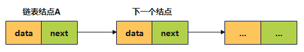

单链表结构的结点定义如下：

```c
struct Node {
    int data;           //这里默认的是int型，如需其他类型可修改
    struct Node *next;  //指向Node型变量的指针
};
```

或者：

```c
typedef struct Node {
    int data;
    struct Node *next;
} LNode;
```

二叉树结构的结点定义如下：

```c
struct BTNode {
    int data;                     //这里默认的是int型，如需其他类型可修改
    struct BTNode *lchild;        //指向左孩子结点指针
    struct BTNode *rchild;        //指向右孩子结点指针
};
```

或者

```c
typedef struct BTNode {
    int data;                     //这里默认的是int型，如需其他类型可修改
    struct BTNode *lchild;        //指向左孩子结点指针
    struct BTNode *rchild;        //指向右孩子结点指针
} BTNode;
```

### 5.2 声明结点变量

这里不需要事先说明链表所包括的结点个数，新数据到达时创建结点变量即可。

以创建二叉树结点为例，方式①：

```c
BTNode bt1;
```

方式②：

```c
BTNode *bt;
bt = (BTNode*) malloc(sizeof (BTNode));//此句要熟练掌握
```

方式①中只用一句就制作了一个结点，而方式②中需要两句，使用了系统已有的函数malloc()申请新结点所需内存空间，比①要烦琐。

②的执行过程为：先定义一个结点的指针bt，然后用函数malloc()来`动态申请`一个结点的内存空间，接着让指针 bt 指向这片内存空间，这样就完成了一个结点变量的创建。后续不需要数据时，删除结点，释放空间（使用`free(bt)`释放）即可。

### 5.3 两种方式对比

对比1：是否可以重新赋值

> ②中的bt是个指针型变量，用来存储刚创建好的结点的地址。因bt是变量，虽然现在bt指向了刚生成的结点，但是在以后必要的时候bt可以离开这个结点转而指向其他结点。而①则不行，①中的bt1就是某个结点的名字，一旦定义好，它就不能脱离这个结点了。
>
> 结论：②比①更灵活，因此②用得多。

对比2：①和②中的BT取分量的操作也是不同的。比如，想取其data 域的值赋给x。

对于①，用结构体变量直接取分量，其操作用`“.”`

```c
int x = bt1.data;
```

对于②，用指向结构体变量的指针来取分量，其操作用`“->”`

```c
int x = bt->data;
//等同于
int x = (*bt).data; //这里的()不要省略
```

> 考研数据结构中所有类型结点的内存分配中使用最多的就是方式② ，即使用函数malloc()来完成，模式固定，务必记忆。

**注意点**

可能会有人认可如下的两种简便写法。虽然这种写法简单，但是在一些纯C编译器中是不通过的，如果你所报考的目标学校严格要求用纯C语言来写程序，则不能这样写结构体定义。

```c
//链表结点：
struct Node {
    int data;
    Node *next;
};

//二叉树结点：
struct BTNode {
    int data;
    BTNode *lchild;
    BTNode *rchild;
};

```


### 5.4 malloc()模板

模板：（当需要制作一个新结点时，只要把结点结构型的名称填入括号中的“类型”处即可）

```c
类型 *p;
p = (类型 *)malloc(sizeof(类型));  //将=右边创建的结点的地址赋给p
```

举例：

```c
typedef struct BTNode {
    int data;
    struct BTNode *lchild;
    struct BTNode *rchild;
}BTNode;

int main() {
    BTNode *newNode;
    newNode = (BTNode *) malloc(sizeof(BTNode));

    return 0;
}
```

此外，还可以一次申请一组结点，可以看做是动态申请数组空间的方法。如下：

```c
int *p;
p = (int *) malloc(n * sizeof(int));
```

这样就申请了一个由指针p所指的( p指向数组中第一个元素的地址)元素为int 型的、长度为n 的动态数组。取元素时和一般的数组(静态数组)一样，如取第二个元素，则可写成p[1]。

### 5.5 举 例

在考研的数据结构中，只需要熟练掌握以上两种结点(链表、二叉树)的定义方法，其他结点都是由这两种衍生而来的。

举例：定义结构体，表示学生结点

```c
struct StudentNode {
    int id;
    char name[20];
    struct StudentNode *next;
};
```

创建多个结点，彼此构成链表

```c
#include <stdio.h>
#include <malloc.h>
#include <string.h>

typedef struct StudentNode {
    int id;
    char name[20];
    struct StudentNode *next;
} StuNode;

int main() {

    StuNode *head;

    // 生成一个三个节点的列表 {1001,"Tom"} -> {1002,"Jerry"} -> {1003,"Lily"}
    head = (StuNode *)malloc(sizeof(StuNode));
    head->id = 1001;
    strcpy(head->name, "Tom");

    StuNode *p = (StuNode *)malloc(sizeof(StuNode));
    p->id = 1002;
    strcpy(p->name, "Jerry");
    head->next = p;

    p = (StuNode *)malloc(sizeof(StuNode));
    p->id = 1003;
    strcpy(p->name, "Lily");
    head->next->next = p;

    //遍历链表
    StuNode *cur;
    for (cur = head; cur != NULL; cur = cur->next) {
        printf("id = %d,name = %s\n", cur->id, cur->name);
    }

    return 0;
}
```

构成如下图的链表：

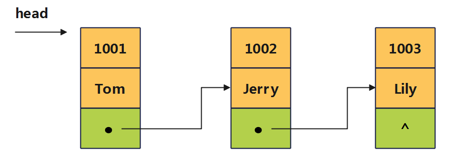

为了准确定位第一个结点，每个链表要有一个表头指针，从第一个结点开始，沿指针链遍历链表中的所有结点。

## 6、共用体类型(union)

### 6.1 共用体概述

有时需要一种数据结构，不同的场合表示不同的数据类型。比如，如果只用一种数据结构表示学生的“成绩”，这种结构就需要有时是整数（80、90），有时是字符（'A'、'B'），又有时是浮点数（80.5、60.5）。

**C 语言提供了共用体类型(Union 结构)，用来自定义可以灵活变更的数据结构。** 它内部可以包含各种属性，但同一时间只能有一个属性，因为所有属性都保存在同一个内存地址，后面写入的属性会覆盖前面的属性。这样做的最大好处是`节省内存空间`。

“共用体”与“结构体”的定义形式相似，但它们的含义是不同的。

- 结构体变量所占内存长度是各成员占的内存长度之和；每个成员分别占有其自己的内存单元。
- 共用体变量所占的内存长度等于最长的成员的长度；几个成员共用一个内存区。

### 6.2 声明共用体

格式：

```c
union 共用体类型名称{
    数据类型 成员名1;
    数据类型 成员名2;
    …
    数据类型 成员名n;
};
```

举例：

```c
union Data {
    short m;
    float x;
    char c;
};
```

上例中， union 命令定义了一个包含三个属性的数据类型 Data。虽然包含三个属性，但是同一时间只能取到一个属性。最后赋值的属性，就是可以取到值的那个属性。

### 6.3 声明共用体变量

方式1：先定义共用体类型，再定义共用体变量

```c
union Data {
    short m;
    float x;
    char c;
};

//声明共用体变量
union Data a, b;
```

方式2：定义共用体类型的同时定义共用体变量

```c
union Data {
    short m;
    float x;
    char c;
} a, b;
```

方式3：直接定义共用体类型变量

```c
union {
    short m;
    float x;
    char c;
} a, b;
```

以共用体变量a为例，它由3个成员组成，分别是m、x和c，编译时，系统会按照最长的成员为它分配内存，由于成员x的长度最长，它占4个字节，所以共用体变量a的内存空间也为4个字节。

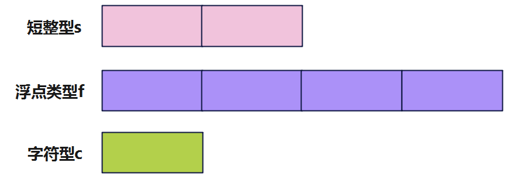

```c
union {
    short m;
    float x;
    char c;
} a, b;

int main(){
    printf("%d\n",sizeof(a));  //4
    return 0;
}
```

### 6.4 调用共同体变量的成员

**正确的方式**

方式1：

```c
union Data a;
a.c = 4;
```

方式2：声明共同体变量的同时，给任一成员赋值

```c
union Data a = {.c = 4};
```

方式3：声明共同体变量的同时，给首成员赋值

```c
union Data a = {8};
```

> 注意，方式3不指定成员名，所以只能为第一个成员进行赋值。

**错误的方式**

```c
union Data a = {1,1.5,'a'};  //错误的
```

**后续操作**

执行完上面的代码以后， 另外取其它属性取不到值。

```c
int main() {
    union Data a = {.c = 4};

    printf("c is %i\n", a.c); // c is 4
    printf("x is %f\n", a.x); // 未定义，x is 0.000000
}
```

如果要让 a.x属性可以取到值，就要先为它赋值。

```c
int main() {
    union Data a = {.c = 4};

    printf("c is %i\n", a.c); // c is 4
    printf("x is %f\n", a.x); // 未定义，x is 0.000000

    a.x = 0.5;
    printf("x is %f\n", a.x); // x is 0.500000
    printf("c is %i\n", a.c); // c is 0
}
```

一旦为其他属性赋值，原先可以取到值的 a.c 属性就不再有效了。除了这一点，Union 结构的其他用法与 Struct 结构，基本上是一致的。

### 6.5 ->操作符

Union 结构也支持指针运算符 -> 。

```c
union evaluation { //评价
    int score;
    float grade;
    char level;
};

int main() {
    union evaluation e;
    e.score = 85;

    union evaluation *p;
    p = &e;
    printf("%d\n", p->score); // 85

    return 0;
}
```

上例中， p 是 e 的指针，那么 p->score等同于 e.score。

了解：Union指针与它的属性有关，当前哪个属性能够取到值，它的指针就是对应的数据类型。

```c
union foo {
    int a;
    float b;
} x;

int main() {
    x.a = 12;
    int *p1 = (int *) &x;
    printf("%d\n", x.a);  // 12
    printf("%d\n", *p1); // 12

    x.b = 3.141592;
    float *p2 = (float *) &x;
    printf("%f\n", x.b);  // 3.141592
    printf("%f\n", *p2); // 3.141592

    return 0;
}
```

上例中， &x 是 foo 结构的指针，它的数据类型完全由当前赋值的属性决定。

### 6.6 补充说明

- 不能对共用体变量名赋值，也不能企图引用变量名来得到一个值。只能引用共用体变量中的成员。


- C99允许同类型的共用体变量互相赋值。


```c
a.i //引用共用体变量中的整型变量i
a.ch //引用共用体变量中的字符变量ch
a.f //引用共用体变量中的实型变量f
```

```c
printf("%d",a);   //错误的

printf("%d",a.i); //正确的
```

- C99允许用共用体变量作为函数参数。


```c
b = a; //a和b是同类型的共用体变量，合法
```

- 共用体类型可以出现在结构体类型定义中，也可以定义共用体数组。反之，结构体也可以出现在共用体类型定义中，数组也可以作为共用体的成员。

### 6.7 练习

现有一张关于学生信息和教师信息的表格。

学生信息包括姓名、编号、性别、职业、分数；

教师的信息包括姓名、编号、性别、职业、教学科目。

请看下面的表格，请使用共用体编程完成。

| name     | id    | gender | profession | score/course |
| -------- | ----- | ------ | ---------- | ------------ |
| 孙悟空   | 12345 | 男(m)  | 学生(s)    | 89.5         |
| 菩提祖师 | 1001  | 男(m)  | 老师(t)    | math         |
| 孙尚香   | 54321 | 女(f)  | 学生(s)    | 92.0         |
| 诸葛亮   | 34567 | 男(m)  | 老师(t)    | english      |

```c
#define TOTAL 2 //人员总数

struct Person {
    char name[20];
    int id;
    char gender; //性别  m->男  f->女
    char profession;//职业 s->学生  t->老师
    union {
        float score;
        char course[20];
    } sc; //sc 是一个共用体变量
};

int main() {
    int i;
    struct Person persons[TOTAL];  //定义一个结构体数组

    //输入人员信息
    for (i = 0; i < TOTAL; i++) {
        printf("Input info: ");
        scanf("%s %d %c %c", persons[i].name, &(persons[i].id), &(persons[i].gender), &(persons[i].profession));
        if (persons[i].profession == 's') { //如果是学生
            printf("请输入学生成绩：");
            scanf("%f", &persons[i].sc.score);
        } else { //如果是老师
            printf("请输入老师课程：");
            scanf("%s", persons[i].sc.course);
        }
    }

    //输出人员信息
    printf("\nName\tid\tgender\tProfession\tScore/Course\n");
    for (i = 0; i < TOTAL; i++) {
        if (persons[i].profession == 's') { //如果是学生
            printf("%s\t%d\t%c\t%c\t\t%f\n", persons[i].name,
                   persons[i].id, persons[i].gender, persons[i].profession, persons[i].sc.score);
        } else { //如果是老师
            printf("%s\t%d\t%c\t%c\t\t%s\n", persons[i].name,
                   persons[i].id, persons[i].gender, persons[i].profession, persons[i].sc.course);
        }

    }
    return 0;
}
```


## 7、typedef 的使用(熟悉)

### 7.1 为什么使用typedef

C语言允许为一个数据类型起一个新的别名，就像给人起“绰号”一样。

起别名的目的不是为了提高程序运行效率，而是为了`编码方便`。例如，有一个结构体的名字是 student，定义一个结构体变量stu1，代码如下：

```c
struct student stu1;
```

struct 看起来就是多余的，但不写又会报错。如果为 struct student起了一个别名 Student，书写起来就简单了：

```c
Student stu1;
```

这种写法更加简练，意义也非常明确，不管是在标准头文件中还是以后的编程实践中，都会大量使用这种别名。

### 7.2 使用格式

用typedef声明数组类型、指针类型，结构体类型、共用体类型等，使得编程更加方便。

**1、为某个基本类型起别名**

typedef 命令用来为某个类型起别名

```c
typedef 类型名 别名;
```

> 习惯上，常把用typedef声明的类型名的第1个字母用大写表示，以便与系统提供的标准类型标识符相区别。

举例：

```c
typedef int Integer;  //用Integer作为int类型别名，作用与int相同
Integer a, b;
a = 1;
b = 2;
```

`Integer a, b;`等同于`int a, b;`。

举例：

```c
typedef unsigned char Byte;  //为类型 unsign char 起别名 Byte
Byte c = 'z';
```

注意：使用 typedef 可以为基本类型一次起多个别名。

```c
typedef int chocolate, doughnut, mushroom; //一次性为 int 类型起了三个别名
```

**2、为结构体、共用体起别名**

为 struct、union等命令定义的复杂数据结构创建别名，从而便于引用。

```c
struct treenode {
  // ...
};

typedef struct treenode* Tree;  //Tree 为 struct treenode* 的别名
```

typedef 也可以与 struct 定义数据类型的命令写在一起。

```c
typedef struct animal {
  char* name;
  int legs;
  int speed;
} Animal;
```

上例中，自定义数据类型时，同时使用 typedef 命令，为 struct animal 起了一个别名 Animal 。

这种情况下，C 语言允许省略 struct 命令后面的类型名。

```c
typedef struct {
  char* name;
  int legs;
  int speed;
} Animal;
```

上例相当于为一个匿名的数据类型起了别名 Animal 。进而：

```c
//使用typedef之前
struct animal dog;

//使用typedef之后
Animal dog;
```

再举例：typedef 命令可以为 union 数据类型起别名。

```c
typedef union {
  short count;
  float weight;
  float volume;
} quantity;
```

上例中， union 命令定义了一个包含三个属性的数据类型， typedef 命令为它起别名为quantity 。

**3、为指针起别名**

typedef 可以为指针起别名。

```c
typedef int* intptr;
int a = 10;
intptr x = &a;
```

上例中， intptr 是 int* 的别名。不过，使用的时候要小心，这样不容易看出来，变量 x 是一个指针类型。

再举例：

```c
typedef char* String;

char * str1 = "hello"; //之前的写法
String str2 = "hello"; //现在的写法
```

为字符指针起别名为 String，以后使用 String声明变量时，就可以轻易辨别该变量是字符串。

**4、为数组类型起别名**

typedef 也可以用来为数组类型起别名。

```c
//举例1
typedef int five_ints[5];
five_ints x = {11, 22, 33, 44, 55};  

//举例2
typedef int Num[100]; //声明Num为整型数组类型名
Num a; //定义a为整型数组名，它有100个元素
```

上例中， five_ints 是一个数组类型。我们把原有的`int [5]`看做是数组的类型。

举例：指针数组

```c
typedef int (*PTR_TO_ARR)[4];
```

表示 PTR_TO_ARR 是类型`int * [4]`的别名，它是一个二维数组指针类型。接着可以使用 PTR_TO_ARR 定义二维数组指针：

```c
PTR_TO_ARR p1, p2;
```

**5、为函数起别名**

typedef 为函数起别名的写法如下

```c
typedef signed char (*fp)(void);
```

类型别名 fp 是一个指针，代表函数 signed char (*)(void) 。

再举例：

```c
typedef int (*PTR_TO_FUNC)(int, int);
PTR_TO_FUNC pfunc;
```

### 7.3 举 例

```c
#include <stdio.h>

int add(int a, int b) {
    int sum = a + b;
    return sum;
}

char str[3][30] = {"尚硅谷教育", "www.atguigu.com", "010-56253825"};


typedef int(*PTR_FUNC)(int,int);

typedef char (*PTR_ARR)[30];

int main() {

    //使用函数指针
    int (*add_ptr)(int,int);
    add_ptr = &add;
    int sum = (*add_ptr)(10,20);
    printf("sum = %d\n",sum);

    //使用数组指针
    char (*arr_ptr)[30]; //arr_ptr是一个指针，指向30个元素构成的char型数组
    arr_ptr = str; //将str[0]的首地址赋给ptr_arr指针
    for(int i = 0;i < 3;i++){
        printf("str[%d]=%s\n",i,*(arr_ptr + i));
    }

    //使用typedef之后：
    //调用函数
    PTR_FUNC ptr_add = &add;
    int sum1 = (*ptr_add)(10,20);
    printf("sum1 = %d\n",sum1);

    //调用数组
    PTR_ARR ptr_arr = str;
    for(int i = 0;i < 3;i++){
        printf("str[%d]=%s\n",i,*(ptr_arr + i));
    }

    return 0;
}
```

### 7.4 小 结

(1) typedef的方法实际上是为特定的类型指定了一个同义字(synonyms)。

(2) 用typedef只是对已经存在的类型指定一个新的类型名，而没有创造新的类型。

(3) typedef与#define是不同的。#define是在`预编译时处理`的，它只能作简单的字符串替换，而typedef是在`编译阶段处理`的，且并非简单的字符串替换。

(4) 当不同源文件中用到同一类型数据（尤其是像数组、指针、结构体、共用体等类型数据）时，常用typedef 声明这些同一的数据类型。

技巧：可以把所有的typedef名称声明单独`放在一个头文件`中，然后在需要用到它们的文件中用#include指令把它们包含到文件中。这样编程者就不需要在各文件中自己定义typedef名称了。

(5) 使用typedef名称有利于`程序的通用与移植`。有时程序会依赖于硬件特性，用typedef类型就便于移植。

某一个值在不同计算机上的类型，可能是不一样的。

```c
int i = 100000;
```

上面代码在32位整数的计算机没有问题，但是在16位整数的计算机就会出错。C 语言的解决办法，就是提供了类型别名，在不同计算机上会解释成不同类型，比如 int32_t 。

```c
int32_t i = 100000;
```

上例将变量 i 声明成 int32_t 类型，保证它在不同计算机上都是32位宽度，移植代码时就不会出错。

这一类的类型别名都是用 typedef 定义的。下面是类似的例子。

```c
typedef long int ptrdiff_t;
typedef unsigned long int size_t;
typedef int wchar_t;
```

这些整数类型别名都放在头文件 stdint.h ，不同架构的计算机只需修改这个头文件即可，而无需修改代码。

### 7.5 应用场景

**场景1：**

在考研中， typedef主要用在结构体的定义过程中，如二叉树结点的结构体定义，其他地方几乎不用。新定义的结构体若没有名字，则用typedef 给它起个名字是有必要的。

**场景2：**

对于已有的数据类型，如int、float等已经有了简洁的名字，还有必要给它起个新名字吗？有必要，但不是在考研数据结构中。举个例子：

在一个大工程中，对于其中的一个变量，在整个工程中都已经用int 型定义过了，但是工程如果要求修改，将所有int 型换成long型，如果事先给int型起个新名字为ElemType，则在整个工程中凡是类似于int x;的语句都写成ElemType x; ，此时只需将typedef int ElemType这一句中的int 换成long 即可实现全局的数据类型替换，这就是typedef 的意义所在。（上述这些对考研答卷的实际意义并不大。）

```c
typedef int ElemType;
ElemType i1, i2, i3;
```

上例中，变量 i1 、 i2 、 i3 的类型都是 int。如果以后需要为它们改类型，只需要修改typedef 语句即可。

```c
typedef long ElemType;
```

上面命令将变量 i1 、 i2 、 i3 的类型都改为 long。

 <p id = "第08章_C语言常用函数"></p> 

# 第08章_C语言常用函数

## 本章专题脉络

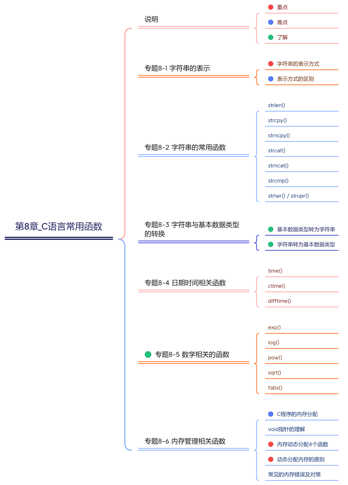

## 1、字符串相关函数

### 1.1 字符串的表示方式

C 语言没有单独的字符串类型，字符串被当作字符数组，即 char 类型的数组。表示方式如下：

**方式1：**

```c
char str[] = "hello";
```

**方式2：**

```c
char *str = "hello";
```

### 1.2 两种方式的区别

字符指针和字符数组，这两种声明字符串变量的写法基本是等价的，但是也有区别。

**区别1：** 指针指向的字符串，在 C 语言内部被当作常量，不能修改字符串本身。

```c
char* str = "hello!";
str[0] = 'z'; // 报错
```

如果使用数组声明字符串变量，就没有这个问题，可以修改数组的任意成员。

```c
char str[] = "hello";
str[0] = 'z'; // 不报错
```

为什么字符串声明为指针时不能修改，声明为数组时就可以修改？

因为系统会将字符串的字面量保存在内存的常量区，这个区域是不允许用户修改的。声明为指针时，指针变量存储的值是一个指向常量区的内存地址，因此用户不能通过这个地址去修改常量区。但是，声明为数组时，编译器会给数组单独分配一段内存，字符串字面量会被编译器解释成字符数组，逐个字符写入这段新分配的内存之中，而这段新内存是允许修改的。

测试代码：

```c
int main() {

    char str1[] = "hello"; //新开辟的空间，保存数组中的数据
    char str2[] = "hello"; //新开辟的空间，保存数组中的数据
    printf("%p\n",str1); //000000f4a93ff81a
    printf("%p\n",str2); //000000f4a93ff814

    char * str3 = "hello"; 
    char * str4 = "hello"; //与前一个str3的数据是共享的，存在于常量区
    printf("%p\n",str3); //00007ff6842ca004
    printf("%p\n",str4); //00007ff6842ca004
    
    return 0;
}
```

**区别2：** 指针变量可以指向其它字符串。

```c
char* s = "hello";
s = "world";
```

但是，字符数组变量不能指向另一个字符串。

```c
char s[] = "hello";
s = "world"; // 报错
```

字符数组的数组名，总是指向初始化时的字符串地址，不能修改。所以，声明字符数组后，不能直接用字符串赋值。

```c
char s[10];
s = "abc"; // 错误
```

为什么数组变量不能赋值为另一个数组？

因为数组变量所在的地址无法改变，或者说，编译器一旦为数组变量分配地址后，这个地址就绑定这个数组变量了，这种绑定关系是不变的，即不能用赋值运算符为它重新赋值。

想要重新赋值，必须使用 C 语言原生提供的 strcpy() 函数，通过字符串拷贝完成赋值。这样做以后，数组变量的地址还是不变的，即 strcpy() 只是在原地址写入新的字符串，而不是让数组变量指向新的地址。

```c
char s[10];
strcpy(s, "abc");
```


> 【武汉科技大学2019研】下面各语句中，能正确进行字符串操作的语句是（　　）。
> A．char a[10]＝{'A'，'B'，'C'，'D'，'\0'}；
> B．char a[10]；  a＝"ABCDE"；
> C．char *p；  *p＝"ABCDE"；
> D．char *s； scanf（"%s"， s）；
>
> 【答案】A
>
> 【解析】B项中，字符数组的数组名指向数组的首元素地址，初始化后不可再被更改；CD两项中的字符指针在定义时均没有进行初始化，对其赋值是非法的，答案选A。


>  【北京航空航天大学2018研】对于以下C程序，其正确的是（　　）。
>
>  ```c
>  #include<stdio.h>
>  int main(){  
>    char str1[]="Hello";  
>    char str2[]="Hello";  
>    if(str1==str2)    
>      printf("Equal\n");  
>    else    
>      printf("Unequal\n");  
>    return 0;
>  } 
>  ```
>
>  A．Unequal
>  B．Equal
>  C．该程序无法通过编译
>  D．该程序运行时出错
>
>  【答案】A
>
>  【解析】首先该程序符合语法规则，因此不会编译时产生错误，其次字符数组str1和str2都为指针常量，将他们直接用关系运算符进行比较肯定是不相等的，但是它们所指的字符串是相等的，因此最后输出Unequal。


### 1.2 字符串常用函数

这里的字符串处理函数，都属于**库函数**。库函数并非C语言本身的组成部分，而是C语言编译系统为方便用户使用而提供的公共函数。不同的编译系统提供的函数数量和函数名、函数功能都不尽相同，使用时要小心，必要时查一下**库函数手册**。

在使用字符串处理函数时，应当在程序文件的开头用`#include <string.h>`把 string.h 文件包含到本文件中。

#### strlen()

作用：返回字符串的字节长度，不包括末尾的空字符 '\0' 。

函数原型：

```c
// string.h
//参数是字符串变量，返回的是 size_t 类型的无符号整数,一般当做int类型处理。
size_t strlen(const char* s);
```

举例：

```c
#include <stdio.h>
#include <string.h>    //需要加载此头文件

int main() {
    char str[10] = "China";
    printf("%d\n", strlen(str));     //5

    printf("%d\n", strlen("China")); //5
    
    //区别于sizeof(),是两个不同的概念
    printf("%d\n", sizeof(str));        //10
}
```

#### strcpy()

**strcpy(字符数组1, 字符数组2)** ：字符串的复制，不能使用赋值运算符，直接将字符数组2的字符串复制到字符数组1中。

函数原型：

```c
// string.h
strcpy(char dest[], const char source[])
```

使用此函数前，如何复制字符串呢？

一方面，下面两种字符串的复制写法，都是错的。因为数组的变量名是一个固定的地址，不能修改，使其指向另一个地址。

```c
char str1[10];
char str2[10];
str1 = "abc"; // 报错
str2 = str1;  // 报错
```

另一方面，如果是字符指针，赋值运算符（ = ）只是将一个指针的地址复制给另一个指针，而不是复制字符串。

```c
char* str1;
char* str2;

str1 = "abc";
str2 = str1;
```

此时，可以使用 strcpy(字符数组1,字符数组2) 函数，用于将一个字符串的内容复制到另一个字符串（**前提**：字符数组1的长度不小于字符数组2的长度，否则会溢出）。

举例：

```c
#include <stdio.h>
#include <string.h>

int main() {
    char str1[10], str2[] = "China";
    strcpy(str1, str2);
    
    printf("%s\n",str1);

    //或
//    strcpy(str1, "China"); //参数2，也可以是一个字符串常量
//    printf("%s\n",str1);
    
    //进一步
    str1[0] = 'A';
    printf("%s\n",str1); //Ahina
    printf("%s\n",str2); //China
}
```

思考：如下程序的输出结果

```c
int main() {

    char str1[10] = "abcde1234", str2[] = "China";
    strcpy(str1, str2);

    printf("%s\n",str1); //

    for(int i = 0;i < 10;i++){
        printf("%c",str1[i]); //
    }
    printf("\n");

    return 0;
}
```

```
China
China 2345
```

复制时将字符串2和其后的′\0′一起复制到字符数组1中，取代字符数组1中前面的字符，未被取代的字符保持原有内容。

#### strncpy()

作用：将字符串2中前面n个字符复制到字符数组1中去。

```c
strncpy(str1, str2, n);
```

将str2中最前面n个字符复制到str1中，取代str1中原有的最前面n个字符。但复制的字符个数n不应多于str1中原有的字符（不包括′\0′）。

```c
int main() {

    char s1[40] = "1234567890";
    char s2[12] = "helloworld";
    strncpy(s1, s2, 5);
//    s1[5] = '\0';  //测试这行代码添加的必要性
    printf("%s\n", s1); // 

    return 0;
}
```

#### strcat()

**strcat(字符数组1, 字符数组2)**：把两个字符数组中的字符串连接起来，把字符串2接到字符串1的后面，结果放在字符数组1中，函数调用后得到一个函数值——字符数组1的地址。

函数原型：

```c
char* strcat(char* s1, const char* s2);
```

说明：

1、字符数组1必须足够大，以便容纳连接后的新字符串。

2、连接前两个字符串的后面都有′\0′，连接时将字符串1后面的′\0′取消，只在新串最后保留′\0′。

```c
#include <stdio.h>
#include <string.h>

int main() {
    char str1[30] = {"People′s Republic of "};
    char str2[] = {"China"};
    printf("%s\n", strcat(str1, str2)); //People′s Republic of China
    printf("%s\n", str1);  //People′s Republic of China

}
```

#### strncat()

作用：将字符串2中前面n个字符连接到字符数组1中去。

```c
strncat(str1, str2, n);
```

strncat() 总是会在拼接结果的结尾，自动添加空字符′\0′ ，所以第三个参数的最大值，应该是 str1 的变量长度减去 str1 的字符串长度，再减去 1 。

```c
#include <stdio.h>
#include <string.h>

int main() {

    char s1[10] = "Hello";
    char s2[8] = "World";
    strncat(s1, s2, 3);
    printf("%s\n", s1);  //HelloWor
    return 0;
}
```

#### strcmp()

函数原型：

```c
int strcmp(const char* s1, const char* s2);
```

**strcmp(字符串1, 字符串2)**：比较字符串1和字符串2。

字符串比较的规则是：将两个字符串自左至右逐个字符相比(按ASCII码值大小比较)，直到出现不同的字符或遇到′\0′为止。

(1) 如全部字符相同，则认为两个字符串相等。返回值为0

(2) 若出现不相同的字符，如果返回值为正数，则字符串1大；反之，返回值为负数，则字符串2大。

```c
#include <stdio.h>
#include <string.h>

int main() {
    char *str1 = "abxy";
    char *str2 = "abmn";
    printf("%d\n",strcmp(str1, str2));  // 1

    int compare1 = strcmp("China", "Korea");
    printf("%d\n",compare1);  // -1

    return 0;
}
```

#### strlwr()/strupr()

**strlwr(字符串)**：将字符串中大写字母换成小写字母。

**strupr(字符串)**：将字符串中小写字母换成大写字母。

```c
#include <stdio.h>
#include <string.h>

int main() {

    char str[] = "HelloWorld";
    strlwr(str);
    puts(str); //helloworld

    strupr(str);
    puts(str); //HELLOWORLD
}
```

### 1.3 基本数据类型和字符串的转换

在程序开发中，我们经常需要将基本数据类型转成字符串类型(即 char数组 )。或者将字符串类型转成基本数据类型。

#### 基本数据类型 -> 字符串

sprintf()函数可以将其他数据类型转换成字符串类型。此函数声明在`stdio.h`头文件中。

sprintf()和平时我们常用的printf()函数的功能相似，只是sprintf()函数输出到字符串中，而printf()函数输出到屏幕上。

```c
#include <stdio.h>

int main() {
    char str1[20]; //字符数组，即字符串
    char str2[20];
    char str3[20];
    int a = 111, b = 222;
    char c = 'a';
    double d = 333.444;


    sprintf(str1, "%d %d", a, b);
    sprintf(str2, "%d%c", a, c);
    sprintf(str3, "%.5f", d);
    printf("str1=%s\n", str1); //111 222
    printf("str2=%s\n", str2); //111a
    printf("str3=%s\n", str3); //333.44400
    
    return 0;
}
```

#### 字符串 -> 基本数据类型

调用头文件` <stdlib.h>` 的函数`atoi()` 或 `atof()` 即可。

```c
#include <stdio.h>
#include <stdlib.h>

int main() {
    char str1[10] = "123456";
    char str2[4] = "111";
    char str3[10] = "12.67423";
    char str4[2] = "a";

    int i = atoi(str1);
    int j = atof(str1);
    short s = atoi(str2);
    double d = atof(str3);
    char c = str4[0];
    printf("i=%d,j=%d,s=%d,d=%lf,c=%c", i, j, s, d, c);

    return 0;
}
```


## 2、日期和时间相关函数

在编程中，程序员会经常使用到日期相关的函数，比如：统计某段代码执行花费的时间等等。头文件是 `<time.h>`。

举例说明：

- 返回一个值，即格林尼治时间1970年1月1日00:00:00到当前时刻的时长，时长单位是秒。

```c
time_t time(time_t *t)
```

- 获取当前时间，返回一个表示当地时间的字符串(当地时间是基于参数timer的)。

```c
char *ctime(const time_t *timer)
```

- 计算time1和time2之间相差的秒数（time1-time2）

```c
double difftime(time_t time1, time_t time2)
```

举例：

```c
#include <stdio.h>
#include <time.h> //该头文件中，声明日期和时间相关的函数

//  运行test函数，看看执行花费时间
void test() {
    int i = 0;
    int sum = 0;
    int j = 0;
    for (i = 0; i < 10000000; i++) {
        sum = 0;
        for (j = 0; j < 100; j++) {
            sum += j;
        }
    }
}

int main() {
    printf("程序启动...\n");

    time_t start_t;
    //先得到执行test前的时间
    time(&start_t); //获取当前时间

    test(); //执行test

    time_t end_t;
    //再得到执行test后的时间
    time(&end_t); //获取当前时间

    double diff_t; //存放时间差
    diff_t = difftime(end_t, start_t); //时间差，按秒 ent_t - start_t


    //然后得到两个时间差就是耗用的时间
    printf("%d\n",start_t); //1697026306
    printf("%d\n",end_t); //1697026308
    printf("执行test()函数 耗用了%.2f 秒\n", diff_t); //执行test()函数 耗用了2.00 秒

    //获取时间对应的字符串的表示
    char * startTimeStr = ctime(&start_t);
    printf("%s\n",startTimeStr); //Wed Oct 11 20:11:48 2023

    return 0;
}
```


## 3、数学运算相关的函数

`math.h`头文件定义了各种数学函数。在这个库中所有可用的功能都带有一个 double 类型的参数，且都返回 double 类型的结果。

- double exp(double x) ：返回 e 的 x 次幂的值。
- double log(double x) ：返回 x 的自然对数（基数为 e 的对数）
- double pow(double x, double y) ：返回 x 的 y 次幂。
- double sqrt(double x) ：返回 x 的平方根。
- double fabs(double x) ：返回 x 的绝对值。

```c
#include <stdio.h>
#include <math.h>

int main() {
    double d1 = pow(2.0, 3.0);
    double d2 = sqrt(5.0);

    printf("d1=%.2f\n", d1); //d1=8.00
    printf("d2=%f\n", d2);   //d2=2.236068

    return 0;
}
```


## 4、内存管理相关函数

### 4.1 C程序的内存分配

**C程序中，不同数据在内存中分配说明：**

1) 全局变量和静态局部变量——内存中的静态存储区/全局区

2) 非静态的局部变量——内存中的动态存储区：stack 栈

3) 临时使用的数据——建立动态内存分配区域，需要时随时开辟，不需要时及时释放——heap 堆

4) 根据需要`向系统申请`所需大小的空间，由于未在声明部分定义其为变量或者数组，不能通过变量名或者数组名来引用这些数据，只能通过**指针**来引用）

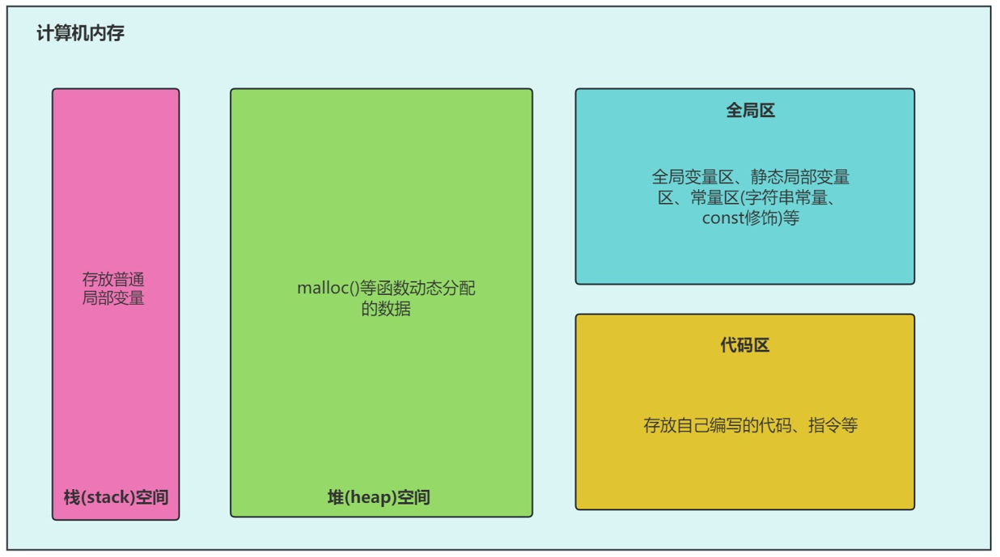

### 4.2 void 指针(无类型指针)

- 每一块内存都有地址，通过指针变量可以获取指定地址的内存块。

- 指针变量必须有类型，否则编译器无法知道如何解读内存块保存的二进制数据。但是，向系统请求内存的时候，有时不确定会有什么样的数据写入内存，需要先获得内存块，稍后再确定写入的数据类型。

综上，为了满足这种需求，C 语言提供了一种不定类型的指针，叫做 void 指针。它只有内存块的`地址信息`，`没有类型信息`，等到使用该块内存的时候，再向编译器补充说明，里面的数据类型是什么。

此外，由于void 指针等同于无类型指针(typeless pointer)，可以`指向任意类型`的数据，但是`不能解读数据`。void 指针与其他所有类型指针之间是`互相转换关系`，任一类型的指针都可以转为 void 指针，而 void 指针也可以转为任一类型的指针。

```c
int x = 10;
void *p = &x; // 整数指针转为 void 指针
int *q = p; // void 指针转为整数指针
```

```c
char a = 'X';
void* p = &a;
printf("%c\n", *p); // 报错
```

由于不知道 void 指针指向什么类型的值，所以不能用 * 运算符取出它指向的值。

> void 指针的重要之处在于，很多内存相关函数的返回值就是 void 指针。

### 4.3 内存动态分配函数

头文件` <stdlib.h>`声明了四个关于内存动态分配的函数。**所谓动态分配内存，就是按需分配，申请才能获得。**

#### 掌握：malloc()

函数原型：

```c
void *malloc(unsigned int size);  //size的类型为无符号整型
```

作用：在内存的`动态存储区(堆区)`中分配一个`长度为size`的`连续空间`。并将该空间的首地址作为函数值返回，即此函数是一个指针函数。

由于返回的指针的基类型为 void，应通过显式类型转换后才能存入其他基类型的指针变量，否则会有警告。如果分配不成功，返回空指针（NULL）。

举例1： 

```c
int *p;
p=(int *)malloc(sizeof(int));
```

举例2：动态申请数组空间

```c
int *p;
p = (int *)malloc(n * sizeof(int));
for (int i = 0; i < n; i++)
  p[i] = i * 5;
```

得到一个元素类型为int型，长度为n的数组。取元素方式与之前相同，如获取第2个元素：p[1]。

举例3：

```c
struct node *p;
p = (struct node *) malloc(sizeof(struct node));  //(struct node*)为强制类型转换
```

```c
typedef struct BTNode{
	int data;
	struct BTNode *lchild;
	struct BTNode *rchild;
}BTNode;

//声明二叉树结点方式1
BTNode bt1;
//声明二叉树结点方式2：需熟练掌握
BTNode *bt2;
bt2 = (BTNode*)malloc(sizeof(BTNode));
```

> 考研数据结构中所有类型结点的内存分配都可以用函数malloc()来完成，模式固定，容易记忆。

方式2中的BT是指针型变量，还可以指向其它节点。而方式1中的BT则不行。此外，调用结构体成员时，

```c
//针对于方式1：结构体变量取成员，用"."
int x = bt1.data;

//针对于方式2：指向结构体的指针取成员，用"->"
int x = bt2->data;
int x = (*bt2).data;//以前的写法
```

**关于返回值为NULL：**

malloc() 分配内存有可能分配失败，这时返回常量 NULL。Null 的值为0，是一个无法读写的内存地址，可以理解成一个不指向任何地方的指针。它在包括 `stdlib.h` 等多个头文件里面都有定义，所以只要可以使用 malloc() ，就可以使用 NULL 。由于存在分配失败的可能，所以最好在使用 malloc() 之后检查一下，是否分配成功。

```c
int* p = malloc(sizeof(int));
if (p == NULL) { // 内存分配失败
  
}
// 或
if (p != NULL) {
  //...
}
```

上面示例中，通过判断返回的指针 p 是否为 NULL ，确定 malloc() 是否分配成功。

#### 了解：calloc()

函数原型：

```c
void *calloc(unsigned int n,unsigned int size);
```

作用：在内存的**动态存储区(堆区)** 中分配n个，单位长度为size的连续空间，这个空间一般比较大，总共占用n*size 个字节。并将该空间的首地址作为函数的返回值。如果函数没有成功执行，返回NULL。

calloc()函数适合为`一维数组`开辟动态存储空间，n为数组元素个数，每个元素长度为size。

举例：

```c
int *p;
p = (int *)calloc(10,sizeof(int)); //开辟空间的同时，其内容初始化为零

//等同于
int* p;
p = (int *)malloc(10 * sizeof(int));
memset(p, 0, sizeof(int) * 10);
```

上面示例中， calloc() 相当于 malloc() + memset() 。

#### 了解：realloc()

函数原型： 

```c
void *realloc(void* p, unsigned int size)
```

作用：重新分配malloc()或calloc()函数获得的动态空间大小，即调整大小的内存空间。将先前开辟的内存块的指针p指向的动态空间大小改变为size，单位字节。返回值是一个全新的地址（数据也会自动复制过去），也可能返回跟原来一样的地址。分配失败返回NULL。

- realloc() 优先在原有内存块上进行缩减，尽量不移动数据，所以通常是返回原先的地址。
- 如果新内存块小于原来的大小，则丢弃超出的部分；如果大于原来的大小，则不对新增的部分进行初始化（程序员可以自动调用 memset() ）。

举例1：

```c
int* b;
b = (int *)malloc(sizeof(int) * 10);
b = (int *)realloc(b, sizeof(int) * 2000);
```

指针 b 原来指向10个成员的整数数组，使用 realloc() 调整为2000个成员的数组。


举例2：动态栈入栈时，判断是否需要扩容

```c
int push(SqStack &S, ElemType e) {
    if (S.top - S.bottom >= S.stacksize) {               //栈满，追加存储空间
        S.bottom = (ElemType *) realloc(S.bottom,(STACKINCREMENT + S.stacksize) * sizeof(ElemType));
        if (!S.bottom) //if(S.bottom == NULL)
            return FALSE;       //空间分配失败
        S.top = S.bottom + S.stacksize;
        S.stacksize += STACKINCREMENT;
    }
    *S.top = e;
    S.top++;     // 栈顶指针加1
    return TRUE;
}
```


#### 掌握：free()

函数原型：

```c
void free(void *p);
```

函数无返回值。p是最近一次调用malloc()或calloc()函数时的返回值。

作用：释放指针变量p所指向的内存空间，使这部分内存能重新被其它变量使用。否则这个内存块会一直占用到程序运行结束。

举例：

```c
int *p;
p=(int *)malloc(sizeof(int));
    
//...各种操作...
    
free(p); //千万不要忘了使用free()释放内存！
```

> 注意：
>
> 1、指针 p 必须是经过动态分配函数 malloc 成功后返回的首地址。
>
> 2、分配的内存块一旦释放，就不应该再次操作已经释放的地址，也不应该再次使用 free() 对该地址释放第二次。
>
> 3、如果忘记调用free()函数，同时p所在的函数调用结束后p指针已经消失了，导致无法访问未回收的内存块，构成内存泄漏。

### 4.4 举例

举例：动态创建数组，输入5个学生的成绩，另外一个函数检测成绩低于60 分的，输出不合格的成绩。

```c
#include <stdio.h>
#include <stdlib.h>

#define N 5

void check(int *ptr) {
    printf("\n不及格的成绩有: ");
    for (int i = 0; i < 5; i++) {
        if (ptr[i] < 60) {
            printf(" %d ", ptr[i]);
        }
    }
}

int main() {
    int *p;
    //动态创建数组
    p = (int *) malloc(N * sizeof(int));

    printf("请输入%d个成绩：\n",N);
    for (int i = 0; i < N; i++) {
        scanf("%d", p + i);
    }
    //检查不及格的学生
    check(p);
    
    free(p); //销毁 堆区 p 指向的空间

    return 0;
}
```

图示：

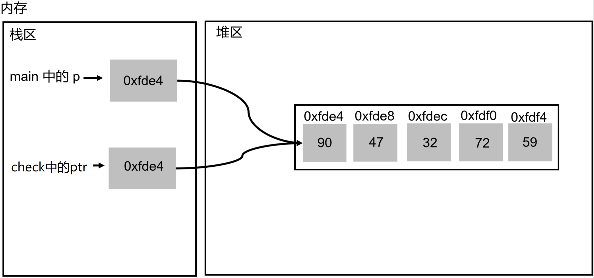


### 4.5 动态分配内存的基本原则

1）**避免分配大量的小内存块。** 分配堆上的内存有一些系统开销，所以分配许多小的内存块比分配几个大内存块的系统开销大

2）**仅在需要时分配内存。** 只要使用完堆上的内存块，就需要及时释放它，否则可能出现内存泄漏。

这里需要遵守原则：谁分配，谁释放。

3）**总是确保释放以分配的内存。** 在编写分配内存的代码时，就要确定在代码的什么地方释放内存。

### 4.6 常见的内存错误及其对策

**1）内存分配未成功，却使用了它**

新手常犯这种错误，因为他们没有意识到内存分配会不成功。

常用解决办法是，在使用内存之前检查指针是否为NULL。比如，如果指针p是函数的参数，那么在函数的入口处应该用`if(p==NULL)`或`if(p!=NULL)`进行防错处理。

**2）内存分配虽然成功，但是尚未初始化就引用它**

犯这种错误主要有两个起因：一是没有初始化的观念；二是误以为内存的缺省初值全为零，导致引用初值错误。

```c
int * p = NULL;
p = (int*)malloc(sizeof(int));
if (p == NULL){/*...*/}
/*初始化为0*/
memset(p, 0, sizeof(int));
```

题外话，无论用何种方式创建数组，都别忘了赋初值，即便是赋零值也不可省略，不要嫌麻烦。

**3）内存分配成功并且已经初始化，但操作时提示内存越界**

在使用数组时经常发生下标“+1”或者“-1”的操作，特别是在for循环语句中，循环次数很容易搞错，导致数组操作越界。

数组访问越界在运行时，它的表现是不定的，有时什么事也没有，程序一直运行（当然，某些错误结果已造成）；有时，则是程序一下子崩溃。

**4）忘记了释放内存，造成内存泄漏**

含有这种错误的函数每被调用一次就丢失一块内存。刚开始时系统的内存充足，你看不到错误。终有一次程序突然死掉，系统出现提示：内存耗尽。

动态内存的申请与释放必须配对，程序中`malloc()`与`free()`的使用次数一定要相同，否则肯定有错误。

**5）未正确的释放内存，造成内存泄漏**

程序中的对象调用关系过于复杂，实在难以搞清楚某个对象究竟是否已经释放了内存。此时应该重新设计数据结构，从根本上解决对象管理的混乱局面。

```c
#include <stdio.h>
#include <stdlib.h>

void getMemory(int *p) {
    p = (int *) malloc(sizeof(int));  // 在这里修改的是局部指针 p，不会影响 main 函数中的原始指针 ptr
    //....
}

int main() {
    int *ptr = NULL;
    getMemory(ptr);  // 将 ptr 的值传递给 getMemory，但是在函数内部修改的是 p，而不是 ptr
    printf("ptr = %d\n", *ptr);  // 这里的 *ptr 是未定义行为，因为 ptr 没有指向有效的内存
    free(ptr);  // 这里试图释放未分配的内存，会导致问题
}
```

在本例中，getMemory()中的p申请了新的内存，只是把 p所指的内存地址改变了，但是ptr丝毫未变。getMemory()中的p也始终没有进行内存的释放。事实上，因为没有用free释放内存，每执行一次getMemory()就会泄漏一块内存。

**6）释放了内存却继续使用它**

函数的return语句写错了，注意不要返回指向“栈内存”的“指针”或者“引用”，因为该内存在函数体结束时被自动销毁。

```c
long *p;

void addr() {
    long k;
    k = 0;
    p = &k;
}
void port() {
    long i, j;
    j = 0;
    for (i = 0; i < 10; i++) {
        (*p)--;
        j++;
    }
}


int main() {
    addr();
    port();
}


```

由于addr函数中的变量k在函数返回后就已经不存在了，但是在全局变量p中却保存了它的地址。在下一个函数port中，试图通过全局指针p访问一个不存在的变量，进而出错。


**在计算机系统，特别是嵌入式系统中，内存资源是非常有限的。尤其对于`移动端开发者`来说，硬件资源的限制使得其在程序设计中首要考虑的问题就是如何`有效地管理内存资源`。**

 <p id = "第09章_文件操作"></p> 

# 第09章_文件操作

## 本章专题脉络

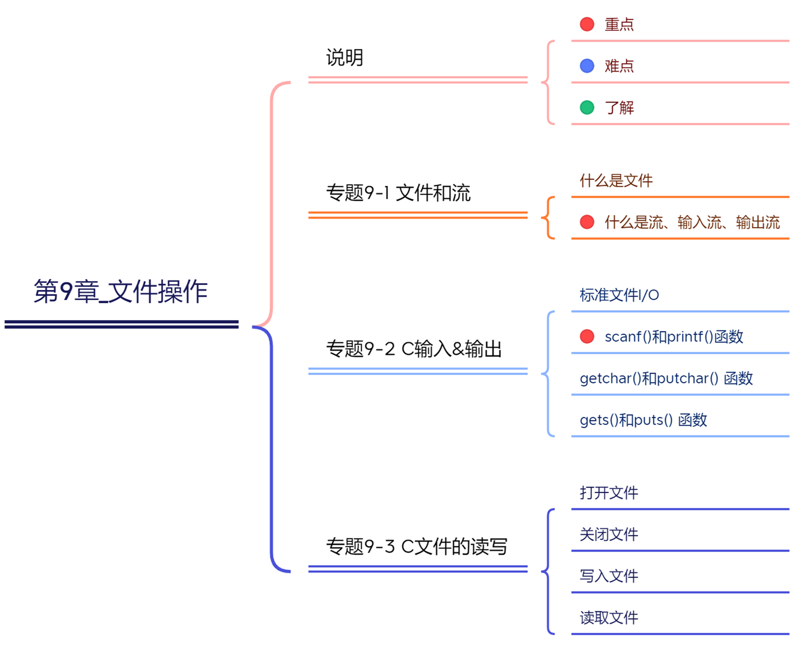

## 1、文件和流的介绍

文件，对我们并不陌生，文件是数据源（保存数据的地方）的一种，比如大家经常使用的word文档，txt文件，excel文件，avi文件...都是文件。文件最主要的作用就是`保存数据`，它既可以保存一张图片，也可以保持视频，声音...

C程序中，对于文件中数据的输入/输出操作以“`流(stream)`” 的方式进行，可以看做是一种数据的流动。

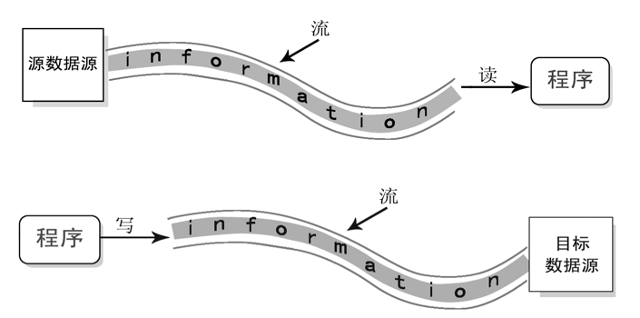

**输入流**：数据从数据源(比如:文件)到程序(或内存)的流动过程。

**输出流**：数据从程序(或内存)到数据源(比如:文件)的流动过程。

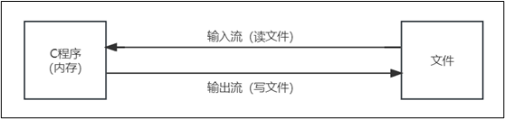


## 2、C 输入 & 输出

- 当我们提到输入时，这意味着要向程序(或内存)中写入一些数据。输入的数据来源可以是从`键盘`中、从`文件`中或从`网络`中。C 语言提供了一系列`内置的函数`来读取给定的输入，并根据需要写入到程序中。


- 当我们提到输出时，这意味着要在`屏幕`上、`打印机`上或`任意文件中`显示(或保存)一些数据。同样，C 语言提供了一系列`内置的函数`来输出数据到指定的载体上。


### 2.1 标准文件I/O

C 语言把所有的设备都当作文件。所以设备（比如显示器）被处理的方式与文件相同。以下三个文件会在程序执行时自动打开，以便访问键盘和屏幕。

| **标准文件** | **文件指针** | **设备** |
| ------------ | ------------ | -------- |
| **标准输入** | stdin        | 键盘     |
| **标准输出** | stdout       | 屏幕     |
| **标准错误** | stderr       | 屏幕     |

文件指针是访问文件的方式，我们会讲解如何从屏幕读取值以及如何把结果输出到屏幕上。

### 2.2 scanf()和printf()函数

C 语言中的 I/O （输入/输出）通常使用`printf()` 和`scanf()` 两个函数。

- `int scanf(const char *format, ...)` 函数从标准输入流 stdin 读取输入，并根据提供的 format 来浏览输入。
- `int printf(const char *format, ...)` 函数把输出写入到标准输出流 stdout ，并根据提供的格式产生输出。

其中，format 可以是一个简单的常量字符串，但是您可以分别指定 %s、%d、%c、%f 等来输出或读取字符串、整数、字符或浮点数。如需了解完整的细节，可以查看这些函数的参考手册。

举例1：将内容输出到屏幕

```c
#include <stdio.h>	// 执行printf() 函数需要该库

int main(){
    printf("hello"); //显示引号中的内容
    return 0;
}

```

举例2：

```c
#include <stdio.h>

int main( ) {

  char str[100];
  int i;

  printf( "Enter a value :");
  scanf("%s %d", str, &i);

  printf( "\nYou entered: %s %d ", str, i);
  printf("\n");
  
  return 0;
}

```


### 2.3 getchar()和putchar() 函数

- `int getchar(void)` 函数从屏幕读取下一个可用的字符，并把它返回为一个整数。这个函数在同一个时间内只会读取一个单一的字符。您可以在循环内使用这个方法，以便从屏幕上读取多个字符。


- `int putchar(int c)`函数把字符输出到屏幕上，并返回相同的字符。这个函数在同一个时间内只会输出一个单一的字符。您可以在循环内使用这个方法，以便在屏幕上输出多个字符。


举例：程序会读取一个单一的字符

```c
#include <stdio.h> 

int main( ){
    int c;
    printf( "Enter a value :"); 
    c = getchar();
    
    printf( "\nYou entered: ");
    putchar(c);
    printf("\n");

    return 0;
}

```

### 2.4 gets()和puts() 函数

- `char *gets(char *s)` 函数从stdin读取一行到 s 所指向的缓冲区，直到一个终止符或EOF。


- `int puts(const char *s)` 函数把字符串s 和一个尾随的换行符写入到stdout。


举例：程序读取一整行直到该行结束。

```c
#include <stdio.h>

int main( ){
    char str[100];
    
    printf( "Enter a value :"); 
    gets(str);
    
    printf( "\nYou entered: "); 
	puts( str );

    return 0;
}
```


## 3、C 文件的读写

一个文件，无论它是文本文件还是二进制文件，都是代表了一系列的字节。C 语言不仅提供了访问顶层的函数，也提供了底层调用来处理存储设备上的文件。

### 3.1 创建/打开文件

使用 fopen( ) 函数来创建一个新的文件或者打开一个已有的文件，这个调用会初始化类型 FILE 的一个对象，类型 FILE 包含了所有用来控制流的必要的信息。

函数原型：

```c
FILE *fopen( const char * filename e, const char * mode );
```

说明：在这里，filename是字符串，用来命名文件；访问模式mode的值可以是下列值中的一个。

第1波：

| 模 式  | 描 述                                                        |
| ------ | ------------------------------------------------------------ |
| **r**  | `只读`。打开一个已有的文本文件，只允许读取。                 |
| **w**  | `只写`。打开一个文本文件，只允许写入文件。如果文件不存在，则会创建一个新文件，<br/>并从文件的开头写入内容。如果文件存在，则截断文件为零长度，从开始写入！ |
| **a**  | `追加`。打开一个文本文件，用于写入。如果文件不存在，则创建一个新文件。<br/>如果文件已存在，则将写入的数据追加到文件末尾。 |
| **rb** | `只读（二进制）`。打开一个二进制文件，只允许读取。           |
| **wb** | `只写（二进制）`。打开一个二进制文件，只允许写入。如果文件不存在，则创建一个<br/>新文件。如果文件已存在，则截断文件为零长度，从开始写入！ |
| **ab** | `追加（二进制）`。打开一个二进制文件，用于写入。如果文件不存在，则创建一个<br/>新文件。如果文件已存在，则将写入的数据追加到文件末尾。 |

第2波：


| 模 式   | 描 述                                                        |
| ------- | ------------------------------------------------------------ |
| **r+**  | `读写`。打开一个文本文件，允许读取和写入。                   |
| **w+**  | `读写`。打开一个文本文件，允许读取和写入。如果文件不存在，则创建一个新文件。<br/>如果文件已存在，则截断文件为零长度，从开始写入！ |
| **a+**  | `读写`。打开一个文本文件，允许读取和写入。如果文件不存在，则创建一个新文件。<br/>如果文件已存在，则将写入的数据追加到文件末尾。 |
| **r+b** | 或 **"rb+"**：`读写（二进制）`。打开一个二进制文件，允许读取和写入。 |
| **w+b** | 或 **"wb+"**：`读写（二进制）`。打开一个二进制文件，允许读取和写入。如果文件<br/>不存在，则创建一个新文件。如果文件已存在，则截断文件为零长度。 |
| **a+b** | 或 **"ab+"**：`读写（二进制）`。打开一个二进制文件，允许读取和写入。如果文件<br/>不存在，则创建一个新文件。如果文件已存在，则将写入的数据追加到文件末尾。 |

技巧：这些访问模式字符串可以根据需要进行组合使用。例如，"r+" 表示读写，"r+b" 表示读写(二进制)。

注意：如果处理的是二进制文件（图片，视频..），则需使用下面的访问模式： "rb", "wb", "ab", "rb+", "r+b", "wb+", "w+b", "ab+", "a+b" 。

### 3.2 关闭文件

使用完文件后（读，写），一定要将该文件关闭。

关闭文件，使用fclose( ) 函数。

函数原型：

```c
int fclose( FILE *fp );
```

- 如果成功关闭文件，fclose( ) 函数返回零。此时，会`清空缓冲区中的数据`，关闭文件，并释放用于该文件的所有内存。
- 如果关闭文件时发生错误，函数返回 EOF。EOF 是一个定义在头文件 `stdio.h` 中的常量。

### 3.3 写入文件

C 标准库提供了各种函数来按字符或者以固定长度字符串的形式读/写文件。

**1）fputc 函数**

函数原型：

```c
int fputc( int c, FILE *fp );
```

说明：

函数 fputc() 把参数c 的`字符值`写入到fp 所指向的输出流中。如果写入成功， 它会返回写入的字符，如果发生错误，则会返回 EOF。

**2）fputs 函数**

函数原型：

```c
int fputs( const char *s, FILE *fp );
```

说明：

函数fputs() 把`字符串 s` 写入到 fp 所指向的输出流中。如果写入成功，它会返回一个非负值，如果发生错误，则会返回 EOF。

**3）fprintf 函数**

函数原型：

```c
int fprintf(FILE *fp,cons t char *format, ...);
```

功能与fputs()类似，将一个`字符串`写入到文件中。

举例：

```c
#include <stdio.h>

int main() {

    //创建一个文件指针
    FILE *fp = NULL;

    //打开该文件
    fp = fopen("d:/hello.txt", "w+"); //w+模式是:如果文件已存在，则截断文件为零长度。
    //fp = fopen("d:/hello.txt", "a+"); //a+模式是:如果文件已存在，则将写入的数据追加到文件末尾。

    //将内容写入到文件中
    fputs("你好，北京！！\n", fp);
    fprintf(fp, "你好，世界！！\n");

    //关闭文件！如果不关闭 ，我们的内容没有保存到文件中!
    fclose(fp);

    printf("创建，写入信息完成");

    return 0;
}
```

### 3.4 读取文件

**1）fgetc 函数**

函数原型：

```c
int fgetc( FILE * fp );
```

说明：

fgetc() 函数从fp 所指向的输入文件中`读取一个字符`。返回值是读取的字符， 如果发生错误则返回 EOF。

**2）fscanf 函数**

函数原型：

```c
int fscanf(FILE *fp, const char *format, ...)
```

说明：

使用 fscanf() 函数从文件中读取格式化的数据，比如`整数、浮点数等各种类型的数据`。`format` 参数指定了数据的格式，后面的参数是用于存储读取数据的变量。

如果使用 fscanf() 函数从文件中`读取字符串`，会在遇到第一个空白字符（空格、制表符、换行符等）时，停止读取，之后的内容会被忽略。

 如果函数成功读取了一些数据并按照指定格式存储到相应的变量中，它会返回成功读取的参数个数。或者在读取失败或文件结束时返回 EOF。

**3）fgets 函数**

函数原型：

```c
char *fgets( char *buf, int n, FILE *fp );
```

说明：

此函数按行读取数据，它从文件中`读取一行数据`（包括换行符 '\n'），并将这一行的内容存储到指定的缓冲区中。参数中 buf 是用于存储读取的文本的缓冲区，n 是缓冲区的大小，fp 是文件指针。

 如果成功读取，返回参数 buf，即读取到的字符串的首地址。如果到达文件末尾或者读取失败，返回NULL。

举例：

```c
#include <stdio.h>

int main() {

    //创建一个文件指针
    FILE *fp = NULL;
    //定义一个缓冲区
    char buff[1024];

    //打开文件
    fp = fopen("d:/hell.txt", "r");
    //方法1
    //fscanf(fp, "%s", buff);
    ////输出
    //printf("%s\n", buff);

    //方法2 读取整个文件
    //说明，循环读取fp指向的文件内容，如果读到NULL,就结束

    while (fgets(buff, 1024, fp) != NULL) {
        printf("%s", buff);
    }

    //关闭文件
    fclose(fp);

    return 0;
}
```
 <p id = "附录1：CLion使用"></p> 

# 附录1：CLion使用

## 1. 认识CLion

### 1.1 JetBrains  公司介绍

CLion，是 JetBrains (https://www.jetbrains.com/)公司的产品，该公司成立于2000年，总部位于捷克的布拉格，致力于为开发者打造最高效智能的开发工具。


公司旗下的各种产品：

- CLion：用于开发 C/C++
- IDEA：用于开发 Java
- PyCharm：用于开发 python

* WebStorm：用于开发 JavaScript、HTML5、CSS3 等前端技术
* PhpStorm：用于开发 PHP
* RubyMine：用于开发 Ruby/Rails
* AppCode：用于开发 Objective - C/Swift
* DataGrip：用于开发数据库和 SQL
* Rider：用于开发.NET
* GoLand：用于开发 Go

### 1.2 CLion 介绍

Clion是一款专门开发C以及C++所设计的跨平台的集成开发环境(IDE)。它是以IntelliJ为基础设计的，包含了许多智能功能来提高开发人员的生产力。这种强大的IDE帮助开发人员在Linux、OS X和Windows上来开发C/C++，同时它还能使用智能编辑器来提高代码质量、自动代码重构并且深度整合Cmake编译系统，从而提高开发人员的工作效率。

### 1.3 Clion  的下载

- 下载网址： https://www.jetbrains.com/clion/download/#section=windows


- Clion 目前没有 `社区版(Community)`。

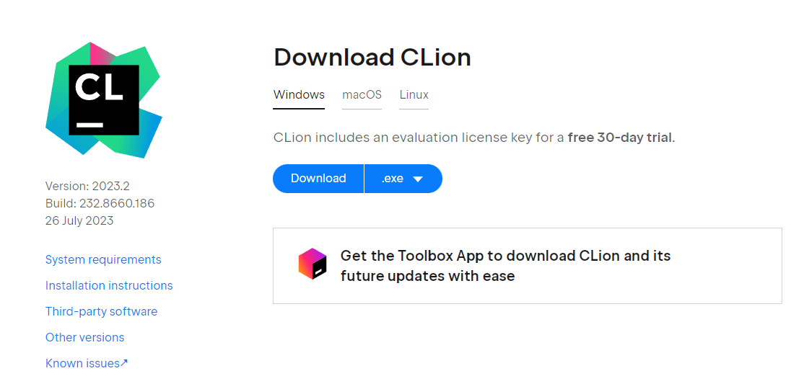

官网提供的详细使用文档：
https://www.jetbrains.com.cn/clion/features/

## 2. 安装

### 2.1 安装前的准备

* 64 位 Microsoft Windows 11、10、8
* 最低 2 GB 可用 RAM，推荐 8 GB 系统总 RAM
* 3.5 GB 硬盘空间，推荐 至少5G的SSD硬盘
* 最低屏幕分辨率 1024x768，推荐1920×1080

### 2.2 安装过程

1、下载完安装包，双击直接安装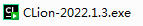

2、欢迎安装

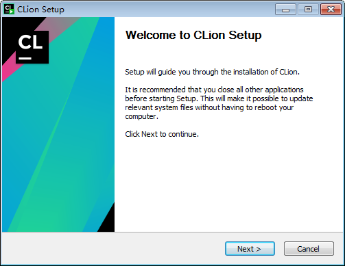

4、选择安装目录

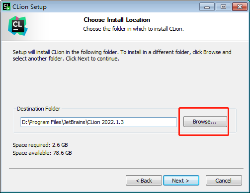

选择安装目录，目录中要避免中文和空格。

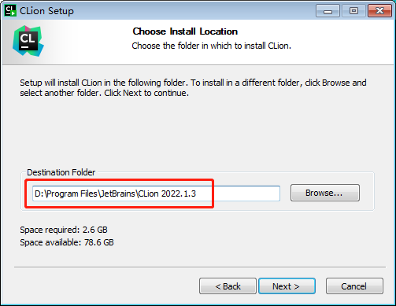

5、创建桌面快捷图标等

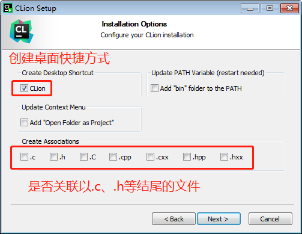

确认是否与.c、.h、.cpp格式文件进行关联。这里建议不关联。

6、在【开始】菜单新建一个文件夹（这里需要确认文件夹的名称），来管理CLion的相关内容。

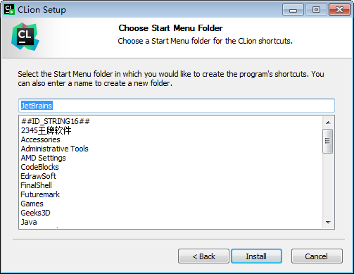

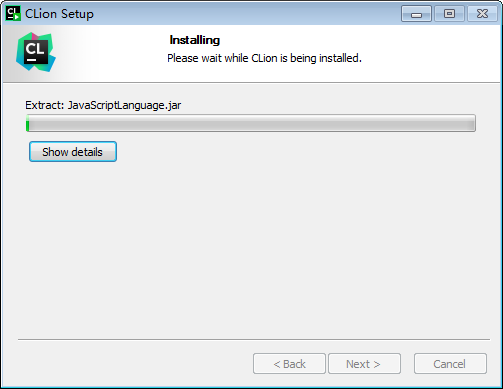

7、完成安装

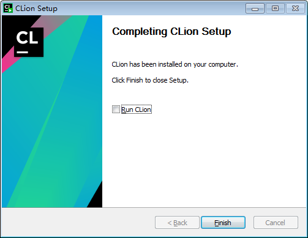

8、双击打开


9、选择“Do not import settings”，点击“OK”按钮

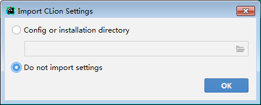

10、如图所示，需要激活CLion

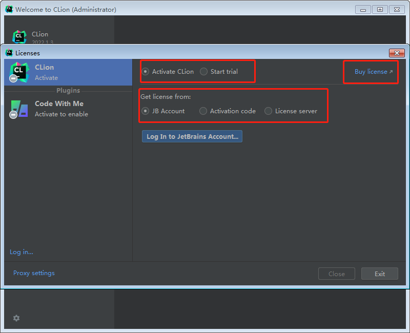

### 2.3 注册

- 选择1：适用30天。在CLion版本中，需要先登录，才能开启试用。

  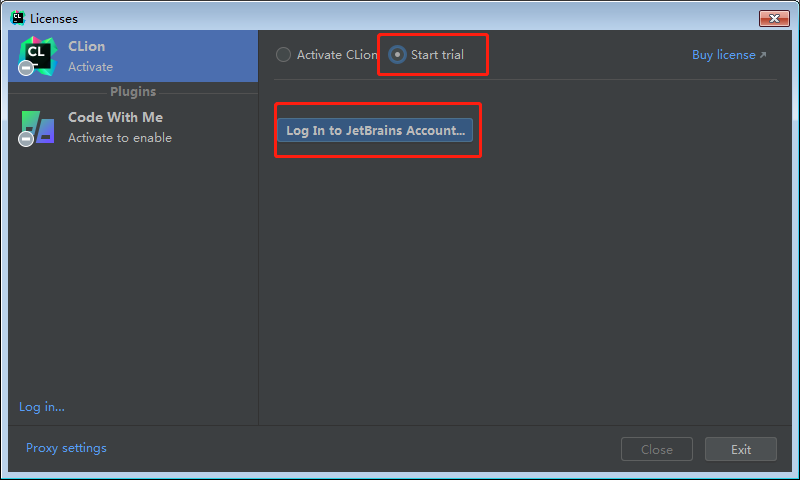

- 选择2：付费购买旗舰版

  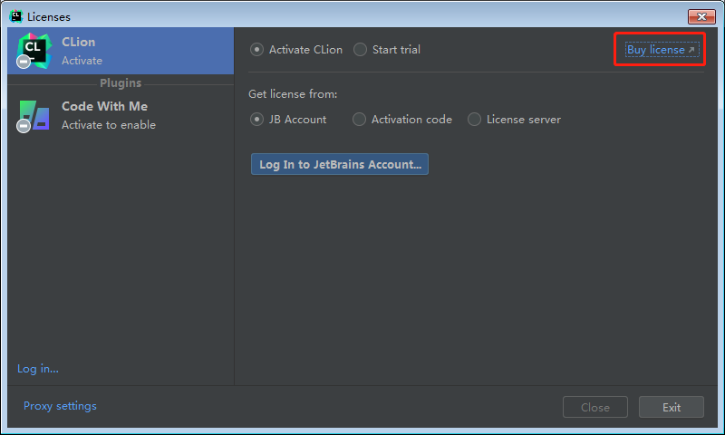

  

- 选择3：（推荐）

  - 大家参照《`02-软件\CLion-2022.1.3安装包\CLion注册文档\CLion注册文档.docx`》操作即可。
  - 由于存在时效性，如果失效，大家可以自行搜索注册方式即可。

## 3. HelloWorld的实现

### 3.1 新建Project

选择"New Project"：


指定创建C可执行文件、工程目录，图中的“untitled1”需要修改为自己的工程名称。如下所示：


选择C可执行文件，修改工程名称为demo1


点击“Create”进行下一步，如图所示


此处选择编译器，默认MinGW即可，点击“OK”按钮，如图所示，默认创建了main.c文件。


### 3.2 运行

点击执行按钮，如下所示


## 4. 详细设置

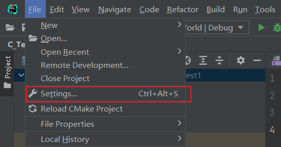

CLion的设置都在 File - Settings 中进行。

### 4.1 设置整体主题

#### 1、选择主题

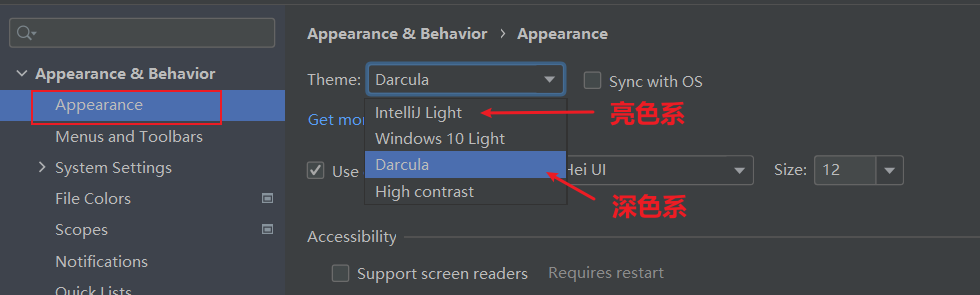

#### 2、设置菜单和窗口字体和大小

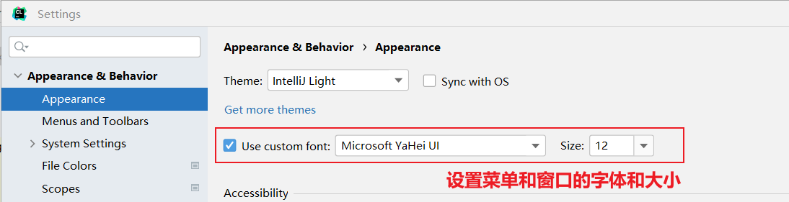

### 4.2 设置编辑器主题样式

#### 1、字体大小

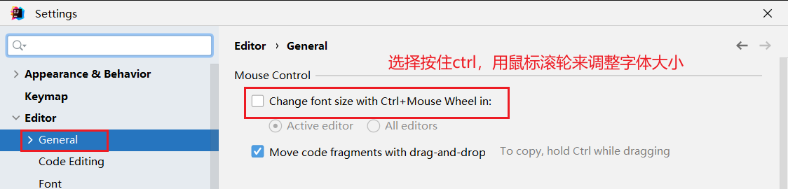

更详细的字体与颜色如下：

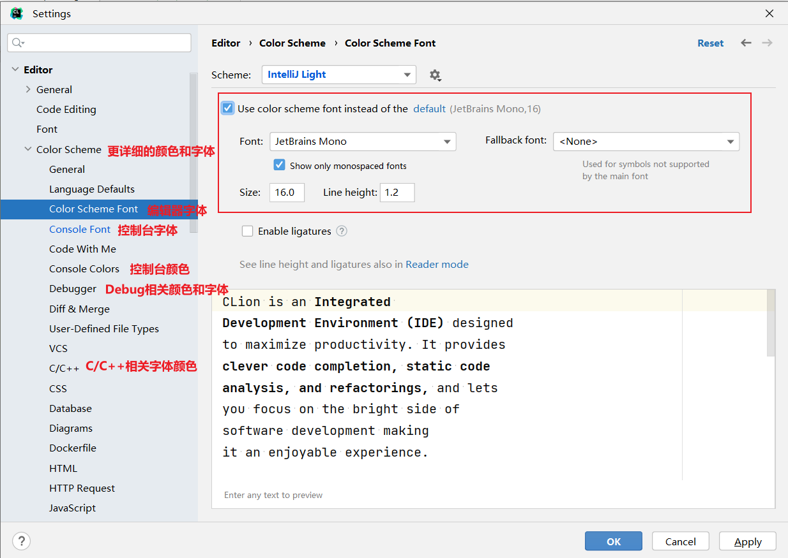

> 温馨提示：如果选择某个font字体，中文乱码，可以在fallback font（备选字体）中选择一个支持中文的字体。

#### 2、注释的字体颜色

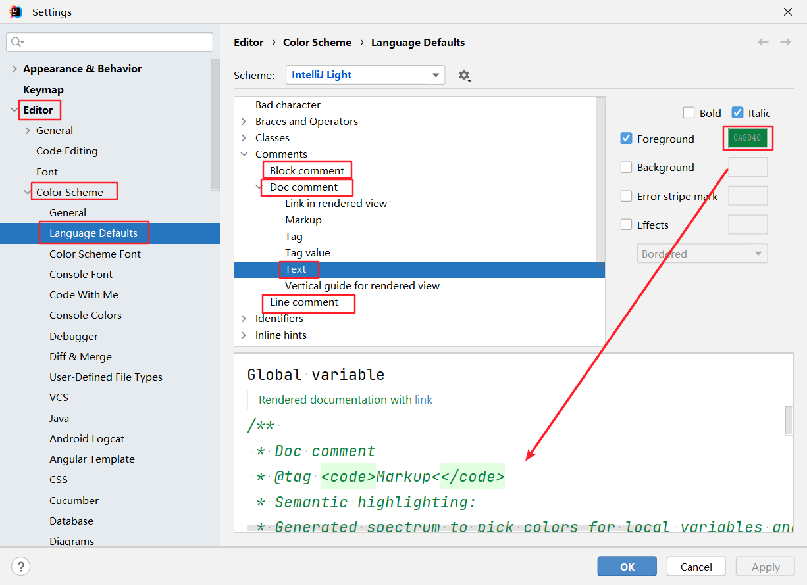

- Block comment：修改多行注释的字体颜色
- Doc Comment –> Text：修改文档注释的字体颜色
- Line comment：修改单行注释的字体颜色

### 4.3 代码智能提示功能

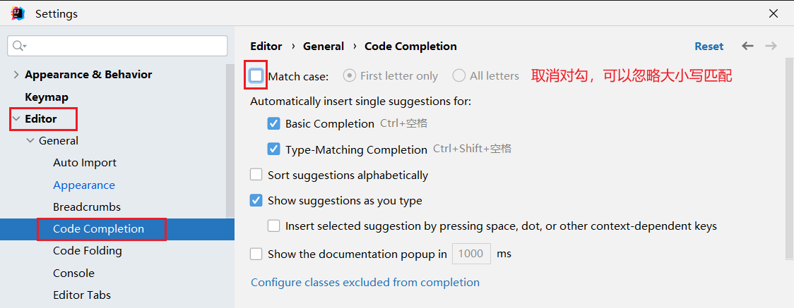

代码提示和补充功能有一个特性：`区分大小写`。 如果想不区分大小写的话，就把这个对勾去掉。`建议去掉勾选`。

### 4.4 设置项目文件编码（一定要改）

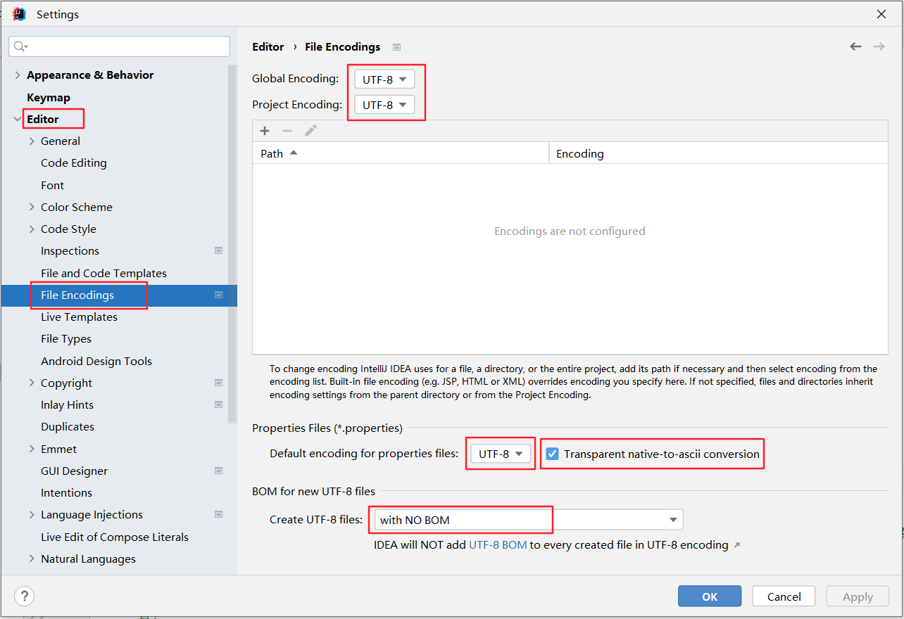

说明： Transparent native-to-ascii conversion主要用于转换ascii，显式原生内容。一般都要勾选。

### 4.5 设置控制台的字符编码

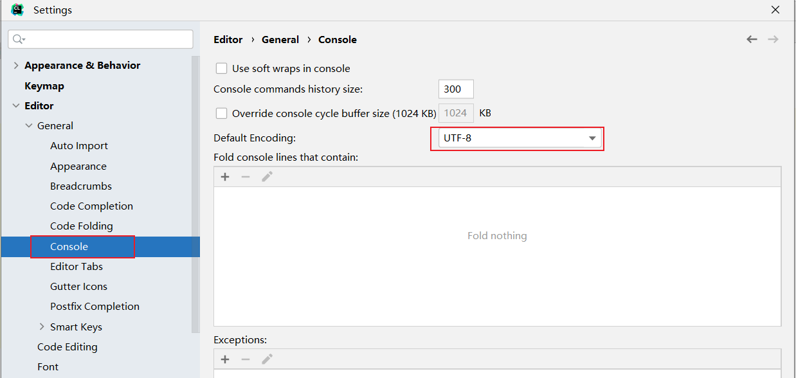

## 5. 插件的使用(重要)

**1、为何安装C/C++ Single File Execution插件？**

前面已经创建了一个demo1工程，项目文件夹内存在一个代码文件，名为`main.c`。如果再创建一个C源文件，内部如果也包含main()函数，则会报错！因为默认C工程下只能有一个main()函数。如何解决此问题呢？

2、安装并测试

1）在 File - Settings - Plugins 中搜索 `C/C++ Single File Execution` 插件并安装


2）在需要运行的代码中右键，点击 Add executable for single c/cpp file


3）此时可以在 Cmakelists.text 文件中看到多出的这一行代码，这就是插件帮我们完成的事情


4）右键项目文件夹，点击 Reload CMake Project 进行刷新


5）此时右上角标签处已经增加了我们的文件选项，选择需要的标签


6）点击小三角，或右键代码处点击 Run 选项，即可运行代码。


7）在该工程下创建main2.c文件，文件中的代码如下所示，执行上面相同的步骤。

```c
#include <stdio.h>

int main() {
    printf("Hello, World2!\n");
    return 0;
}
```

可以发现一个工程中允许存在多个main方法了，而且可以独立允许。

## 6. 快捷键的使用

### 6.1 常用快捷键

#### 第1组：通用型

| 说明            | 快捷键           |
| --------------- | ---------------- |
| 复制代码-copy   | ctrl + c         |
| 粘贴-paste      | ctrl + v         |
| 剪切-cut        | ctrl + x         |
| 撤销-undo       | ctrl + z         |
| 反撤销-redo     | ctrl + shift + z |
| 保存-save all   | ctrl + s         |
| 全选-select all | ctrl + a         |

#### 第2组：提高编写速度（上）

| 说明                                               | 快捷键           |
| -------------------------------------------------- | ---------------- |
| 提示代码模板-insert live template                  | ctrl+j           |
| 使用xx块环绕-surround with ...                     | ctrl+alt+t       |
| 调出生成getter/setter/构造器等结构-generate ...    | alt+insert       |
| 自动生成返回值变量-introduce variable ...          | ctrl+alt+v       |
| 复制指定行的代码-duplicate line or selection       | ctrl+d           |
| 删除指定行的代码-delete line                       | ctrl+y           |
| 切换到下一行代码空位-start new line                | shift + enter    |
| 切换到上一行代码空位-start new line before current | ctrl +alt+ enter |
| 向上移动代码-move statement up                     | ctrl+shift+↑     |
| 向下移动代码-move statement down                   | ctrl+shift+↓     |
| 向上移动一行-move line up                          | alt+shift+↑      |
| 向下移动一行-move line down                        | alt+shift+↓      |

#### 第3组：提高编写速度（下）

| 说明                                        | 快捷键       |
| ------------------------------------------- | ------------ |
| 批量修改指定的变量名、方法名、类名等-rename | shift+f6     |
| 抽取代码重构方法-extract method ...         | ctrl+alt+m   |
| 选中的结构的大小写的切换-toggle case        | ctrl+shift+u |

#### 第4组：类结构、查找和查看源码

| 说明                                          | 快捷键        |
| --------------------------------------------- | ------------- |
| 退回到前一个编辑的页面-back                   | ctrl+alt+←    |
| 进入到下一个编辑的页面-forward                | ctrl+alt+→    |
| 打开的类文件之间切换-select previous/next tab | alt+←/→       |
| 定位某行-go to line/column                    | ctrl+g        |
| 回溯变量或方法的来源-go to implementation(s)  | ctrl+alt+b    |
| 折叠方法实现-collapse all                     | ctrl+shift+ - |
| 展开方法实现-expand all                       | ctrl+shift+ + |

#### 第5组：查找、替换与关闭

| 说明                                               | 快捷键       |
| -------------------------------------------------- | ------------ |
| 查找指定的结构                                     | ctlr+f       |
| 快速查找：选中的Word快速定位到下一个-find next     | ctrl+l       |
| 查找与替换-replace                                 | ctrl+r       |
| 直接定位到当前行的首位-move caret to line start    | home         |
| 直接定位到当前行的末位 -move caret to line end     | end          |
| 查询当前元素在当前文件中的引用，然后按 F3 可以选择 | ctrl+f7      |
| 全项目搜索文本-find in path ...                    | ctrl+shift+f |
| 关闭当前窗口-close                                 | ctrl+f4      |

#### 第6组：调整格式

| 说明                                         | 快捷键           |
| -------------------------------------------- | ---------------- |
| 格式化代码-reformat code                     | ctrl+alt+l       |
| 使用单行注释-comment with line comment       | ctrl + /         |
| 使用/取消多行注释-comment with block comment | ctrl + shift + / |
| 选中数行，整体往后移动-tab                   | tab              |
| 选中数行，整体往前移动-prev tab              | shift + tab      |

#### 第7组-Debug快捷键

| 说明                                                  | 快捷键        |
| ----------------------------------------------------- | ------------- |
| 单步调试（不进入函数内部）- step over                 | F8            |
| 单步调试（进入函数内部）- step into                   | F7            |
| 强制单步调试（进入函数内部） - force step into        | alt+shift+f7  |
| 选择要进入的函数 - smart step into                    | shift + F7    |
| 跳出函数 - step out                                   | shift + F8    |
| 运行到断点 - run to cursor                            | alt + F9      |
| 继续执行，进入下一个断点或执行完程序 - resume program | F9            |
| 停止 - stop                                           | Ctrl+F2       |
| 查看断点 - view breakpoints                           | Ctrl+Shift+F8 |
| 关闭 - close                                          | Ctrl+F4       |

### 6.2 查看快捷键

#### 1、已知快捷键操作名，未知快捷键

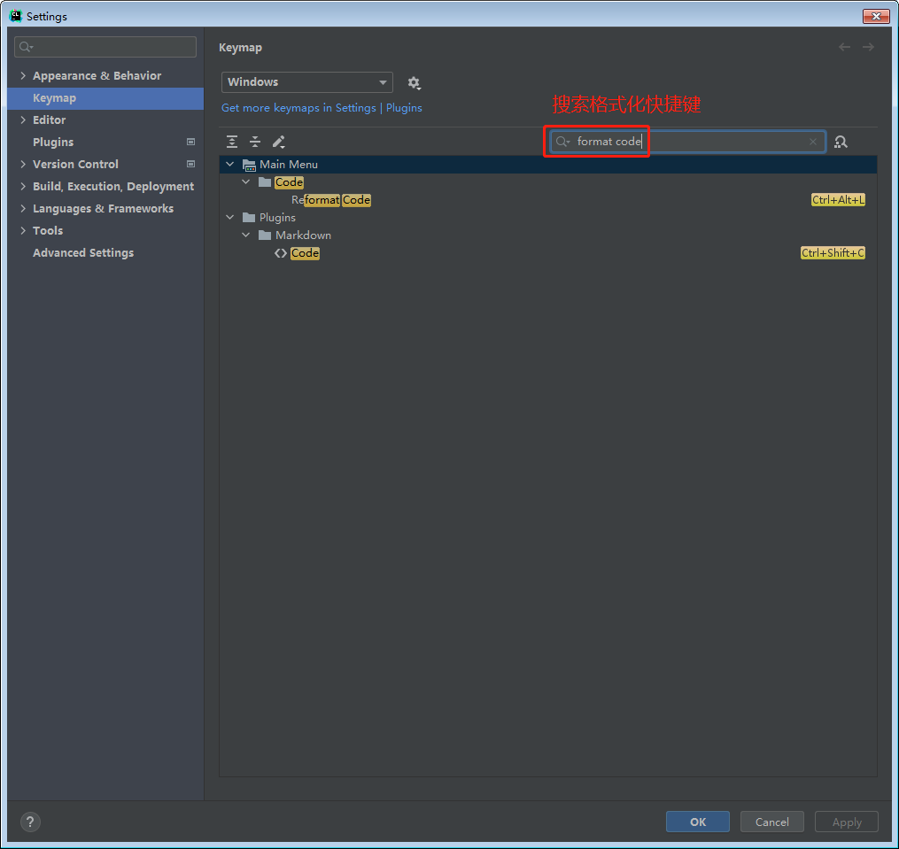

#### 2、已知快捷键，不知道对应的操作名

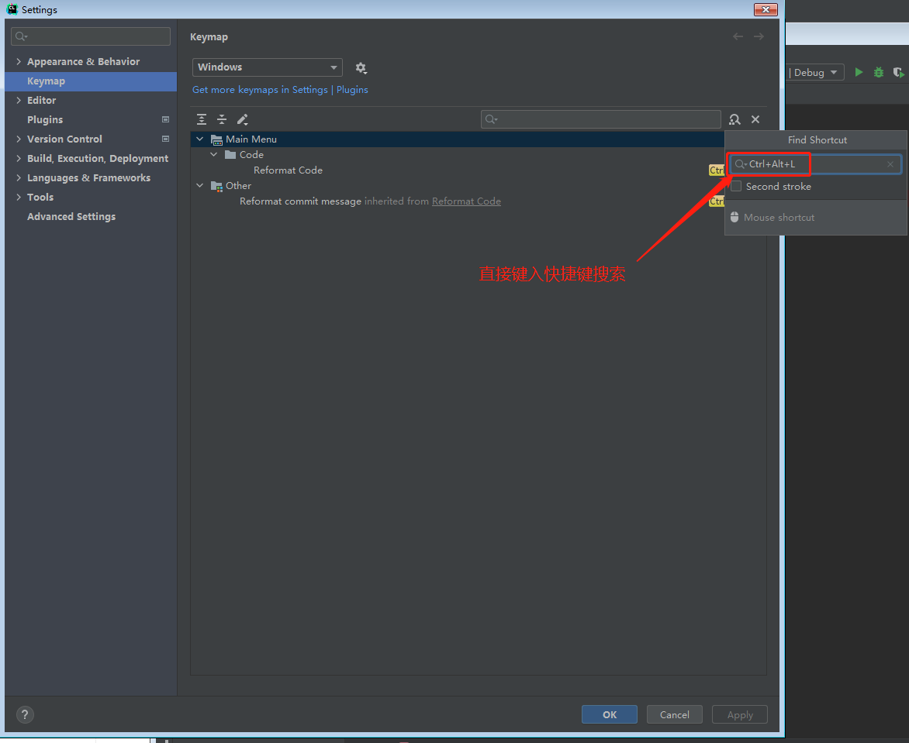

### 6.3 自定义快捷键

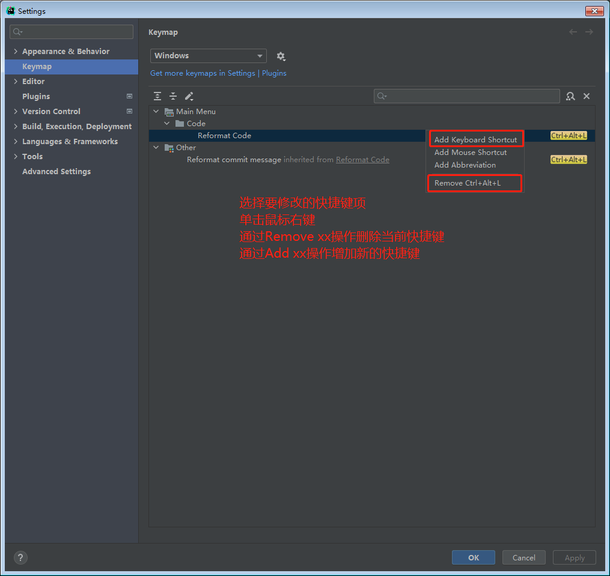

 <p id = "附录2：MinGW编译器的安装和配置"></p> 

# 附录2：MinGW编译器的安装和配置

## 1、MinGW介绍

MinGW（Minimalist GNU on Windows）实际上是GCC在Windows平台上的移植版本，因此可以将源代码编译为可在 Windows 中运行的可执行程序。MinGW是，主要用于在Windows上本地编译C和C++代码。


> 目前适用于 Windows 平台、受欢迎的 GCC 移植版主要有 2 种，分别为 MinGW 和 Cygwin。
> 其中：
>
> MinGW 侧重于服务 Windows 用户可以使用 GCC 编译环境，是真正的GCC移植，相比后者体积更小，使用更方便；
> Cygwin 只是提供一个类unix的环境内部是原生的GCC，借助它不仅可以在 Windows 平台上使用 GCC 编译器，理论上可以运行 Linux 平台上所有的程序；
>
> Cygwin 只是提供一个类unix的环境内部是原生的GCC。
>
> 如果读者仅需要在 Windows 平台上使用 GCC，可以使用 MinGW 或者 Cygwin；除此之外，如果还有更高的需求（例如运行 POSIX 应用程序），就只能选择安装 Cygwin。

## 2、下载与安装

### 2.1 下载

下载地址：<https://sourceforge.net/projects/mingw/files/>

点击“Download Latest Version”即可

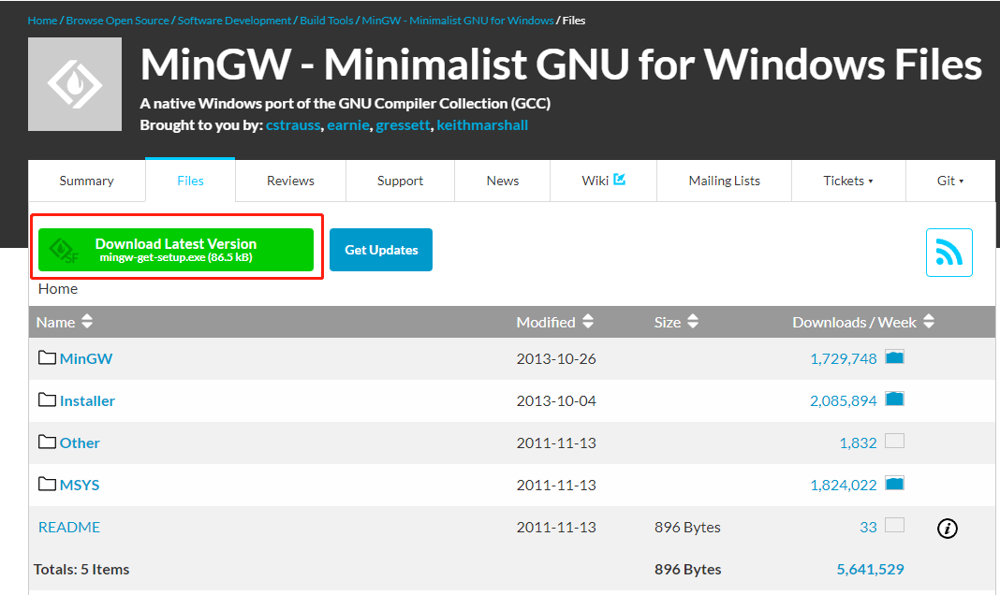

### 2.2 安装

下载完成后，会得到一个名为 mingw-get-setup.exe 的安装包，双击打开它，可以看到如下的对话框：


直接点击“Install”，进入下面的对话框：

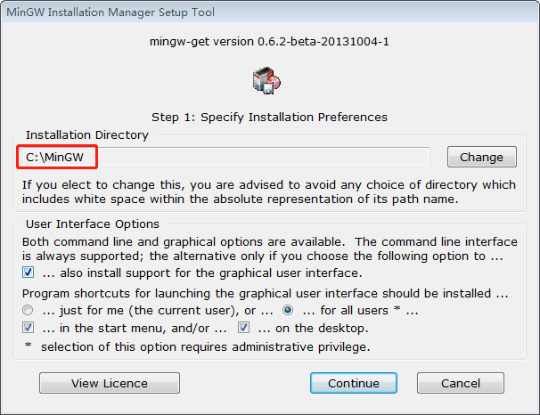

读者可根据自己操作系统的实际情况，自定义 MinGW 的安装位置（`建议安装到非C盘的指定目录下`），然后点击“continue”，进入下面的对话框：

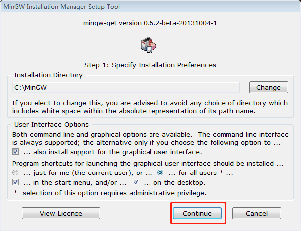

​	进入安装 MinGW 配置器的界面，耐心等待安装完成（显示 100%）即可。

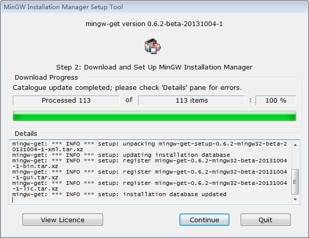

安装完成之后，继续点击“continue”，进入下面的对话框，这是一个名为 “`MinGW Installer Manager`” 的软件，借助它，我们可以随时根据需要修改 GCC 编译器的配置。

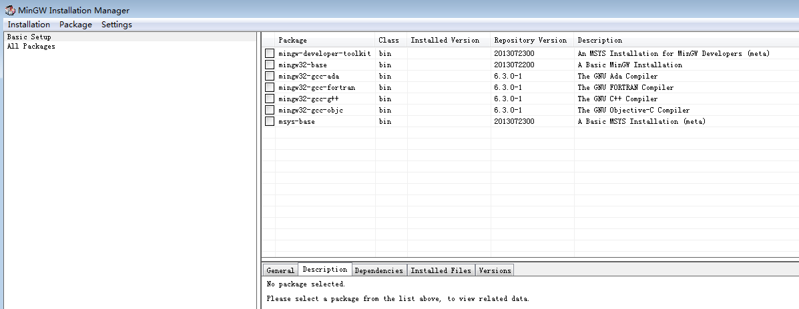

常见的安装包介绍如下。

| 安装包名称          | 作用                                             |
| ------------------- | ------------------------------------------------ |
| mingw32-binutils    | 用于编译生成的 .o 文件的链接、汇编、生成静态库等 |
| mingw32-gcc         | 核心的 C 编译器                                  |
| mingw32-gcc-ada     | Ada 编译器                                       |
| mingw32-gcc-fortran | Fortran 编译器                                   |
| mingw32-gcc-g++     | C++ 编译器                                       |
| mingw32-gcc-objc    | Objective-C 编译器                               |
| mingw32-libgcc      | C 编译器编译出来的程序的运行库                   |

其中minw32-gcc-g++支持C++编译和minw32-gcc支持C编译。

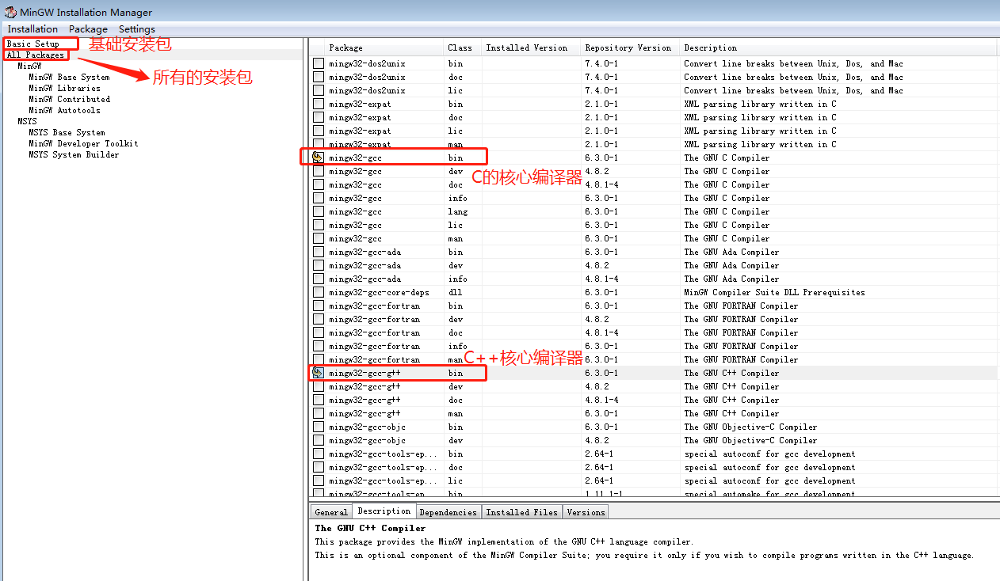

为使 GCC 同时支持编译 `C` 语言和 `C++`，需勾选上图中标注的 2 项。选中其中一项，鼠标右键点击，选择“Mark for Installation”，如图所示。

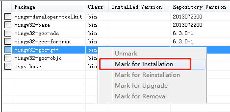

标记完以后如图所示。

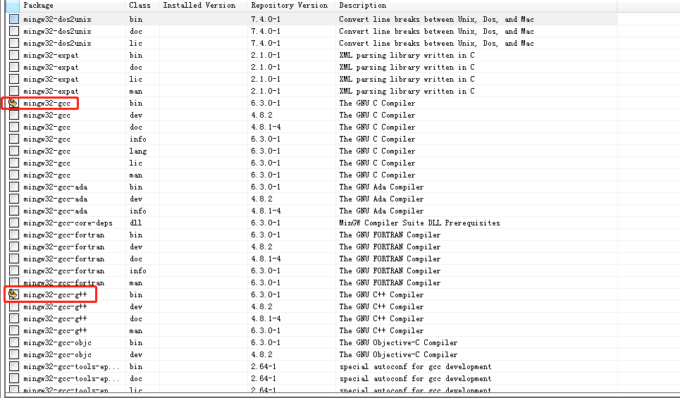

> GCC 还支持其它编程语言，读者可借助此配置器，随时根据需要安装自己需要的编译环境。

勾选完成后，在菜单栏中选择 `Installation -> Apply Changes`，

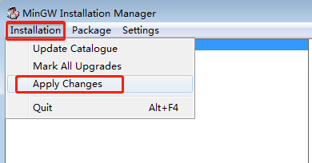

弹出如下对话框：

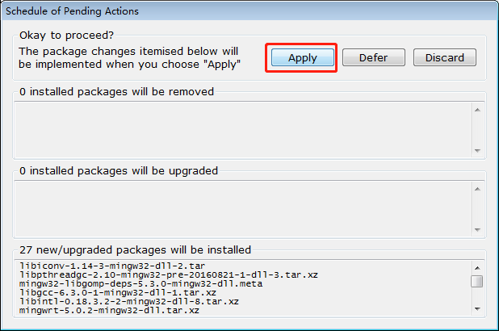

选择“Apply”。然后耐心等待，直至安装成功，即可关闭此界面。

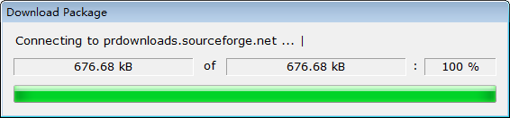

## 3、配置：path环境变量

在安装完成的基础上，我们需要手动配置 PATH 环境变量。

1）依次 `右击计算机（我的电脑） -> 属性 -> 高级系统设置 -> 环境变量`，例如我将其安装到了C:\MinGW文件夹中，因此 PATH 环境变量的设置如下：

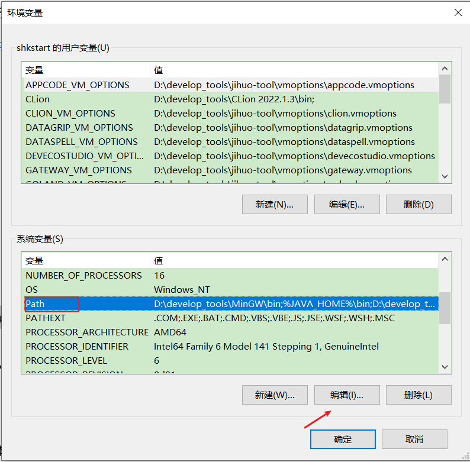

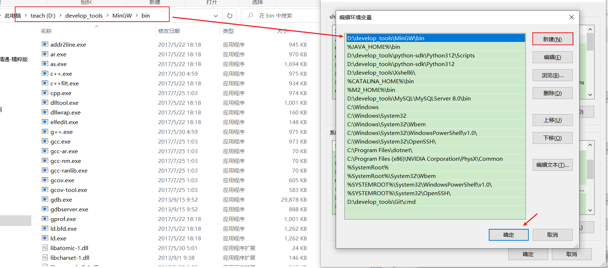


2）打开命令行窗口（通过在搜索栏中执行 cmd 指令即可），输入`gcc -v`指令，如果输出 GCC 编译器的具体信息，则表示安装成功，例如：

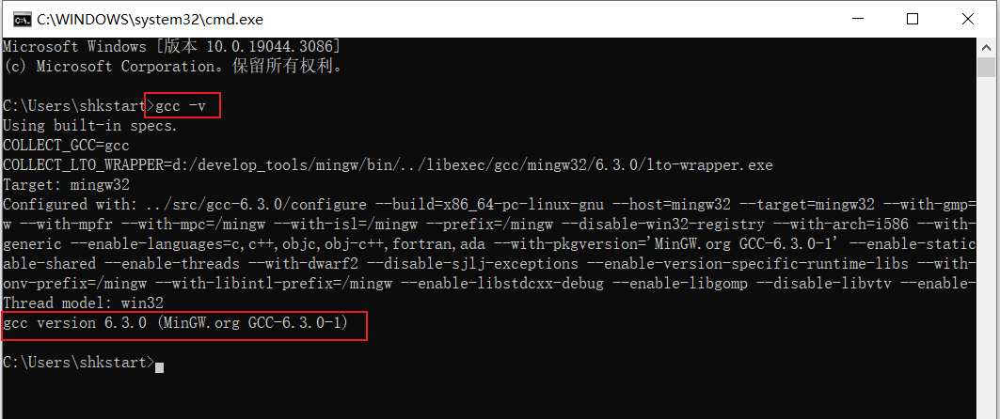

通过上面的安装，我们就可以在当前 Windows 平台上编译、运行 C 或者 C++ 程序了。

因为 MinGW-w64 本来就是将 GCC 移植到 Windows 上的产物，所以操作方式和 GCC 一样，只是在 Linux 下命令是被键入到“终端”中，而 Windows 下则是被键入到“命令提示符”里。
