# 从零搭建计算机

## 1  数字电路基础

### 1.1 二进制数据表达

```
1. 二进制表示文字
2. 二进制表示图片
3. 二进制表示声音
4. 二进制表示视频
```

### 1.2 数电基础

#### ① 基础逻辑门电路

> 需要记住：口诀、符号！

```
1. 非门
   输入和输出相反
2. 与门
   有0出0，全1出1
3. 或门
   有1出1，全0出0
```

#### ② 其他门电路

> 需要记住：口诀、符号！

```
1. 异或门
   相同出0，相异出1
   
2. 与非门
   有0出1，全1出0

3. 或非门
   有1出0，全0出1

4. 异或非门
   相同出1，不同出0
```

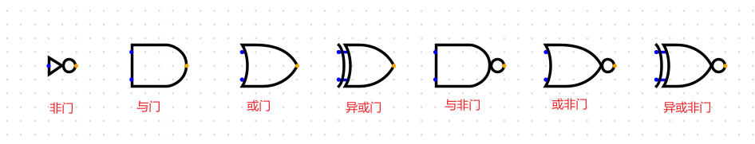

#### ③ 运算器

##### 1位半加器

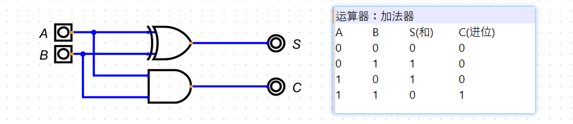

##### 1位全加器

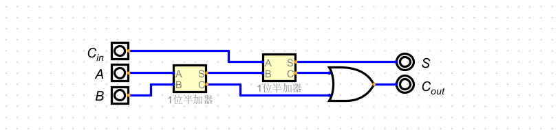

##### 4位加法器

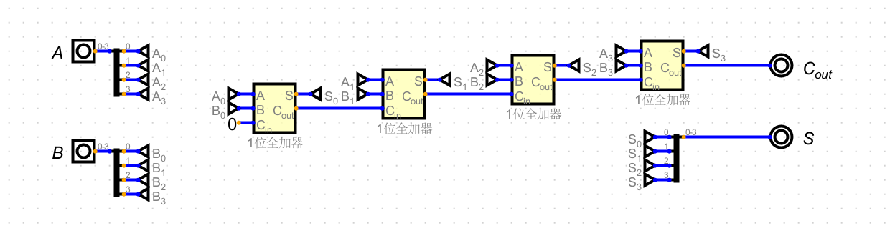

> Digital自带的**加法器**组件：`菜单 -> 组件 -> 运算器 -> 加法器`，内置加法器组件可以设置数据位数。

#### ④ 锁存器和触发器

##### SR锁存器

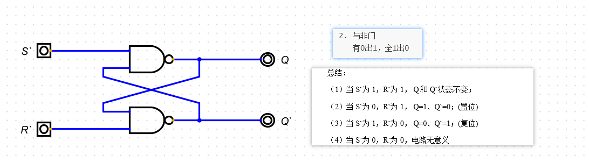

##### D 锁存器

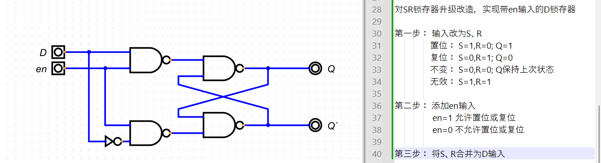

##### D 触发器

上升沿触发的D触发器：

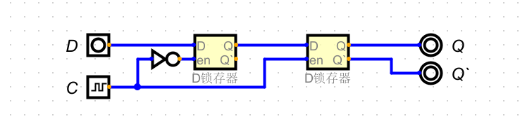

> Digital自带的**D触发器**组件：`菜单 -> 组件 -> 触发器 -> D触发器`

#### ⑤ 寄存器

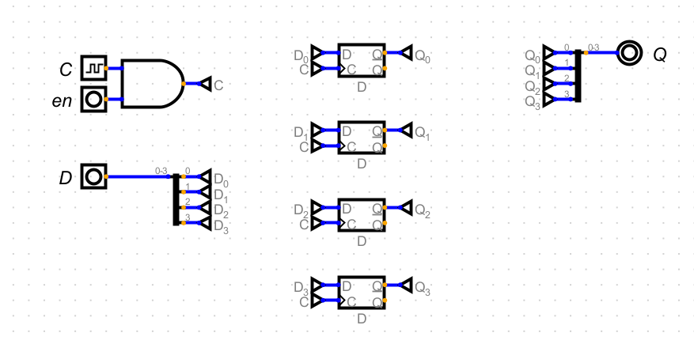

> Digital自带的**寄存器**组件：`菜单 -> 组件 -> 存储器 -> 寄存器`

## 2  计算机组成原理

### 2.1 冯诺依曼模型

#### ① 计算机组成部分

```
1. 存储器
   存储数据和指令

2. 算术逻辑单元（运算器、ALU）
   
3. 控制单元（控制器、CU）

4. 输入/输出系统（I/O系统）
   输入设备：键盘、鼠标、麦克风、扫描仪等
   输出设备：显示器、音响、打印机等
```

#### ② 程序存储

```
程序加载进内存运行
冯诺依曼架构：指令和数据存储在一个内存，一块内存。
哈佛架构：指令和数据存储在不同内存，两块内存。
```

#### ③ 指令执行

```
指令顺序执行
```

### 2.2 现代计算机组成

```
CPU： Central Processing Unit ，中央处理器

GPU： graphics processing unit ，图像处理器

MCU： Microprogrammed Control Unit ，微控制器

MPU： Microprocessor Unit ，微处理器
```

#### ① 中央处理器（CPU）

```
1. 算术逻辑单元（ALU）
   实现算术运算、位移运算、逻辑运算
   
2. 控制单元（CU）
   根据程序指令产生控制信号
   
3. 寄存器（Register）
   数据存储寄存器
   指令存储寄存器
   程序计数器
```

#### ② 主存储器（内存）

```
1. 两种类型
   RAM：随机存取存储器， 特点：可读可写，断电丢失。
   ROM：只读存储器，特点：只读，断电不丢失。
   
2. 存储器的层次（速度从快到慢）
   CPU中的寄存器 > 高速缓存 > 内存 > 外部存储（硬盘等） 
```

#### ③ 三大总线

```
1. 控制总线
   传递控制信号

2. 地址总线
   传递地址（包括寄存器地址、内存单元的地址、设备地址）

3. 数据总线
   传递数据
```

#### ④ 程序周期

```
每个程序周期分为：取指令 -> 译码 -> 执行
```

#### ⑤ 指令集架构

```
CISC： 复杂指令集系统，如 X86
RISC： 精简指令集系统，如 ARM、RISC-V
```

## 3  设计简单单片机

### 3.1 实现一个 ALU

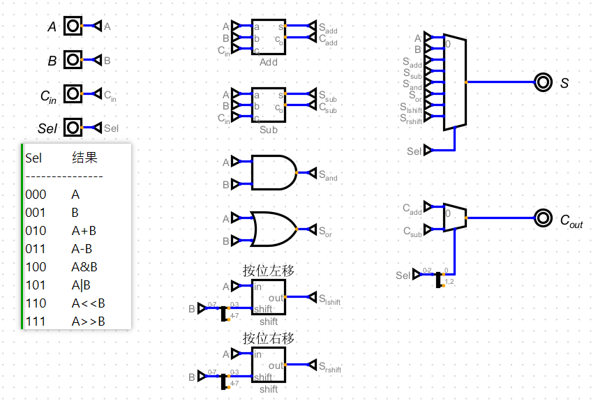

```
1. A、B 的数据位是 8 bit、C_in 的数据位是 1 bit，Sel 的数据位是 3 bit。
2. 加法器、减法器、与门、或门、桶式移位器的数据位都是 8 bit。
3. 桶式移位器的 in 输入是8 bit，shift 输入是 4 bit， 注意：桶式移位器需要选择方向是“左”或者“右”。
4. S 输出前面的复用器数据位是 8 bit，选择位是 3 bit； C_out 输出前面的复用器，数据位是 1 bit，选择位是 1 bit。
```

### 3.2 使用ALU和寄存器实现计算


```
1. 现将ALU封装为自定义组件
2. 使用ALU和寄存器实现 13+6+27+6
```

### 3.3 添加数据内存

#### ① 38译码器

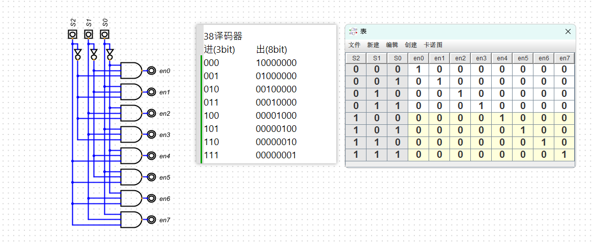

#### ② 自定义内存电路

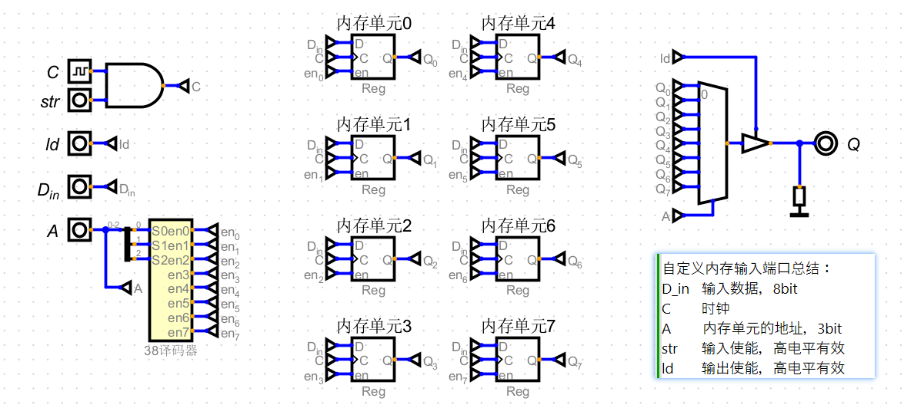

> 内置内存组件：`组件 > 存储器 > EEPROM -> EEPROM (独立端口)`

#### ③ ALU+寄存器+数据内存 计算

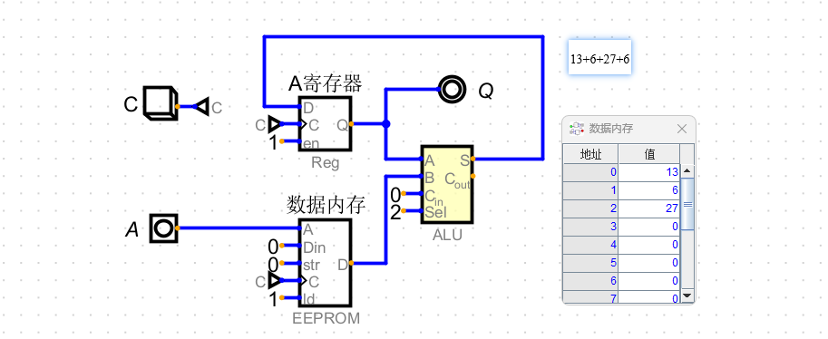

### 3.4 添加指令内存

#### ① 添加指令内存

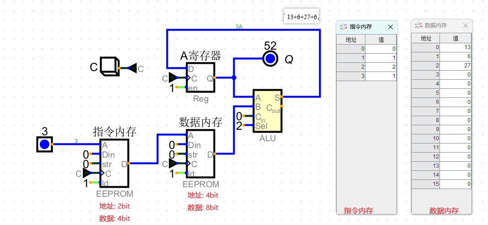

#### ② 程序计数器


#### ③ 添加程序计数器后的运算电路

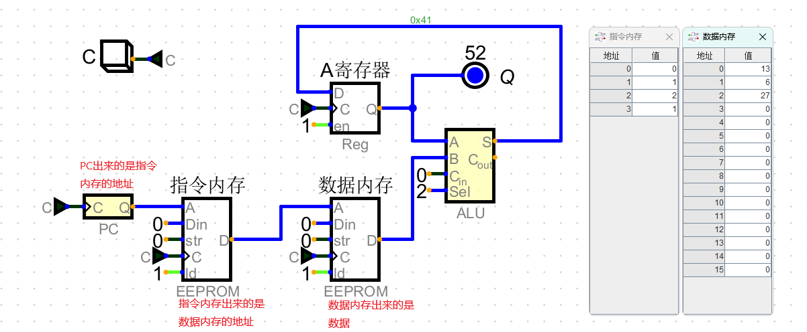

```
1. 程序计数器计数，生成指令内存的地址
2. 从指令内存中取出数据地址
3. 根据数据地址取出数据
4. 数据作为ALU的B输入
```

### 3.5 添加其他运算

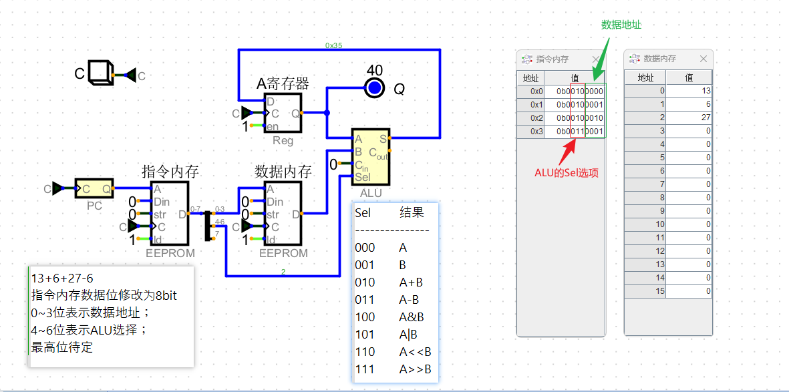

### 3.6 设计指令集

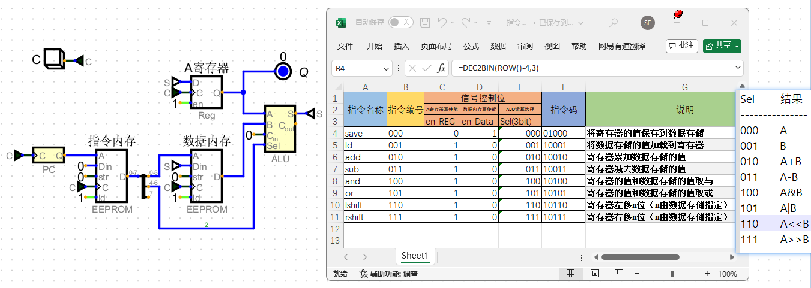

### 3.7 添加控制器

#### ① 实现控制器


#### ② 添加控制器后的电路

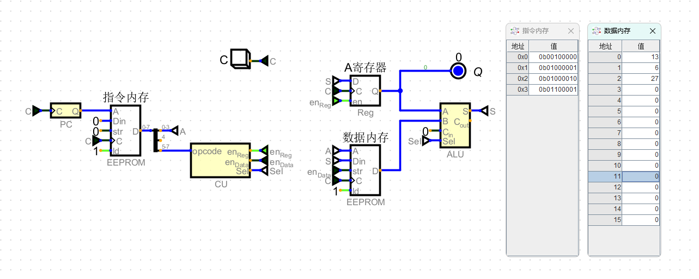

```
13+6+27-6

汇编：
ld 13
add 6
add 27
sub 6

机器指令：（高3位存指令变量，中间1位待定，低4位存数据地址）
001 0 0000
010 0 0001
010 0 0010
011 0 0001
```

### 3.8 添加外设寄存器

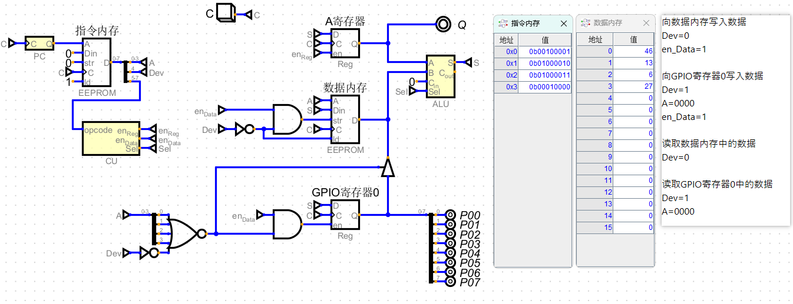

```
向数据内存写入数据
Dev=0
en_Data=1

向GPIO寄存器0写入数据
Dev=1
A=0000
en_Data=1

读取数据内存中的数据
Dev=0

读取GPIO寄存器0中的数据
Dev=1
A=0000
```

### 3.9 封装单片机并控制流水灯

#### ① MCU电路

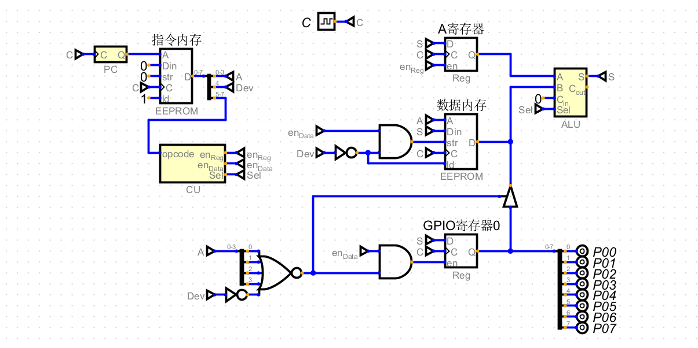

#### ② 流水灯电路（使用MCU组件）

**电路：**

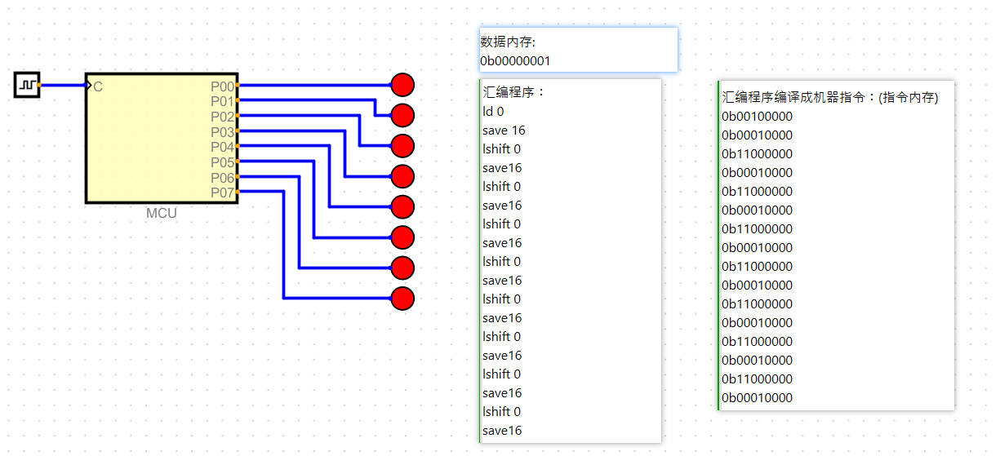

**数据内存：**

```
0b00000001
```

**汇编代码：**

```
ld 0
save 16
lshift 0
save16
lshift 0
save16
lshift 0
save16
lshift 0
save16
lshift 0
save16
lshift 0
save16
lshift 0
save16
lshift 0
save16
```

**二进制指令（指令内存）**

```
0b00100000
0b00010000
0b11000000
0b00010000
0b11000000
0b00010000
0b11000000
0b00010000
0b11000000
0b00010000
0b11000000
0b00010000
0b11000000
0b00010000
0b11000000
0b00010000
```

